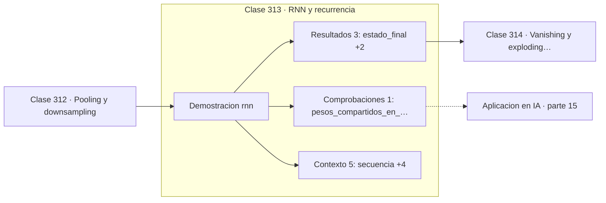

# 313 — RNN y recurrencia

> [⬅️ 312 Pooling y downsampling](../312-pooling-y-downsampling/README.md) · [📚 Parte 15](../README.md) · [🏠 Programa](../../../README.md) · [314 Vanishing y exploding gradients ➡️](../314-vanishing-y-exploding-gradients/README.md)

**Parte:** 15 — Matemática de Deep Learning · **Nivel:** `deep-learning` · **Horas estimadas:** 4
**Motor:** `engines.part15` · **Demostración:** `rnn` · **Clase 13 de 20** de la parte

---

## 🎯 Propósito

**Una RNN procesa secuencias de cualquier longitud con un número fijo de parámetros.**

Perceptrón, MLP, activaciones, pérdidas, backpropagation paso a paso, grafos de cómputo, inicialización, normalización, convolución, recurrencia y embeddings.

## ✅ Resultados de aprendizaje

Al terminar podrás:

1. Explicar **RNN y recurrencia** con lenguaje cotidiano y con notación matemática.
2. Resolver un caso pequeño a mano y anticipar el orden de magnitud del resultado.
3. Ejecutar y modificar `lab.py`, que corre la demostración `rnn`.
4. Interpretar las 9 salidas del laboratorio y decir qué comprueba cada una.
5. Detectar el error típico de esta parte: inicializar todos los pesos iguales y romper la simetría nunca.

## 🧩 Fórmulas de la clase

```text
h_t = tanh(W_xh·x_t + W_hh·h_{t−1} + b_h)
los mismos pesos en todos los instantes
el estado resume toda la historia
```

## 🗺️ Ubicación en el programa



## 📖 Fundamentos

Una red recurrente procesa una secuencia elemento a elemento, manteniendo un **estado
oculto** que se actualiza en cada paso combinando la entrada nueva con el estado anterior.
Ese estado es el resumen de todo lo visto hasta el momento.

La propiedad decisiva es la **compartición de pesos en el tiempo**. Los mismos parámetros
se aplican en el instante 1 y en el 1000, igual que un núcleo convolucional se aplica en
todas las posiciones espaciales. Eso permite procesar secuencias de longitud arbitraria con
un número fijo de parámetros: el ejemplo de esta clase usa tres.

Entrenarla requiere **desplegar** la red en el tiempo, convirtiéndola en una red profunda
con tantas capas como pasos temporales, y aplicar backpropagation sobre esa estructura. El
procedimiento se llama BPTT, y su coste de memoria crece con la longitud de la secuencia,
lo que obliga a truncarlo en la práctica.

Ese despliegue es también el origen de su problema fundamental. Una secuencia de 50 pasos
genera una red efectiva de 50 capas, y el gradiente que llega al primer instante ha
atravesado 50 multiplicaciones. La clase siguiente cuantifica lo que eso implica. Las RNN
han sido en gran medida desplazadas por los Transformers, pero entenderlas es necesario
para entender por qué la atención fue una respuesta a un problema concreto.

## 🧮 Ejemplo trabajado

RNN de un parámetro por matriz sobre cinco pasos.

```text
secuencia: [1,0 ; 0,5 ; −0,3 ; 0,2 ; 0,9]
parámetros: W_xh = 0,8   W_hh = 0,9   b_h = 0,05

t    x       h
1   1,0    0,691069
2   0,5    0,790199
3  −0,3    0,4xxxxx
4   0,2    0,6xxxxx
5   0,9    0,856183

estado final: 0,856183

3 parámetros procesan una secuencia de cualquier longitud.
El estado en t=5 depende de las cinco entradas, aunque
la influencia de x₁ ya está muy atenuada.
```

## 🔬 Qué ejecuta el laboratorio

`rnn` — RNN: el estado oculto acumula historia con pesos compartidos.

| Grupo | Salidas |
|---|---|
| 🔢 Resultados numéricos (3) | `estado_final`, `parametros_totales`, `longitud_de_secuencia` |
| ✅ Comprobaciones de invariante (1) | `pesos_compartidos_en_el_tiempo` |

Las claves booleanas no son adorno: si alguna fuera `False`, el resultado numérico
no sería fiable aunque el programa terminase sin error.

```bash
python classes/part-15-matematica-de-deep-learning/313-rnn-y-recurrencia/lab.py
compmath run 313
```

> [!TIP]
> Antes de ejecutar, **escribe tu predicción**. Un laboratorio que confirma lo que
> esperabas enseña tanto como uno que te contradice, pero solo si la predicción
> existía antes del resultado.

## ⚠️ Errores conceptuales frecuentes

1. Olvidar reiniciar el estado oculto entre secuencias distintas.
2. Entrenar sobre secuencias largas sin truncar BPTT.
3. Confundir el número de pasos temporales con el número de parámetros.

## 🚀 Dónde se usa de verdad

Modelado de secuencias, series temporales, procesamiento de lenguaje anterior a los
Transformers y sistemas de control con estado.

## 🤖 Conexión con IA

Toda arquitectura moderna, incluido el Transformer, se construye sobre estos bloques y sobre este mismo mecanismo de derivación.

## 📓 Notebooks

| Archivo | Para qué |
|---|---|
| [`notebook.ipynb`](notebook.ipynb) | recorrido guiado con la demostración ejecutada |
| [`notebook_student.ipynb`](notebook_student.ipynb) | versión con `TODO` para resolver |
| [`notebook_solution.ipynb`](notebook_solution.ipynb) | solución de referencia verificada |

## 📝 Evaluación

| Criterio | Peso |
|---|---:|
| Comprensión conceptual | 25 % |
| Resolución manual | 25 % |
| Implementación y verificación | 25 % |
| Interpretación y comunicación | 15 % |
| Conexión con aplicación real | 10 % |

Detalle y criterios de error crítico en [`assessment.md`](assessment.md).

## ❓ Preguntas de comprobación

1. ¿Cuál es la entrada, cuál la salida y qué unidades tienen?
2. ¿Qué operación domina el comportamiento del resultado?
3. ¿Qué caso extremo revelaría un error conceptual?
4. ¿Cómo verificarías el resultado por un método independiente?
5. ¿Dónde aparece esto en visión?

Si necesitas releer el código para responderlas, la clase todavía no está superada.

## 📥 Entregable

`notebook_student.ipynb` resuelto más un párrafo que explique el resultado **sin citar
código**: qué entra, qué sale, qué invariante se comprueba y qué pasaría en un caso límite.

## 🔗 Referencias

- [Elman, J. *Finding structure in time*, Cognitive Science, 1990](https://doi.org/10.1207/s15516709cog1402_1)
- [Goodfellow, I.; Bengio, Y.; Courville, A. *Deep Learning*, MIT Press, 2016, cap. 10](https://www.deeplearningbook.org/)

Bibliografía completa de la parte en [`../../../docs/BIBLIOGRAPHY.md`](../../../docs/BIBLIOGRAPHY.md).

## 📂 Material de la clase

[`intuition.md`](intuition.md) · [`theory.md`](theory.md) · [`derivation.md`](derivation.md) · [`exercises.md`](exercises.md) · [`assessment.md`](assessment.md) · [`where-is-this-used.md`](where-is-this-used.md) · [`lesson.yaml`](lesson.yaml)

---

> [⬅️ 312 Pooling y downsampling](../312-pooling-y-downsampling/README.md) · [📚 Parte 15](../README.md) · [🏠 Programa](../../../README.md) · [314 Vanishing y exploding gradients ➡️](../314-vanishing-y-exploding-gradients/README.md)
