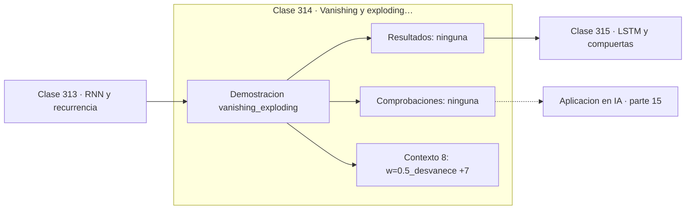

# 314 — Vanishing y exploding gradients

> [⬅️ 313 RNN y recurrencia](../313-rnn-y-recurrencia/README.md) · [📚 Parte 15](../README.md) · [🏠 Programa](../../../README.md) · [315 LSTM y compuertas ➡️](../315-lstm-y-compuertas/README.md)

**Parte:** 15 — Matemática de Deep Learning · **Nivel:** `deep-learning` · **Horas estimadas:** 4
**Motor:** `engines.part15` · **Demostración:** `vanishing_exploding` · **Clase 14 de 20** de la parte

---

## 🎯 Propósito

**El gradiente a 50 pasos es un producto de 50 factores: o se anula o explota.**

Perceptrón, MLP, activaciones, pérdidas, backpropagation paso a paso, grafos de cómputo, inicialización, normalización, convolución, recurrencia y embeddings.

## ✅ Resultados de aprendizaje

Al terminar podrás:

1. Explicar **Vanishing y exploding gradients** con lenguaje cotidiano y con notación matemática.
2. Resolver un caso pequeño a mano y anticipar el orden de magnitud del resultado.
3. Ejecutar y modificar `lab.py`, que corre la demostración `vanishing_exploding`.
4. Interpretar las 8 salidas del laboratorio y decir qué comprueba cada una.
5. Detectar el error típico de esta parte: aplicar softmax sin restar el máximo y provocar overflow.

## 🧩 Fórmulas de la clase

```text
∂L/∂h₀ = Π_{t=1}^{T} (∂h_t/∂h_{t−1})
factores < 1 ⟹ 0 exponencialmente
factores > 1 ⟹ ∞ exponencialmente
```

## 🗺️ Ubicación en el programa



## 📖 Fundamentos

Al propagar el gradiente hacia atrás en el tiempo, la contribución al primer instante es el
**producto** de las derivadas de todos los pasos intermedios. Ese producto es la causa
única de los dos patologías más conocidas de las redes recurrentes.

Si los factores son sistemáticamente menores que 1, el producto tiende a cero
exponencialmente y el gradiente **se desvanece**: la red no puede aprender dependencias
largas porque la señal de error nunca llega al principio de la secuencia. Con factor 0,5 y
50 pasos, el gradiente inicial es del orden de `10⁻¹⁵`.

Si los factores son mayores que 1, el producto **explota**: el gradiente crece hasta
desbordar y produce NaN, destruyendo el entrenamiento en un solo paso. Es más visible que
el desvanecimiento —se nota inmediatamente— y por eso más fácil de diagnosticar.

Las soluciones son distintas para cada caso. La explosión se resuelve con **gradient
clipping**: acotar la norma del gradiente conservando su dirección, un parche simple y
eficaz. El desvanecimiento es más profundo y exige cambiar la arquitectura: LSTM y GRU
crean un camino aditivo por el que el gradiente fluye sin multiplicarse, y las conexiones
residuales resuelven el mismo problema en redes profundas no recurrentes.

## 🧮 Ejemplo trabajado

El mismo experimento con tres valores del factor.

```text
50 pasos de propagación hacia atrás

w = 0,5  (desvanece)
  paso  1: 0,470007
  paso 10: ≈ 1e-4
  paso 50: ≈ 1e-15        gradiente inexistente

w = 1,0  (estable)
  paso  1: 0,786448
  paso 10: ≈ 0,3
  paso 50: sigue siendo apreciable

w = 1,5  (explota)
  paso  1: 0,894879
  paso 10: ≈ 50
  paso 50: desborda a infinito

Causa única: el gradiente en t=0 es el producto
de 50 factores. Todo depende de si son <1 o >1.
```

## 🔬 Qué ejecuta el laboratorio

`vanishing_exploding` — Gradientes que se desvanecen o explotan: un producto de derivadas.

| Grupo | Salidas |
|---|---|
| 🔢 Resultados numéricos (0) | — |
| ✅ Comprobaciones de invariante (0) | — |

Las claves booleanas no son adorno: si alguna fuera `False`, el resultado numérico
no sería fiable aunque el programa terminase sin error.

```bash
python classes/part-15-matematica-de-deep-learning/314-vanishing-y-exploding-gradients/lab.py
compmath run 314
```

> [!TIP]
> Antes de ejecutar, **escribe tu predicción**. Un laboratorio que confirma lo que
> esperabas enseña tanto como uno que te contradice, pero solo si la predicción
> existía antes del resultado.

## ⚠️ Errores conceptuales frecuentes

1. Entrenar RNN largas sin gradient clipping.
2. Atribuir a los datos un problema que es de propagación del gradiente.
3. Intentar arreglar el desvanecimiento subiendo el learning rate.

## 🚀 Dónde se usa de verdad

Diagnóstico de entrenamientos inestables, justificación de LSTM y conexiones residuales,
clipping en modelos de lenguaje y análisis de profundidad efectiva.

## 🤖 Conexión con IA

Toda arquitectura moderna, incluido el Transformer, se construye sobre estos bloques y sobre este mismo mecanismo de derivación.

## 📓 Notebooks

| Archivo | Para qué |
|---|---|
| [`notebook.ipynb`](notebook.ipynb) | recorrido guiado con la demostración ejecutada |
| [`notebook_student.ipynb`](notebook_student.ipynb) | versión con `TODO` para resolver |
| [`notebook_solution.ipynb`](notebook_solution.ipynb) | solución de referencia verificada |

## 📝 Evaluación

| Criterio | Peso |
|---|---:|
| Comprensión conceptual | 25 % |
| Resolución manual | 25 % |
| Implementación y verificación | 25 % |
| Interpretación y comunicación | 15 % |
| Conexión con aplicación real | 10 % |

Detalle y criterios de error crítico en [`assessment.md`](assessment.md).

## ❓ Preguntas de comprobación

1. ¿Cuál es la entrada, cuál la salida y qué unidades tienen?
2. ¿Qué operación domina el comportamiento del resultado?
3. ¿Qué caso extremo revelaría un error conceptual?
4. ¿Cómo verificarías el resultado por un método independiente?
5. ¿Dónde aparece esto en visión?

Si necesitas releer el código para responderlas, la clase todavía no está superada.

## 📥 Entregable

`notebook_student.ipynb` resuelto más un párrafo que explique el resultado **sin citar
código**: qué entra, qué sale, qué invariante se comprueba y qué pasaría en un caso límite.

## 📚 Bibliografía de la clase

Esta clase enseña **Deep learning**. Cada obra dice qué aporta aquí y cómo se comprobó su localizador:

- [Bengio, Y.; Simard, P.; Frasconi, P. *Learning long-term dependencies with gradient descent is difficult*, 1994](https://doi.org/10.1109/72.279181) — Deep learning: el tema de esta clase · DOI `10.1109/72.279181` verificado en Crossref (2026-08-19).
- [Pascanu, R.; Mikolov, T.; Bengio, Y. *On the difficulty of training recurrent neural networks*, ICML, 2013](https://arxiv.org/abs/1211.5063) — Deep learning: el tema de esta clase · DOI `10.48550/arxiv.1211.5063` verificado en DataCite (2026-08-19).

Bibliografía de todas las clases, con el porqué de cada obra, en [`docs/BIBLIOGRAPHY.md`](../../../docs/BIBLIOGRAPHY.md) · localizador y estado de cada obra en [`sources/bibliography.json`](../../../sources/bibliography.json).

## 📂 Material de la clase

[`intuition.md`](intuition.md) · [`theory.md`](theory.md) · [`derivation.md`](derivation.md) · [`exercises.md`](exercises.md) · [`assessment.md`](assessment.md) · [`where-is-this-used.md`](where-is-this-used.md) · [`lesson.yaml`](lesson.yaml)

---

> [⬅️ 313 RNN y recurrencia](../313-rnn-y-recurrencia/README.md) · [📚 Parte 15](../README.md) · [🏠 Programa](../../../README.md) · [315 LSTM y compuertas ➡️](../315-lstm-y-compuertas/README.md)
