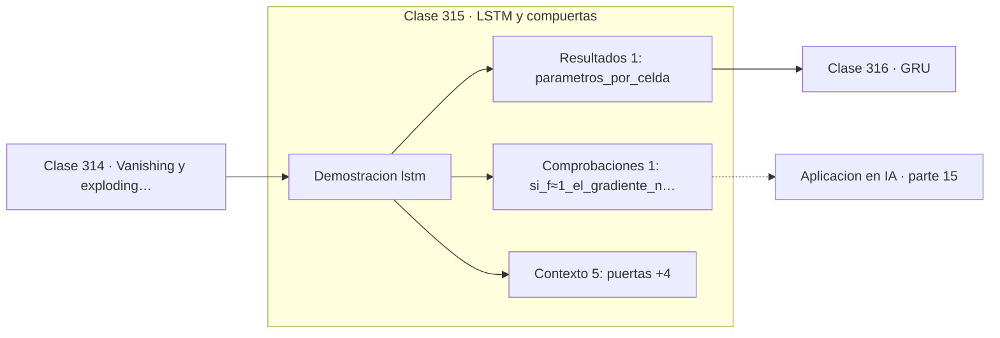

# 315 — LSTM y compuertas

> [⬅️ 314 Vanishing y exploding gradients](../314-vanishing-y-exploding-gradients/README.md) · [📚 Parte 15](../README.md) · [🏠 Programa](../../../README.md) · [316 GRU ➡️](../316-gru/README.md)

**Parte:** 15 — Matemática de Deep Learning · **Nivel:** `deep-learning` · **Horas estimadas:** 4
**Motor:** `engines.part15` · **Demostración:** `lstm` · **Clase 15 de 20** de la parte

---

## 🎯 Propósito

**La celda LSTM suma en vez de multiplicar, y por eso el gradiente sobrevive.**

Perceptrón, MLP, activaciones, pérdidas, backpropagation paso a paso, grafos de cómputo, inicialización, normalización, convolución, recurrencia y embeddings.

## ✅ Resultados de aprendizaje

Al terminar podrás:

1. Explicar **LSTM y compuertas** con lenguaje cotidiano y con notación matemática.
2. Resolver un caso pequeño a mano y anticipar el orden de magnitud del resultado.
3. Ejecutar y modificar `lab.py`, que corre la demostración `lstm`.
4. Interpretar las 7 salidas del laboratorio y decir qué comprueba cada una.
5. Detectar el error típico de esta parte: mezclar estadísticas de batch normalization entre entrenamiento e inferencia.

## 🧩 Fórmulas de la clase

```text
c_t = f_t·c_{t−1} + i_t·g_t
h_t = o_t·tanh(c_t)
si f ≈ 1, ∂c_t/∂c_{t−1} ≈ 1
```

## 🗺️ Ubicación en el programa



## 📖 Fundamentos

La LSTM introduce un **estado de celda** separado del estado oculto, cuya actualización es
fundamentalmente **aditiva**. Tres puertas —olvido, entrada y salida— controlan qué se
descarta del pasado, qué se incorpora del presente y qué se expone al exterior.

La clave está en la forma de la actualización. En una RNN simple, la derivada de un estado
respecto del anterior involucra la matriz de pesos y la derivada de la activación, y se
multiplica en cada paso. En la LSTM, si la puerta de olvido está cerca de 1, la derivada
`∂c_t/∂c_{t−1}` es aproximadamente 1, y el gradiente **atraviesa el tiempo sin atenuarse**.

Ese camino se conoce como el carrusel de error constante, y es la misma idea que las
conexiones residuales de ResNet: crear una vía por la que el gradiente pase intacto. La
diferencia con una RNN no es de capacidad de representación sino de entrenabilidad.

Un detalle práctico que ilustra bien el diseño: el sesgo de la puerta de olvido se
inicializa en 1, no en 0. Así la puerta empieza abierta y la celda **recuerda por
defecto**, dejando que el entrenamiento aprenda cuándo olvidar en vez de tener que aprender
a recordar desde cero. Cuesta doce parámetros por celda frente a los tres de una RNN
simple, y durante veinte años ese coste mereció la pena.

## 🧮 Ejemplo trabajado

Traza de una celda LSTM sobre una secuencia corta.

```text
puertas: forget, input, output

t    x      c         h        forget   input
1   1,0   0,42874   0,270127   0,8176   0,6xxx
2   ...   ...       ...        ...      ...

El sesgo de forget se inicializa en 1:
la puerta arranca en 0,82, cerca de abierta.

Camino del gradiente:
  c_t = f·c_{t−1} + i·g
  ∂c_t/∂c_{t−1} = f ≈ 0,82

Con 50 pasos y f ≈ 1:  0,98⁵⁰ ≈ 0,36
Con una RNN y factor 0,5: 0,5⁵⁰ ≈ 1e-15

12 parámetros por celda, frente a 3 de la RNN simple.
```

## 🔬 Qué ejecuta el laboratorio

`lstm` — LSTM: la celda mantiene un camino aditivo para el gradiente.

| Grupo | Salidas |
|---|---|
| 🔢 Resultados numéricos (1) | `parametros_por_celda` |
| ✅ Comprobaciones de invariante (1) | `si_f≈1_el_gradiente_no_se_atenua` |

Las claves booleanas no son adorno: si alguna fuera `False`, el resultado numérico
no sería fiable aunque el programa terminase sin error.

```bash
python classes/part-15-matematica-de-deep-learning/315-lstm-y-compuertas/lab.py
compmath run 315
```

> [!TIP]
> Antes de ejecutar, **escribe tu predicción**. Un laboratorio que confirma lo que
> esperabas enseña tanto como uno que te contradice, pero solo si la predicción
> existía antes del resultado.

## ⚠️ Errores conceptuales frecuentes

1. Inicializar el sesgo de la puerta de olvido en cero.
2. Confundir el estado de celda con el estado oculto.
3. Usar LSTM donde una arquitectura con atención sería más adecuada.

## 🚀 Dónde se usa de verdad

Modelado de secuencias largas, reconocimiento de voz, traducción automática anterior a los
Transformers y series temporales con dependencias lejanas.

## 🤖 Conexión con IA

Toda arquitectura moderna, incluido el Transformer, se construye sobre estos bloques y sobre este mismo mecanismo de derivación.

## 📓 Notebooks

| Archivo | Para qué |
|---|---|
| [`notebook.ipynb`](notebook.ipynb) | recorrido guiado con la demostración ejecutada |
| [`notebook_student.ipynb`](notebook_student.ipynb) | versión con `TODO` para resolver |
| [`notebook_solution.ipynb`](notebook_solution.ipynb) | solución de referencia verificada |

## 📝 Evaluación

| Criterio | Peso |
|---|---:|
| Comprensión conceptual | 25 % |
| Resolución manual | 25 % |
| Implementación y verificación | 25 % |
| Interpretación y comunicación | 15 % |
| Conexión con aplicación real | 10 % |

Detalle y criterios de error crítico en [`assessment.md`](assessment.md).

## ❓ Preguntas de comprobación

1. ¿Cuál es la entrada, cuál la salida y qué unidades tienen?
2. ¿Qué operación domina el comportamiento del resultado?
3. ¿Qué caso extremo revelaría un error conceptual?
4. ¿Cómo verificarías el resultado por un método independiente?
5. ¿Dónde aparece esto en visión?

Si necesitas releer el código para responderlas, la clase todavía no está superada.

## 📥 Entregable

`notebook_student.ipynb` resuelto más un párrafo que explique el resultado **sin citar
código**: qué entra, qué sale, qué invariante se comprueba y qué pasaría en un caso límite.

## 🔗 Referencias

- [Hochreiter, S.; Schmidhuber, J. *Long Short-Term Memory*, Neural Computation, 1997](https://doi.org/10.1162/neco.1997.9.8.1735) — *uso:* artículo de origen consultado en «LSTM y compuertas».
- [Olah, C. *Understanding LSTM Networks*, 2015](https://colah.github.io/posts/2015-08-Understanding-LSTMs/) — *uso:* exposición alternativa del tema en «LSTM y compuertas».

Bibliografía completa de la parte en [`../../../docs/BIBLIOGRAPHY.md`](../../../docs/BIBLIOGRAPHY.md) · localizador verificable de cada obra en [`sources/bibliography.json`](../../../sources/bibliography.json).

## 📂 Material de la clase

[`intuition.md`](intuition.md) · [`theory.md`](theory.md) · [`derivation.md`](derivation.md) · [`exercises.md`](exercises.md) · [`assessment.md`](assessment.md) · [`where-is-this-used.md`](where-is-this-used.md) · [`lesson.yaml`](lesson.yaml)

---

> [⬅️ 314 Vanishing y exploding gradients](../314-vanishing-y-exploding-gradients/README.md) · [📚 Parte 15](../README.md) · [🏠 Programa](../../../README.md) · [316 GRU ➡️](../316-gru/README.md)
