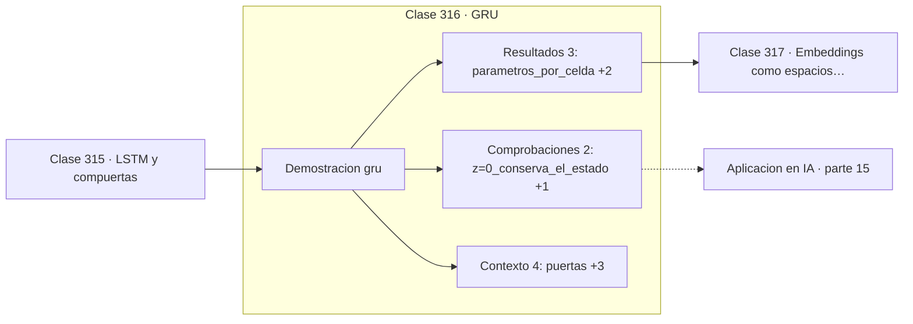

# 316 — GRU

> [⬅️ 315 LSTM y compuertas](../315-lstm-y-compuertas/README.md) · [📚 Parte 15](../README.md) · [🏠 Programa](../../../README.md) · [317 Embeddings como espacios vectoriales ➡️](../317-embeddings-como-espacios-vectoriales/README.md)

**Parte:** 15 — Matemática de Deep Learning · **Nivel:** `deep-learning` · **Horas estimadas:** 4
**Motor:** `engines.part15` · **Demostración:** `gru` · **Clase 16 de 20** de la parte

---

## 🎯 Propósito

**GRU consigue casi lo mismo que LSTM con dos puertas y un 25 % menos de parámetros.**

Perceptrón, MLP, activaciones, pérdidas, backpropagation paso a paso, grafos de cómputo, inicialización, normalización, convolución, recurrencia y embeddings.

## ✅ Resultados de aprendizaje

Al terminar podrás:

1. Explicar **GRU** con lenguaje cotidiano y con notación matemática.
2. Resolver un caso pequeño a mano y anticipar el orden de magnitud del resultado.
3. Ejecutar y modificar `lab.py`, que corre la demostración `gru`.
4. Interpretar las 9 salidas del laboratorio y decir qué comprueba cada una.
5. Detectar el error típico de esta parte: inicializar todos los pesos iguales y romper la simetría nunca.

## 🧩 Fórmulas de la clase

```text
z: puerta de actualización;  r: puerta de reinicio
h_t = (1−z)·h_{t−1} + z·h̃_t
9 parámetros por celda frente a 12 de LSTM
```

## 🗺️ Ubicación en el programa



## 📖 Fundamentos

La GRU simplifica la LSTM fusionando el estado de celda con el estado oculto y reduciendo
las tres puertas a dos. La **puerta de actualización** decide cuánto del estado anterior se
conserva frente al candidato nuevo, combinando los papeles de las puertas de olvido y
entrada. La **puerta de reinicio** decide cuánto del pasado se usa para calcular ese
candidato.

La actualización tiene una forma de interpolación explícita: `(1−z)·h_anterior + z·h_nuevo`.
Si `z = 0` el estado se conserva íntegro, y esa es la misma vía aditiva que protege el
gradiente en la LSTM. La protección se consigue con menos maquinaria.

El ahorro es de 9 parámetros por celda frente a 12, un 25 %. Con capas de miles de unidades
eso se traduce en menos memoria y entrenamientos más rápidos, lo que en su momento fue una
ventaja práctica considerable.

La comparación empírica entre GRU y LSTM ha sido objeto de muchos estudios y la conclusión
es que **depende de la tarea**, sin ganador consistente. La recomendación razonable es
empezar por GRU por ser más ligera y probar LSTM si el rendimiento no basta. Ambas han
quedado en segundo plano frente a los Transformers, pero siguen siendo competitivas en
secuencias cortas y con pocos datos.

## 🧮 Ejemplo trabajado

Traza de una celda GRU y comparación de parámetros.

```text
puertas: update (z), reset (r)

t     h         update   reset
1   0,413336    0,6225   0,6457
2   ...         ...      ...

Parámetros por celda:
  GRU:  9
  LSTM: 12
  ahorro: 25 %

Interpolación: h_t = (1−z)·h_{t−1} + z·h̃_t
  z = 0  →  el estado se conserva íntegro           ✓
  z = 1  →  el estado se sustituye por el candidato

Ese camino con z ≈ 0 es lo que protege el gradiente,
igual que la puerta de olvido de la LSTM.
```

## 🔬 Qué ejecuta el laboratorio

`gru` — GRU: dos puertas en lugar de tres, menos parámetros.

| Grupo | Salidas |
|---|---|
| 🔢 Resultados numéricos (3) | `parametros_por_celda`, `parametros_LSTM`, `ahorro_%` |
| ✅ Comprobaciones de invariante (2) | `z=0_conserva_el_estado`, `z=1_lo_reemplaza` |

Las claves booleanas no son adorno: si alguna fuera `False`, el resultado numérico
no sería fiable aunque el programa terminase sin error.

```bash
python classes/part-15-matematica-de-deep-learning/316-gru/lab.py
compmath run 316
```

> [!TIP]
> Antes de ejecutar, **escribe tu predicción**. Un laboratorio que confirma lo que
> esperabas enseña tanto como uno que te contradice, pero solo si la predicción
> existía antes del resultado.

## ⚠️ Errores conceptuales frecuentes

1. Elegir entre GRU y LSTM sin probar en la tarea concreta.
2. Confundir el sentido de la puerta de actualización al implementarla.
3. Suponer que menos parámetros implica siempre peor rendimiento.

## 🚀 Dónde se usa de verdad

Modelado de secuencias con recursos limitados, series temporales, reconocimiento de gestos
y sistemas embebidos.

## 🤖 Conexión con IA

Toda arquitectura moderna, incluido el Transformer, se construye sobre estos bloques y sobre este mismo mecanismo de derivación.

## 📓 Notebooks

| Archivo | Para qué |
|---|---|
| [`notebook.ipynb`](notebook.ipynb) | recorrido guiado con la demostración ejecutada |
| [`notebook_student.ipynb`](notebook_student.ipynb) | versión con `TODO` para resolver |
| [`notebook_solution.ipynb`](notebook_solution.ipynb) | solución de referencia verificada |

## 📝 Evaluación

| Criterio | Peso |
|---|---:|
| Comprensión conceptual | 25 % |
| Resolución manual | 25 % |
| Implementación y verificación | 25 % |
| Interpretación y comunicación | 15 % |
| Conexión con aplicación real | 10 % |

Detalle y criterios de error crítico en [`assessment.md`](assessment.md).

## ❓ Preguntas de comprobación

1. ¿Cuál es la entrada, cuál la salida y qué unidades tienen?
2. ¿Qué operación domina el comportamiento del resultado?
3. ¿Qué caso extremo revelaría un error conceptual?
4. ¿Cómo verificarías el resultado por un método independiente?
5. ¿Dónde aparece esto en visión?

Si necesitas releer el código para responderlas, la clase todavía no está superada.

## 📥 Entregable

`notebook_student.ipynb` resuelto más un párrafo que explique el resultado **sin citar
código**: qué entra, qué sale, qué invariante se comprueba y qué pasaría en un caso límite.

## 🔗 Referencias

- [Cho, K. et al. *Learning phrase representations using RNN encoder-decoder*, EMNLP, 2014](https://arxiv.org/abs/1406.1078) — *uso:* artículo de origen consultado en «GRU».
- [Chung, J. et al. *Empirical evaluation of gated recurrent neural networks*, 2014](https://arxiv.org/abs/1412.3555) — *uso:* artículo de origen consultado en «GRU».

Bibliografía completa de la parte en [`../../../docs/BIBLIOGRAPHY.md`](../../../docs/BIBLIOGRAPHY.md) · localizador verificable de cada obra en [`sources/bibliography.json`](../../../sources/bibliography.json).

## 📂 Material de la clase

[`intuition.md`](intuition.md) · [`theory.md`](theory.md) · [`derivation.md`](derivation.md) · [`exercises.md`](exercises.md) · [`assessment.md`](assessment.md) · [`where-is-this-used.md`](where-is-this-used.md) · [`lesson.yaml`](lesson.yaml)

---

> [⬅️ 315 LSTM y compuertas](../315-lstm-y-compuertas/README.md) · [📚 Parte 15](../README.md) · [🏠 Programa](../../../README.md) · [317 Embeddings como espacios vectoriales ➡️](../317-embeddings-como-espacios-vectoriales/README.md)
