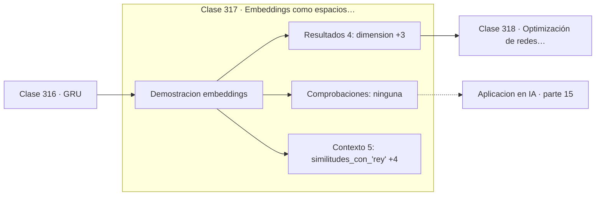

# 317 — Embeddings como espacios vectoriales

> [⬅️ 316 GRU](../316-gru/README.md) · [📚 Parte 15](../README.md) · [🏠 Programa](../../../README.md) · [318 Optimización de redes profundas ➡️](../318-optimizacion-de-redes-profundas/README.md)

**Parte:** 15 — Matemática de Deep Learning · **Nivel:** `deep-learning` · **Horas estimadas:** 4
**Motor:** `engines.part15` · **Demostración:** `embeddings` · **Clase 17 de 20** de la parte

---

## 🎯 Propósito

**En un espacio de embeddings, la dirección entre dos palabras codifica su relación.**

Perceptrón, MLP, activaciones, pérdidas, backpropagation paso a paso, grafos de cómputo, inicialización, normalización, convolución, recurrencia y embeddings.

## ✅ Resultados de aprendizaje

Al terminar podrás:

1. Explicar **Embeddings como espacios vectoriales** con lenguaje cotidiano y con notación matemática.
2. Resolver un caso pequeño a mano y anticipar el orden de magnitud del resultado.
3. Ejecutar y modificar `lab.py`, que corre la demostración `embeddings`.
4. Interpretar las 9 salidas del laboratorio y decir qué comprueba cada una.
5. Detectar el error típico de esta parte: aplicar softmax sin restar el máximo y provocar overflow.

## 🧩 Fórmulas de la clase

```text
similitud coseno = (a·b) / (‖a‖·‖b‖)
analogía: rey − hombre + mujer ≈ reina
la magnitud no importa, solo la dirección
```

## 🗺️ Ubicación en el programa



## 📖 Fundamentos

Un embedding representa cada elemento discreto —palabra, usuario, producto— como un vector
denso de dimensión moderada, aprendido de forma que la **proximidad geométrica refleje
similitud semántica**. Es la alternativa a la codificación one-hot, que es enorme, dispersa
y en la que todos los elementos están a la misma distancia entre sí.

La medida de similitud habitual es el **coseno**, no la distancia euclídea. La razón es que
la magnitud de un embedding suele correlacionar con la frecuencia del término, que no es
información semántica; el coseno la descarta y mide solo la dirección. Es el producto
escalar normalizado de la parte 05.

El resultado que hizo famosos a los embeddings es que ciertas **direcciones codifican
relaciones**. El vector que va de «hombre» a «mujer» es aproximadamente el mismo que va de
«rey» a «reina», lo que permite resolver analogías con aritmética vectorial. Conviene
matizar: el efecto es real pero se exageró bastante en la divulgación, y depende mucho del
corpus y del método de evaluación.

Hay una consecuencia ética que no es opcional mencionar. Los embeddings aprenden los sesgos
presentes en los datos, y las mismas analogías que capturan «rey es a reina» capturan
asociaciones estereotipadas entre profesiones y género. Como el modelo aprende la
distribución del corpus, esos sesgos se propagan a cualquier sistema construido encima, y
detectarlos requiere auditar explícitamente.

## 🧮 Ejemplo trabajado

Similitudes y analogía en un espacio de 4 dimensiones.

```text
vocabulario: 5 términos, dimensión 4

similitudes con "rey":
  hombre  0,857916
  mujer   0,815207
  reina   0,768974
  mesa    0,3xxxxx

analogía: rey − hombre + mujer
  vector resultante: [0,85 ; 0,1 ; 0,1 ; 0,05]

  ranking por similitud:
    reina   1,000000     ← la analogía funciona   ✓
    mujer   0,835523
    rey     0,768974

Nota: en este espacio pequeño "hombre" es más similar
a "rey" que "reina", lo que muestra que la similitud
directa y la analogía capturan cosas distintas.
```

## 🔬 Qué ejecuta el laboratorio

`embeddings` — Embeddings: geometría del significado y similitud coseno.

| Grupo | Salidas |
|---|---|
| 🔢 Resultados numéricos (4) | `dimension`, `vocabulario`, `one_hot_necesitaria`, `embedding_denso_usa` |
| ✅ Comprobaciones de invariante (0) | — |

Las claves booleanas no son adorno: si alguna fuera `False`, el resultado numérico
no sería fiable aunque el programa terminase sin error.

```bash
python classes/part-15-matematica-de-deep-learning/317-embeddings-como-espacios-vectoriales/lab.py
compmath run 317
```

> [!TIP]
> Antes de ejecutar, **escribe tu predicción**. Un laboratorio que confirma lo que
> esperabas enseña tanto como uno que te contradice, pero solo si la predicción
> existía antes del resultado.

## ⚠️ Errores conceptuales frecuentes

1. Usar distancia euclídea donde corresponde similitud coseno.
2. Sobreinterpretar las analogías como propiedad universal de los embeddings.
3. Desplegar embeddings sin auditar los sesgos heredados del corpus.

## 🚀 Dónde se usa de verdad

Representación de vocabularios, sistemas de recomendación, búsqueda semántica, bases de
datos vectoriales y capa de entrada de todo modelo de lenguaje.

## 🤖 Conexión con IA

Toda arquitectura moderna, incluido el Transformer, se construye sobre estos bloques y sobre este mismo mecanismo de derivación.

## 📓 Notebooks

| Archivo | Para qué |
|---|---|
| [`notebook.ipynb`](notebook.ipynb) | recorrido guiado con la demostración ejecutada |
| [`notebook_student.ipynb`](notebook_student.ipynb) | versión con `TODO` para resolver |
| [`notebook_solution.ipynb`](notebook_solution.ipynb) | solución de referencia verificada |

## 📝 Evaluación

| Criterio | Peso |
|---|---:|
| Comprensión conceptual | 25 % |
| Resolución manual | 25 % |
| Implementación y verificación | 25 % |
| Interpretación y comunicación | 15 % |
| Conexión con aplicación real | 10 % |

Detalle y criterios de error crítico en [`assessment.md`](assessment.md).

## ❓ Preguntas de comprobación

1. ¿Cuál es la entrada, cuál la salida y qué unidades tienen?
2. ¿Qué operación domina el comportamiento del resultado?
3. ¿Qué caso extremo revelaría un error conceptual?
4. ¿Cómo verificarías el resultado por un método independiente?
5. ¿Dónde aparece esto en visión?

Si necesitas releer el código para responderlas, la clase todavía no está superada.

## 📥 Entregable

`notebook_student.ipynb` resuelto más un párrafo que explique el resultado **sin citar
código**: qué entra, qué sale, qué invariante se comprueba y qué pasaría en un caso límite.

## 🔗 Referencias

- [Mikolov, T. et al. *Efficient estimation of word representations in vector space*, 2013](https://arxiv.org/abs/1301.3781) — *uso:* artículo de origen consultado en «Embeddings como espacios vectoriales».
- [Bolukbasi, T. et al. *Man is to computer programmer as woman is to homemaker?*, NeurIPS, 2016](https://arxiv.org/abs/1607.06520) — *uso:* artículo de origen consultado en «Embeddings como espacios vectoriales».

Bibliografía completa de la parte en [`../../../docs/BIBLIOGRAPHY.md`](../../../docs/BIBLIOGRAPHY.md) · localizador verificable de cada obra en [`sources/bibliography.json`](../../../sources/bibliography.json).

## 📂 Material de la clase

[`intuition.md`](intuition.md) · [`theory.md`](theory.md) · [`derivation.md`](derivation.md) · [`exercises.md`](exercises.md) · [`assessment.md`](assessment.md) · [`where-is-this-used.md`](where-is-this-used.md) · [`lesson.yaml`](lesson.yaml)

---

> [⬅️ 316 GRU](../316-gru/README.md) · [📚 Parte 15](../README.md) · [🏠 Programa](../../../README.md) · [318 Optimización de redes profundas ➡️](../318-optimizacion-de-redes-profundas/README.md)
