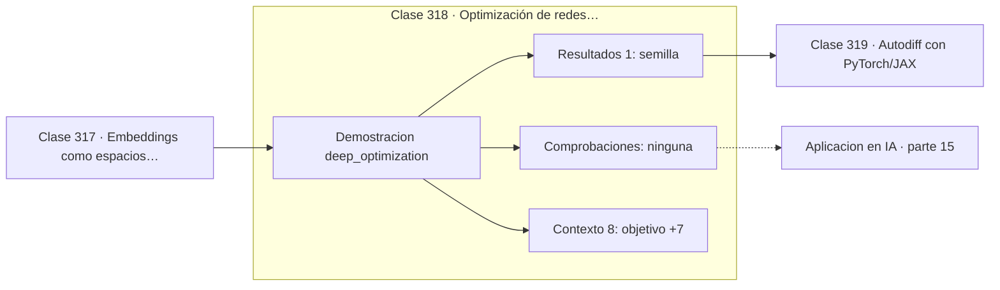

# 318 — Optimización de redes profundas

> [⬅️ 317 Embeddings como espacios vectoriales](../317-embeddings-como-espacios-vectoriales/README.md) · [📚 Parte 15](../README.md) · [🏠 Programa](../../../README.md) · [319 Autodiff con PyTorch/JAX ➡️](../319-autodiff-con-pytorch-jax/README.md)

**Parte:** 15 — Matemática de Deep Learning · **Nivel:** `deep-learning` · **Horas estimadas:** 4
**Motor:** `engines.part15` · **Demostración:** `deep_optimization` · **Clase 18 de 20** de la parte

---

## 🎯 Propósito

**Warmup evita divergir al arrancar y clipping evita que un gradiente anómalo destruya el modelo.**

Perceptrón, MLP, activaciones, pérdidas, backpropagation paso a paso, grafos de cómputo, inicialización, normalización, convolución, recurrencia y embeddings.

## ✅ Resultados de aprendizaje

Al terminar podrás:

1. Explicar **Optimización de redes profundas** con lenguaje cotidiano y con notación matemática.
2. Resolver un caso pequeño a mano y anticipar el orden de magnitud del resultado.
3. Ejecutar y modificar `lab.py`, que corre la demostración `deep_optimization`.
4. Interpretar las 9 salidas del laboratorio y decir qué comprueba cada una.
5. Detectar el error típico de esta parte: mezclar estadísticas de batch normalization entre entrenamiento e inferencia.

## 🧩 Fórmulas de la clase

```text
warmup: subir el lr linealmente durante los primeros pasos
clipping: si ‖g‖ > c, escalar g ← c·g/‖g‖
planificador: reducir el lr según avanza el entrenamiento
```

## 🗺️ Ubicación en el programa



## 📖 Fundamentos

Entrenar una red profunda es aplicar los optimizadores de la parte 12 a un problema no
convexo, ruidoso y de curvatura muy variable. Las técnicas de esta clase no son adornos:
son lo que hace la diferencia entre un entrenamiento que converge y uno que produce NaN en
el paso 300.

El **warmup** sube el learning rate gradualmente durante los primeros cientos o miles de
pasos. La razón es concreta: al principio los momentos de Adam están mal estimados y los
gradientes son grandes y poco informativos, así que un paso completo puede llevar los pesos
a una región de la que no se recuperan. Es prácticamente obligatorio al entrenar
Transformers.

El **gradient clipping** acota la norma del gradiente sin cambiar su dirección. Es un
seguro barato contra los picos anómalos —un lote raro, una muestra corrupta— que en un
solo paso podrían destruir horas de entrenamiento. Un valor de 1,0 es habitual y rara vez
perjudica.

Los **planificadores** reducen el learning rate a lo largo del entrenamiento: pasos grandes
al principio para explorar, pequeños al final para afinar. El decaimiento por coseno con
warmup es la receta estándar actual. Y conviene recordar que estas tres técnicas atacan
problemas de **optimización**, no de generalización: si el modelo converge bien y
generaliza mal, el remedio está en otra parte.

## 🧮 Ejemplo trabajado

Cuatro configuraciones sobre el mismo objetivo ruidoso.

```text
objetivo: minimizar ‖w − w*‖² con gradientes ruidosos

configuración              paso 10      paso 100
lr alto sin clipping      0,00039758      0,0
lr alto con clipping      4,96308444      0,0
lr moderado               0,00864028      0,0
lr moderado con warmup    2,80892690      0,0

Todas convergen aquí porque el problema es benigno.

Lo que cambia es el paso 10: warmup y clipping avanzan
más despacio al principio a cambio de no arriesgar.

En un problema real, "lr alto sin clipping" produciría
NaN antes del paso 100 con un solo lote anómalo.
```

## 🔬 Qué ejecuta el laboratorio

`deep_optimization` — Entrenar una red profunda: learning rate, warmup y clipping.

| Grupo | Salidas |
|---|---|
| 🔢 Resultados numéricos (1) | `semilla` |
| ✅ Comprobaciones de invariante (0) | — |

Las claves booleanas no son adorno: si alguna fuera `False`, el resultado numérico
no sería fiable aunque el programa terminase sin error.

```bash
python classes/part-15-matematica-de-deep-learning/318-optimizacion-de-redes-profundas/lab.py
compmath run 318
```

> [!TIP]
> Antes de ejecutar, **escribe tu predicción**. Un laboratorio que confirma lo que
> esperabas enseña tanto como uno que te contradice, pero solo si la predicción
> existía antes del resultado.

## ⚠️ Errores conceptuales frecuentes

1. Entrenar Transformers sin warmup.
2. Prescindir del clipping y perder un entrenamiento largo por un lote anómalo.
3. Ajustar el learning rate para arreglar un problema de generalización.

## 🚀 Dónde se usa de verdad

Entrenamiento de modelos de lenguaje, recetas de entrenamiento reproducibles, ajuste fino
y depuración de entrenamientos inestables.

## 🤖 Conexión con IA

Toda arquitectura moderna, incluido el Transformer, se construye sobre estos bloques y sobre este mismo mecanismo de derivación.

## 📓 Notebooks

| Archivo | Para qué |
|---|---|
| [`notebook.ipynb`](notebook.ipynb) | recorrido guiado con la demostración ejecutada |
| [`notebook_student.ipynb`](notebook_student.ipynb) | versión con `TODO` para resolver |
| [`notebook_solution.ipynb`](notebook_solution.ipynb) | solución de referencia verificada |

## 📝 Evaluación

| Criterio | Peso |
|---|---:|
| Comprensión conceptual | 25 % |
| Resolución manual | 25 % |
| Implementación y verificación | 25 % |
| Interpretación y comunicación | 15 % |
| Conexión con aplicación real | 10 % |

Detalle y criterios de error crítico en [`assessment.md`](assessment.md).

## ❓ Preguntas de comprobación

1. ¿Cuál es la entrada, cuál la salida y qué unidades tienen?
2. ¿Qué operación domina el comportamiento del resultado?
3. ¿Qué caso extremo revelaría un error conceptual?
4. ¿Cómo verificarías el resultado por un método independiente?
5. ¿Dónde aparece esto en visión?

Si necesitas releer el código para responderlas, la clase todavía no está superada.

## 📥 Entregable

`notebook_student.ipynb` resuelto más un párrafo que explique el resultado **sin citar
código**: qué entra, qué sale, qué invariante se comprueba y qué pasaría en un caso límite.

## 🔗 Referencias

- [Goyal, P. et al. *Accurate, Large Minibatch SGD*, 2017](https://arxiv.org/abs/1706.02677) — *uso:* artículo de origen consultado en «Optimización de redes profundas».
- [Loshchilov, I.; Hutter, F. *SGDR: Stochastic Gradient Descent with Warm Restarts*, ICLR, 2017](https://arxiv.org/abs/1608.03983) — *uso:* artículo de origen consultado en «Optimización de redes profundas».

Bibliografía completa de la parte en [`../../../docs/BIBLIOGRAPHY.md`](../../../docs/BIBLIOGRAPHY.md) · localizador verificable de cada obra en [`sources/bibliography.json`](../../../sources/bibliography.json).

## 📂 Material de la clase

[`intuition.md`](intuition.md) · [`theory.md`](theory.md) · [`derivation.md`](derivation.md) · [`exercises.md`](exercises.md) · [`assessment.md`](assessment.md) · [`where-is-this-used.md`](where-is-this-used.md) · [`lesson.yaml`](lesson.yaml)

---

> [⬅️ 317 Embeddings como espacios vectoriales](../317-embeddings-como-espacios-vectoriales/README.md) · [📚 Parte 15](../README.md) · [🏠 Programa](../../../README.md) · [319 Autodiff con PyTorch/JAX ➡️](../319-autodiff-con-pytorch-jax/README.md)
