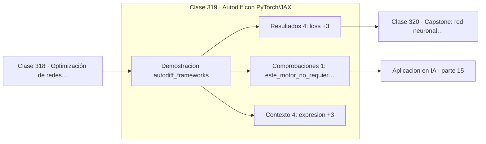

# 319 — Autodiff con PyTorch/JAX

> [⬅️ 318 Optimización de redes profundas](../318-optimizacion-de-redes-profundas/README.md) · [📚 Parte 15](../README.md) · [🏠 Programa](../../../README.md) · [320 Capstone: red neuronal desde cero en Python puro ➡️](../320-capstone-red-neuronal-desde-cero-en-python-puro/README.md)

**Parte:** 15 — Matemática de Deep Learning · **Nivel:** `deep-learning` · **Horas estimadas:** 4
**Motor:** `engines.part15` · **Demostración:** `autodiff_frameworks` · **Clase 19 de 20** de la parte

---

## 🎯 Propósito

**PyTorch y JAX hacen lo mismo que el Var de la parte 08, con ingeniería de por medio.**

Perceptrón, MLP, activaciones, pérdidas, backpropagation paso a paso, grafos de cómputo, inicialización, normalización, convolución, recurrencia y embeddings.

## ✅ Resultados de aprendizaje

Al terminar podrás:

1. Explicar **Autodiff con PyTorch/JAX** con lenguaje cotidiano y con notación matemática.
2. Resolver un caso pequeño a mano y anticipar el orden de magnitud del resultado.
3. Ejecutar y modificar `lab.py`, que corre la demostración `autodiff_frameworks`.
4. Interpretar las 9 salidas del laboratorio y decir qué comprueba cada una.
5. Detectar el error típico de esta parte: inicializar todos los pesos iguales y romper la simetría nunca.

## 🧩 Fórmulas de la clase

```text
modo reverso: una pasada adelante, una atrás
coste ≈ 2 veces el del forward, independientemente del número de parámetros
modo directo: eficiente con pocas entradas y muchas salidas
```

## 🗺️ Ubicación en el programa



## 📖 Fundamentos

La autodiferenciación en **modo reverso** obtiene los gradientes de una salida escalar
respecto de todas las entradas con una sola pasada hacia atrás. Su coste es
aproximadamente el doble del paso hacia adelante, **independientemente de cuántos
parámetros haya**. Esa propiedad es lo que hace viable entrenar modelos de miles de
millones de parámetros.

El **modo directo** propaga derivadas hacia adelante y es eficiente en el caso opuesto:
pocas entradas y muchas salidas. Como en aprendizaje automático la pérdida siempre es un
escalar y los parámetros son millones, el modo reverso es el adecuado, y por eso es el que
implementan todos los frameworks.

Ninguno de los dos es diferenciación simbólica ni numérica. No manipula fórmulas ni usa
diferencias finitas: evalúa derivadas exactas de operaciones elementales y las compone
según el grafo. Es exacta hasta el redondeo y eficiente, que es lo mejor de ambos mundos.

Lo que aportan PyTorch y JAX sobre el `Var` de la parte 08 no es el concepto sino la
ingeniería: núcleos optimizados para GPU y TPU, fusión de operaciones, compilación
diferida, paralelismo y una cobertura enorme de operaciones. El principio se entiende en
cien líneas de Python; la implementación de producción son cientos de miles.

## 🧮 Ejemplo trabajado

La misma expresión derivada por el motor propio.

```text
expresión: loss = (tanh(wx + b) − 1)²

loss = 0,09543807

dloss/dw = −0,48417723
dloss/db = −0,32278482
dloss/dx = −0,22594937

Tres gradientes de una sola pasada hacia atrás.

Con un millón de parámetros el coste sería el mismo
factor 2 sobre el forward: esa es la propiedad clave.

Con diferencias finitas harían falta un millón de
evaluaciones adicionales, una por parámetro.
```

## 🔬 Qué ejecuta el laboratorio

`autodiff_frameworks` — Nuestro Var frente a PyTorch/JAX: mismo principio, distinta escala.

| Grupo | Salidas |
|---|---|
| 🔢 Resultados numéricos (4) | `loss`, `dloss/dw`, `dloss/db`, `dloss/dx` |
| ✅ Comprobaciones de invariante (1) | `este_motor_no_requiere_torch` |

Las claves booleanas no son adorno: si alguna fuera `False`, el resultado numérico
no sería fiable aunque el programa terminase sin error.

```bash
python classes/part-15-matematica-de-deep-learning/319-autodiff-con-pytorch-jax/lab.py
compmath run 319
```

> [!TIP]
> Antes de ejecutar, **escribe tu predicción**. Un laboratorio que confirma lo que
> esperabas enseña tanto como uno que te contradice, pero solo si la predicción
> existía antes del resultado.

## ⚠️ Errores conceptuales frecuentes

1. Confundir autodiferenciación con derivación simbólica o numérica.
2. Usar modo directo cuando hay muchos parámetros y una sola salida.
3. Reimplementar gradientes a mano existiendo autodiferenciación.

## 🚀 Dónde se usa de verdad

Todo entrenamiento moderno, optimización de simuladores diferenciables, física
diferenciable y cálculo de sensibilidades.

## 🤖 Conexión con IA

Toda arquitectura moderna, incluido el Transformer, se construye sobre estos bloques y sobre este mismo mecanismo de derivación.

## 📓 Notebooks

| Archivo | Para qué |
|---|---|
| [`notebook.ipynb`](notebook.ipynb) | recorrido guiado con la demostración ejecutada |
| [`notebook_student.ipynb`](notebook_student.ipynb) | versión con `TODO` para resolver |
| [`notebook_solution.ipynb`](notebook_solution.ipynb) | solución de referencia verificada |

## 📝 Evaluación

| Criterio | Peso |
|---|---:|
| Comprensión conceptual | 25 % |
| Resolución manual | 25 % |
| Implementación y verificación | 25 % |
| Interpretación y comunicación | 15 % |
| Conexión con aplicación real | 10 % |

Detalle y criterios de error crítico en [`assessment.md`](assessment.md).

## ❓ Preguntas de comprobación

1. ¿Cuál es la entrada, cuál la salida y qué unidades tienen?
2. ¿Qué operación domina el comportamiento del resultado?
3. ¿Qué caso extremo revelaría un error conceptual?
4. ¿Cómo verificarías el resultado por un método independiente?
5. ¿Dónde aparece esto en visión?

Si necesitas releer el código para responderlas, la clase todavía no está superada.

## 📥 Entregable

`notebook_student.ipynb` resuelto más un párrafo que explique el resultado **sin citar
código**: qué entra, qué sale, qué invariante se comprueba y qué pasaría en un caso límite.

## 🔗 Referencias

- [Paszke, A. et al. *PyTorch: An Imperative Style, High-Performance Deep Learning Library*, NeurIPS, 2019](https://arxiv.org/abs/1912.01703) — *uso:* artículo de origen consultado en «Autodiff con PyTorch/JAX».
- [Bradbury, J. et al. *JAX: composable transformations of Python+NumPy programs*, 2018](https://github.com/google/jax) — *uso:* obra de referencia consultada en «Autodiff con PyTorch/JAX».

Bibliografía completa de la parte en [`../../../docs/BIBLIOGRAPHY.md`](../../../docs/BIBLIOGRAPHY.md) · localizador verificable de cada obra en [`sources/bibliography.json`](../../../sources/bibliography.json).

## 📂 Material de la clase

[`intuition.md`](intuition.md) · [`theory.md`](theory.md) · [`derivation.md`](derivation.md) · [`exercises.md`](exercises.md) · [`assessment.md`](assessment.md) · [`where-is-this-used.md`](where-is-this-used.md) · [`lesson.yaml`](lesson.yaml)

---

> [⬅️ 318 Optimización de redes profundas](../318-optimizacion-de-redes-profundas/README.md) · [📚 Parte 15](../README.md) · [🏠 Programa](../../../README.md) · [320 Capstone: red neuronal desde cero en Python puro ➡️](../320-capstone-red-neuronal-desde-cero-en-python-puro/README.md)
