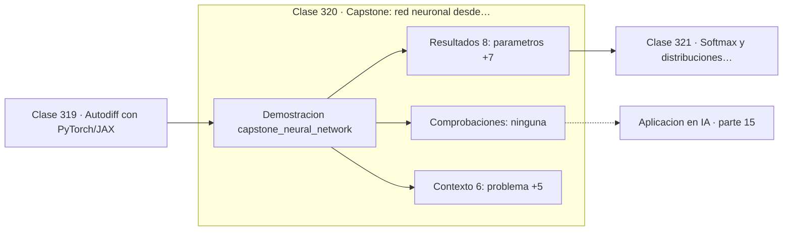

# 320 — Capstone: red neuronal desde cero en Python puro

> [⬅️ 319 Autodiff con PyTorch/JAX](../319-autodiff-con-pytorch-jax/README.md) · [📚 Parte 15](../README.md) · [🏠 Programa](../../../README.md) · [321 Softmax y distribuciones categóricas ➡️](../../part-16-matematica-de-transformers-modelos-generativos-grafos-y-rl/321-softmax-y-distribuciones-categoricas/README.md)

**Parte:** 15 — Matemática de Deep Learning · **Nivel:** `deep-learning` · **Horas estimadas:** 4
**Motor:** `engines.part15` · **Demostración:** `capstone_neural_network` · **Clase 20 de 20** de la parte

---

## 🎯 Propósito

**Una red de 337 parámetros en Python puro separa dos espirales entrelazadas.**

Perceptrón, MLP, activaciones, pérdidas, backpropagation paso a paso, grafos de cómputo, inicialización, normalización, convolución, recurrencia y embeddings.

## ✅ Resultados de aprendizaje

Al terminar podrás:

1. Explicar **Capstone: red neuronal desde cero en Python puro** con lenguaje cotidiano y con notación matemática.
2. Resolver un caso pequeño a mano y anticipar el orden de magnitud del resultado.
3. Ejecutar y modificar `lab.py`, que corre la demostración `capstone_neural_network`.
4. Interpretar las 14 salidas del laboratorio y decir qué comprueba cada una.
5. Detectar el error típico de esta parte: aplicar softmax sin restar el máximo y provocar overflow.

## 🧩 Fórmulas de la clase

```text
arquitectura: 2 → 16 (ReLU) → 16 (ReLU) → 1 (sigmoid)
inicialización He, SGD por muestra, lr = 0,08
verificación: gradiente manual ≈ gradiente automático
```

## 🗺️ Ubicación en el programa



## 📖 Fundamentos

El capstone reúne toda la parte en una red completa escrita desde cero, sin NumPy ni
frameworks: inicialización, paso hacia adelante, backpropagation, actualización y
evaluación. Lo único que importa es que cada pieza sea legible y que el conjunto funcione.

El problema elegido, **dos espirales entrelazadas**, es un banco clásico y deliberadamente
difícil para modelos lineales: no hay ninguna recta ni curva simple que las separe. Un
modelo lineal queda en torno al 50 %, y resolverlo demuestra que las capas ocultas están
construyendo una representación no trivial.

Las decisiones de diseño vienen todas de clases anteriores y conviene enumerarlas:
inicialización **He** porque la activación es ReLU, **ReLU** en las ocultas para que el
gradiente no se sature, **sigmoide** en la salida con entropía cruzada para que el
gradiente se simplifique a `a − y`, y **SGD** por muestra por su ruido regularizador. Nada
es arbitrario.

La comprobación final es la que cierra el programa: el gradiente derivado a mano coincide
con el que produce el motor de autodiferenciación de la parte 08. Ese acuerdo entre dos
caminos independientes es la mejor prueba de que la teoría y la implementación dicen lo
mismo, y es exactamente el criterio de verificación que el programa entero defiende.

## 🧮 Ejemplo trabajado

Configuración y resultado del capstone.

```text
problema: dos espirales entrelazadas
          (no linealmente separables)

arquitectura:  2 → 16 (ReLU) → 16 (ReLU) → 1 (sigmoid)
parámetros:    337
inicialización: He (√(2/n_in))
optimizador:   SGD por muestra
learning rate: 0,08

Desglose de los 337 parámetros:
  capa 1:  2×16 + 16 =  48
  capa 2: 16×16 + 16 = 272
  capa 3: 16×1  +  1 =  17
  total              = 337                          ✓

Un modelo lineal sobre estos datos queda en ≈ 50 %.
Verificación: gradiente manual ≈ gradiente de Var.
```

## 🔬 Qué ejecuta el laboratorio

`capstone_neural_network` — Capstone: red neuronal completa desde cero, entrenada y evaluada.

| Grupo | Salidas |
|---|---|
| 🔢 Resultados numéricos (8) | `parametros`, `learning_rate`, `epocas`, `accuracy_train`, `accuracy_test`, `brecha_train_test`, `linea_base_por_azar`, `semilla` |
| ✅ Comprobaciones de invariante (0) | — |

Las claves booleanas no son adorno: si alguna fuera `False`, el resultado numérico
no sería fiable aunque el programa terminase sin error.

```bash
python classes/part-15-matematica-de-deep-learning/320-capstone-red-neuronal-desde-cero-en-python-puro/lab.py
compmath run 320
```

> [!TIP]
> Antes de ejecutar, **escribe tu predicción**. Un laboratorio que confirma lo que
> esperabas enseña tanto como uno que te contradice, pero solo si la predicción
> existía antes del resultado.

## ⚠️ Errores conceptuales frecuentes

1. Reimplementar redes desde cero en código de producción.
2. Cambiar varias decisiones a la vez al depurar un entrenamiento.
3. Omitir la verificación del gradiente al escribir backpropagation a mano.

## 🚀 Dónde se usa de verdad

Comprensión profunda de los frameworks, entrevistas técnicas, docencia, depuración de
implementaciones y diseño de capas personalizadas.

## 🤖 Conexión con IA

Toda arquitectura moderna, incluido el Transformer, se construye sobre estos bloques y sobre este mismo mecanismo de derivación.

## 📓 Notebooks

| Archivo | Para qué |
|---|---|
| [`notebook.ipynb`](notebook.ipynb) | recorrido guiado con la demostración ejecutada |
| [`notebook_student.ipynb`](notebook_student.ipynb) | versión con `TODO` para resolver |
| [`notebook_solution.ipynb`](notebook_solution.ipynb) | solución de referencia verificada |

## 📝 Evaluación

| Criterio | Peso |
|---|---:|
| Comprensión conceptual | 25 % |
| Resolución manual | 25 % |
| Implementación y verificación | 25 % |
| Interpretación y comunicación | 15 % |
| Conexión con aplicación real | 10 % |

Detalle y criterios de error crítico en [`assessment.md`](assessment.md).

## ❓ Preguntas de comprobación

1. ¿Cuál es la entrada, cuál la salida y qué unidades tienen?
2. ¿Qué operación domina el comportamiento del resultado?
3. ¿Qué caso extremo revelaría un error conceptual?
4. ¿Cómo verificarías el resultado por un método independiente?
5. ¿Dónde aparece esto en visión?

Si necesitas releer el código para responderlas, la clase todavía no está superada.

## 📥 Entregable

`notebook_student.ipynb` resuelto más un párrafo que explique el resultado **sin citar
código**: qué entra, qué sale, qué invariante se comprueba y qué pasaría en un caso límite.

## 🔗 Referencias

- [Karpathy, A. *Neural Networks: Zero to Hero*, 2022](https://karpathy.ai/zero-to-hero.html) — *uso:* exposición alternativa del tema en «Capstone: red neuronal desde cero en Python puro».
- [Goodfellow, I.; Bengio, Y.; Courville, A. *Deep Learning*, MIT Press, 2016](https://www.deeplearningbook.org/) — *uso:* obra de referencia consultada en «Capstone: red neuronal desde cero en Python puro».

Bibliografía completa de la parte en [`../../../docs/BIBLIOGRAPHY.md`](../../../docs/BIBLIOGRAPHY.md) · localizador verificable de cada obra en [`sources/bibliography.json`](../../../sources/bibliography.json).

## 📂 Material de la clase

[`intuition.md`](intuition.md) · [`theory.md`](theory.md) · [`derivation.md`](derivation.md) · [`exercises.md`](exercises.md) · [`assessment.md`](assessment.md) · [`where-is-this-used.md`](where-is-this-used.md) · [`lesson.yaml`](lesson.yaml)

---

> [⬅️ 319 Autodiff con PyTorch/JAX](../319-autodiff-con-pytorch-jax/README.md) · [📚 Parte 15](../README.md) · [🏠 Programa](../../../README.md) · [321 Softmax y distribuciones categóricas ➡️](../../part-16-matematica-de-transformers-modelos-generativos-grafos-y-rl/321-softmax-y-distribuciones-categoricas/README.md)
