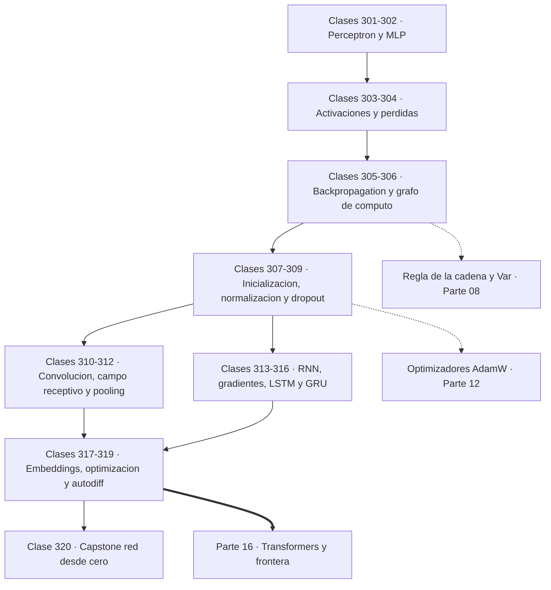

# 🧠 Parte 15 — Matemática de Deep Learning

> [⬅️ Parte 14 — Matemática de Machine Learning](../part-14-matematica-de-machine-learning/README.md) · [🏠 Programa](../../README.md) · [📇 Catálogo](../README.md) · [Parte 16 — Matemática de Transformers, modelos generativos, grafos y RL ➡️](../part-16-matematica-de-transformers-modelos-generativos-grafos-y-rl/README.md)

**Nivel:** `deep-learning` · **Clases:** 20 · **Horas estimadas:** 80 · **Motor:** [`part15.py`](../../src/computational_math/engines/part15.py)

---

## 🎯 De qué trata esta parte

Perceptrón, MLP, activaciones, pérdidas, backpropagation paso a paso, grafos de cómputo, inicialización, normalización, convolución, recurrencia y embeddings.

Una red neuronal es una función compuesta con muchos parámetros, entrenada minimizando una
pérdida con descenso de gradiente. Esa frase contiene todo, y esta parte la desarrolla pieza
por pieza usando exactamente lo construido antes: la regla de la cadena de la parte 07, el
gradiente y la autodiferenciación de la parte 08, los optimizadores de la parte 12 y las
pérdidas de la parte 13.

Las clases 301 y 302 marcan la frontera histórica. El **perceptrón** converge si y solo si
los datos son linealmente separables, y su incapacidad para resolver XOR —señalada por Minsky
y Papert en 1969— congeló el campo durante una década. La solución es apilar capas **con no
linealidad entre ellas**: sin ella, componer transformaciones lineales da otra transformación
lineal y la profundidad no aporta nada. La capa oculta no clasifica: construye una
representación en la que el problema sí es separable, y ese es el mecanismo esencial del
aprendizaje profundo.

Las clases 303 a 306 son el motor. Cada **activación** tiene su zona de saturación, y la
sigmoide, con derivada máxima de 0,25, garantiza que el gradiente se atenúe al menos cuatro
veces por capa: por eso ReLU la desplazó. **Backpropagation** se desarrolla aquí paso a paso,
con números, y se ve que no es un algoritmo nuevo sino la regla de la cadena aplicada en
orden topológico inverso sobre el grafo de cómputo. El detalle que más se olvida al
implementarlo a mano es que un nodo reutilizado **acumula** gradientes de todos sus consumos.

Las clases 307 a 309 tratan lo que hace entrenable una red profunda. La **inicialización** no
es un detalle: con escala 0,01 las activaciones colapsan a cero en ocho capas y con escala 1,0
se saturan, mientras que Xavier y He mantienen la varianza estable en ambos sentidos. La
**normalización** estabiliza la escala interna, y batch norm y layer norm se distinguen
simplemente por el eje sobre el que promedian —una razón concreta por la que los Transformers
usan layer norm—. El **dropout** introduce ruido en entrenamiento y conserva la esperanza en
inferencia mediante escalado.

Las clases 310 a 312 desarrollan la convolución como capa: la fórmula del tamaño de salida
con padding y stride, el **campo receptivo** que crece al apilar capas, y el hecho de que dos
convoluciones de 3×3 cubren lo mismo que una de 5×5 con menos parámetros y más no linealidad
—la observación que define VGG—.

Las clases 313 a 316 tratan las secuencias. Una RNN comparte pesos en el tiempo y acumula
historia en su estado, pero el gradiente a través de 50 pasos es un **producto de 50
factores**: si cada uno es menor que 1 el producto se desvanece exponencialmente, y si es
mayor explota. La **LSTM** resuelve el desvanecimiento con un camino aditivo para el estado de
celda, y la GRU lo consigue con dos puertas en vez de tres y un 25 % menos de parámetros.

El cierre conecta con la práctica: embeddings como geometría del significado, las técnicas
reales de entrenamiento —warmup, clipping, planificadores—, y la comparación entre el motor
`Var` de la parte 08 y PyTorch o JAX, que hacen lo mismo con otra escala de ingeniería. El
capstone entrena una red completa en Python puro sobre dos espirales entrelazadas, y comprueba
que el gradiente derivado a mano coincide con el automático.

## 🗺️ Mapa conceptual



## 🧠 Ideas centrales

- Backpropagation es la regla de la cadena aplicada en orden topológico inverso.
- Sin no linealidad, apilar capas sigue siendo una única transformación lineal.
- La inicialización controla la varianza de las activaciones y de los gradientes.
- Normalizar estabiliza la escala interna y permite tasas de aprendizaje mayores.
- El gradiente que se desvanece es un producto de derivadas menores que uno.

## 🤖 Por qué importa en IA

> [!IMPORTANT]
> Toda arquitectura moderna, incluido el Transformer, se construye sobre estos bloques y sobre este mismo mecanismo de derivación.

## ⚠️ Errores frecuentes de esta parte

- Inicializar todos los pesos iguales y romper la simetría nunca.
- Aplicar softmax sin restar el máximo y provocar overflow.
- Mezclar estadísticas de batch normalization entre entrenamiento e inferencia.

## 🧭 Secuencia de la parte


## 📚 Las clases

| # | Clase | Demostración | Idea central |
|---|---|---|---|
| `301` | [Perceptrón y separabilidad](301-perceptron-y-separabilidad/README.md) | `perceptron` | El perceptrón converge siempre en datos separables y nunca en XOR. |
| `302` | [MLP como composición de funciones](302-mlp-como-composicion-de-funciones/README.md) | `mlp` | Sin no linealidad entre capas, cien capas siguen siendo una sola transformación lineal. |
| `303` | [Funciones de activación](303-funciones-de-activacion/README.md) | `activations` | La derivada máxima de la sigmoide es 0,25: cada capa divide el gradiente por cuatro como mínimo. |
| `304` | [Funciones de pérdida](304-funciones-de-perdida/README.md) | `loss_functions` | Un solo valor atípico multiplica el MSE por cien mil; Huber lo absorbe. |
| `305` | [Backpropagation paso a paso](305-backpropagation-paso-a-paso/README.md) | `backpropagation` | Backpropagation es la regla de la cadena recorrida hacia atrás, y se puede seguir con números. |
| `306` | [Computational graphs](306-computational-graphs/README.md) | `computational_graphs` | Un nodo usado dos veces recibe la suma de los dos gradientes, no uno de ellos. |
| `307` | [Inicialización de pesos](307-inicializacion-de-pesos/README.md) | `weight_initialization` | Con escala 0,01 las activaciones mueren en ocho capas; con escala 1,0 se saturan. |
| `308` | [Batch normalization y layer normalization](308-batch-normalization-y-layer-normalization/README.md) | `normalization` | Batch norm promedia por columna y layer norm por fila: ese eje es toda la diferencia. |
| `309` | [Regularización y dropout](309-regularizacion-y-dropout/README.md) | `dropout_regularization` | Dropout apaga neuronas al azar y escala en entrenamiento para que la inferencia no cambie. |
| `310` | [Convolución discreta](310-convolucion-discreta/README.md) | `discrete_convolution` | El tamaño de salida sale de una fórmula, y equivocarla es el error más común al montar una CNN. |
| `311` | [CNN y receptive fields](311-cnn-y-receptive-fields/README.md) | `cnn_receptive_fields` | Dos convoluciones de 3×3 ven lo mismo que una de 5×5 con menos parámetros y más no linealidad. |
| `312` | [Pooling y downsampling](312-pooling-y-downsampling/README.md) | `pooling` | Pooling reduce sin parámetros: max conserva la intensidad, average conserva el contexto. |
| `313` | [RNN y recurrencia](313-rnn-y-recurrencia/README.md) | `rnn` | Una RNN procesa secuencias de cualquier longitud con un número fijo de parámetros. |
| `314` | [Vanishing y exploding gradients](314-vanishing-y-exploding-gradients/README.md) | `vanishing_exploding` | El gradiente a 50 pasos es un producto de 50 factores: o se anula o explota. |
| `315` | [LSTM y compuertas](315-lstm-y-compuertas/README.md) | `lstm` | La celda LSTM suma en vez de multiplicar, y por eso el gradiente sobrevive. |
| `316` | [GRU](316-gru/README.md) | `gru` | GRU consigue casi lo mismo que LSTM con dos puertas y un 25 % menos de parámetros. |
| `317` | [Embeddings como espacios vectoriales](317-embeddings-como-espacios-vectoriales/README.md) | `embeddings` | En un espacio de embeddings, la dirección entre dos palabras codifica su relación. |
| `318` | [Optimización de redes profundas](318-optimizacion-de-redes-profundas/README.md) | `deep_optimization` | Warmup evita divergir al arrancar y clipping evita que un gradiente anómalo destruya el modelo. |
| `319` | [Autodiff con PyTorch/JAX](319-autodiff-con-pytorch-jax/README.md) | `autodiff_frameworks` | PyTorch y JAX hacen lo mismo que el Var de la parte 08, con ingeniería de por medio. |
| `320` | [Capstone: red neuronal desde cero en Python puro](320-capstone-red-neuronal-desde-cero-en-python-puro/README.md) | `capstone_neural_network` | Una red de 337 parámetros en Python puro separa dos espirales entrelazadas. |

## 📖 Glosario de la parte (36 términos)

Definiciones precisas en [`GLOSARIO.md`](GLOSARIO.md).

## 🧰 Stack de referencia

`math`, `random`, `numpy (opcional)`, `torch/jax (opcional)`

Los laboratorios se ejecutan con biblioteca estándar; estas herramientas aparecen
como contraste profesional, no como requisito.

## 🧪 Ejecutar toda la parte

```bash
compmath run --part 15
compmath catalog --part 15
```

## 📊 Evaluación de la parte

| Componente | Peso |
|---|---:|
| Clases y ejercicios | 40 % |
| Laboratorios y notebooks | 25 % |
| Explicación oral o escrita | 15 % |
| Capstone ([320](320-capstone-red-neuronal-desde-cero-en-python-puro/README.md)) | 20 % |

## 📖 Bibliografía

- Goodfellow, I.; Bengio, Y.; Courville, A. *Deep Learning*. MIT Press, 2016.
- Glorot, X.; Bengio, Y. *Understanding the difficulty of training deep feedforward neural networks*. AISTATS, 2010.
- He, K. et al. *Delving Deep into Rectifiers*. ICCV, 2015.

---

> [⬅️ Parte 14 — Matemática de Machine Learning](../part-14-matematica-de-machine-learning/README.md) · [🏠 Programa](../../README.md) · [📇 Catálogo](../README.md) · [Parte 16 — Matemática de Transformers, modelos generativos, grafos y RL ➡️](../part-16-matematica-de-transformers-modelos-generativos-grafos-y-rl/README.md)
