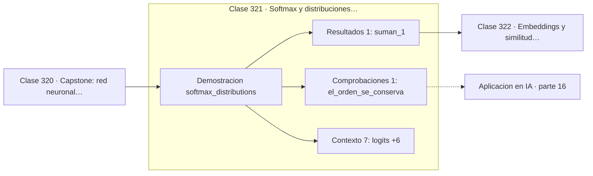

# 321 — Softmax y distribuciones categóricas

> [⬅️ 320 Capstone: red neuronal desde cero en Python puro](../../part-15-matematica-de-deep-learning/320-capstone-red-neuronal-desde-cero-en-python-puro/README.md) · [📚 Parte 16](../README.md) · [🏠 Programa](../../../README.md) · [322 Embeddings y similitud coseno ➡️](../322-embeddings-y-similitud-coseno/README.md)

**Parte:** 16 — Matemática de Transformers, modelos generativos, grafos y RL · **Nivel:** `experto` · **Horas estimadas:** 4
**Motor:** `engines.part16` · **Demostración:** `softmax_distributions` · **Clase 1 de 20** de la parte

---

## 🎯 Propósito

**Restar el máximo antes de exponenciar no cambia el resultado y evita el desbordamiento.**

Softmax, embeddings, positional encoding, atención escalada, multi-head, Transformer completo, muestreo, VAE, GAN, difusión, GNN y ecuaciones de Bellman.

## ✅ Resultados de aprendizaje

Al terminar podrás:

1. Explicar **Softmax y distribuciones categóricas** con lenguaje cotidiano y con notación matemática.
2. Resolver un caso pequeño a mano y anticipar el orden de magnitud del resultado.
3. Ejecutar y modificar `lab.py`, que corre la demostración `softmax_distributions`.
4. Interpretar las 9 salidas del laboratorio y decir qué comprueba cada una.
5. Detectar el error típico de esta parte: olvidar la máscara causal en el modelado autoregresivo.

## 🧩 Fórmulas de la clase

```text
softmax(z)ᵢ = e^{zᵢ} / Σⱼ e^{zⱼ}
softmax(z + c) = softmax(z)  para todo c
implementación: restar max(z) antes de exponenciar
```

## 🗺️ Ubicación en el programa



## 📖 Fundamentos

Softmax convierte un vector de números reales cualesquiera en una distribución de
probabilidad: todos positivos y sumando 1. Es la capa de salida de todo clasificador y la
pieza que normaliza los pesos de atención, así que aparece dos veces en cada bloque
Transformer.

Su propiedad estructural es la **invariancia frente a desplazamientos**: sumar la misma
constante a todos los logits no cambia la salida, porque el factor común se cancela entre
numerador y denominador. Solo importan las **diferencias** entre logits, no sus valores
absolutos.

Esa invariancia tiene una consecuencia práctica que no es opcional. Si un logit vale 1000,
`exp(1000)` desborda a infinito y el resultado es NaN. Como restar el máximo no altera la
salida, toda implementación seria lo hace: los exponentes quedan entre `exp(−algo)` y
`exp(0) = 1`, siempre representables. Es el truco de estabilidad numérica más rentable de
todo el aprendizaje profundo, y viene directamente de la parte 01.

Conviene además recordar su origen: softmax es la distribución de **máxima entropía**
compatible con los logits, como se vio en la clase 267. No es una normalización elegida por
comodidad sino la solución de un problema de optimización con restricciones, y esa es la
razón de su forma exponencial.

## 🧮 Ejemplo trabajado

Invariancia y estabilidad numérica.

```text
logits: [2,0 ; 1,0 ; 0,1 ; −1,0]

probabilidades: [0,638066 ; 0,234731 ; 0,095435 ; 0,031767]
suman 1,0                                            ✓

Sumando 1000 a todos los logits:
  [0,638066 ; 0,234731 ; 0,095435 ; 0,031767]
  idéntico resultado                                 ✓

Sin restar el máximo:
  exp(1002) = inf  →  inf/inf = NaN                  ✗

Restando el máximo (2,0 o 1002,0, da igual):
  exponentes en [exp(−3), exp(0)]                    ✓

Solo importan las diferencias entre logits.
```

## 🔬 Qué ejecuta el laboratorio

`softmax_distributions` — Softmax: de logits arbitrarios a una distribución categórica.

| Grupo | Salidas |
|---|---|
| 🔢 Resultados numéricos (1) | `suman_1` |
| ✅ Comprobaciones de invariante (1) | `el_orden_se_conserva` |

Las claves booleanas no son adorno: si alguna fuera `False`, el resultado numérico
no sería fiable aunque el programa terminase sin error.

```bash
python classes/part-16-matematica-de-transformers-modelos-generativos-grafos-y-rl/321-softmax-y-distribuciones-categoricas/lab.py
compmath run 321
```

> [!TIP]
> Antes de ejecutar, **escribe tu predicción**. Un laboratorio que confirma lo que
> esperabas enseña tanto como uno que te contradice, pero solo si la predicción
> existía antes del resultado.

## ⚠️ Errores conceptuales frecuentes

1. Aplicar softmax sin restar el máximo.
2. Aplicar softmax dos veces cuando la pérdida ya lo incluye.
3. Interpretar los valores absolutos de los logits en vez de sus diferencias.

## 🚀 Dónde se usa de verdad

Capa de salida de clasificadores, normalización de pesos de atención, muestreo de tokens y
políticas estocásticas en aprendizaje por refuerzo.

## 🤖 Conexión con IA

Esta parte es la traducción matemática directa de los papers que definen el estado del arte actual.

## 📓 Notebooks

| Archivo | Para qué |
|---|---|
| [`notebook.ipynb`](notebook.ipynb) | recorrido guiado con la demostración ejecutada |
| [`notebook_student.ipynb`](notebook_student.ipynb) | versión con `TODO` para resolver |
| [`notebook_solution.ipynb`](notebook_solution.ipynb) | solución de referencia verificada |

## 📝 Evaluación

| Criterio | Peso |
|---|---:|
| Comprensión conceptual | 25 % |
| Resolución manual | 25 % |
| Implementación y verificación | 25 % |
| Interpretación y comunicación | 15 % |
| Conexión con aplicación real | 10 % |

Detalle y criterios de error crítico en [`assessment.md`](assessment.md).

## ❓ Preguntas de comprobación

1. ¿Cuál es la entrada, cuál la salida y qué unidades tienen?
2. ¿Qué operación domina el comportamiento del resultado?
3. ¿Qué caso extremo revelaría un error conceptual?
4. ¿Cómo verificarías el resultado por un método independiente?
5. ¿Dónde aparece esto en LLM?

Si necesitas releer el código para responderlas, la clase todavía no está superada.

## 📥 Entregable

`notebook_student.ipynb` resuelto más un párrafo que explique el resultado **sin citar
código**: qué entra, qué sale, qué invariante se comprueba y qué pasaría en un caso límite.

## 🔗 Referencias

- [Goodfellow, I.; Bengio, Y.; Courville, A. *Deep Learning*, MIT Press, 2016, cap. 6](https://www.deeplearningbook.org/) — *uso:* obra de referencia consultada en «Softmax y distribuciones categóricas».
- [Bridle, J. *Probabilistic interpretation of feedforward classification network outputs*, 1990](https://doi.org/10.1007/978-3-642-76153-9_28) — *uso:* desarrollo formal del tema en «Softmax y distribuciones categóricas».

Bibliografía completa de la parte en [`../../../docs/BIBLIOGRAPHY.md`](../../../docs/BIBLIOGRAPHY.md) · localizador verificable de cada obra en [`sources/bibliography.json`](../../../sources/bibliography.json).

## 📂 Material de la clase

[`intuition.md`](intuition.md) · [`theory.md`](theory.md) · [`derivation.md`](derivation.md) · [`exercises.md`](exercises.md) · [`assessment.md`](assessment.md) · [`where-is-this-used.md`](where-is-this-used.md) · [`lesson.yaml`](lesson.yaml)

---

> [⬅️ 320 Capstone: red neuronal desde cero en Python puro](../../part-15-matematica-de-deep-learning/320-capstone-red-neuronal-desde-cero-en-python-puro/README.md) · [📚 Parte 16](../README.md) · [🏠 Programa](../../../README.md) · [322 Embeddings y similitud coseno ➡️](../322-embeddings-y-similitud-coseno/README.md)
