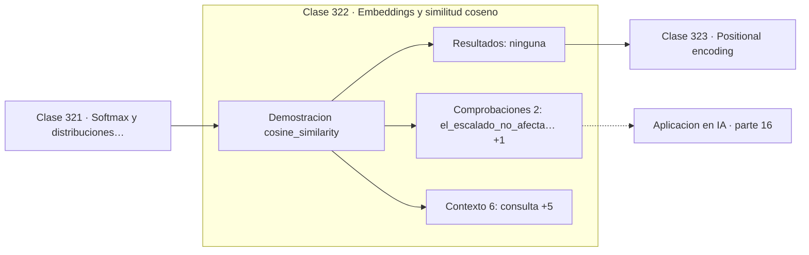

# 322 — Embeddings y similitud coseno

> [⬅️ 321 Softmax y distribuciones categóricas](../321-softmax-y-distribuciones-categoricas/README.md) · [📚 Parte 16](../README.md) · [🏠 Programa](../../../README.md) · [323 Positional encoding ➡️](../323-positional-encoding/README.md)

**Parte:** 16 — Matemática de Transformers, modelos generativos, grafos y RL · **Nivel:** `experto` · **Horas estimadas:** 4
**Motor:** `engines.part16` · **Demostración:** `cosine_similarity` · **Clase 2 de 20** de la parte

---

## 🎯 Propósito

Softmax, embeddings, positional encoding, atención escalada, multi-head, Transformer completo, muestreo, VAE, GAN, difusión, GNN y ecuaciones de Bellman.

Esta clase concreta ese objetivo sobre **Embeddings y similitud coseno**: qué es, cómo se
calcula a mano, cómo se implementa sin ocultar el procedimiento y cómo se verifica
que el resultado es correcto y no solo plausible.

## ✅ Resultados de aprendizaje

Al terminar podrás:

1. Explicar **Embeddings y similitud coseno** con lenguaje cotidiano y con notación matemática.
2. Resolver un caso pequeño a mano y anticipar el orden de magnitud del resultado.
3. Ejecutar y modificar `lab.py`, que corre la demostración `cosine_similarity`.
4. Interpretar las 8 salidas del laboratorio y decir qué comprueba cada una.
5. Detectar el error típico de esta parte: confundir temperatura alta con mayor calidad en lugar de mayor entropía.

## 🗺️ Ubicación en el programa



## 🧠 Idea rectora de la parte 16

> La escala 1/√d evita que el producto punto sature la softmax en alta dimensión.

## 🔬 Qué ejecuta el laboratorio

`cosine_similarity` — Similitud coseno: la métrica estándar entre embeddings.

| Grupo | Salidas |
|---|---|
| 🔢 Resultados numéricos (0) | — |
| ✅ Comprobaciones de invariante (2) | `el_escalado_no_afecta_al_coseno`, `el_escalado_si_afecta_a_la_distancia` |

Las claves booleanas no son adorno: si alguna fuera `False`, el resultado numérico
no sería fiable aunque el programa terminase sin error.

```bash
python classes/part-16-matematica-de-transformers-modelos-generativos-grafos-y-rl/322-embeddings-y-similitud-coseno/lab.py
compmath run 322
```

> [!TIP]
> Antes de ejecutar, **escribe tu predicción**. Un laboratorio que confirma lo que
> esperabas enseña tanto como uno que te contradice, pero solo si la predicción
> existía antes del resultado.

## ⚠️ Errores frecuentes en esta parte

- Olvidar la máscara causal en el modelado autoregresivo.
- Confundir temperatura alta con mayor calidad en lugar de mayor entropía.
- Normalizar el Laplaciano de un grafo con nodos aislados sin tratar la división por cero.

## 🤖 Conexión con IA

Esta parte es la traducción matemática directa de los papers que definen el estado del arte actual.

## 📓 Notebooks

| Archivo | Para qué |
|---|---|
| [`notebook.ipynb`](notebook.ipynb) | recorrido guiado con la demostración ejecutada |
| [`notebook_student.ipynb`](notebook_student.ipynb) | versión con `TODO` para resolver |
| [`notebook_solution.ipynb`](notebook_solution.ipynb) | solución de referencia verificada |

## 📝 Evaluación

| Criterio | Peso |
|---|---:|
| Comprensión conceptual | 25 % |
| Resolución manual | 25 % |
| Implementación y verificación | 25 % |
| Interpretación y comunicación | 15 % |
| Conexión con aplicación real | 10 % |

Detalle y criterios de error crítico en [`assessment.md`](assessment.md).

## ❓ Preguntas de comprobación

1. ¿Cuál es la entrada, cuál la salida y qué unidades tienen?
2. ¿Qué operación domina el comportamiento del resultado?
3. ¿Qué caso extremo revelaría un error conceptual?
4. ¿Cómo verificarías el resultado por un método independiente?
5. ¿Dónde aparece esto en LLM?

Si necesitas releer el código para responderlas, la clase todavía no está superada.

## 📥 Entregable

`notebook_student.ipynb` resuelto más un párrafo que explique el resultado **sin citar
código**: qué entra, qué sale, qué invariante se comprueba y qué pasaría en un caso límite.

## 🔗 Referencias

- Vaswani, A. et al. *Attention Is All You Need*. NeurIPS, 2017.
- Kingma, D.; Welling, M. *Auto-Encoding Variational Bayes*. ICLR, 2014.
- Ho, J.; Jain, A.; Abbeel, P. *Denoising Diffusion Probabilistic Models*. NeurIPS, 2020.
- Sutton, R.; Barto, A. *Reinforcement Learning: An Introduction*. 2ª ed., MIT Press, 2018.

## 📂 Material de la clase

[`intuition.md`](intuition.md) · [`theory.md`](theory.md) · [`derivation.md`](derivation.md) · [`exercises.md`](exercises.md) · [`assessment.md`](assessment.md) · [`where-is-this-used.md`](where-is-this-used.md) · [`lesson.yaml`](lesson.yaml)

---

> [⬅️ 321 Softmax y distribuciones categóricas](../321-softmax-y-distribuciones-categoricas/README.md) · [📚 Parte 16](../README.md) · [🏠 Programa](../../../README.md) · [323 Positional encoding ➡️](../323-positional-encoding/README.md)
