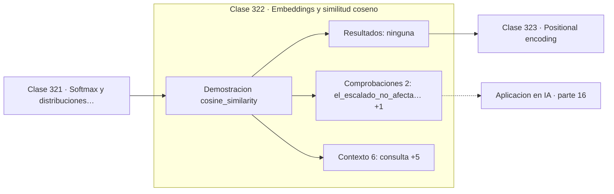

# 322 — Embeddings y similitud coseno

> [⬅️ 321 Softmax y distribuciones categóricas](../321-softmax-y-distribuciones-categoricas/README.md) · [📚 Parte 16](../README.md) · [🏠 Programa](../../../README.md) · [323 Positional encoding ➡️](../323-positional-encoding/README.md)

**Parte:** 16 — Matemática de Transformers, modelos generativos, grafos y RL · **Nivel:** `experto` · **Horas estimadas:** 4
**Motor:** `engines.part16` · **Demostración:** `cosine_similarity` · **Clase 2 de 20** de la parte

---

## 🎯 Propósito

**El coseno ignora la magnitud, y en embeddings la magnitud suele ser frecuencia, no significado.**

Softmax, embeddings, positional encoding, atención escalada, multi-head, Transformer completo, muestreo, VAE, GAN, difusión, GNN y ecuaciones de Bellman.

## ✅ Resultados de aprendizaje

Al terminar podrás:

1. Explicar **Embeddings y similitud coseno** con lenguaje cotidiano y con notación matemática.
2. Resolver un caso pequeño a mano y anticipar el orden de magnitud del resultado.
3. Ejecutar y modificar `lab.py`, que corre la demostración `cosine_similarity`.
4. Interpretar las 8 salidas del laboratorio y decir qué comprueba cada una.
5. Detectar el error típico de esta parte: confundir temperatura alta con mayor calidad en lugar de mayor entropía.

## 🧩 Fórmulas de la clase

```text
cos(a,b) = (a·b) / (‖a‖·‖b‖)
rango [−1, 1]
invariante al escalado de cualquiera de los dos vectores
```

## 🗺️ Ubicación en el programa



## 📖 Fundamentos

La similitud coseno mide el ángulo entre dos vectores, descartando sus longitudes. En
espacios de embeddings es la medida estándar, y la razón es concreta: la norma de un
embedding tiende a correlacionar con la frecuencia del término en el corpus, que no es
información semántica.

La diferencia con la distancia euclídea se ve mejor con un caso extremo. Un vector y su
doble apuntan exactamente en la misma dirección, así que su coseno es 1 —máxima
similitud—, mientras que su distancia euclídea puede ser enorme. Para «¿hablan de lo
mismo?» el coseno acierta y la distancia no.

El **producto escalar sin normalizar** es lo que usa la atención, y ahí la magnitud sí
influye deliberadamente: un token puede aprender a tener clave de norma grande para
atraer más atención. Es una decisión de diseño distinta, no un descuido, y por eso la
atención necesita el factor `1/√d` mientras que la búsqueda por similitud usa coseno.

La consecuencia de ingeniería es que si los vectores se **normalizan previamente**, el
producto escalar **es** el coseno. Las bases de datos vectoriales explotan esto: normalizan
al indexar y luego usan producto escalar, que es más rápido y está mejor optimizado que
calcular normas en cada consulta.

## 🧮 Ejemplo trabajado

Coseno frente a distancia euclídea sobre la misma consulta.

```text
consulta: (0,8 ; 0,5 ; 0,2 ; 0,1)

candidato          coseno     distancia euclídea
muy relacionado   0,994667        0,100000
relacionado       0,787527        0,608276
ortogonal         0,0xxxxx        1,352770

Efecto del escalado:
  multiplicar un candidato por 10
    coseno:    no cambia                            ✓
    distancia: se multiplica por ~10                ✗

En embeddings la norma suele reflejar frecuencia,
no significado: por eso se usa coseno.
```

## 🔬 Qué ejecuta el laboratorio

`cosine_similarity` — Similitud coseno: la métrica estándar entre embeddings.

| Grupo | Salidas |
|---|---|
| 🔢 Resultados numéricos (0) | — |
| ✅ Comprobaciones de invariante (2) | `el_escalado_no_afecta_al_coseno`, `el_escalado_si_afecta_a_la_distancia` |

Las claves booleanas no son adorno: si alguna fuera `False`, el resultado numérico
no sería fiable aunque el programa terminase sin error.

```bash
python classes/part-16-matematica-de-transformers-modelos-generativos-grafos-y-rl/322-embeddings-y-similitud-coseno/lab.py
compmath run 322
```

> [!TIP]
> Antes de ejecutar, **escribe tu predicción**. Un laboratorio que confirma lo que
> esperabas enseña tanto como uno que te contradice, pero solo si la predicción
> existía antes del resultado.

## ⚠️ Errores conceptuales frecuentes

1. Usar distancia euclídea sin normalizar sobre embeddings.
2. Normalizar los vectores de atención y perder la información de magnitud.
3. Comparar cosenos entre espacios de embeddings distintos.

## 🚀 Dónde se usa de verdad

Búsqueda semántica, bases de datos vectoriales, RAG, sistemas de recomendación y
deduplicación de documentos.

## 🤖 Conexión con IA

Esta parte es la traducción matemática directa de los papers que definen el estado del arte actual.

## 📓 Notebooks

| Archivo | Para qué |
|---|---|
| [`notebook.ipynb`](notebook.ipynb) | recorrido guiado con la demostración ejecutada |
| [`notebook_student.ipynb`](notebook_student.ipynb) | versión con `TODO` para resolver |
| [`notebook_solution.ipynb`](notebook_solution.ipynb) | solución de referencia verificada |

## 📝 Evaluación

| Criterio | Peso |
|---|---:|
| Comprensión conceptual | 25 % |
| Resolución manual | 25 % |
| Implementación y verificación | 25 % |
| Interpretación y comunicación | 15 % |
| Conexión con aplicación real | 10 % |

Detalle y criterios de error crítico en [`assessment.md`](assessment.md).

## ❓ Preguntas de comprobación

1. ¿Cuál es la entrada, cuál la salida y qué unidades tienen?
2. ¿Qué operación domina el comportamiento del resultado?
3. ¿Qué caso extremo revelaría un error conceptual?
4. ¿Cómo verificarías el resultado por un método independiente?
5. ¿Dónde aparece esto en LLM?

Si necesitas releer el código para responderlas, la clase todavía no está superada.

## 📥 Entregable

`notebook_student.ipynb` resuelto más un párrafo que explique el resultado **sin citar
código**: qué entra, qué sale, qué invariante se comprueba y qué pasaría en un caso límite.

## 🔗 Referencias

- [Mikolov, T. et al. *Distributed representations of words and phrases*, NeurIPS, 2013](https://arxiv.org/abs/1310.4546) — *uso:* artículo de origen consultado en «Embeddings y similitud coseno».
- [Reimers, N.; Gurevych, I. *Sentence-BERT*, EMNLP, 2019](https://arxiv.org/abs/1908.10084) — *uso:* artículo de origen consultado en «Embeddings y similitud coseno».

Bibliografía completa de la parte en [`../../../docs/BIBLIOGRAPHY.md`](../../../docs/BIBLIOGRAPHY.md) · localizador verificable de cada obra en [`sources/bibliography.json`](../../../sources/bibliography.json).

## 📂 Material de la clase

[`intuition.md`](intuition.md) · [`theory.md`](theory.md) · [`derivation.md`](derivation.md) · [`exercises.md`](exercises.md) · [`assessment.md`](assessment.md) · [`where-is-this-used.md`](where-is-this-used.md) · [`lesson.yaml`](lesson.yaml)

---

> [⬅️ 321 Softmax y distribuciones categóricas](../321-softmax-y-distribuciones-categoricas/README.md) · [📚 Parte 16](../README.md) · [🏠 Programa](../../../README.md) · [323 Positional encoding ➡️](../323-positional-encoding/README.md)
