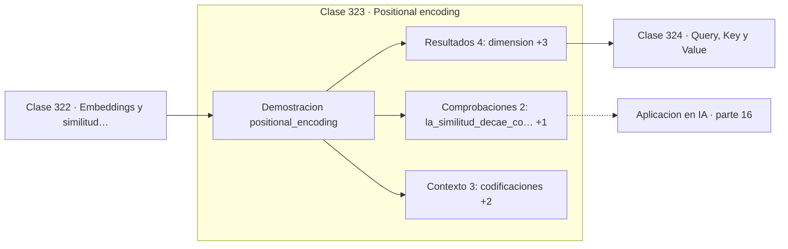

# 323 — Positional encoding

> [⬅️ 322 Embeddings y similitud coseno](../322-embeddings-y-similitud-coseno/README.md) · [📚 Parte 16](../README.md) · [🏠 Programa](../../../README.md) · [324 Query, Key y Value ➡️](../324-query-key-y-value/README.md)

**Parte:** 16 — Matemática de Transformers, modelos generativos, grafos y RL · **Nivel:** `experto` · **Horas estimadas:** 4
**Motor:** `engines.part16` · **Demostración:** `positional_encoding` · **Clase 3 de 20** de la parte

---

## 🎯 Propósito

**La atención no tiene noción de orden, así que la posición hay que inyectarla.**

Softmax, embeddings, positional encoding, atención escalada, multi-head, Transformer completo, muestreo, VAE, GAN, difusión, GNN y ecuaciones de Bellman.

## ✅ Resultados de aprendizaje

Al terminar podrás:

1. Explicar **Positional encoding** con lenguaje cotidiano y con notación matemática.
2. Resolver un caso pequeño a mano y anticipar el orden de magnitud del resultado.
3. Ejecutar y modificar `lab.py`, que corre la demostración `positional_encoding`.
4. Interpretar las 9 salidas del laboratorio y decir qué comprueba cada una.
5. Detectar el error típico de esta parte: normalizar el laplaciano de un grafo con nodos aislados sin tratar la división por cero.

## 🧩 Fórmulas de la clase

```text
PE(pos, 2i)   = sin(pos / 10000^{2i/d})
PE(pos, 2i+1) = cos(pos / 10000^{2i/d})
sin parámetros aprendidos
```

## 🗺️ Ubicación en el programa



## 📖 Fundamentos

El mecanismo de atención es **invariante a permutaciones**: si se barajan los tokens de
entrada, las salidas se barajan igual pero nada más cambia. Para el modelo, «el gato come
pescado» y «pescado come gato el» serían indistinguibles. Hay que añadir la posición
explícitamente.

La codificación sinusoidal del artículo original usa senos y cosenos de frecuencias que
decrecen geométricamente a lo largo de las dimensiones. Las primeras dimensiones varían
rápido y distinguen posiciones cercanas; las últimas varían lento y codifican posición
global. Es exactamente una descomposición en frecuencias, la parte 13 aplicada al índice de
posición.

Tiene dos propiedades atractivas. **No tiene parámetros**, así que funciona con longitudes
de secuencia nunca vistas en entrenamiento, al menos en principio. Y la similitud entre
codificaciones **decae con la distancia**, lo que da al modelo una noción utilizable de
proximidad. Además, `PE(pos+k)` es una transformación lineal de `PE(pos)`, lo que facilita
aprender desplazamientos relativos.

La práctica ha evolucionado. Las posiciones **aprendidas** funcionaron igual de bien y
dominaron durante años; hoy lo estándar es **RoPE**, que codifica posición rotando los
vectores de consulta y clave, lo que hace que el producto escalar dependa naturalmente de
la posición **relativa**. Es la solución que mejor extrapola a contextos largos.

## 🧮 Ejemplo trabajado

Codificación sinusoidal en dimensión 8.

```text
dimensión: 8

pos 0: [0,000000 ; 1,0 ; 0,000000 ; 1,0 ; 0,0 ; 1,0 ; 0,0 ; 1,0]
pos 1: [0,841471 ; 0,5xxx ; ...]
pos 2: [0,909297 ; ...]

normas: todas valen 2,0                             ✓
(la norma es constante por construcción)

producto escalar con pos 0:
  pos 1  →  3,535256
  pos 5  →  3,159983

La similitud decae con la distancia                  ✓

Sin esta codificación, la atención vería la secuencia
como un conjunto sin orden.
```

## 🔬 Qué ejecuta el laboratorio

`positional_encoding` — Positional encoding sinusoidal: posición sin parámetros aprendidos.

| Grupo | Salidas |
|---|---|
| 🔢 Resultados numéricos (4) | `dimension`, `producto_pos0_pos1`, `producto_pos0_pos5`, `parametros_aprendidos` |
| ✅ Comprobaciones de invariante (2) | `la_similitud_decae_con_la_distancia`, `extrapola_a_secuencias_mas_largas` |

Las claves booleanas no son adorno: si alguna fuera `False`, el resultado numérico
no sería fiable aunque el programa terminase sin error.

```bash
python classes/part-16-matematica-de-transformers-modelos-generativos-grafos-y-rl/323-positional-encoding/lab.py
compmath run 323
```

> [!TIP]
> Antes de ejecutar, **escribe tu predicción**. Un laboratorio que confirma lo que
> esperabas enseña tanto como uno que te contradice, pero solo si la predicción
> existía antes del resultado.

## ⚠️ Errores conceptuales frecuentes

1. Omitir la codificación posicional y entrenar un modelo ciego al orden.
2. Suponer que la codificación sinusoidal extrapola bien a contextos mucho más largos.
3. Sumar la codificación después de la primera capa en vez de al embedding.

## 🚀 Dónde se usa de verdad

Todos los Transformers, modelos de visión con parches, modelos de audio y cualquier
arquitectura con atención sobre secuencias.

## 🤖 Conexión con IA

Esta parte es la traducción matemática directa de los papers que definen el estado del arte actual.

## 📓 Notebooks

| Archivo | Para qué |
|---|---|
| [`notebook.ipynb`](notebook.ipynb) | recorrido guiado con la demostración ejecutada |
| [`notebook_student.ipynb`](notebook_student.ipynb) | versión con `TODO` para resolver |
| [`notebook_solution.ipynb`](notebook_solution.ipynb) | solución de referencia verificada |

## 📝 Evaluación

| Criterio | Peso |
|---|---:|
| Comprensión conceptual | 25 % |
| Resolución manual | 25 % |
| Implementación y verificación | 25 % |
| Interpretación y comunicación | 15 % |
| Conexión con aplicación real | 10 % |

Detalle y criterios de error crítico en [`assessment.md`](assessment.md).

## ❓ Preguntas de comprobación

1. ¿Cuál es la entrada, cuál la salida y qué unidades tienen?
2. ¿Qué operación domina el comportamiento del resultado?
3. ¿Qué caso extremo revelaría un error conceptual?
4. ¿Cómo verificarías el resultado por un método independiente?
5. ¿Dónde aparece esto en LLM?

Si necesitas releer el código para responderlas, la clase todavía no está superada.

## 📥 Entregable

`notebook_student.ipynb` resuelto más un párrafo que explique el resultado **sin citar
código**: qué entra, qué sale, qué invariante se comprueba y qué pasaría en un caso límite.

## 🔗 Referencias

- [Vaswani, A. et al. *Attention Is All You Need*, NeurIPS, 2017](https://arxiv.org/abs/1706.03762) — *uso:* artículo de origen consultado en «Positional encoding».
- [Su, J. et al. *RoFormer: Enhanced Transformer with Rotary Position Embedding*, 2021](https://arxiv.org/abs/2104.09864) — *uso:* artículo de origen consultado en «Positional encoding».

Bibliografía completa de la parte en [`../../../docs/BIBLIOGRAPHY.md`](../../../docs/BIBLIOGRAPHY.md) · localizador verificable de cada obra en [`sources/bibliography.json`](../../../sources/bibliography.json).

## 📂 Material de la clase

[`intuition.md`](intuition.md) · [`theory.md`](theory.md) · [`derivation.md`](derivation.md) · [`exercises.md`](exercises.md) · [`assessment.md`](assessment.md) · [`where-is-this-used.md`](where-is-this-used.md) · [`lesson.yaml`](lesson.yaml)

---

> [⬅️ 322 Embeddings y similitud coseno](../322-embeddings-y-similitud-coseno/README.md) · [📚 Parte 16](../README.md) · [🏠 Programa](../../../README.md) · [324 Query, Key y Value ➡️](../324-query-key-y-value/README.md)
