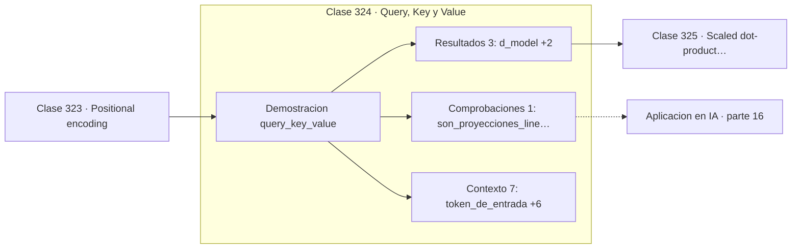

# 324 — Query, Key y Value

> [⬅️ 323 Positional encoding](../323-positional-encoding/README.md) · [📚 Parte 16](../README.md) · [🏠 Programa](../../../README.md) · [325 Scaled dot-product attention ➡️](../325-scaled-dot-product-attention/README.md)

**Parte:** 16 — Matemática de Transformers, modelos generativos, grafos y RL · **Nivel:** `experto` · **Horas estimadas:** 4
**Motor:** `engines.part16` · **Demostración:** `query_key_value` · **Clase 4 de 20** de la parte

---

## 🎯 Propósito

**Q, K y V son tres proyecciones del mismo token con tres papeles distintos.**

Softmax, embeddings, positional encoding, atención escalada, multi-head, Transformer completo, muestreo, VAE, GAN, difusión, GNN y ecuaciones de Bellman.

## ✅ Resultados de aprendizaje

Al terminar podrás:

1. Explicar **Query, Key y Value** con lenguaje cotidiano y con notación matemática.
2. Resolver un caso pequeño a mano y anticipar el orden de magnitud del resultado.
3. Ejecutar y modificar `lab.py`, que corre la demostración `query_key_value`.
4. Interpretar las 11 salidas del laboratorio y decir qué comprueba cada una.
5. Detectar el error típico de esta parte: olvidar la máscara causal en el modelado autoregresivo.

## 🧩 Fórmulas de la clase

```text
Q = W_Q·x   (qué busco)
K = W_K·x   (qué ofrezco)
V = W_V·x   (qué aporto)
```

## 🗺️ Ubicación en el programa



## 📖 Fundamentos

La atención se explica bien con la metáfora de una búsqueda. Cada token emite una
**consulta** que describe qué información necesita, expone una **clave** que describe qué
información contiene, y guarda un **valor** que es lo que efectivamente entregará si
alguien lo selecciona.

Que los tres vengan del mismo vector de entrada mediante tres matrices distintas es lo
esencial. Separar los papeles permite que un token busque una cosa y ofrezca otra: un
adjetivo puede buscar el sustantivo al que modifica mientras ofrece su propia información
semántica. Con una sola proyección esa asimetría sería imposible.

Las dimensiones no tienen por qué coincidir con la del modelo. Es habitual proyectar a una
dimensión menor `d_k`, lo que reduce el coste y, en multi-head, permite repartir la
capacidad entre varias cabezas sin multiplicar los parámetros.

La generalización que esta separación permite es la **atención cruzada**: si las consultas
vienen de una secuencia y las claves y valores de otra, un decodificador puede atender al
codificador. Ese es el mecanismo de la traducción automática, y el mismo que permite a un
modelo multimodal atender desde texto a una imagen.

## 🧮 Ejemplo trabajado

Las tres proyecciones de un mismo token.

```text
token de entrada: (1,0 ; 0,5 ; −0,3 ; 0,8)
d_model = 4      d_k = 3

query = (−0,011555 ; −0,203105 ;  1,236170)
key   = (−0,372490 ;  0,857526 ; −0,242572)
value = ( 1,518768 ; −0,211168 ; −0,655401)

Los tres vectores son muy distintos entre sí
aunque provienen del mismo token.

Parámetros: 3 matrices de 4×3 = 36 valores.

Atención cruzada: Q de una secuencia,
K y V de otra. Mismo mecanismo.
```

## 🔬 Qué ejecuta el laboratorio

`query_key_value` — Q, K, V: tres proyecciones distintas del mismo token.

| Grupo | Salidas |
|---|---|
| 🔢 Resultados numéricos (3) | `d_model`, `d_k`, `parametros_por_cabeza` |
| ✅ Comprobaciones de invariante (1) | `son_proyecciones_lineales` |

Las claves booleanas no son adorno: si alguna fuera `False`, el resultado numérico
no sería fiable aunque el programa terminase sin error.

```bash
python classes/part-16-matematica-de-transformers-modelos-generativos-grafos-y-rl/324-query-key-y-value/lab.py
compmath run 324
```

> [!TIP]
> Antes de ejecutar, **escribe tu predicción**. Un laboratorio que confirma lo que
> esperabas enseña tanto como uno que te contradice, pero solo si la predicción
> existía antes del resultado.

## ⚠️ Errores conceptuales frecuentes

1. Usar la misma proyección para consulta y clave.
2. Confundir qué secuencia aporta Q y cuál aporta K y V en atención cruzada.
3. Suponer que d_k debe coincidir con d_model.

## 🚀 Dónde se usa de verdad

Todos los Transformers, atención cruzada en traducción, modelos multimodales y mecanismos
de recuperación diferenciables.

## 🤖 Conexión con IA

Esta parte es la traducción matemática directa de los papers que definen el estado del arte actual.

## 📓 Notebooks

| Archivo | Para qué |
|---|---|
| [`notebook.ipynb`](notebook.ipynb) | recorrido guiado con la demostración ejecutada |
| [`notebook_student.ipynb`](notebook_student.ipynb) | versión con `TODO` para resolver |
| [`notebook_solution.ipynb`](notebook_solution.ipynb) | solución de referencia verificada |

## 📝 Evaluación

| Criterio | Peso |
|---|---:|
| Comprensión conceptual | 25 % |
| Resolución manual | 25 % |
| Implementación y verificación | 25 % |
| Interpretación y comunicación | 15 % |
| Conexión con aplicación real | 10 % |

Detalle y criterios de error crítico en [`assessment.md`](assessment.md).

## ❓ Preguntas de comprobación

1. ¿Cuál es la entrada, cuál la salida y qué unidades tienen?
2. ¿Qué operación domina el comportamiento del resultado?
3. ¿Qué caso extremo revelaría un error conceptual?
4. ¿Cómo verificarías el resultado por un método independiente?
5. ¿Dónde aparece esto en LLM?

Si necesitas releer el código para responderlas, la clase todavía no está superada.

## 📥 Entregable

`notebook_student.ipynb` resuelto más un párrafo que explique el resultado **sin citar
código**: qué entra, qué sale, qué invariante se comprueba y qué pasaría en un caso límite.

## 🔗 Referencias

- [Vaswani, A. et al. *Attention Is All You Need*, NeurIPS, 2017](https://arxiv.org/abs/1706.03762) — *uso:* artículo de origen consultado en «Query, Key y Value».
- [Alammar, J. *The Illustrated Transformer*, 2018](https://jalammar.github.io/illustrated-transformer/) — *uso:* exposición alternativa del tema en «Query, Key y Value».

Bibliografía completa de la parte en [`../../../docs/BIBLIOGRAPHY.md`](../../../docs/BIBLIOGRAPHY.md) · localizador verificable de cada obra en [`sources/bibliography.json`](../../../sources/bibliography.json).

## 📂 Material de la clase

[`intuition.md`](intuition.md) · [`theory.md`](theory.md) · [`derivation.md`](derivation.md) · [`exercises.md`](exercises.md) · [`assessment.md`](assessment.md) · [`where-is-this-used.md`](where-is-this-used.md) · [`lesson.yaml`](lesson.yaml)

---

> [⬅️ 323 Positional encoding](../323-positional-encoding/README.md) · [📚 Parte 16](../README.md) · [🏠 Programa](../../../README.md) · [325 Scaled dot-product attention ➡️](../325-scaled-dot-product-attention/README.md)
