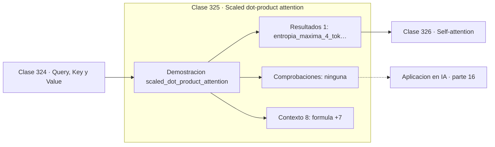

# 325 — Scaled dot-product attention

> [⬅️ 324 Query, Key y Value](../324-query-key-y-value/README.md) · [📚 Parte 16](../README.md) · [🏠 Programa](../../../README.md) · [326 Self-attention ➡️](../326-self-attention/README.md)

**Parte:** 16 — Matemática de Transformers, modelos generativos, grafos y RL · **Nivel:** `experto` · **Horas estimadas:** 4
**Motor:** `engines.part16` · **Demostración:** `scaled_dot_product_attention` · **Clase 5 de 20** de la parte

---

## 🎯 Propósito

**Con d = 256 y sin escalar, la softmax se satura y el gradiente desaparece.**

Softmax, embeddings, positional encoding, atención escalada, multi-head, Transformer completo, muestreo, VAE, GAN, difusión, GNN y ecuaciones de Bellman.

## ✅ Resultados de aprendizaje

Al terminar podrás:

1. Explicar **Scaled dot-product attention** con lenguaje cotidiano y con notación matemática.
2. Resolver un caso pequeño a mano y anticipar el orden de magnitud del resultado.
3. Ejecutar y modificar `lab.py`, que corre la demostración `scaled_dot_product_attention`.
4. Interpretar las 9 salidas del laboratorio y decir qué comprueba cada una.
5. Detectar el error típico de esta parte: confundir temperatura alta con mayor calidad en lugar de mayor entropía.

## 🧩 Fórmulas de la clase

```text
Attention(Q,K,V) = softmax(QKᵀ/√d_k)·V
Var(q·k) ≈ d·σ⁴ con entradas iid
dividir por √d_k devuelve la varianza a escala 1
```

## 🗺️ Ubicación en el programa



## 📖 Fundamentos

La atención escalada calcula la similitud entre cada consulta y cada clave mediante
producto escalar, normaliza con softmax y usa los pesos resultantes para promediar los
valores. Es un promedio ponderado por similitud, y toda la fórmula cabe en esa frase.

La única parte que no es evidente es el factor `1/√d_k`, y su justificación es
estadística. Si las componentes de `q` y `k` son independientes con varianza `σ²`, el
producto escalar de `d` términos tiene varianza proporcional a `d`, y por tanto desviación
proporcional a `√d`. Con `d = 256` eso son 16 veces más dispersión que con `d = 1`.

El efecto sobre la softmax es destructivo. Con puntuaciones muy dispersas, la exponencial
concentra casi toda la masa en el máximo: la distribución se vuelve prácticamente one-hot,
la atención deja de ser un promedio y se convierte en una selección dura. Peor aún, en esa
región la softmax tiene gradiente casi nulo y el mecanismo **deja de aprender**.

Dividir por `√d_k` cancela exactamente el crecimiento. La comparación numérica lo muestra:
con `d = 256` sin escalar, un peso se lleva prácticamente todo y otro cae a `8e-06`; con la
escala, los pesos quedan repartidos y el gradiente fluye. Un solo factor en el denominador
es lo que hace entrenable la arquitectura.

## 🧮 Ejemplo trabajado

Puntuaciones y pesos con y sin escala, en dos dimensiones.

```text
d = 8, sin escalar:
  puntuaciones: [ 0,4204 ; −1,9767 ;  1,3619 ;  1,2219]
  pesos:        [0,169955 ; ... ]        repartidos

d = 8, escalado:
  puntuaciones: [ 0,3541 ; −0,3729 ;  2,3033 ;  0,8469]
  pesos:        [0,098585 ; ... ]        repartidos

d = 256, sin escalar:
  puntuaciones: [−9,7106 ; −2,6027 ; 1,9724 ; −15,9423]
  pesos:        [8e-06 ; ...]           ← saturado    ✗

d = 256, escalado:
  puntuaciones: [−0,7502 ; 1,9863 ; 0,3221 ; 0,5716]
  pesos:        [0,043279 ; ...]        repartidos    ✓

Var(q·k) ≈ d·σ⁴ : por eso se divide por √d.
```

## 🔬 Qué ejecuta el laboratorio

`scaled_dot_product_attention` — Atención escalada: por qué existe el 1/√d.

| Grupo | Salidas |
|---|---|
| 🔢 Resultados numéricos (1) | `entropia_maxima_4_tokens` |
| ✅ Comprobaciones de invariante (0) | — |

Las claves booleanas no son adorno: si alguna fuera `False`, el resultado numérico
no sería fiable aunque el programa terminase sin error.

```bash
python classes/part-16-matematica-de-transformers-modelos-generativos-grafos-y-rl/325-scaled-dot-product-attention/lab.py
compmath run 325
```

> [!TIP]
> Antes de ejecutar, **escribe tu predicción**. Un laboratorio que confirma lo que
> esperabas enseña tanto como uno que te contradice, pero solo si la predicción
> existía antes del resultado.

## ⚠️ Errores conceptuales frecuentes

1. Omitir el factor 1/√d y saturar la softmax en dimensión alta.
2. Escalar por d en vez de por √d.
3. Atribuir la saturación a la inicialización cuando es un problema de escala.

## 🚀 Dónde se usa de verdad

Todos los Transformers, atención en visión y audio, mecanismos de recuperación y modelos
de secuencias modernos.

## 🤖 Conexión con IA

Esta parte es la traducción matemática directa de los papers que definen el estado del arte actual.

## 📓 Notebooks

| Archivo | Para qué |
|---|---|
| [`notebook.ipynb`](notebook.ipynb) | recorrido guiado con la demostración ejecutada |
| [`notebook_student.ipynb`](notebook_student.ipynb) | versión con `TODO` para resolver |
| [`notebook_solution.ipynb`](notebook_solution.ipynb) | solución de referencia verificada |

## 📝 Evaluación

| Criterio | Peso |
|---|---:|
| Comprensión conceptual | 25 % |
| Resolución manual | 25 % |
| Implementación y verificación | 25 % |
| Interpretación y comunicación | 15 % |
| Conexión con aplicación real | 10 % |

Detalle y criterios de error crítico en [`assessment.md`](assessment.md).

## ❓ Preguntas de comprobación

1. ¿Cuál es la entrada, cuál la salida y qué unidades tienen?
2. ¿Qué operación domina el comportamiento del resultado?
3. ¿Qué caso extremo revelaría un error conceptual?
4. ¿Cómo verificarías el resultado por un método independiente?
5. ¿Dónde aparece esto en LLM?

Si necesitas releer el código para responderlas, la clase todavía no está superada.

## 📥 Entregable

`notebook_student.ipynb` resuelto más un párrafo que explique el resultado **sin citar
código**: qué entra, qué sale, qué invariante se comprueba y qué pasaría en un caso límite.

## 🔗 Referencias

- [Vaswani, A. et al. *Attention Is All You Need*, NeurIPS, 2017](https://arxiv.org/abs/1706.03762) — *uso:* artículo de origen consultado en «Scaled dot-product attention».
- [Phuong, M.; Hutter, M. *Formal Algorithms for Transformers*, 2022](https://arxiv.org/abs/2207.09238) — *uso:* artículo de origen consultado en «Scaled dot-product attention».

Bibliografía completa de la parte en [`../../../docs/BIBLIOGRAPHY.md`](../../../docs/BIBLIOGRAPHY.md) · localizador verificable de cada obra en [`sources/bibliography.json`](../../../sources/bibliography.json).

## 📂 Material de la clase

[`intuition.md`](intuition.md) · [`theory.md`](theory.md) · [`derivation.md`](derivation.md) · [`exercises.md`](exercises.md) · [`assessment.md`](assessment.md) · [`where-is-this-used.md`](where-is-this-used.md) · [`lesson.yaml`](lesson.yaml)

---

> [⬅️ 324 Query, Key y Value](../324-query-key-y-value/README.md) · [📚 Parte 16](../README.md) · [🏠 Programa](../../../README.md) · [326 Self-attention ➡️](../326-self-attention/README.md)
