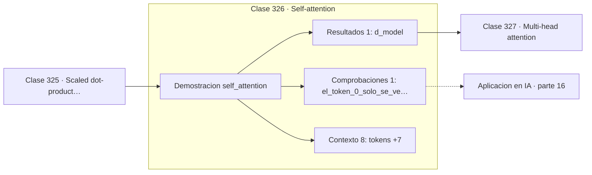

# 326 — Self-attention

> [⬅️ 325 Scaled dot-product attention](../325-scaled-dot-product-attention/README.md) · [📚 Parte 16](../README.md) · [🏠 Programa](../../../README.md) · [327 Multi-head attention ➡️](../327-multi-head-attention/README.md)

**Parte:** 16 — Matemática de Transformers, modelos generativos, grafos y RL · **Nivel:** `experto` · **Horas estimadas:** 4
**Motor:** `engines.part16` · **Demostración:** `self_attention` · **Clase 6 de 20** de la parte

---

## 🎯 Propósito

**Sin máscara causal el modelo ve el futuro, entrena perfecto y genera basura.**

Softmax, embeddings, positional encoding, atención escalada, multi-head, Transformer completo, muestreo, VAE, GAN, difusión, GNN y ecuaciones de Bellman.

## ✅ Resultados de aprendizaje

Al terminar podrás:

1. Explicar **Self-attention** con lenguaje cotidiano y con notación matemática.
2. Resolver un caso pequeño a mano y anticipar el orden de magnitud del resultado.
3. Ejecutar y modificar `lab.py`, que corre la demostración `self_attention`.
4. Interpretar las 10 salidas del laboratorio y decir qué comprueba cada una.
5. Detectar el error típico de esta parte: normalizar el laplaciano de un grafo con nodos aislados sin tratar la división por cero.

## 🧩 Fórmulas de la clase

```text
Q, K, V provienen todos de la misma secuencia
máscara causal: puntuación = −∞ para j > i
cada fila de la matriz de atención suma 1
```

## 🗺️ Ubicación en el programa



## 📖 Fundamentos

En self-attention, consultas, claves y valores se calculan todos a partir de la misma
secuencia. Cada token puede atender a todos los demás y actualizar su representación con la
información que le resulte relevante, en **una sola operación** y sin importar la
distancia.

Esa es la ventaja decisiva sobre las RNN de la parte 15. En una recurrente, conectar el
token 1 con el 100 requiere que la información atraviese 99 pasos, con el gradiente
multiplicándose 99 veces. En self-attention hay un camino directo. El precio es el coste
cuadrático en la longitud de la secuencia, que es el cuello de botella de los contextos
largos.

Para generación autorregresiva hace falta la **máscara causal**: poner las puntuaciones de
las posiciones futuras a menos infinito antes del softmax, de modo que sus pesos sean
exactamente cero. La matriz de atención queda triangular inferior, y el primer token solo
puede atenderse a sí mismo.

Olvidarla produce un fallo especialmente traicionero porque **no da ningún error**. El
modelo entrena con métricas excelentes, porque para predecir el token siguiente puede
simplemente mirarlo, y al generar —cuando el futuro no existe— produce basura. Es un error
silencioso que solo se detecta al probar la generación.

## 🧮 Ejemplo trabajado

Atención bidireccional y causal sobre cuatro tokens.

```text
tokens: ["el", "gato", "come", "pescado"]

matriz de atención bidireccional:
  [0,2982  0,2239  0,4516  0,0263]
  [0,3251  0,3369  0,2829  0,0550]
  [ ...                          ]
cada fila suma 1                                     ✓

matriz causal:
  [1,0000  0,0000  0,0000  0,0000]
  [0,4911  0,5089  0,0000  0,0000]
  [0,0051  0,0022  0,99xx  0,0000]
  [ ...                          ]

El token 0 solo se ve a sí mismo                     ✓
Triangular inferior: nadie ve el futuro.

Sin la máscara, predecir el token 2 podría hacerse
simplemente mirándolo.
```

## 🔬 Qué ejecuta el laboratorio

`self_attention` — Self-attention completa sobre una secuencia de 4 tokens.

| Grupo | Salidas |
|---|---|
| 🔢 Resultados numéricos (1) | `d_model` |
| ✅ Comprobaciones de invariante (1) | `el_token_0_solo_se_ve_a_si_mismo` |

Las claves booleanas no son adorno: si alguna fuera `False`, el resultado numérico
no sería fiable aunque el programa terminase sin error.

```bash
python classes/part-16-matematica-de-transformers-modelos-generativos-grafos-y-rl/326-self-attention/lab.py
compmath run 326
```

> [!TIP]
> Antes de ejecutar, **escribe tu predicción**. Un laboratorio que confirma lo que
> esperabas enseña tanto como uno que te contradice, pero solo si la predicción
> existía antes del resultado.

## ⚠️ Errores conceptuales frecuentes

1. Olvidar la máscara causal en modelos generativos.
2. Usar máscara causal en modelos de comprensión tipo BERT, donde estorba.
3. Poner las posiciones futuras a cero después del softmax en vez de a −∞ antes.

## 🚀 Dónde se usa de verdad

GPT y todos los modelos de lenguaje generativos, BERT sin máscara, Vision Transformers y
modelos de audio.

## 🤖 Conexión con IA

Esta parte es la traducción matemática directa de los papers que definen el estado del arte actual.

## 📓 Notebooks

| Archivo | Para qué |
|---|---|
| [`notebook.ipynb`](notebook.ipynb) | recorrido guiado con la demostración ejecutada |
| [`notebook_student.ipynb`](notebook_student.ipynb) | versión con `TODO` para resolver |
| [`notebook_solution.ipynb`](notebook_solution.ipynb) | solución de referencia verificada |

## 📝 Evaluación

| Criterio | Peso |
|---|---:|
| Comprensión conceptual | 25 % |
| Resolución manual | 25 % |
| Implementación y verificación | 25 % |
| Interpretación y comunicación | 15 % |
| Conexión con aplicación real | 10 % |

Detalle y criterios de error crítico en [`assessment.md`](assessment.md).

## ❓ Preguntas de comprobación

1. ¿Cuál es la entrada, cuál la salida y qué unidades tienen?
2. ¿Qué operación domina el comportamiento del resultado?
3. ¿Qué caso extremo revelaría un error conceptual?
4. ¿Cómo verificarías el resultado por un método independiente?
5. ¿Dónde aparece esto en LLM?

Si necesitas releer el código para responderlas, la clase todavía no está superada.

## 📥 Entregable

`notebook_student.ipynb` resuelto más un párrafo que explique el resultado **sin citar
código**: qué entra, qué sale, qué invariante se comprueba y qué pasaría en un caso límite.

## 🔗 Referencias

- [Vaswani, A. et al. *Attention Is All You Need*, NeurIPS, 2017](https://arxiv.org/abs/1706.03762) — *uso:* artículo de origen consultado en «Self-attention».
- [Radford, A. et al. *Improving Language Understanding by Generative Pre-Training*, 2018](https://openai.com/research/language-unsupervised) — *uso:* obra de referencia consultada en «Self-attention».

Bibliografía completa de la parte en [`../../../docs/BIBLIOGRAPHY.md`](../../../docs/BIBLIOGRAPHY.md) · localizador verificable de cada obra en [`sources/bibliography.json`](../../../sources/bibliography.json).

## 📂 Material de la clase

[`intuition.md`](intuition.md) · [`theory.md`](theory.md) · [`derivation.md`](derivation.md) · [`exercises.md`](exercises.md) · [`assessment.md`](assessment.md) · [`where-is-this-used.md`](where-is-this-used.md) · [`lesson.yaml`](lesson.yaml)

---

> [⬅️ 325 Scaled dot-product attention](../325-scaled-dot-product-attention/README.md) · [📚 Parte 16](../README.md) · [🏠 Programa](../../../README.md) · [327 Multi-head attention ➡️](../327-multi-head-attention/README.md)
