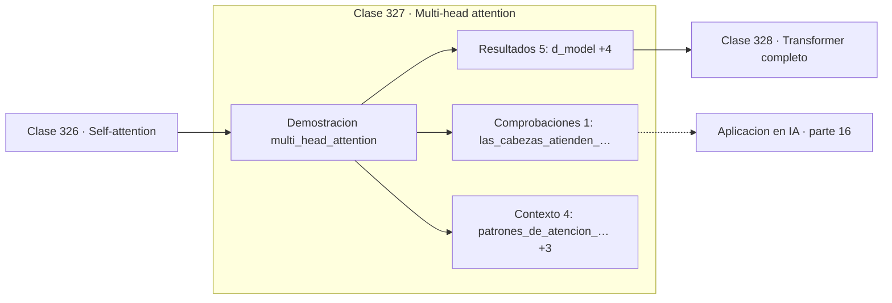

# 327 — Multi-head attention

> [⬅️ 326 Self-attention](../326-self-attention/README.md) · [📚 Parte 16](../README.md) · [🏠 Programa](../../../README.md) · [328 Transformer completo ➡️](../328-transformer-completo/README.md)

**Parte:** 16 — Matemática de Transformers, modelos generativos, grafos y RL · **Nivel:** `experto` · **Horas estimadas:** 4
**Motor:** `engines.part16` · **Demostración:** `multi_head_attention` · **Clase 7 de 20** de la parte

---

## 🎯 Propósito

**Varias cabezas atienden a cosas distintas en subespacios distintos, al mismo coste.**

Softmax, embeddings, positional encoding, atención escalada, multi-head, Transformer completo, muestreo, VAE, GAN, difusión, GNN y ecuaciones de Bellman.

## ✅ Resultados de aprendizaje

Al terminar podrás:

1. Explicar **Multi-head attention** con lenguaje cotidiano y con notación matemática.
2. Resolver un caso pequeño a mano y anticipar el orden de magnitud del resultado.
3. Ejecutar y modificar `lab.py`, que corre la demostración `multi_head_attention`.
4. Interpretar las 10 salidas del laboratorio y decir qué comprueba cada una.
5. Detectar el error típico de esta parte: olvidar la máscara causal en el modelado autoregresivo.

## 🧩 Fórmulas de la clase

```text
d_por_cabeza = d_model / n_cabezas
concatenar las salidas y proyectar con W_O
coste total similar al de una sola cabeza de dimensión completa
```

## 🗺️ Ubicación en el programa



## 📖 Fundamentos

Una sola cabeza de atención produce una única distribución de pesos por token, y eso obliga
a comprometer: no puede atender a la vez a la concordancia sintáctica y a la relación
semántica. Multi-head resuelve el conflicto ejecutando varias atenciones en paralelo sobre
**subespacios distintos**.

La aritmética está diseñada para que no cueste más. Con `d_model = 512` y 8 cabezas, cada
una trabaja en dimensión 64, y el total de parámetros es aproximadamente el mismo que el de
una única atención de dimensión 512. Se gana diversidad sin pagar capacidad.

Los patrones aprendidos son efectivamente distintos, y eso se puede comprobar
inspeccionando las matrices. El análisis de modelos entrenados encuentra cabezas
especializadas de forma reconocible: unas siguen dependencias sintácticas, otras enlazan
referencias, otras miran sistemáticamente al token anterior. También encuentra que muchas
cabezas son redundantes y se pueden podar sin pérdida apreciable.

La concatenación de las salidas se proyecta con una matriz `W_O` que mezcla la información
de todas las cabezas. Sin ese paso final, las cabezas quedarían en subespacios estancos y
no podrían combinarse.

## 🧮 Ejemplo trabajado

Cuatro cabezas sobre un modelo de dimensión 8.

```text
d_model = 8      cabezas = 4      d por cabeza = 2

patrones de atención (primera fila de cada cabeza):
  cabeza 1: [0,1657  0,7332  0,1010]
  cabeza 2: [0,0010  0,9989  0,0000]
  cabeza 3: [0,0423  0,0099  0,9478]
  cabeza 4: [ ... ]

Las cabezas atienden a posiciones distintas          ✓
La cabeza 2 está muy concentrada; la 1, repartida.

parámetros totales: 256
Una sola cabeza de dimensión 8 costaría lo mismo.
```

## 🔬 Qué ejecuta el laboratorio

`multi_head_attention` — Multi-head: varias atenciones en subespacios distintos.

| Grupo | Salidas |
|---|---|
| 🔢 Resultados numéricos (5) | `d_model`, `cabezas`, `d_por_cabeza`, `parametros_totales`, `parametros_de_una_sola_cabeza_ancha` |
| ✅ Comprobaciones de invariante (1) | `las_cabezas_atienden_distinto` |

Las claves booleanas no son adorno: si alguna fuera `False`, el resultado numérico
no sería fiable aunque el programa terminase sin error.

```bash
python classes/part-16-matematica-de-transformers-modelos-generativos-grafos-y-rl/327-multi-head-attention/lab.py
compmath run 327
```

> [!TIP]
> Antes de ejecutar, **escribe tu predicción**. Un laboratorio que confirma lo que
> esperabas enseña tanto como uno que te contradice, pero solo si la predicción
> existía antes del resultado.

## ⚠️ Errores conceptuales frecuentes

1. Elegir un número de cabezas que no divide la dimensión del modelo.
2. Omitir la proyección final W_O tras la concatenación.
3. Suponer que todas las cabezas aportan información útil.

## 🚀 Dónde se usa de verdad

Todos los Transformers, interpretabilidad mecanicista, poda de cabezas redundantes y
diseño de arquitecturas eficientes.

## 🤖 Conexión con IA

Esta parte es la traducción matemática directa de los papers que definen el estado del arte actual.

## 📓 Notebooks

| Archivo | Para qué |
|---|---|
| [`notebook.ipynb`](notebook.ipynb) | recorrido guiado con la demostración ejecutada |
| [`notebook_student.ipynb`](notebook_student.ipynb) | versión con `TODO` para resolver |
| [`notebook_solution.ipynb`](notebook_solution.ipynb) | solución de referencia verificada |

## 📝 Evaluación

| Criterio | Peso |
|---|---:|
| Comprensión conceptual | 25 % |
| Resolución manual | 25 % |
| Implementación y verificación | 25 % |
| Interpretación y comunicación | 15 % |
| Conexión con aplicación real | 10 % |

Detalle y criterios de error crítico en [`assessment.md`](assessment.md).

## ❓ Preguntas de comprobación

1. ¿Cuál es la entrada, cuál la salida y qué unidades tienen?
2. ¿Qué operación domina el comportamiento del resultado?
3. ¿Qué caso extremo revelaría un error conceptual?
4. ¿Cómo verificarías el resultado por un método independiente?
5. ¿Dónde aparece esto en LLM?

Si necesitas releer el código para responderlas, la clase todavía no está superada.

## 📥 Entregable

`notebook_student.ipynb` resuelto más un párrafo que explique el resultado **sin citar
código**: qué entra, qué sale, qué invariante se comprueba y qué pasaría en un caso límite.

## 🔗 Referencias

- [Vaswani, A. et al. *Attention Is All You Need*, NeurIPS, 2017](https://arxiv.org/abs/1706.03762) — *uso:* artículo de origen consultado en «Multi-head attention».
- [Michel, P.; Levy, O.; Neubig, G. *Are sixteen heads really better than one?*, NeurIPS, 2019](https://arxiv.org/abs/1905.10650) — *uso:* artículo de origen consultado en «Multi-head attention».

Bibliografía completa de la parte en [`../../../docs/BIBLIOGRAPHY.md`](../../../docs/BIBLIOGRAPHY.md) · localizador verificable de cada obra en [`sources/bibliography.json`](../../../sources/bibliography.json).

## 📂 Material de la clase

[`intuition.md`](intuition.md) · [`theory.md`](theory.md) · [`derivation.md`](derivation.md) · [`exercises.md`](exercises.md) · [`assessment.md`](assessment.md) · [`where-is-this-used.md`](where-is-this-used.md) · [`lesson.yaml`](lesson.yaml)

---

> [⬅️ 326 Self-attention](../326-self-attention/README.md) · [📚 Parte 16](../README.md) · [🏠 Programa](../../../README.md) · [328 Transformer completo ➡️](../328-transformer-completo/README.md)
