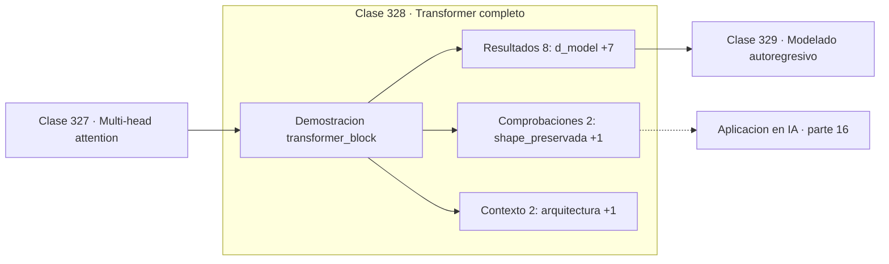

# 328 — Transformer completo

> [⬅️ 327 Multi-head attention](../327-multi-head-attention/README.md) · [📚 Parte 16](../README.md) · [🏠 Programa](../../../README.md) · [329 Modelado autoregresivo ➡️](../329-modelado-autoregresivo/README.md)

**Parte:** 16 — Matemática de Transformers, modelos generativos, grafos y RL · **Nivel:** `experto` · **Horas estimadas:** 4
**Motor:** `engines.part16` · **Demostración:** `transformer_block` · **Clase 8 de 20** de la parte

---

## 🎯 Propósito

**El bloque es atención más feed-forward, cada uno envuelto en residual y normalización.**

Softmax, embeddings, positional encoding, atención escalada, multi-head, Transformer completo, muestreo, VAE, GAN, difusión, GNN y ecuaciones de Bellman.

## ✅ Resultados de aprendizaje

Al terminar podrás:

1. Explicar **Transformer completo** con lenguaje cotidiano y con notación matemática.
2. Resolver un caso pequeño a mano y anticipar el orden de magnitud del resultado.
3. Ejecutar y modificar `lab.py`, que corre la demostración `transformer_block`.
4. Interpretar las 12 salidas del laboratorio y decir qué comprueba cada una.
5. Detectar el error típico de esta parte: confundir temperatura alta con mayor calidad en lugar de mayor entropía.

## 🧩 Fórmulas de la clase

```text
x ← LayerNorm(x + MultiHead(x))
x ← LayerNorm(x + FFN(x))
FFN con expansión ×4: d_ff = 4·d_model
```

## 🗺️ Ubicación en el programa



## 📖 Fundamentos

El bloque Transformer combina dos subcapas con la misma envoltura. Primero atención
multi-cabeza, que mezcla información **entre** posiciones; después una red feed-forward
aplicada a cada posición **por separado**, que procesa cada representación
individualmente. Ambas van rodeadas de conexión residual y normalización.

La **conexión residual** es la que hace entrenables las pilas profundas. Sumar la entrada a
la salida crea un camino por el que el gradiente pasa sin multiplicarse, exactamente la
misma solución que la LSTM de la clase 315 y que ResNet. Sin ella, apilar 96 bloques sería
inviable.

La **normalización** estabiliza la escala. Se usa layer norm y no batch norm porque las
secuencias tienen longitud variable y el tamaño de lote efectivo cambia, como se explicó en
la clase 308. Su colocación importa: la variante **pre-norm** —normalizar antes de la
subcapa— es más estable en modelos muy profundos y es la que usan los modelos actuales,
aunque el artículo original usaba post-norm.

La **expansión ×4** en la red feed-forward es una constante empírica notablemente estable a
lo largo de los años. Ahí reside la mayor parte de los parámetros del modelo, y hay
evidencia de que esas capas funcionan como una memoria asociativa de conocimiento
factual, más que como un simple procesador local.

## 🧮 Ejemplo trabajado

Estructura y dimensiones de un bloque.

```text
arquitectura:
  multi-head attention
  + residual
  layer norm
  feed-forward
  + residual
  layer norm

d_model = 8      d_ff = 32      razón = 4
tokens = 4

norma media de entrada: 3,214373

Reparto de parámetros en un modelo real:
  atención:      4·d²   = 4·d_model²
  feed-forward:  8·d²   = 2·(d_model·4·d_model)
  el feed-forward tiene el doble de parámetros

Pre-norm frente a post-norm: pre-norm es más estable
con muchas capas y es lo estándar hoy.
```

## 🔬 Qué ejecuta el laboratorio

`transformer_block` — Bloque Transformer: atención, residual, layer norm y feed-forward.

| Grupo | Salidas |
|---|---|
| 🔢 Resultados numéricos (8) | `d_model`, `d_ff`, `razon_d_ff/d_model`, `tokens`, `norma_media_entrada`, `norma_media_salida`, `parametros_atencion`, `parametros_feed_forward` |
| ✅ Comprobaciones de invariante (2) | `shape_preservada`, `el_FFN_tiene_mas_parametros` |

Las claves booleanas no son adorno: si alguna fuera `False`, el resultado numérico
no sería fiable aunque el programa terminase sin error.

```bash
python classes/part-16-matematica-de-transformers-modelos-generativos-grafos-y-rl/328-transformer-completo/lab.py
compmath run 328
```

> [!TIP]
> Antes de ejecutar, **escribe tu predicción**. Un laboratorio que confirma lo que
> esperabas enseña tanto como uno que te contradice, pero solo si la predicción
> existía antes del resultado.

## ⚠️ Errores conceptuales frecuentes

1. Omitir las conexiones residuales en pilas profundas.
2. Usar batch norm en vez de layer norm con secuencias de longitud variable.
3. Mezclar pre-norm y post-norm al reproducir una arquitectura publicada.

## 🚀 Dónde se usa de verdad

GPT, BERT, Vision Transformers, modelos de audio y prácticamente toda la arquitectura
moderna de gran escala.

## 🤖 Conexión con IA

Esta parte es la traducción matemática directa de los papers que definen el estado del arte actual.

## 📓 Notebooks

| Archivo | Para qué |
|---|---|
| [`notebook.ipynb`](notebook.ipynb) | recorrido guiado con la demostración ejecutada |
| [`notebook_student.ipynb`](notebook_student.ipynb) | versión con `TODO` para resolver |
| [`notebook_solution.ipynb`](notebook_solution.ipynb) | solución de referencia verificada |

## 📝 Evaluación

| Criterio | Peso |
|---|---:|
| Comprensión conceptual | 25 % |
| Resolución manual | 25 % |
| Implementación y verificación | 25 % |
| Interpretación y comunicación | 15 % |
| Conexión con aplicación real | 10 % |

Detalle y criterios de error crítico en [`assessment.md`](assessment.md).

## ❓ Preguntas de comprobación

1. ¿Cuál es la entrada, cuál la salida y qué unidades tienen?
2. ¿Qué operación domina el comportamiento del resultado?
3. ¿Qué caso extremo revelaría un error conceptual?
4. ¿Cómo verificarías el resultado por un método independiente?
5. ¿Dónde aparece esto en LLM?

Si necesitas releer el código para responderlas, la clase todavía no está superada.

## 📥 Entregable

`notebook_student.ipynb` resuelto más un párrafo que explique el resultado **sin citar
código**: qué entra, qué sale, qué invariante se comprueba y qué pasaría en un caso límite.

## 🔗 Referencias

- [Vaswani, A. et al. *Attention Is All You Need*, NeurIPS, 2017](https://arxiv.org/abs/1706.03762) — *uso:* artículo de origen consultado en «Transformer completo».
- [Xiong, R. et al. *On Layer Normalization in the Transformer Architecture*, ICML, 2020](https://arxiv.org/abs/2002.04745) — *uso:* artículo de origen consultado en «Transformer completo».

Bibliografía completa de la parte en [`../../../docs/BIBLIOGRAPHY.md`](../../../docs/BIBLIOGRAPHY.md) · localizador verificable de cada obra en [`sources/bibliography.json`](../../../sources/bibliography.json).

## 📂 Material de la clase

[`intuition.md`](intuition.md) · [`theory.md`](theory.md) · [`derivation.md`](derivation.md) · [`exercises.md`](exercises.md) · [`assessment.md`](assessment.md) · [`where-is-this-used.md`](where-is-this-used.md) · [`lesson.yaml`](lesson.yaml)

---

> [⬅️ 327 Multi-head attention](../327-multi-head-attention/README.md) · [📚 Parte 16](../README.md) · [🏠 Programa](../../../README.md) · [329 Modelado autoregresivo ➡️](../329-modelado-autoregresivo/README.md)
