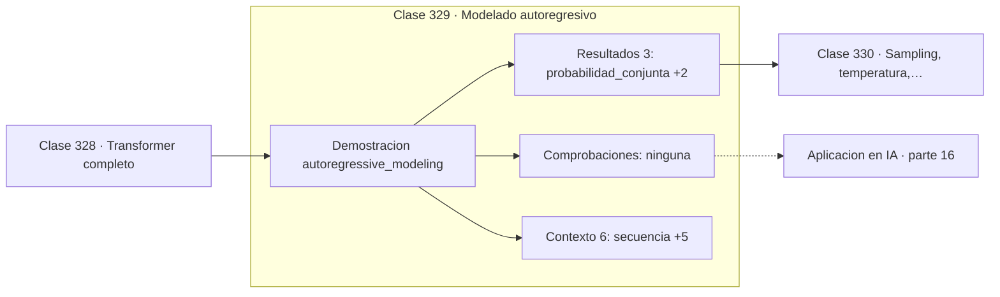

# 329 — Modelado autoregresivo

> [⬅️ 328 Transformer completo](../328-transformer-completo/README.md) · [📚 Parte 16](../README.md) · [🏠 Programa](../../../README.md) · [330 Sampling, temperatura, top-k y top-p ➡️](../330-sampling-temperatura-top-k-y-top-p/README.md)

**Parte:** 16 — Matemática de Transformers, modelos generativos, grafos y RL · **Nivel:** `experto` · **Horas estimadas:** 4
**Motor:** `engines.part16` · **Demostración:** `autoregressive_modeling` · **Clase 9 de 20** de la parte

---

## 🎯 Propósito

**Un modelo de lenguaje es la regla de la cadena de la probabilidad, entrenada por verosimilitud.**

Softmax, embeddings, positional encoding, atención escalada, multi-head, Transformer completo, muestreo, VAE, GAN, difusión, GNN y ecuaciones de Bellman.

## ✅ Resultados de aprendizaje

Al terminar podrás:

1. Explicar **Modelado autoregresivo** con lenguaje cotidiano y con notación matemática.
2. Resolver un caso pequeño a mano y anticipar el orden de magnitud del resultado.
3. Ejecutar y modificar `lab.py`, que corre la demostración `autoregressive_modeling`.
4. Interpretar las 9 salidas del laboratorio y decir qué comprueba cada una.
5. Detectar el error típico de esta parte: normalizar el laplaciano de un grafo con nodos aislados sin tratar la división por cero.

## 🧩 Fórmulas de la clase

```text
P(x₁…xₙ) = Π P(xᵢ | x₁…xᵢ₋₁)
log P = Σ log P(xᵢ | contexto)
perplejidad = exp(−(1/n)·Σ log P)
```

## 🗺️ Ubicación en el programa



## 📖 Fundamentos

Un modelo autorregresivo descompone la probabilidad de una secuencia en un producto de
condicionales, cada uno prediciendo el siguiente elemento a partir de los anteriores. Es
exactamente la regla de la cadena de la clase 183 aplicada a secuencias, sin ninguna
aproximación: la factorización es exacta.

El entrenamiento es máxima verosimilitud, y por tanto la pérdida es entropía cruzada, como
se dedujo en la clase 263. Se trabaja con **logaritmos** por dos razones: convierte el
producto en suma y evita el subdesbordamiento, que con secuencias de miles de tokens sería
inevitable.

La **perplejidad** es la exponencial de la entropía cruzada media, y su interpretación es
útil: el número efectivo de opciones equiprobables entre las que el modelo duda. Una
perplejidad de 2,55 significa que el modelo está tan indeciso como si eligiera entre 2,55
alternativas igualmente probables. Es la métrica estándar y permite comparar modelos, con
la precaución de que depende del tokenizador.

La consecuencia arquitectónica es la máscara causal de la clase 326: para que la
factorización sea legítima, la predicción del token `i` solo puede depender de los
anteriores. Y la consecuencia práctica es que el mismo modelo sirve para evaluar la
probabilidad de un texto dado y para generar texto nuevo muestreando de las condicionales.

## 🧮 Ejemplo trabajado

Descomposición de una secuencia de tres tokens.

```text
secuencia: ["el", "gato", "duerme"]

paso  token     contexto              P(token|contexto)
  1   "el"      [<inicio>]                  0,40
  2   "gato"    [<inicio>, el]              0,30
  3   "duerme"  [<inicio>, el, gato]        0,50

probabilidad conjunta: 0,40 × 0,30 × 0,50 = 0,06
log probabilidad: −2,813411
perplejidad: exp(2,813411/3) = 2,554365

Lectura: el modelo duda como si eligiera entre
2,55 opciones equiprobables por token.

Con logaritmos: −0,916 − 1,204 − 0,693 = −2,813
Sin logaritmos, 1000 tokens darían un producto
del orden de 1e-500: cero en punto flotante.
```

## 🔬 Qué ejecuta el laboratorio

`autoregressive_modeling` — Modelado autoregresivo: la regla de la cadena de la probabilidad.

| Grupo | Salidas |
|---|---|
| 🔢 Resultados numéricos (3) | `probabilidad_conjunta`, `log_probabilidad`, `perplejidad` |
| ✅ Comprobaciones de invariante (0) | — |

Las claves booleanas no son adorno: si alguna fuera `False`, el resultado numérico
no sería fiable aunque el programa terminase sin error.

```bash
python classes/part-16-matematica-de-transformers-modelos-generativos-grafos-y-rl/329-modelado-autoregresivo/lab.py
compmath run 329
```

> [!TIP]
> Antes de ejecutar, **escribe tu predicción**. Un laboratorio que confirma lo que
> esperabas enseña tanto como uno que te contradice, pero solo si la predicción
> existía antes del resultado.

## ⚠️ Errores conceptuales frecuentes

1. Multiplicar probabilidades en vez de sumar logaritmos.
2. Comparar perplejidades entre modelos con tokenizadores distintos.
3. Entrenar sin máscara causal e invalidar la factorización.

## 🚀 Dónde se usa de verdad

Modelos de lenguaje, generación de código, síntesis de audio, modelos de series temporales
y evaluación de modelos generativos.

## 🤖 Conexión con IA

Esta parte es la traducción matemática directa de los papers que definen el estado del arte actual.

## 📓 Notebooks

| Archivo | Para qué |
|---|---|
| [`notebook.ipynb`](notebook.ipynb) | recorrido guiado con la demostración ejecutada |
| [`notebook_student.ipynb`](notebook_student.ipynb) | versión con `TODO` para resolver |
| [`notebook_solution.ipynb`](notebook_solution.ipynb) | solución de referencia verificada |

## 📝 Evaluación

| Criterio | Peso |
|---|---:|
| Comprensión conceptual | 25 % |
| Resolución manual | 25 % |
| Implementación y verificación | 25 % |
| Interpretación y comunicación | 15 % |
| Conexión con aplicación real | 10 % |

Detalle y criterios de error crítico en [`assessment.md`](assessment.md).

## ❓ Preguntas de comprobación

1. ¿Cuál es la entrada, cuál la salida y qué unidades tienen?
2. ¿Qué operación domina el comportamiento del resultado?
3. ¿Qué caso extremo revelaría un error conceptual?
4. ¿Cómo verificarías el resultado por un método independiente?
5. ¿Dónde aparece esto en LLM?

Si necesitas releer el código para responderlas, la clase todavía no está superada.

## 📥 Entregable

`notebook_student.ipynb` resuelto más un párrafo que explique el resultado **sin citar
código**: qué entra, qué sale, qué invariante se comprueba y qué pasaría en un caso límite.

## 🔗 Referencias

- [Bengio, Y. et al. *A neural probabilistic language model*, JMLR, 2003](https://jmlr.org/papers/v3/bengio03a.html)
- [Radford, A. et al. *Language Models are Unsupervised Multitask Learners*, 2019](https://openai.com/research/better-language-models)

Bibliografía completa de la parte en [`../../../docs/BIBLIOGRAPHY.md`](../../../docs/BIBLIOGRAPHY.md).

## 📂 Material de la clase

[`intuition.md`](intuition.md) · [`theory.md`](theory.md) · [`derivation.md`](derivation.md) · [`exercises.md`](exercises.md) · [`assessment.md`](assessment.md) · [`where-is-this-used.md`](where-is-this-used.md) · [`lesson.yaml`](lesson.yaml)

---

> [⬅️ 328 Transformer completo](../328-transformer-completo/README.md) · [📚 Parte 16](../README.md) · [🏠 Programa](../../../README.md) · [330 Sampling, temperatura, top-k y top-p ➡️](../330-sampling-temperatura-top-k-y-top-p/README.md)
