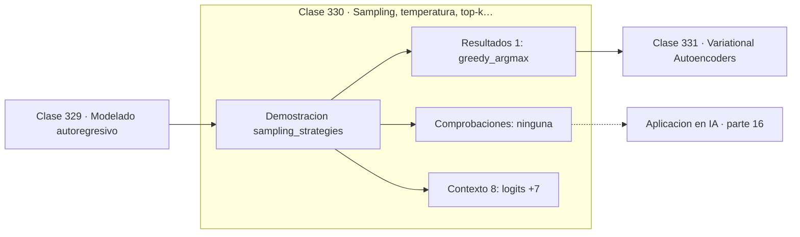

# 330 — Sampling, temperatura, top-k y top-p

> [⬅️ 329 Modelado autoregresivo](../329-modelado-autoregresivo/README.md) · [📚 Parte 16](../README.md) · [🏠 Programa](../../../README.md) · [331 Variational Autoencoders ➡️](../331-variational-autoencoders/README.md)

**Parte:** 16 — Matemática de Transformers, modelos generativos, grafos y RL · **Nivel:** `experto` · **Horas estimadas:** 4
**Motor:** `engines.part16` · **Demostración:** `sampling_strategies` · **Clase 10 de 20** de la parte

---

## 🎯 Propósito

**Temperatura alta no es más creatividad: es más entropía, y también más error.**

Softmax, embeddings, positional encoding, atención escalada, multi-head, Transformer completo, muestreo, VAE, GAN, difusión, GNN y ecuaciones de Bellman.

## ✅ Resultados de aprendizaje

Al terminar podrás:

1. Explicar **Sampling, temperatura, top-k y top-p** con lenguaje cotidiano y con notación matemática.
2. Resolver un caso pequeño a mano y anticipar el orden de magnitud del resultado.
3. Ejecutar y modificar `lab.py`, que corre la demostración `sampling_strategies`.
4. Interpretar las 9 salidas del laboratorio y decir qué comprueba cada una.
5. Detectar el error típico de esta parte: olvidar la máscara causal en el modelado autoregresivo.

## 🧩 Fórmulas de la clase

```text
temperatura: softmax(z/T)
top-k: conservar los k logits mayores
top-p: conservar la masa acumulada hasta p
```

## 🗺️ Ubicación en el programa



## 📖 Fundamentos

Un modelo autorregresivo produce una distribución sobre el vocabulario; la estrategia de
muestreo decide qué hacer con ella. Tomar siempre el máximo —**greedy**— es determinista y
produce texto repetitivo; muestrear de la distribución cruda produce texto diverso pero
con errores frecuentes de la cola.

La **temperatura** divide los logits antes del softmax. Con `T < 1` las diferencias se
amplifican y la distribución se concentra: más determinista y más conservador. Con `T > 1`
las diferencias se comprimen y la distribución se aplana: más variedad y más riesgo. En el
límite `T → 0` se recupera greedy y con `T → ∞` se obtiene la uniforme.

Conviene decirlo sin eufemismos: temperatura alta **no es más creatividad, es más
entropía**. Aumenta la probabilidad de tokens raros, y algunos de esos tokens son
sorprendentes de forma interesante mientras que otros son simplemente incorrectos. El
modelo no distingue entre ambos casos.

**Top-k** y **top-p** atacan el problema desde otro ángulo: en vez de reescalar toda la
distribución, truncan la cola. Top-k conserva los `k` candidatos más probables; top-p —o
muestreo por núcleo— conserva los que acumulan una masa `p`, lo que **adapta el número de
candidatos** a lo segura que esté la distribución. Cuando el modelo tiene clara la
respuesta, top-p deja pocos; cuando duda, deja muchos. Es la razón de que sea preferible a
top-k, y en la práctica se combina con temperatura moderada.

## 🧮 Ejemplo trabajado

La misma distribución bajo cinco estrategias.

```text
logits: [3,0 ; 2,5 ; 2,0 ; 1,0 ; 0,5 ; −1,0 ; −2,0]

greedy (argmax): token 0

T = 1,0:  [0,45108 ; 0,27360 ; 0,16594 ; 0,06105 ; ...]
T = 0,5:  [0,65417 ; 0,24066 ; 0,08853 ; 0,01198 ; ...]
           más determinista
T = 2,0:  [0,30702 ; 0,23911 ; 0,18622 ; 0,11295 ; ...]
           más diverso

top-k = 3:
  [0,50648 ; 0,30720 ; 0,18632 ; 0 ; 0 ; 0 ; 0]
  la cola se elimina y se renormaliza

Con T = 0,5 el token menos probable pasa de 3e-3 a 3e-5:
queda prácticamente descartado.
```

## 🔬 Qué ejecuta el laboratorio

`sampling_strategies` — Temperatura, top-k y top-p reescriben la distribución antes de muestrear.

| Grupo | Salidas |
|---|---|
| 🔢 Resultados numéricos (1) | `greedy_argmax` |
| ✅ Comprobaciones de invariante (0) | — |

Las claves booleanas no son adorno: si alguna fuera `False`, el resultado numérico
no sería fiable aunque el programa terminase sin error.

```bash
python classes/part-16-matematica-de-transformers-modelos-generativos-grafos-y-rl/330-sampling-temperatura-top-k-y-top-p/lab.py
compmath run 330
```

> [!TIP]
> Antes de ejecutar, **escribe tu predicción**. Un laboratorio que confirma lo que
> esperabas enseña tanto como uno que te contradice, pero solo si la predicción
> existía antes del resultado.

## ⚠️ Errores conceptuales frecuentes

1. Interpretar temperatura alta como mayor calidad.
2. Combinar temperatura muy alta con top-p amplio y generar incoherencias.
3. Usar greedy y luego quejarse de la repetición.

## 🚀 Dónde se usa de verdad

Generación con modelos de lenguaje, síntesis de imágenes, generación de código y control
del compromiso entre diversidad y fiabilidad.

## 🤖 Conexión con IA

Esta parte es la traducción matemática directa de los papers que definen el estado del arte actual.

## 📓 Notebooks

| Archivo | Para qué |
|---|---|
| [`notebook.ipynb`](notebook.ipynb) | recorrido guiado con la demostración ejecutada |
| [`notebook_student.ipynb`](notebook_student.ipynb) | versión con `TODO` para resolver |
| [`notebook_solution.ipynb`](notebook_solution.ipynb) | solución de referencia verificada |

## 📝 Evaluación

| Criterio | Peso |
|---|---:|
| Comprensión conceptual | 25 % |
| Resolución manual | 25 % |
| Implementación y verificación | 25 % |
| Interpretación y comunicación | 15 % |
| Conexión con aplicación real | 10 % |

Detalle y criterios de error crítico en [`assessment.md`](assessment.md).

## ❓ Preguntas de comprobación

1. ¿Cuál es la entrada, cuál la salida y qué unidades tienen?
2. ¿Qué operación domina el comportamiento del resultado?
3. ¿Qué caso extremo revelaría un error conceptual?
4. ¿Cómo verificarías el resultado por un método independiente?
5. ¿Dónde aparece esto en LLM?

Si necesitas releer el código para responderlas, la clase todavía no está superada.

## 📥 Entregable

`notebook_student.ipynb` resuelto más un párrafo que explique el resultado **sin citar
código**: qué entra, qué sale, qué invariante se comprueba y qué pasaría en un caso límite.

## 🔗 Referencias

- [Holtzman, A. et al. *The Curious Case of Neural Text Degeneration*, ICLR, 2020](https://arxiv.org/abs/1904.09751) — *uso:* artículo de origen consultado en «Sampling, temperatura, top-k y top-p».
- [Fan, A.; Lewis, M.; Dauphin, Y. *Hierarchical Neural Story Generation*, ACL, 2018](https://arxiv.org/abs/1805.04833) — *uso:* artículo de origen consultado en «Sampling, temperatura, top-k y top-p».

Bibliografía completa de la parte en [`../../../docs/BIBLIOGRAPHY.md`](../../../docs/BIBLIOGRAPHY.md) · localizador verificable de cada obra en [`sources/bibliography.json`](../../../sources/bibliography.json).

## 📂 Material de la clase

[`intuition.md`](intuition.md) · [`theory.md`](theory.md) · [`derivation.md`](derivation.md) · [`exercises.md`](exercises.md) · [`assessment.md`](assessment.md) · [`where-is-this-used.md`](where-is-this-used.md) · [`lesson.yaml`](lesson.yaml)

---

> [⬅️ 329 Modelado autoregresivo](../329-modelado-autoregresivo/README.md) · [📚 Parte 16](../README.md) · [🏠 Programa](../../../README.md) · [331 Variational Autoencoders ➡️](../331-variational-autoencoders/README.md)
