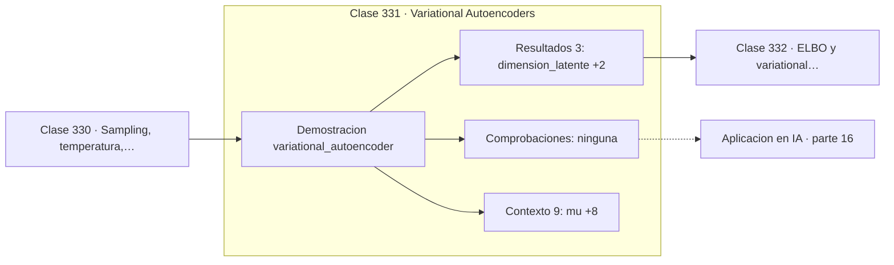

# 331 — Variational Autoencoders

> [⬅️ 330 Sampling, temperatura, top-k y top-p](../330-sampling-temperatura-top-k-y-top-p/README.md) · [📚 Parte 16](../README.md) · [🏠 Programa](../../../README.md) · [332 ELBO y variational inference ➡️](../332-elbo-y-variational-inference/README.md)

**Parte:** 16 — Matemática de Transformers, modelos generativos, grafos y RL · **Nivel:** `experto` · **Horas estimadas:** 4
**Motor:** `engines.part16` · **Demostración:** `variational_autoencoder` · **Clase 11 de 20** de la parte

---

## 🎯 Propósito

**No se puede derivar a través de un muestreo, y reparametrizar es la salida.**

Softmax, embeddings, positional encoding, atención escalada, multi-head, Transformer completo, muestreo, VAE, GAN, difusión, GNN y ecuaciones de Bellman.

## ✅ Resultados de aprendizaje

Al terminar podrás:

1. Explicar **Variational Autoencoders** con lenguaje cotidiano y con notación matemática.
2. Resolver un caso pequeño a mano y anticipar el orden de magnitud del resultado.
3. Ejecutar y modificar `lab.py`, que corre la demostración `variational_autoencoder`.
4. Interpretar las 12 salidas del laboratorio y decir qué comprueba cada una.
5. Detectar el error típico de esta parte: confundir temperatura alta con mayor calidad en lugar de mayor entropía.

## 🧩 Fórmulas de la clase

```text
codificador: x → (μ, log σ²)
reparametrización: z = μ + σ·ε,  ε ~ N(0,1)
KL en forma cerrada: ½·Σ(σ² + μ² − 1 − log σ²)
```

## 🗺️ Ubicación en el programa



## 📖 Fundamentos

Un autoencoder variacional codifica cada entrada no en un punto sino en una
**distribución** del espacio latente, muestrea de ella y decodifica. Esa aleatoriedad es
lo que hace del espacio latente algo continuo y muestreable, y lo que permite generar datos
nuevos en vez de solo reconstruir.

El problema técnico es que muestrear no es diferenciable: no hay forma de propagar el
gradiente a través de una operación aleatoria. El **truco de reparametrización** lo
resuelve moviendo la aleatoriedad fuera del camino del gradiente: se muestrea `ε` de una
normal estándar —que no depende de ningún parámetro— y se construye `z = μ + σ·ε`. Ahora
`z` es una función determinista y derivable de `μ` y `σ`.

Un detalle de implementación que conviene entender: la red predice `log σ²`, no `σ`. La
razón es doble: el logaritmo puede tomar cualquier valor real, con lo que no hay que
restringir la salida, y exponenciarlo garantiza que la varianza sea positiva sin
artificios.

El término **KL** entre la posterior aproximada y el prior normal estándar tiene forma
cerrada, lo que evita estimarlo por muestreo y reduce la varianza del gradiente. Ese
término empuja las distribuciones latentes hacia el prior, y su tensión con el término de
reconstrucción es lo que da al VAE su comportamiento característico: muestras suaves y algo
borrosas.

## 🧮 Ejemplo trabajado

Reparametrización en un espacio latente de dimensión 4.

```text
mu      = ( 0,5 ; −0,3 ;  0,8 ;  0,1)
log_var = (−0,5 ; −1,0 ; −0,2 ; −0,8)

sigma = exp(log_var/2)
      = (0,778801 ; 0,606531 ; 0,904837 ; 0,670320)

Muestreando z = mu + sigma·ε muchas veces:
  media empírica    = (0,5108 ; −0,2871 ; 0,7997 ; 0,0878)
  varianza empírica = (0,5910 ;  0,3745 ; 0,8373 ; 0,4378)

comprobación: sigma² = (0,6065 ; 0,3679 ; 0,8187 ; 0,4493)
coinciden con la varianza empírica                   ✓

La aleatoriedad está en ε, fuera del camino
del gradiente respecto de mu y sigma.
```

## 🔬 Qué ejecuta el laboratorio

`variational_autoencoder` — VAE: reparametrización y el término KL en forma cerrada.

| Grupo | Salidas |
|---|---|
| 🔢 Resultados numéricos (3) | `dimension_latente`, `KL(q||N(0,I))`, `KL_si_q=prior` |
| ✅ Comprobaciones de invariante (0) | — |

Las claves booleanas no son adorno: si alguna fuera `False`, el resultado numérico
no sería fiable aunque el programa terminase sin error.

```bash
python classes/part-16-matematica-de-transformers-modelos-generativos-grafos-y-rl/331-variational-autoencoders/lab.py
compmath run 331
```

> [!TIP]
> Antes de ejecutar, **escribe tu predicción**. Un laboratorio que confirma lo que
> esperabas enseña tanto como uno que te contradice, pero solo si la predicción
> existía antes del resultado.

## ⚠️ Errores conceptuales frecuentes

1. Muestrear directamente de la distribución y romper el gradiente.
2. Predecir sigma en vez de log sigma² y obtener varianzas negativas.
3. Desequilibrar reconstrucción y KL sin controlar el colapso de la posterior.

## 🚀 Dónde se usa de verdad

Generación de imágenes, aprendizaje de representaciones, detección de anomalías,
compresión con pérdida y espacios latentes para modelos de difusión.

## 🤖 Conexión con IA

Esta parte es la traducción matemática directa de los papers que definen el estado del arte actual.

## 📓 Notebooks

| Archivo | Para qué |
|---|---|
| [`notebook.ipynb`](notebook.ipynb) | recorrido guiado con la demostración ejecutada |
| [`notebook_student.ipynb`](notebook_student.ipynb) | versión con `TODO` para resolver |
| [`notebook_solution.ipynb`](notebook_solution.ipynb) | solución de referencia verificada |

## 📝 Evaluación

| Criterio | Peso |
|---|---:|
| Comprensión conceptual | 25 % |
| Resolución manual | 25 % |
| Implementación y verificación | 25 % |
| Interpretación y comunicación | 15 % |
| Conexión con aplicación real | 10 % |

Detalle y criterios de error crítico en [`assessment.md`](assessment.md).

## ❓ Preguntas de comprobación

1. ¿Cuál es la entrada, cuál la salida y qué unidades tienen?
2. ¿Qué operación domina el comportamiento del resultado?
3. ¿Qué caso extremo revelaría un error conceptual?
4. ¿Cómo verificarías el resultado por un método independiente?
5. ¿Dónde aparece esto en LLM?

Si necesitas releer el código para responderlas, la clase todavía no está superada.

## 📥 Entregable

`notebook_student.ipynb` resuelto más un párrafo que explique el resultado **sin citar
código**: qué entra, qué sale, qué invariante se comprueba y qué pasaría en un caso límite.

## 🔗 Referencias

- [Kingma, D.; Welling, M. *Auto-Encoding Variational Bayes*, ICLR, 2014](https://arxiv.org/abs/1312.6114) — *uso:* artículo de origen consultado en «Variational Autoencoders».
- [Doersch, C. *Tutorial on Variational Autoencoders*, 2016](https://arxiv.org/abs/1606.05908) — *uso:* artículo de origen consultado en «Variational Autoencoders».

Bibliografía completa de la parte en [`../../../docs/BIBLIOGRAPHY.md`](../../../docs/BIBLIOGRAPHY.md) · localizador verificable de cada obra en [`sources/bibliography.json`](../../../sources/bibliography.json).

## 📂 Material de la clase

[`intuition.md`](intuition.md) · [`theory.md`](theory.md) · [`derivation.md`](derivation.md) · [`exercises.md`](exercises.md) · [`assessment.md`](assessment.md) · [`where-is-this-used.md`](where-is-this-used.md) · [`lesson.yaml`](lesson.yaml)

---

> [⬅️ 330 Sampling, temperatura, top-k y top-p](../330-sampling-temperatura-top-k-y-top-p/README.md) · [📚 Parte 16](../README.md) · [🏠 Programa](../../../README.md) · [332 ELBO y variational inference ➡️](../332-elbo-y-variational-inference/README.md)
