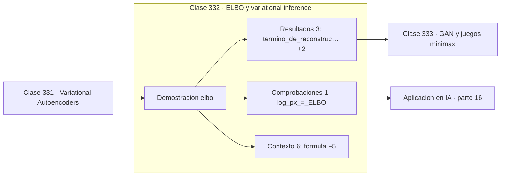

# 332 — ELBO y variational inference

> [⬅️ 331 Variational Autoencoders](../331-variational-autoencoders/README.md) · [📚 Parte 16](../README.md) · [🏠 Programa](../../../README.md) · [333 GAN y juegos minimax ➡️](../333-gan-y-juegos-minimax/README.md)

**Parte:** 16 — Matemática de Transformers, modelos generativos, grafos y RL · **Nivel:** `experto` · **Horas estimadas:** 4
**Motor:** `engines.part16` · **Demostración:** `elbo` · **Clase 12 de 20** de la parte

---

## 🎯 Propósito

**El ELBO acota la log-verosimilitud, y la brecha es exactamente otra KL.**

Softmax, embeddings, positional encoding, atención escalada, multi-head, Transformer completo, muestreo, VAE, GAN, difusión, GNN y ecuaciones de Bellman.

## ✅ Resultados de aprendizaje

Al terminar podrás:

1. Explicar **ELBO y variational inference** con lenguaje cotidiano y con notación matemática.
2. Resolver un caso pequeño a mano y anticipar el orden de magnitud del resultado.
3. Ejecutar y modificar `lab.py`, que corre la demostración `elbo`.
4. Interpretar las 10 salidas del laboratorio y decir qué comprueba cada una.
5. Detectar el error típico de esta parte: normalizar el laplaciano de un grafo con nodos aislados sin tratar la división por cero.

## 🧩 Fórmulas de la clase

```text
ELBO = E_q[log p(x|z)] − KL(q(z|x) ‖ p(z))
log p(x) = ELBO + KL(q(z|x) ‖ p(z|x))
la brecha es ≥ 0, luego log p(x) ≥ ELBO
```

## 🗺️ Ubicación en el programa



## 📖 Fundamentos

La log-verosimilitud de un modelo con variables latentes requiere integrar sobre todas las
configuraciones latentes posibles, y esa integral es intratable salvo en casos triviales.
La inferencia variacional sortea el problema optimizando una **cota inferior** en su lugar.

El ELBO tiene dos términos con lecturas claras. El de **reconstrucción** premia que el
decodificador recupere la entrada a partir del latente. El de **KL** penaliza que la
posterior aproximada se aleje del prior, actuando como regularizador del espacio latente.
Maximizar la suma equilibra fidelidad y estructura.

La identidad clave es que `log p(x)` es exactamente el ELBO **más** la KL entre la
posterior aproximada y la verdadera. Como toda KL es no negativa, el ELBO nunca supera la
log-verosimilitud, y maximizarlo hace dos cosas a la vez: sube la verosimilitud y acerca la
aproximación a la posterior real. Esa doble acción es lo elegante del método.

El ELBO es también el objeto que aparecía en el algoritmo EM de la clase 296. En EM el paso
E hace la cota exacta calculando la posterior verdadera; en inferencia variacional la
posterior no es tratable y la cota queda con holgura. Ver EM primero es lo que hace que el
ELBO no parezca una construcción sacada de la nada.

## 🧮 Ejemplo trabajado

Descomposición numérica del ELBO.

```text
término de reconstrucción: −12,4
término KL:                  3,7

ELBO = −12,4 − 3,7 = −16,1

Identidad:
  log p(x) = ELBO + KL(q(z|x) ‖ p(z|x))
           = −16,1 + brecha

Como la brecha es ≥ 0:
  log p(x) ≥ −16,1                                   ✓

Si la brecha fuera 0, la posterior aproximada
coincidiría con la verdadera y el ELBO sería exacto.

Maximizar el ELBO sube la verosimilitud y reduce
la brecha simultáneamente.
```

## 🔬 Qué ejecuta el laboratorio

`elbo` — ELBO: reconstrucción menos KL, y su relación con la log-verosimilitud.

| Grupo | Salidas |
|---|---|
| 🔢 Resultados numéricos (3) | `termino_de_reconstruccion`, `termino_KL`, `ELBO` |
| ✅ Comprobaciones de invariante (1) | `log_p(x)_>=_ELBO` |

Las claves booleanas no son adorno: si alguna fuera `False`, el resultado numérico
no sería fiable aunque el programa terminase sin error.

```bash
python classes/part-16-matematica-de-transformers-modelos-generativos-grafos-y-rl/332-elbo-y-variational-inference/lab.py
compmath run 332
```

> [!TIP]
> Antes de ejecutar, **escribe tu predicción**. Un laboratorio que confirma lo que
> esperabas enseña tanto como uno que te contradice, pero solo si la predicción
> existía antes del resultado.

## ⚠️ Errores conceptuales frecuentes

1. Confundir el ELBO con la log-verosimilitud exacta.
2. Interpretar la brecha como error del modelo en vez de error de la aproximación.
3. Comparar valores de ELBO entre modelos con distintas dimensiones latentes.

## 🚀 Dónde se usa de verdad

VAE, inferencia variacional en modelos bayesianos, modelos de difusión y aproximaciones
tratables de posteriores complejas.

## 🤖 Conexión con IA

Esta parte es la traducción matemática directa de los papers que definen el estado del arte actual.

## 📓 Notebooks

| Archivo | Para qué |
|---|---|
| [`notebook.ipynb`](notebook.ipynb) | recorrido guiado con la demostración ejecutada |
| [`notebook_student.ipynb`](notebook_student.ipynb) | versión con `TODO` para resolver |
| [`notebook_solution.ipynb`](notebook_solution.ipynb) | solución de referencia verificada |

## 📝 Evaluación

| Criterio | Peso |
|---|---:|
| Comprensión conceptual | 25 % |
| Resolución manual | 25 % |
| Implementación y verificación | 25 % |
| Interpretación y comunicación | 15 % |
| Conexión con aplicación real | 10 % |

Detalle y criterios de error crítico en [`assessment.md`](assessment.md).

## ❓ Preguntas de comprobación

1. ¿Cuál es la entrada, cuál la salida y qué unidades tienen?
2. ¿Qué operación domina el comportamiento del resultado?
3. ¿Qué caso extremo revelaría un error conceptual?
4. ¿Cómo verificarías el resultado por un método independiente?
5. ¿Dónde aparece esto en LLM?

Si necesitas releer el código para responderlas, la clase todavía no está superada.

## 📥 Entregable

`notebook_student.ipynb` resuelto más un párrafo que explique el resultado **sin citar
código**: qué entra, qué sale, qué invariante se comprueba y qué pasaría en un caso límite.

## 📚 Bibliografía de la clase

Esta clase enseña **Deep learning · Modelos de lenguaje · Modelos generativos · Aprendizaje por refuerzo · Grafos y redes**. Cada obra dice qué aporta aquí y cómo se comprobó su localizador:

- [Blei, D.; Kucukelbir, A.; McAuliffe, J. *Variational inference: a review for statisticians*, JASA, 2017](https://arxiv.org/abs/1601.00670) — Inferencia bayesiana y Machine learning: conexión declarada de esta parte · DOI `10.48550/arxiv.1601.00670` verificado en DataCite (2026-08-19).
- [Kingma, D.; Welling, M. *An Introduction to Variational Autoencoders*, 2019](https://arxiv.org/abs/1906.02691) — Modelos generativos: el tema de esta clase · DOI `10.48550/arxiv.1906.02691` verificado en DataCite (2026-08-19).

Bibliografía de todas las clases, con el porqué de cada obra, en [`docs/BIBLIOGRAPHY.md`](../../../docs/BIBLIOGRAPHY.md) · localizador y estado de cada obra en [`sources/bibliography.json`](../../../sources/bibliography.json).

## 📂 Material de la clase

[`intuition.md`](intuition.md) · [`theory.md`](theory.md) · [`derivation.md`](derivation.md) · [`exercises.md`](exercises.md) · [`assessment.md`](assessment.md) · [`where-is-this-used.md`](where-is-this-used.md) · [`lesson.yaml`](lesson.yaml)

---

> [⬅️ 331 Variational Autoencoders](../331-variational-autoencoders/README.md) · [📚 Parte 16](../README.md) · [🏠 Programa](../../../README.md) · [333 GAN y juegos minimax ➡️](../333-gan-y-juegos-minimax/README.md)
