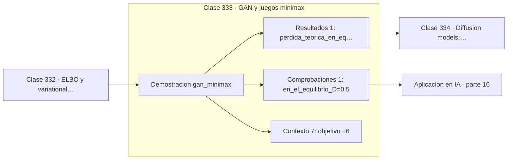

# 333 — GAN y juegos minimax

> [⬅️ 332 ELBO y variational inference](../332-elbo-y-variational-inference/README.md) · [📚 Parte 16](../README.md) · [🏠 Programa](../../../README.md) · [334 Diffusion models: forward process ➡️](../334-diffusion-models-forward-process/README.md)

**Parte:** 16 — Matemática de Transformers, modelos generativos, grafos y RL · **Nivel:** `experto` · **Horas estimadas:** 4
**Motor:** `engines.part16` · **Demostración:** `gan_minimax` · **Clase 13 de 20** de la parte

---

## 🎯 Propósito

**En el equilibrio de una GAN el discriminador acierta el 50 %: no distingue nada.**

Softmax, embeddings, positional encoding, atención escalada, multi-head, Transformer completo, muestreo, VAE, GAN, difusión, GNN y ecuaciones de Bellman.

## ✅ Resultados de aprendizaje

Al terminar podrás:

1. Explicar **GAN y juegos minimax** con lenguaje cotidiano y con notación matemática.
2. Resolver un caso pequeño a mano y anticipar el orden de magnitud del resultado.
3. Ejecutar y modificar `lab.py`, que corre la demostración `gan_minimax`.
4. Interpretar las 9 salidas del laboratorio y decir qué comprueba cada una.
5. Detectar el error típico de esta parte: olvidar la máscara causal en el modelado autoregresivo.

## 🧩 Fórmulas de la clase

```text
min_G max_D  E[log D(x)] + E[log(1 − D(G(z)))]
D*(x) = p_datos(x) / (p_datos(x) + p_G(x))
en el equilibrio D = 0,5 y la pérdida vale log 2
```

## 🗺️ Ubicación en el programa



## 📖 Fundamentos

Una GAN enfrenta dos redes con objetivos opuestos. El **generador** produce muestras
falsas intentando parecer real; el **discriminador** intenta distinguir reales de falsas. El
entrenamiento es un juego minimax, y el objetivo del generador es hacer fracasar al
discriminador.

El resultado teórico central es que el discriminador óptimo tiene **forma cerrada**: la
proporción de densidad real sobre densidad total. Sustituyendo ese óptimo en el objetivo, se
obtiene que el generador está minimizando `2·JS(p_datos ‖ p_G) − log 4`, es decir, la
divergencia de Jensen-Shannon de la clase 265. El objetivo de las GAN no se inventó como
divergencia: resulta serlo.

En el equilibrio ideal, generador y datos tienen la misma distribución, el discriminador
óptimo vale 0,5 en todas partes y la pérdida vale `log 2 ≈ 0,693`. Ese número es el
diagnóstico: una pérdida de discriminador que se estabiliza cerca de 0,693 indica
equilibrio; una que se va a cero indica que el discriminador ha ganado y el generador ya no
recibe señal útil.

La inestabilidad práctica tiene una causa identificable en esa misma teoría: si los
soportes de ambas distribuciones no se solapan, la JS es constante y su gradiente es cero.
Esa observación motivó **WGAN**, que sustituye JS por la distancia de Wasserstein,
precisamente porque esta sí da gradiente útil cuando los soportes están separados.

## 🧮 Ejemplo trabajado

Tres escenarios del juego y el punto de equilibrio.

```text
objetivo: min_G max_D E[log D(x)] + E[log(1 − D(G(z)))]

escenario "D gana":
  D(real) = 0,99    D(falso) = 0,01
  pérdida de D = 0,01005      muy baja
  el generador recibe gradiente casi nulo

escenario de equilibrio:
  D(real) = 0,50    D(falso) = 0,50
  pérdida teórica = log 2 = 0,693147                 ✓

D óptimo: D*(x) = p_datos / (p_datos + p_G)
  si p_G = p_datos  →  D* = 0,5 en todas partes

El objetivo original equivale a minimizar
2·JS(p_datos ‖ p_G) − log 4.
```

## 🔬 Qué ejecuta el laboratorio

`gan_minimax` — GAN: el equilibrio del juego minimax y su punto óptimo.

| Grupo | Salidas |
|---|---|
| 🔢 Resultados numéricos (1) | `perdida_teorica_en_equilibrio` |
| ✅ Comprobaciones de invariante (1) | `en_el_equilibrio_D=0.5` |

Las claves booleanas no son adorno: si alguna fuera `False`, el resultado numérico
no sería fiable aunque el programa terminase sin error.

```bash
python classes/part-16-matematica-de-transformers-modelos-generativos-grafos-y-rl/333-gan-y-juegos-minimax/lab.py
compmath run 333
```

> [!TIP]
> Antes de ejecutar, **escribe tu predicción**. Un laboratorio que confirma lo que
> esperabas enseña tanto como uno que te contradice, pero solo si la predicción
> existía antes del resultado.

## ⚠️ Errores conceptuales frecuentes

1. Entrenar el discriminador hasta la perfección y dejar al generador sin gradiente.
2. Interpretar una pérdida de discriminador cercana a cero como buena señal.
3. Ignorar el colapso de modos mirando solo las pérdidas.

## 🚀 Dónde se usa de verdad

Generación de imágenes, superresolución, traducción entre dominios, aumento de datos y
generación de datos sintéticos.

## 🤖 Conexión con IA

Esta parte es la traducción matemática directa de los papers que definen el estado del arte actual.

## 📓 Notebooks

| Archivo | Para qué |
|---|---|
| [`notebook.ipynb`](notebook.ipynb) | recorrido guiado con la demostración ejecutada |
| [`notebook_student.ipynb`](notebook_student.ipynb) | versión con `TODO` para resolver |
| [`notebook_solution.ipynb`](notebook_solution.ipynb) | solución de referencia verificada |

## 📝 Evaluación

| Criterio | Peso |
|---|---:|
| Comprensión conceptual | 25 % |
| Resolución manual | 25 % |
| Implementación y verificación | 25 % |
| Interpretación y comunicación | 15 % |
| Conexión con aplicación real | 10 % |

Detalle y criterios de error crítico en [`assessment.md`](assessment.md).

## ❓ Preguntas de comprobación

1. ¿Cuál es la entrada, cuál la salida y qué unidades tienen?
2. ¿Qué operación domina el comportamiento del resultado?
3. ¿Qué caso extremo revelaría un error conceptual?
4. ¿Cómo verificarías el resultado por un método independiente?
5. ¿Dónde aparece esto en LLM?

Si necesitas releer el código para responderlas, la clase todavía no está superada.

## 📥 Entregable

`notebook_student.ipynb` resuelto más un párrafo que explique el resultado **sin citar
código**: qué entra, qué sale, qué invariante se comprueba y qué pasaría en un caso límite.

## 🔗 Referencias

- [Goodfellow, I. et al. *Generative Adversarial Networks*, NeurIPS, 2014](https://arxiv.org/abs/1406.2661) — *uso:* artículo de origen consultado en «GAN y juegos minimax».
- [Arjovsky, M.; Chintala, S.; Bottou, L. *Wasserstein GAN*, ICML, 2017](https://arxiv.org/abs/1701.07875) — *uso:* artículo de origen consultado en «GAN y juegos minimax».

Bibliografía completa de la parte en [`../../../docs/BIBLIOGRAPHY.md`](../../../docs/BIBLIOGRAPHY.md) · localizador verificable de cada obra en [`sources/bibliography.json`](../../../sources/bibliography.json).

## 📂 Material de la clase

[`intuition.md`](intuition.md) · [`theory.md`](theory.md) · [`derivation.md`](derivation.md) · [`exercises.md`](exercises.md) · [`assessment.md`](assessment.md) · [`where-is-this-used.md`](where-is-this-used.md) · [`lesson.yaml`](lesson.yaml)

---

> [⬅️ 332 ELBO y variational inference](../332-elbo-y-variational-inference/README.md) · [📚 Parte 16](../README.md) · [🏠 Programa](../../../README.md) · [334 Diffusion models: forward process ➡️](../334-diffusion-models-forward-process/README.md)
