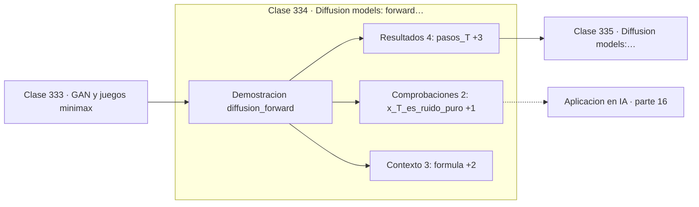

# 334 — Diffusion models: forward process

> [⬅️ 333 GAN y juegos minimax](../333-gan-y-juegos-minimax/README.md) · [📚 Parte 16](../README.md) · [🏠 Programa](../../../README.md) · [335 Diffusion models: reverse process ➡️](../335-diffusion-models-reverse-process/README.md)

**Parte:** 16 — Matemática de Transformers, modelos generativos, grafos y RL · **Nivel:** `experto` · **Horas estimadas:** 4
**Motor:** `engines.part16` · **Demostración:** `diffusion_forward` · **Clase 14 de 20** de la parte

---

## 🎯 Propósito

**El proceso directo permite saltar a cualquier paso sin simular los anteriores.**

Softmax, embeddings, positional encoding, atención escalada, multi-head, Transformer completo, muestreo, VAE, GAN, difusión, GNN y ecuaciones de Bellman.

## ✅ Resultados de aprendizaje

Al terminar podrás:

1. Explicar **Diffusion models: forward process** con lenguaje cotidiano y con notación matemática.
2. Resolver un caso pequeño a mano y anticipar el orden de magnitud del resultado.
3. Ejecutar y modificar `lab.py`, que corre la demostración `diffusion_forward`.
4. Interpretar las 9 salidas del laboratorio y decir qué comprueba cada una.
5. Detectar el error típico de esta parte: confundir temperatura alta con mayor calidad en lugar de mayor entropía.

## 🧩 Fórmulas de la clase

```text
x_t = √ᾱ_t·x₀ + √(1−ᾱ_t)·ε
ᾱ_t = Π_{s≤t} (1 − β_s)
horario β: de 1e-4 a 0,02
```

## 🗺️ Ubicación en el programa



## 📖 Fundamentos

El proceso directo de difusión destruye progresivamente una muestra añadiendo ruido
gaussiano según un horario fijo. Tras suficientes pasos, lo que queda es indistinguible de
ruido puro. Este proceso **no tiene parámetros aprendidos**: es una definición.

Su propiedad más importante es computacional. Como la composición de ruidos gaussianos es
gaussiana, existe una fórmula cerrada que da `x_t` directamente a partir de `x₀` **sin
simular los `t−1` pasos intermedios**. Sin ella, entrenar exigiría recorrer secuencialmente
hasta el paso deseado, y el coste sería prohibitivo.

Con esa fórmula, el entrenamiento es sencillo: se toma una muestra, se elige un `t` al
azar, se salta directamente a `x_t` y se pide a la red que prediga el ruido añadido. Cada
paso de entrenamiento cuesta lo mismo independientemente de `t`.

El **horario de ruido** —cómo crece `β` con `t`— resulta importar bastante. El horario
lineal original funciona, y los horarios coseno posteriores destruyen la información de
forma más gradual y mejoran la calidad. Es un ejemplo de hiperparámetro que parecía menor y
resultó tener efecto sustancial.

## 🧮 Ejemplo trabajado

Horario de 20 pasos y señal conservada.

```text
T = 20      β de 0,0001 a 0,02

 t     ᾱ_t        señal conservada
 0   0,999900         99,995 %
 5   0,98xxxx         ~99 %
10   0,94xxxx         ~97 %
15   0,879869         ~93,8 %
20   0,80xxxx         ~89 %

Fórmula: x_t = √ᾱ_t·x₀ + √(1−ᾱ_t)·ε

Con t = 15:
  √ᾱ = 0,938     √(1−ᾱ) = 0,347
  la señal aún domina sobre el ruido

Salto directo: para entrenar en t = 15 no hace falta
simular los 14 pasos anteriores.
```

## 🔬 Qué ejecuta el laboratorio

`diffusion_forward` — Proceso directo de difusión: ruido añadido con horario fijo.

| Grupo | Salidas |
|---|---|
| 🔢 Resultados numéricos (4) | `pasos_T`, `beta_inicial`, `beta_final`, `semilla` |
| ✅ Comprobaciones de invariante (2) | `x_T_es_ruido_puro`, `el_proceso_directo_no_se_aprende` |

Las claves booleanas no son adorno: si alguna fuera `False`, el resultado numérico
no sería fiable aunque el programa terminase sin error.

```bash
python classes/part-16-matematica-de-transformers-modelos-generativos-grafos-y-rl/334-diffusion-models-forward-process/lab.py
compmath run 334
```

> [!TIP]
> Antes de ejecutar, **escribe tu predicción**. Un laboratorio que confirma lo que
> esperabas enseña tanto como uno que te contradice, pero solo si la predicción
> existía antes del resultado.

## ⚠️ Errores conceptuales frecuentes

1. Simular paso a paso el proceso directo pudiendo saltar.
2. Usar un horario de ruido demasiado agresivo al principio.
3. Confundir β_t con ᾱ_t al implementar las fórmulas.

## 🚀 Dónde se usa de verdad

Stable Diffusion, DALL-E, generación de audio y vídeo, y modelos de difusión sobre datos
estructurados.

## 🤖 Conexión con IA

Esta parte es la traducción matemática directa de los papers que definen el estado del arte actual.

## 📓 Notebooks

| Archivo | Para qué |
|---|---|
| [`notebook.ipynb`](notebook.ipynb) | recorrido guiado con la demostración ejecutada |
| [`notebook_student.ipynb`](notebook_student.ipynb) | versión con `TODO` para resolver |
| [`notebook_solution.ipynb`](notebook_solution.ipynb) | solución de referencia verificada |

## 📝 Evaluación

| Criterio | Peso |
|---|---:|
| Comprensión conceptual | 25 % |
| Resolución manual | 25 % |
| Implementación y verificación | 25 % |
| Interpretación y comunicación | 15 % |
| Conexión con aplicación real | 10 % |

Detalle y criterios de error crítico en [`assessment.md`](assessment.md).

## ❓ Preguntas de comprobación

1. ¿Cuál es la entrada, cuál la salida y qué unidades tienen?
2. ¿Qué operación domina el comportamiento del resultado?
3. ¿Qué caso extremo revelaría un error conceptual?
4. ¿Cómo verificarías el resultado por un método independiente?
5. ¿Dónde aparece esto en LLM?

Si necesitas releer el código para responderlas, la clase todavía no está superada.

## 📥 Entregable

`notebook_student.ipynb` resuelto más un párrafo que explique el resultado **sin citar
código**: qué entra, qué sale, qué invariante se comprueba y qué pasaría en un caso límite.

## 📚 Bibliografía de la clase

Esta clase enseña **Deep learning · Modelos de lenguaje · Modelos generativos · Aprendizaje por refuerzo · Grafos y redes**. Cada obra dice qué aporta aquí y cómo se comprobó su localizador:

- [Ho, J.; Jain, A.; Abbeel, P. *Denoising Diffusion Probabilistic Models*, NeurIPS, 2020](https://arxiv.org/abs/2006.11239) — Deep learning y Modelos generativos: el tema de esta clase · DOI `10.48550/arxiv.2006.11239` verificado en DataCite (2026-08-19).
- [Nichol, A.; Dhariwal, P. *Improved Denoising Diffusion Probabilistic Models*, ICML, 2021](https://arxiv.org/abs/2102.09672) — Deep learning y Modelos generativos: el tema de esta clase · DOI `10.48550/arxiv.2102.09672` verificado en DataCite (2026-08-19).

Bibliografía de todas las clases, con el porqué de cada obra, en [`docs/BIBLIOGRAPHY.md`](../../../docs/BIBLIOGRAPHY.md) · localizador y estado de cada obra en [`sources/bibliography.json`](../../../sources/bibliography.json).

## 📂 Material de la clase

[`intuition.md`](intuition.md) · [`theory.md`](theory.md) · [`derivation.md`](derivation.md) · [`exercises.md`](exercises.md) · [`assessment.md`](assessment.md) · [`where-is-this-used.md`](where-is-this-used.md) · [`lesson.yaml`](lesson.yaml)

---

> [⬅️ 333 GAN y juegos minimax](../333-gan-y-juegos-minimax/README.md) · [📚 Parte 16](../README.md) · [🏠 Programa](../../../README.md) · [335 Diffusion models: reverse process ➡️](../335-diffusion-models-reverse-process/README.md)
