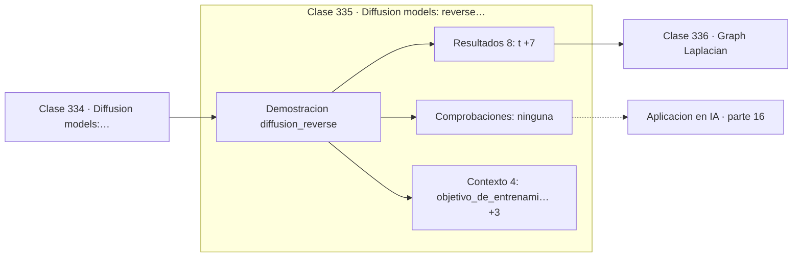

# 335 — Diffusion models: reverse process

> [⬅️ 334 Diffusion models: forward process](../334-diffusion-models-forward-process/README.md) · [📚 Parte 16](../README.md) · [🏠 Programa](../../../README.md) · [336 Graph Laplacian ➡️](../336-graph-laplacian/README.md)

**Parte:** 16 — Matemática de Transformers, modelos generativos, grafos y RL · **Nivel:** `experto` · **Horas estimadas:** 4
**Motor:** `engines.part16` · **Demostración:** `diffusion_reverse` · **Clase 15 de 20** de la parte

---

## 🎯 Propósito

**La red no genera la imagen: predice el ruido, y de ahí se despeja la imagen.**

Softmax, embeddings, positional encoding, atención escalada, multi-head, Transformer completo, muestreo, VAE, GAN, difusión, GNN y ecuaciones de Bellman.

## ✅ Resultados de aprendizaje

Al terminar podrás:

1. Explicar **Diffusion models: reverse process** con lenguaje cotidiano y con notación matemática.
2. Resolver un caso pequeño a mano y anticipar el orden de magnitud del resultado.
3. Ejecutar y modificar `lab.py`, que corre la demostración `diffusion_reverse`.
4. Interpretar las 12 salidas del laboratorio y decir qué comprueba cada una.
5. Detectar el error típico de esta parte: normalizar el laplaciano de un grafo con nodos aislados sin tratar la división por cero.

## 🧩 Fórmulas de la clase

```text
la red estima ε̂ = ε_θ(x_t, t)
x̂₀ = (x_t − √(1−ᾱ_t)·ε̂) / √ᾱ_t
pérdida: ‖ε − ε̂‖²
```

## 🗺️ Ubicación en el programa



## 📖 Fundamentos

El proceso inverso es donde está el aprendizaje. Dado un `x_t` ruidoso, una red predice
**qué ruido se añadió**, y despejando la fórmula del proceso directo se recupera una
estimación del dato original. Iterando ese paso desde ruido puro se genera una muestra
nueva.

Que la red prediga el ruido en vez de la imagen es una elección de parametrización, y
resultó funcionar mucho mejor. Son matemáticamente equivalentes —de una se despeja la
otra— pero predecir ruido da un objetivo mejor condicionado, con escala similar en todos
los pasos temporales, lo que estabiliza el entrenamiento.

La pérdida resultante es simplemente el error cuadrático entre el ruido real y el
predicho. Esa simplicidad es engañosa: la formulación completa parte de un ELBO como el de
la clase 332, y tras varias simplificaciones se reduce a este objetivo. La derivación es
laboriosa y el resultado es una línea de código.

El coste es el **número de pasos**. Los primeros modelos necesitaban mil evaluaciones de la
red por muestra, lo que hacía la generación lenta. Los muestreadores acelerados —DDIM,
DPM-Solver— reducen a decenas de pasos aplicando lo que la parte 11 enseña sobre
integradores: son métodos numéricos aplicados a la ecuación diferencial asociada al
proceso.

## 🧮 Ejemplo trabajado

Reconstrucción exacta con un modelo perfecto.

```text
t = 15        ᾱ_t = 0,87986861

x₀ real     =  1,000000
ruido real  = −0,198859
x_t         =  0,869089

Comprobación del proceso directo:
  √0,8799 · 1,0 + √0,1201 · (−0,198859)
  = 0,93800 − 0,06891 = 0,86909            ✓

Con un modelo perfecto (ε̂ = ε):
  x̂₀ = (0,869089 − 0,346554·(−0,198859)) / 0,937961
     = 1,000000                                      ✓

La red solo tiene que acertar el ruido;
la imagen se despeja algebraicamente.
```

## 🔬 Qué ejecuta el laboratorio

`diffusion_reverse` — Proceso inverso: la red predice el ruido y se reconstruye x₀.

| Grupo | Salidas |
|---|---|
| 🔢 Resultados numéricos (8) | `t`, `alpha_barra_t`, `x0_real`, `ruido_real`, `x_t`, `x0_estimado_con_modelo_perfecto`, `x0_estimado_con_error_0.1`, `amplificacion_del_error` |
| ✅ Comprobaciones de invariante (0) | — |

Las claves booleanas no son adorno: si alguna fuera `False`, el resultado numérico
no sería fiable aunque el programa terminase sin error.

```bash
python classes/part-16-matematica-de-transformers-modelos-generativos-grafos-y-rl/335-diffusion-models-reverse-process/lab.py
compmath run 335
```

> [!TIP]
> Antes de ejecutar, **escribe tu predicción**. Un laboratorio que confirma lo que
> esperabas enseña tanto como uno que te contradice, pero solo si la predicción
> existía antes del resultado.

## ⚠️ Errores conceptuales frecuentes

1. Parametrizar la red para predecir x₀ en vez del ruido sin justificarlo.
2. Usar mil pasos de muestreo existiendo muestreadores acelerados.
3. Olvidar condicionar la red en el paso temporal t.

## 🚀 Dónde se usa de verdad

Generación de imágenes, inpainting, superresolución, generación de audio y modelos
condicionados por texto.

## 🤖 Conexión con IA

Esta parte es la traducción matemática directa de los papers que definen el estado del arte actual.

## 📓 Notebooks

| Archivo | Para qué |
|---|---|
| [`notebook.ipynb`](notebook.ipynb) | recorrido guiado con la demostración ejecutada |
| [`notebook_student.ipynb`](notebook_student.ipynb) | versión con `TODO` para resolver |
| [`notebook_solution.ipynb`](notebook_solution.ipynb) | solución de referencia verificada |

## 📝 Evaluación

| Criterio | Peso |
|---|---:|
| Comprensión conceptual | 25 % |
| Resolución manual | 25 % |
| Implementación y verificación | 25 % |
| Interpretación y comunicación | 15 % |
| Conexión con aplicación real | 10 % |

Detalle y criterios de error crítico en [`assessment.md`](assessment.md).

## ❓ Preguntas de comprobación

1. ¿Cuál es la entrada, cuál la salida y qué unidades tienen?
2. ¿Qué operación domina el comportamiento del resultado?
3. ¿Qué caso extremo revelaría un error conceptual?
4. ¿Cómo verificarías el resultado por un método independiente?
5. ¿Dónde aparece esto en LLM?

Si necesitas releer el código para responderlas, la clase todavía no está superada.

## 📥 Entregable

`notebook_student.ipynb` resuelto más un párrafo que explique el resultado **sin citar
código**: qué entra, qué sale, qué invariante se comprueba y qué pasaría en un caso límite.

## 🔗 Referencias

- [Ho, J.; Jain, A.; Abbeel, P. *Denoising Diffusion Probabilistic Models*, NeurIPS, 2020](https://arxiv.org/abs/2006.11239)
- [Song, J.; Meng, C.; Ermon, S. *Denoising Diffusion Implicit Models*, ICLR, 2021](https://arxiv.org/abs/2010.02502)

Bibliografía completa de la parte en [`../../../docs/BIBLIOGRAPHY.md`](../../../docs/BIBLIOGRAPHY.md).

## 📂 Material de la clase

[`intuition.md`](intuition.md) · [`theory.md`](theory.md) · [`derivation.md`](derivation.md) · [`exercises.md`](exercises.md) · [`assessment.md`](assessment.md) · [`where-is-this-used.md`](where-is-this-used.md) · [`lesson.yaml`](lesson.yaml)

---

> [⬅️ 334 Diffusion models: forward process](../334-diffusion-models-forward-process/README.md) · [📚 Parte 16](../README.md) · [🏠 Programa](../../../README.md) · [336 Graph Laplacian ➡️](../336-graph-laplacian/README.md)
