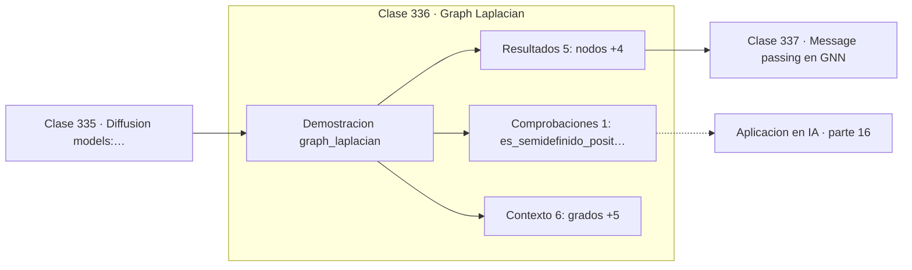

# 336 — Graph Laplacian

> [⬅️ 335 Diffusion models: reverse process](../335-diffusion-models-reverse-process/README.md) · [📚 Parte 16](../README.md) · [🏠 Programa](../../../README.md) · [337 Message passing en GNN ➡️](../337-message-passing-en-gnn/README.md)

**Parte:** 16 — Matemática de Transformers, modelos generativos, grafos y RL · **Nivel:** `experto` · **Horas estimadas:** 4
**Motor:** `engines.part16` · **Demostración:** `graph_laplacian` · **Clase 16 de 20** de la parte

---

## 🎯 Propósito

**La multiplicidad del autovalor cero del Laplaciano cuenta las componentes conexas.**

Softmax, embeddings, positional encoding, atención escalada, multi-head, Transformer completo, muestreo, VAE, GAN, difusión, GNN y ecuaciones de Bellman.

## ✅ Resultados de aprendizaje

Al terminar podrás:

1. Explicar **Graph Laplacian** con lenguaje cotidiano y con notación matemática.
2. Resolver un caso pequeño a mano y anticipar el orden de magnitud del resultado.
3. Ejecutar y modificar `lab.py`, que corre la demostración `graph_laplacian`.
4. Interpretar las 12 salidas del laboratorio y decir qué comprueba cada una.
5. Detectar el error típico de esta parte: olvidar la máscara causal en el modelado autoregresivo.

## 🧩 Fórmulas de la clase

```text
L = D − A
autovalores: 0 = λ₁ ≤ λ₂ ≤ … ≤ λₙ
λ₂ > 0 ⟺ el grafo es conexo
```

## 🗺️ Ubicación en el programa



## 📖 Fundamentos

El Laplaciano de un grafo se construye restando la matriz de adyacencia a la matriz
diagonal de grados. Pese a su simplicidad, su espectro contiene una cantidad notable de
información sobre la estructura, y ese es el objeto de la teoría espectral de grafos.

El autovalor **cero** está siempre presente, con el vector constante como autovector: es
inmediato comprobar que `L·1 = 0`. Lo interesante es su **multiplicidad**, que coincide
exactamente con el número de componentes conexas. Un grafo conexo tiene un único cero.

El segundo autovalor `λ₂` se llama **conectividad algebraica**, y mide cuán bien conectado
está el grafo: cerca de cero significa que hay un cuello de botella y el grafo está casi
partido en dos. Su autovector asociado, el vector de Fiedler, indica **por dónde** cortar, y
esa es la base del agrupamiento espectral.

Como `L` es simétrica y semidefinida positiva, todo el aparato del teorema espectral de la
parte 06 se aplica: autovalores reales no negativos y autovectores ortogonales. La versión
**normalizada** `D^{−1/2}·L·D^{−1/2}` acota los autovalores en `[0, 2]` y es la que usan las
redes convolucionales sobre grafos, con la precaución de tratar los nodos aislados para no
dividir por cero.

## 🧮 Ejemplo trabajado

Laplaciano de un grafo de cinco nodos.

```text
5 nodos, 6 aristas
grados: [3, 2, 3, 3, 1]

L = D − A:
  [ 3  −1  −1  −1   0]
  [−1   2  −1   0   0]
  [−1  −1   3  ...   ]
  [ ...                ]

autovalores:
  [0,0 ; 0,82991351 ; 2,68889218 ; 4,0 ; 4,4811943]

multiplicidad de 0: 1  →  grafo conexo             ✓
λ₂ = 0,83 > 0        →  confirma la conexión       ✓

Un λ₂ pequeño indicaría un cuello de botella,
y el vector de Fiedler diría por dónde cortarlo.
```

## 🔬 Qué ejecuta el laboratorio

`graph_laplacian` — Laplaciano del grafo: espectro y componentes conexas.

| Grupo | Salidas |
|---|---|
| 🔢 Resultados numéricos (5) | `nodos`, `aristas`, `autovalores_nulos`, `componentes_conexas`, `conectividad_algebraica_fiedler` |
| ✅ Comprobaciones de invariante (1) | `es_semidefinido_positivo` |

Las claves booleanas no son adorno: si alguna fuera `False`, el resultado numérico
no sería fiable aunque el programa terminase sin error.

```bash
python classes/part-16-matematica-de-transformers-modelos-generativos-grafos-y-rl/336-graph-laplacian/lab.py
compmath run 336
```

> [!TIP]
> Antes de ejecutar, **escribe tu predicción**. Un laboratorio que confirma lo que
> esperabas enseña tanto como uno que te contradice, pero solo si la predicción
> existía antes del resultado.

## ⚠️ Errores conceptuales frecuentes

1. Normalizar el Laplaciano sin tratar los nodos aislados y dividir por cero.
2. Confundir el Laplaciano con la matriz de adyacencia.
3. Interpretar λ₂ sin comprobar antes que el grafo es conexo.

## 🚀 Dónde se usa de verdad

Agrupamiento espectral, redes convolucionales sobre grafos, análisis de redes sociales,
partición de mallas y detección de comunidades.

## 🤖 Conexión con IA

Esta parte es la traducción matemática directa de los papers que definen el estado del arte actual.

## 📓 Notebooks

| Archivo | Para qué |
|---|---|
| [`notebook.ipynb`](notebook.ipynb) | recorrido guiado con la demostración ejecutada |
| [`notebook_student.ipynb`](notebook_student.ipynb) | versión con `TODO` para resolver |
| [`notebook_solution.ipynb`](notebook_solution.ipynb) | solución de referencia verificada |

## 📝 Evaluación

| Criterio | Peso |
|---|---:|
| Comprensión conceptual | 25 % |
| Resolución manual | 25 % |
| Implementación y verificación | 25 % |
| Interpretación y comunicación | 15 % |
| Conexión con aplicación real | 10 % |

Detalle y criterios de error crítico en [`assessment.md`](assessment.md).

## ❓ Preguntas de comprobación

1. ¿Cuál es la entrada, cuál la salida y qué unidades tienen?
2. ¿Qué operación domina el comportamiento del resultado?
3. ¿Qué caso extremo revelaría un error conceptual?
4. ¿Cómo verificarías el resultado por un método independiente?
5. ¿Dónde aparece esto en LLM?

Si necesitas releer el código para responderlas, la clase todavía no está superada.

## 📥 Entregable

`notebook_student.ipynb` resuelto más un párrafo que explique el resultado **sin citar
código**: qué entra, qué sale, qué invariante se comprueba y qué pasaría en un caso límite.

## 📚 Bibliografía de la clase

Esta clase enseña **Deep learning · Modelos de lenguaje · Modelos generativos · Aprendizaje por refuerzo · Grafos y redes**. Cada obra dice qué aporta aquí y cómo se comprobó su localizador:

- [Chung, F. *Spectral Graph Theory*, AMS, 1997](https://mathweb.ucsd.edu/~fan/research/revised.html) — Grafos y redes: el tema de esta clase · URL de la fuente primaria, pendiente de resolver.
- [von Luxburg, U. *A tutorial on spectral clustering*, Statistics and Computing, 2007](https://arxiv.org/abs/0711.0189) — Grafos y redes: el tema de esta clase · DOI `10.48550/arxiv.0711.0189` verificado en DataCite (2026-08-19).

Bibliografía de todas las clases, con el porqué de cada obra, en [`docs/BIBLIOGRAPHY.md`](../../../docs/BIBLIOGRAPHY.md) · localizador y estado de cada obra en [`sources/bibliography.json`](../../../sources/bibliography.json).

## 📂 Material de la clase

[`intuition.md`](intuition.md) · [`theory.md`](theory.md) · [`derivation.md`](derivation.md) · [`exercises.md`](exercises.md) · [`assessment.md`](assessment.md) · [`where-is-this-used.md`](where-is-this-used.md) · [`lesson.yaml`](lesson.yaml)

---

> [⬅️ 335 Diffusion models: reverse process](../335-diffusion-models-reverse-process/README.md) · [📚 Parte 16](../README.md) · [🏠 Programa](../../../README.md) · [337 Message passing en GNN ➡️](../337-message-passing-en-gnn/README.md)
