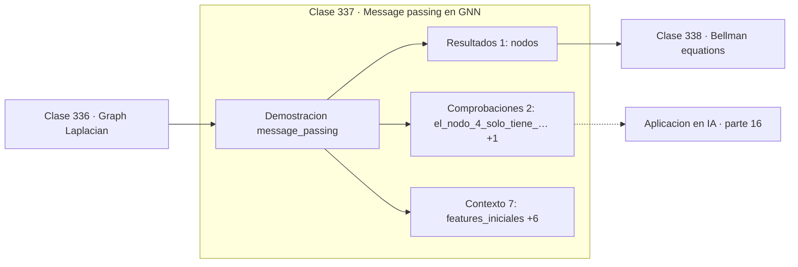

# 337 — Message passing en GNN

> [⬅️ 336 Graph Laplacian](../336-graph-laplacian/README.md) · [📚 Parte 16](../README.md) · [🏠 Programa](../../../README.md) · [338 Bellman equations ➡️](../338-bellman-equations/README.md)

**Parte:** 16 — Matemática de Transformers, modelos generativos, grafos y RL · **Nivel:** `experto` · **Horas estimadas:** 4
**Motor:** `engines.part16` · **Demostración:** `message_passing` · **Clase 17 de 20** de la parte

---

## 🎯 Propósito

**Una capa de paso de mensajes ve un salto; k capas ven un vecindario de radio k.**

Softmax, embeddings, positional encoding, atención escalada, multi-head, Transformer completo, muestreo, VAE, GAN, difusión, GNN y ecuaciones de Bellman.

## ✅ Resultados de aprendizaje

Al terminar podrás:

1. Explicar **Message passing en GNN** con lenguaje cotidiano y con notación matemática.
2. Resolver un caso pequeño a mano y anticipar el orden de magnitud del resultado.
3. Ejecutar y modificar `lab.py`, que corre la demostración `message_passing`.
4. Interpretar las 10 salidas del laboratorio y decir qué comprueba cada una.
5. Detectar el error típico de esta parte: confundir temperatura alta con mayor calidad en lugar de mayor entropía.

## 🧩 Fórmulas de la clase

```text
h_v^{(k+1)} = σ(Σ_{u∈N(v)∪{v}} w_{vu}·W·h_u^{(k)})
normalización GCN: D^{−1/2}(A+I)D^{−1/2}
campo receptivo tras k capas: radio k
```

## 🗺️ Ubicación en el programa



## 📖 Fundamentos

El paso de mensajes es el mecanismo central de las redes sobre grafos. En cada capa, cada
nodo recoge las representaciones de sus vecinos, las agrega y las combina con la suya para
producir una representación nueva. Repetir la operación propaga información cada vez más
lejos.

El paralelismo con las convoluciones de la parte 15 es exacto: **una capa equivale a un
salto**, y `k` capas dan un campo receptivo de radio `k`. La diferencia es que en una imagen
el vecindario es una rejilla regular y en un grafo es arbitrario, con nodos de grado 1 y de
grado 1000 en la misma red.

Esa irregularidad obliga a **normalizar**. Sin ella, un nodo con mil vecinos acumularía una
suma con escala completamente distinta a la de un nodo con dos, y las activaciones
quedarían descontroladas. La normalización simétrica `D^{−1/2}(A+I)D^{−1/2}` de las GCN
resuelve eso y además añade auto-lazos para que cada nodo conserve su propia información.

La limitación característica es el **sobresuavizado**: con muchas capas, las
representaciones de todos los nodos convergen a algo indistinguible, porque cada una acaba
siendo un promedio de casi todo el grafo. Por eso las GNN son típicamente poco profundas
—dos o tres capas— al contrario que las CNN, y por eso hay líneas de trabajo enteras
dedicadas a permitir GNN profundas.

## 🧮 Ejemplo trabajado

Dos capas de paso de mensajes sobre cinco nodos.

```text
características iniciales:
  [1,0  0,0]  [0,0  1,0]  [1,0  1,0]  [0,5  0,5]  [2,0  −1,0]

tras 1 capa:
  [0,625  0,663675]
  [0,577  0,622008]
  [0,625  0,663675]
  [1,332107  ...]

tras 2 capas:
  [0,812193  0,516758]
  [0,553294  0,590509]
  [0,812193  0,516758]

Los nodos 0 y 2 convergen a lo mismo: tienen
vecindarios equivalentes.

Campo receptivo tras k capas: vecindario de radio k.
Normalización: D^{−1/2}(A+I)D^{−1/2}, como en GCN.
```

## 🔬 Qué ejecuta el laboratorio

`message_passing` — Message passing: cada capa agrega información de un salto más lejos.

| Grupo | Salidas |
|---|---|
| 🔢 Resultados numéricos (1) | `nodos` |
| ✅ Comprobaciones de invariante (2) | `el_nodo_4_solo_tiene_1_vecino`, `permutacion_equivariante` |

Las claves booleanas no son adorno: si alguna fuera `False`, el resultado numérico
no sería fiable aunque el programa terminase sin error.

```bash
python classes/part-16-matematica-de-transformers-modelos-generativos-grafos-y-rl/337-message-passing-en-gnn/lab.py
compmath run 337
```

> [!TIP]
> Antes de ejecutar, **escribe tu predicción**. Un laboratorio que confirma lo que
> esperabas enseña tanto como uno que te contradice, pero solo si la predicción
> existía antes del resultado.

## ⚠️ Errores conceptuales frecuentes

1. Apilar muchas capas y provocar sobresuavizado.
2. Omitir la normalización por grado con grafos muy heterogéneos.
3. Olvidar los auto-lazos y perder la información propia del nodo.

## 🚀 Dónde se usa de verdad

Predicción molecular, sistemas de recomendación sobre grafos, análisis de redes sociales,
detección de fraude y simulación física con partículas.

## 🤖 Conexión con IA

Esta parte es la traducción matemática directa de los papers que definen el estado del arte actual.

## 📓 Notebooks

| Archivo | Para qué |
|---|---|
| [`notebook.ipynb`](notebook.ipynb) | recorrido guiado con la demostración ejecutada |
| [`notebook_student.ipynb`](notebook_student.ipynb) | versión con `TODO` para resolver |
| [`notebook_solution.ipynb`](notebook_solution.ipynb) | solución de referencia verificada |

## 📝 Evaluación

| Criterio | Peso |
|---|---:|
| Comprensión conceptual | 25 % |
| Resolución manual | 25 % |
| Implementación y verificación | 25 % |
| Interpretación y comunicación | 15 % |
| Conexión con aplicación real | 10 % |

Detalle y criterios de error crítico en [`assessment.md`](assessment.md).

## ❓ Preguntas de comprobación

1. ¿Cuál es la entrada, cuál la salida y qué unidades tienen?
2. ¿Qué operación domina el comportamiento del resultado?
3. ¿Qué caso extremo revelaría un error conceptual?
4. ¿Cómo verificarías el resultado por un método independiente?
5. ¿Dónde aparece esto en LLM?

Si necesitas releer el código para responderlas, la clase todavía no está superada.

## 📥 Entregable

`notebook_student.ipynb` resuelto más un párrafo que explique el resultado **sin citar
código**: qué entra, qué sale, qué invariante se comprueba y qué pasaría en un caso límite.

## 📚 Bibliografía de la clase

Esta clase enseña **Deep learning · Modelos de lenguaje · Modelos generativos · Aprendizaje por refuerzo · Grafos y redes**. Cada obra dice qué aporta aquí y cómo se comprobó su localizador:

- [Kipf, T.; Welling, M. *Semi-Supervised Classification with Graph Convolutional Networks*, ICLR, 2017](https://arxiv.org/abs/1609.02907) — Deep learning y Grafos y redes: el tema de esta clase · DOI `10.48550/arxiv.1609.02907` verificado en DataCite (2026-08-19).
- [Gilmer, J. et al. *Neural Message Passing for Quantum Chemistry*, ICML, 2017](https://arxiv.org/abs/1704.01212) — Deep learning y Grafos y redes: el tema de esta clase · DOI `10.48550/arxiv.1704.01212` verificado en DataCite (2026-08-19).

Bibliografía de todas las clases, con el porqué de cada obra, en [`docs/BIBLIOGRAPHY.md`](../../../docs/BIBLIOGRAPHY.md) · localizador y estado de cada obra en [`sources/bibliography.json`](../../../sources/bibliography.json).

## 📂 Material de la clase

[`intuition.md`](intuition.md) · [`theory.md`](theory.md) · [`derivation.md`](derivation.md) · [`exercises.md`](exercises.md) · [`assessment.md`](assessment.md) · [`where-is-this-used.md`](where-is-this-used.md) · [`lesson.yaml`](lesson.yaml)

---

> [⬅️ 336 Graph Laplacian](../336-graph-laplacian/README.md) · [📚 Parte 16](../README.md) · [🏠 Programa](../../../README.md) · [338 Bellman equations ➡️](../338-bellman-equations/README.md)
