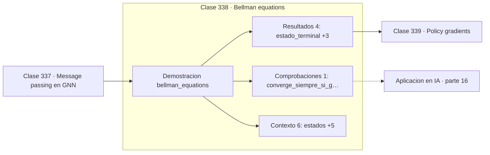

# 338 — Bellman equations

> [⬅️ 337 Message passing en GNN](../337-message-passing-en-gnn/README.md) · [📚 Parte 16](../README.md) · [🏠 Programa](../../../README.md) · [339 Policy gradients ➡️](../339-policy-gradients/README.md)

**Parte:** 16 — Matemática de Transformers, modelos generativos, grafos y RL · **Nivel:** `experto` · **Horas estimadas:** 4
**Motor:** `engines.part16` · **Demostración:** `bellman_equations` · **Clase 18 de 20** de la parte

---

## 🎯 Propósito

**El valor de un estado es la recompensa inmediata más el valor futuro descontado.**

Softmax, embeddings, positional encoding, atención escalada, multi-head, Transformer completo, muestreo, VAE, GAN, difusión, GNN y ecuaciones de Bellman.

## ✅ Resultados de aprendizaje

Al terminar podrás:

1. Explicar **Bellman equations** con lenguaje cotidiano y con notación matemática.
2. Resolver un caso pequeño a mano y anticipar el orden de magnitud del resultado.
3. Ejecutar y modificar `lab.py`, que corre la demostración `bellman_equations`.
4. Interpretar las 11 salidas del laboratorio y decir qué comprueba cada una.
5. Detectar el error típico de esta parte: normalizar el laplaciano de un grafo con nodos aislados sin tratar la división por cero.

## 🧩 Fórmulas de la clase

```text
V(s) = max_a [R(s,a) + γ·V(s')]
γ ∈ [0,1): factor de descuento
iteración de valor: aplicar la ecuación hasta converger
```

## 🗺️ Ubicación en el programa



## 📖 Fundamentos

La ecuación de Bellman descompone el valor de un estado en dos partes: lo que se obtiene
ahora y lo que se puede obtener después. Esa recursión es la base de todo el aprendizaje
por refuerzo y de buena parte de la programación dinámica.

El **factor de descuento** `γ` pondera el futuro. Con `γ` cercano a 0 el agente es
miope y solo persigue recompensa inmediata; con `γ` cercano a 1 planifica a largo plazo.
Además de reflejar una preferencia, tiene una función matemática: garantiza que la suma de
recompensas de un horizonte infinito converja.

La **iteración de valor** aplica la ecuación repetidamente hasta que los valores dejan de
cambiar. Converge siempre porque el operador de Bellman es una **contracción** con
constante `γ`: cada aplicación acerca la estimación al punto fijo en un factor `γ`. Es una
aplicación directa del teorema del punto fijo de Banach.

El límite es que exige conocer el modelo: las transiciones y las recompensas. Cuando no se
conocen —que es el caso interesante— aparecen los métodos libres de modelo como Q-learning,
que estiman lo mismo a partir de la experiencia. Y con espacios de estados enormes, la
tabla de valores se sustituye por una red neuronal, que es lo que hace DQN.

## 🧮 Ejemplo trabajado

Iteración de valor sobre un MDP de cuatro estados.

```text
estados: [0, 1, 2, 3]      terminal: 3      γ = 0,9

ecuación: V(s) = max_a [R(s,a) + γ·V(s')]

iter   V
  1    {0: 0,000, 1: 0,000, 2: 1,000, 3: 1,000}
  2    {0: 0,000, 1: 0,900, 2: 1,900, 3: 1,000}
  3    {0: 0,810, 1: 1,710, 2: 1,900, 3: 1,000}
final  {0: 1,539, 1: 1,710, 2: 1,900, 3: 1,000}

El valor se propaga hacia atrás desde el terminal,
un estado por iteración.

V(0) = 0,9 · V(1) = 0,9 · 1,71 = 1,539              ✓
```

## 🔬 Qué ejecuta el laboratorio

`bellman_equations` — Iteración de valor sobre un MDP pequeño.

| Grupo | Salidas |
|---|---|
| 🔢 Resultados numéricos (4) | `estado_terminal`, `gamma`, `iteraciones_hasta_converger`, `V(0)_teorico_gamma³` |
| ✅ Comprobaciones de invariante (1) | `converge_siempre_si_gamma<1` |

Las claves booleanas no son adorno: si alguna fuera `False`, el resultado numérico
no sería fiable aunque el programa terminase sin error.

```bash
python classes/part-16-matematica-de-transformers-modelos-generativos-grafos-y-rl/338-bellman-equations/lab.py
compmath run 338
```

> [!TIP]
> Antes de ejecutar, **escribe tu predicción**. Un laboratorio que confirma lo que
> esperabas enseña tanto como uno que te contradice, pero solo si la predicción
> existía antes del resultado.

## ⚠️ Errores conceptuales frecuentes

1. Usar γ = 1 con horizonte infinito y no converger.
2. Confundir la función de valor de estado con la de acción.
3. Aplicar iteración de valor sin conocer el modelo de transiciones.

## 🚀 Dónde se usa de verdad

Aprendizaje por refuerzo, planificación en robótica, control óptimo, juegos y toma de
decisiones secuenciales.

## 🤖 Conexión con IA

Esta parte es la traducción matemática directa de los papers que definen el estado del arte actual.

## 📓 Notebooks

| Archivo | Para qué |
|---|---|
| [`notebook.ipynb`](notebook.ipynb) | recorrido guiado con la demostración ejecutada |
| [`notebook_student.ipynb`](notebook_student.ipynb) | versión con `TODO` para resolver |
| [`notebook_solution.ipynb`](notebook_solution.ipynb) | solución de referencia verificada |

## 📝 Evaluación

| Criterio | Peso |
|---|---:|
| Comprensión conceptual | 25 % |
| Resolución manual | 25 % |
| Implementación y verificación | 25 % |
| Interpretación y comunicación | 15 % |
| Conexión con aplicación real | 10 % |

Detalle y criterios de error crítico en [`assessment.md`](assessment.md).

## ❓ Preguntas de comprobación

1. ¿Cuál es la entrada, cuál la salida y qué unidades tienen?
2. ¿Qué operación domina el comportamiento del resultado?
3. ¿Qué caso extremo revelaría un error conceptual?
4. ¿Cómo verificarías el resultado por un método independiente?
5. ¿Dónde aparece esto en LLM?

Si necesitas releer el código para responderlas, la clase todavía no está superada.

## 📥 Entregable

`notebook_student.ipynb` resuelto más un párrafo que explique el resultado **sin citar
código**: qué entra, qué sale, qué invariante se comprueba y qué pasaría en un caso límite.

## 🔗 Referencias

- [Sutton, R.; Barto, A. *Reinforcement Learning: An Introduction*, 2ª ed., MIT Press, 2018](http://incompleteideas.net/book/the-book.html) — *uso:* obra de referencia consultada en «Bellman equations».
- [Bellman, R. *Dynamic Programming*, Princeton University Press, 1957](https://press.princeton.edu/books/paperback/9780691146683/dynamic-programming) — *uso:* desarrollo formal del tema en «Bellman equations».

Bibliografía completa de la parte en [`../../../docs/BIBLIOGRAPHY.md`](../../../docs/BIBLIOGRAPHY.md) · localizador verificable de cada obra en [`sources/bibliography.json`](../../../sources/bibliography.json).

## 📂 Material de la clase

[`intuition.md`](intuition.md) · [`theory.md`](theory.md) · [`derivation.md`](derivation.md) · [`exercises.md`](exercises.md) · [`assessment.md`](assessment.md) · [`where-is-this-used.md`](where-is-this-used.md) · [`lesson.yaml`](lesson.yaml)

---

> [⬅️ 337 Message passing en GNN](../337-message-passing-en-gnn/README.md) · [📚 Parte 16](../README.md) · [🏠 Programa](../../../README.md) · [339 Policy gradients ➡️](../339-policy-gradients/README.md)
