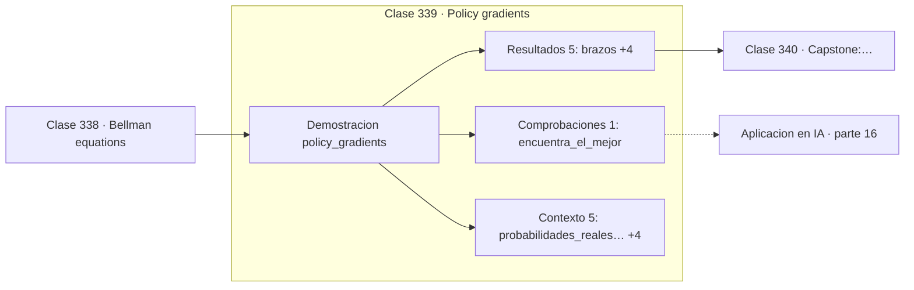

# 339 — Policy gradients

> [⬅️ 338 Bellman equations](../338-bellman-equations/README.md) · [📚 Parte 16](../README.md) · [🏠 Programa](../../../README.md) · [340 Capstone: mini-Transformer matemático ➡️](../340-capstone-mini-transformer-matematico/README.md)

**Parte:** 16 — Matemática de Transformers, modelos generativos, grafos y RL · **Nivel:** `experto` · **Horas estimadas:** 4
**Motor:** `engines.part16` · **Demostración:** `policy_gradients` · **Clase 19 de 20** de la parte

---

## 🎯 Propósito

**REINFORCE sube la probabilidad de lo que salió bien, y la línea base reduce la varianza.**

Softmax, embeddings, positional encoding, atención escalada, multi-head, Transformer completo, muestreo, VAE, GAN, difusión, GNN y ecuaciones de Bellman.

## ✅ Resultados de aprendizaje

Al terminar podrás:

1. Explicar **Policy gradients** con lenguaje cotidiano y con notación matemática.
2. Resolver un caso pequeño a mano y anticipar el orden de magnitud del resultado.
3. Ejecutar y modificar `lab.py`, que corre la demostración `policy_gradients`.
4. Interpretar las 11 salidas del laboratorio y decir qué comprueba cada una.
5. Detectar el error típico de esta parte: olvidar la máscara causal en el modelado autoregresivo.

## 🧩 Fórmulas de la clase

```text
∇J = E[∇log π(a|s) · (R − b)]
b es la línea base, típicamente el valor medio
restar b no sesga el gradiente
```

## 🗺️ Ubicación en el programa



## 📖 Fundamentos

Los métodos de gradiente de política optimizan directamente la política parametrizada, sin
pasar por una función de valor. La actualización tiene una lectura muy directa: aumentar la
log-probabilidad de las acciones que produjeron recompensa alta y disminuir la de las que
produjeron recompensa baja.

El problema del estimador básico es la **varianza**. La recompensa de un episodio depende de
muchas decisiones y de la aleatoriedad del entorno, así que el gradiente es muy ruidoso y
el aprendizaje, lento e inestable.

La **línea base** lo mitiga. Restar una cantidad que no depende de la acción —típicamente
el valor medio del estado— **no cambia la esperanza del gradiente** pero reduce mucho su
varianza. Es un resultado limpio: se gana estabilidad sin introducir sesgo. La diferencia
`R − b` se llama ventaja, y mide cuánto mejor fue la acción que la media.

De ahí sale toda la familia actor-crítico: el actor es la política, el crítico estima la
línea base, y ambos se entrenan a la vez. PPO, el algoritmo estándar hoy y el que se usa en
el ajuste por retroalimentación humana de los modelos de lenguaje, es un refinamiento de
esta idea con una restricción que impide que la política cambie demasiado en un solo paso.

## 🧮 Ejemplo trabajado

REINFORCE sobre un bandido de tres brazos.

```text
probabilidades reales de recompensa: [0,2 ; 0,5 ; 0,8]
mejor brazo: 2

episodio    política                    línea base
   1      [0,3222 ; 0,3222 ; 0,3557]      0,00
 100      [ ... ]                          ...
final     [0,004018 ; 0,014253 ; 0,981729]

brazo preferido: 2                                   ✓

La política converge al brazo correcto sin conocer
las probabilidades: solo por experiencia.

Sin línea base, la varianza del gradiente sería
mucho mayor y la convergencia más lenta.
```

## 🔬 Qué ejecuta el laboratorio

`policy_gradients` — REINFORCE: gradiente de la política sobre un bandido de 3 brazos.

| Grupo | Salidas |
|---|---|
| 🔢 Resultados numéricos (5) | `brazos`, `mejor_brazo`, `brazo_preferido`, `episodios`, `semilla` |
| ✅ Comprobaciones de invariante (1) | `encuentra_el_mejor` |

Las claves booleanas no son adorno: si alguna fuera `False`, el resultado numérico
no sería fiable aunque el programa terminase sin error.

```bash
python classes/part-16-matematica-de-transformers-modelos-generativos-grafos-y-rl/339-policy-gradients/lab.py
compmath run 339
```

> [!TIP]
> Antes de ejecutar, **escribe tu predicción**. Un laboratorio que confirma lo que
> esperabas enseña tanto como uno que te contradice, pero solo si la predicción
> existía antes del resultado.

## ⚠️ Errores conceptuales frecuentes

1. Usar REINFORCE sin línea base y sufrir varianza excesiva.
2. Elegir una línea base que depende de la acción e introducir sesgo.
3. Actualizar la política con pasos grandes y colapsar la exploración.

## 🚀 Dónde se usa de verdad

Aprendizaje por refuerzo, RLHF en modelos de lenguaje, robótica, optimización de sistemas
de diálogo y control continuo.

## 🤖 Conexión con IA

Esta parte es la traducción matemática directa de los papers que definen el estado del arte actual.

## 📓 Notebooks

| Archivo | Para qué |
|---|---|
| [`notebook.ipynb`](notebook.ipynb) | recorrido guiado con la demostración ejecutada |
| [`notebook_student.ipynb`](notebook_student.ipynb) | versión con `TODO` para resolver |
| [`notebook_solution.ipynb`](notebook_solution.ipynb) | solución de referencia verificada |

## 📝 Evaluación

| Criterio | Peso |
|---|---:|
| Comprensión conceptual | 25 % |
| Resolución manual | 25 % |
| Implementación y verificación | 25 % |
| Interpretación y comunicación | 15 % |
| Conexión con aplicación real | 10 % |

Detalle y criterios de error crítico en [`assessment.md`](assessment.md).

## ❓ Preguntas de comprobación

1. ¿Cuál es la entrada, cuál la salida y qué unidades tienen?
2. ¿Qué operación domina el comportamiento del resultado?
3. ¿Qué caso extremo revelaría un error conceptual?
4. ¿Cómo verificarías el resultado por un método independiente?
5. ¿Dónde aparece esto en LLM?

Si necesitas releer el código para responderlas, la clase todavía no está superada.

## 📥 Entregable

`notebook_student.ipynb` resuelto más un párrafo que explique el resultado **sin citar
código**: qué entra, qué sale, qué invariante se comprueba y qué pasaría en un caso límite.

## 🔗 Referencias

- [Williams, R. *Simple statistical gradient-following algorithms*, Machine Learning, 1992](https://doi.org/10.1007/BF00992696) — *uso:* artículo de origen consultado en «Policy gradients».
- [Schulman, J. et al. *Proximal Policy Optimization Algorithms*, 2017](https://arxiv.org/abs/1707.06347) — *uso:* artículo de origen consultado en «Policy gradients».

Bibliografía completa de la parte en [`../../../docs/BIBLIOGRAPHY.md`](../../../docs/BIBLIOGRAPHY.md) · localizador verificable de cada obra en [`sources/bibliography.json`](../../../sources/bibliography.json).

## 📂 Material de la clase

[`intuition.md`](intuition.md) · [`theory.md`](theory.md) · [`derivation.md`](derivation.md) · [`exercises.md`](exercises.md) · [`assessment.md`](assessment.md) · [`where-is-this-used.md`](where-is-this-used.md) · [`lesson.yaml`](lesson.yaml)

---

> [⬅️ 338 Bellman equations](../338-bellman-equations/README.md) · [📚 Parte 16](../README.md) · [🏠 Programa](../../../README.md) · [340 Capstone: mini-Transformer matemático ➡️](../340-capstone-mini-transformer-matematico/README.md)
