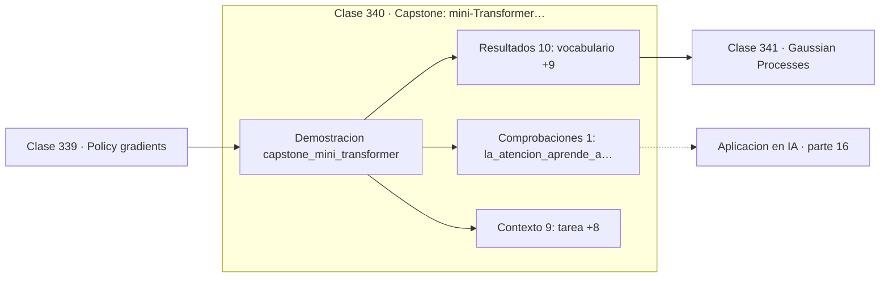

# 340 — Capstone: mini-Transformer matemático

> [⬅️ 339 Policy gradients](../339-policy-gradients/README.md) · [📚 Parte 16](../README.md) · [🏠 Programa](../../../README.md) · [341 Gaussian Processes ➡️](../../part-17-frontera-matematica-para-ia-e-investigacion/341-gaussian-processes/README.md)

**Parte:** 16 — Matemática de Transformers, modelos generativos, grafos y RL · **Nivel:** `experto` · **Horas estimadas:** 4
**Motor:** `engines.part16` · **Demostración:** `capstone_mini_transformer` · **Clase 20 de 20** de la parte

---

## 🎯 Propósito

**Un Transformer de 101 parámetros aprende a mirar exactamente una posición atrás.**

Softmax, embeddings, positional encoding, atención escalada, multi-head, Transformer completo, muestreo, VAE, GAN, difusión, GNN y ecuaciones de Bellman.

## ✅ Resultados de aprendizaje

Al terminar podrás:

1. Explicar **Capstone: mini-Transformer matemático** con lenguaje cotidiano y con notación matemática.
2. Resolver un caso pequeño a mano y anticipar el orden de magnitud del resultado.
3. Ejecutar y modificar `lab.py`, que corre la demostración `capstone_mini_transformer`.
4. Interpretar las 20 salidas del laboratorio y decir qué comprueba cada una.
5. Detectar el error típico de esta parte: confundir temperatura alta con mayor calidad en lugar de mayor entropía.

## 🧩 Fórmulas de la clase

```text
embedding + positional encoding → self-attention causal → salida
tarea: predecir el token anterior
verificación: la atención debe concentrarse en la posición i−1
```

## 🗺️ Ubicación en el programa



## 📖 Fundamentos

El capstone construye un Transformer causal completo con todos los componentes de la parte:
embedding aprendido, codificación posicional sinusoidal, self-attention con máscara causal
y proyección de salida. Son 101 parámetros y funciona.

La tarea elegida —predecir el token anterior— es deliberadamente trivial, y esa trivialidad
es lo valioso. Permite verificar el mecanismo de forma **directa**: si la atención funciona
como se ha descrito, la matriz de atención aprendida debe concentrar su masa en la posición
`i−1`. No hace falta confiar en una métrica agregada; se puede mirar la matriz.

El papel de la codificación posicional se vuelve evidente aquí. Sin ella el modelo no
podría resolver la tarea en absoluto, porque «el token anterior» es una noción puramente
posicional y la atención por sí sola es ciega al orden. Quitarla y ver el fallo es el
experimento de ablación más instructivo posible.

La distancia con un modelo real es de escala, no de concepto: los mismos componentes,
repetidos decenas de veces y con dimensiones mil veces mayores. Entender qué hace cada
pieza en 101 parámetros es lo que permite razonar sobre qué ocurre en 100 000 millones, y
cierra el recorrido que empezó contando con los dedos en la parte 00.

## 🧮 Ejemplo trabajado

Configuración del mini-Transformer.

```text
tarea: predecir el token anterior (copia desplazada)

vocabulario: 6
d_model: 8
longitud de secuencia: 5

componentes:
  embedding aprendido
  positional encoding sinusoidal
  self-attention causal
  proyección de salida

parámetros entrenados: 101

Verificación esperada:
  la matriz de atención debe concentrarse
  en la posición i−1 para cada token i

Ablación: sin positional encoding la tarea
es irresoluble, porque "anterior" es posicional.
```

## 🔬 Qué ejecuta el laboratorio

`capstone_mini_transformer` — Capstone: mini-Transformer que aprende a copiar el token anterior.

| Grupo | Salidas |
|---|---|
| 🔢 Resultados numéricos (10) | `vocabulario`, `d_model`, `longitud_de_secuencia`, `parametros_entrenados`, `ejemplos_train`, `ejemplos_test`, `accuracy_train`, `accuracy_test`, `linea_base_por_azar`, `semilla` |
| ✅ Comprobaciones de invariante (1) | `la_atencion_aprende_a_mirar_i-1` |

Las claves booleanas no son adorno: si alguna fuera `False`, el resultado numérico
no sería fiable aunque el programa terminase sin error.

```bash
python classes/part-16-matematica-de-transformers-modelos-generativos-grafos-y-rl/340-capstone-mini-transformer-matematico/lab.py
compmath run 340
```

> [!TIP]
> Antes de ejecutar, **escribe tu predicción**. Un laboratorio que confirma lo que
> esperabas enseña tanto como uno que te contradice, pero solo si la predicción
> existía antes del resultado.

## ⚠️ Errores conceptuales frecuentes

1. Evaluar solo la pérdida sin inspeccionar la matriz de atención.
2. Omitir la codificación posicional en tareas que dependen del orden.
3. Extrapolar conclusiones de un modelo de juguete a modelos de gran escala.

## 🚀 Dónde se usa de verdad

Comprensión profunda de los Transformers, interpretabilidad mecanicista, docencia,
entrevistas técnicas y depuración de implementaciones.

## 🤖 Conexión con IA

Esta parte es la traducción matemática directa de los papers que definen el estado del arte actual.

## 📓 Notebooks

| Archivo | Para qué |
|---|---|
| [`notebook.ipynb`](notebook.ipynb) | recorrido guiado con la demostración ejecutada |
| [`notebook_student.ipynb`](notebook_student.ipynb) | versión con `TODO` para resolver |
| [`notebook_solution.ipynb`](notebook_solution.ipynb) | solución de referencia verificada |

## 📝 Evaluación

| Criterio | Peso |
|---|---:|
| Comprensión conceptual | 25 % |
| Resolución manual | 25 % |
| Implementación y verificación | 25 % |
| Interpretación y comunicación | 15 % |
| Conexión con aplicación real | 10 % |

Detalle y criterios de error crítico en [`assessment.md`](assessment.md).

## ❓ Preguntas de comprobación

1. ¿Cuál es la entrada, cuál la salida y qué unidades tienen?
2. ¿Qué operación domina el comportamiento del resultado?
3. ¿Qué caso extremo revelaría un error conceptual?
4. ¿Cómo verificarías el resultado por un método independiente?
5. ¿Dónde aparece esto en LLM?

Si necesitas releer el código para responderlas, la clase todavía no está superada.

## 📥 Entregable

`notebook_student.ipynb` resuelto más un párrafo que explique el resultado **sin citar
código**: qué entra, qué sale, qué invariante se comprueba y qué pasaría en un caso límite.

## 🔗 Referencias

- [Vaswani, A. et al. *Attention Is All You Need*, NeurIPS, 2017](https://arxiv.org/abs/1706.03762)
- [Elhage, N. et al. *A Mathematical Framework for Transformer Circuits*, Anthropic, 2021](https://transformer-circuits.pub/2021/framework/index.html)

Bibliografía completa de la parte en [`../../../docs/BIBLIOGRAPHY.md`](../../../docs/BIBLIOGRAPHY.md).

## 📂 Material de la clase

[`intuition.md`](intuition.md) · [`theory.md`](theory.md) · [`derivation.md`](derivation.md) · [`exercises.md`](exercises.md) · [`assessment.md`](assessment.md) · [`where-is-this-used.md`](where-is-this-used.md) · [`lesson.yaml`](lesson.yaml)

---

> [⬅️ 339 Policy gradients](../339-policy-gradients/README.md) · [📚 Parte 16](../README.md) · [🏠 Programa](../../../README.md) · [341 Gaussian Processes ➡️](../../part-17-frontera-matematica-para-ia-e-investigacion/341-gaussian-processes/README.md)
