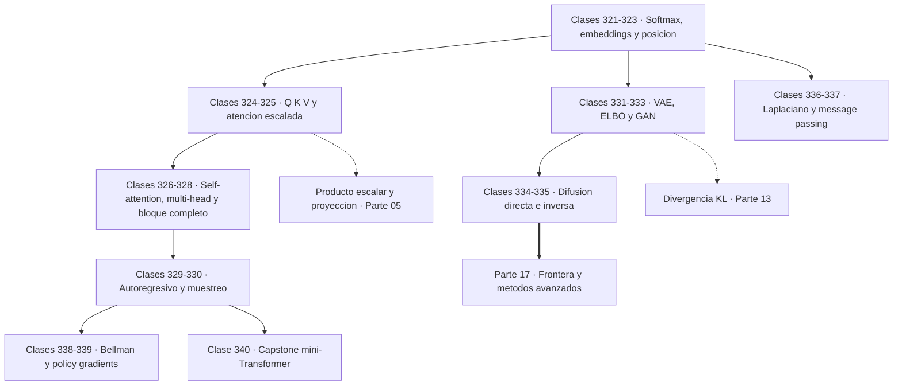

# 🛰️ Parte 16 — Matemática de Transformers, modelos generativos, grafos y RL

> [⬅️ Parte 15 — Matemática de Deep Learning](../part-15-matematica-de-deep-learning/README.md) · [🏠 Programa](../../README.md) · [📇 Catálogo](../README.md) · [Parte 17 — Frontera matemática para IA e investigación ➡️](../part-17-frontera-matematica-para-ia-e-investigacion/README.md)

**Nivel:** `experto` · **Clases:** 20 · **Horas estimadas:** 80 · **Motor:** [`part16.py`](../../src/computational_math/engines/part16.py)

---

## 🎯 De qué trata esta parte

Softmax, embeddings, positional encoding, atención escalada, multi-head, Transformer completo, muestreo, VAE, GAN, difusión, GNN y ecuaciones de Bellman.

Esta parte traduce a matemática los artículos que definen el estado del arte. No hay conceptos
nuevos: la atención es un promedio ponderado por productos escalares, el ELBO es la cota de
Jensen sobre una log-verosimilitud, la difusión es un proceso estocástico con reverso
aprendido y Bellman es una recursión sobre esperanzas. Todo lo necesario está en las quince
partes anteriores, y lo que se hace aquí es reconocerlo.

Las clases 321 a 328 construyen el Transformer pieza a pieza. **Softmax** convierte logits
arbitrarios en una distribución categórica, y su invariancia frente a desplazamientos es
exactamente lo que permite restar el máximo para evitar el desbordamiento: sin ese truco,
`exp(1000)` es infinito y la implementación falla. **Q, K y V** son tres proyecciones
distintas del mismo token, con papeles distintos: qué busco, qué ofrezco y qué aporto.

El detalle más citado y menos entendido es el `1/√d`. Con dimensión 256, los productos
escalares de vectores aleatorios tienen desviación proporcional a `√d`, y la softmax de
valores tan dispersos se satura: un peso se lleva casi toda la masa y los gradientes
desaparecen. Dividir por `√d` devuelve las puntuaciones a una escala manejable, y la
demostración numérica de la clase 325 lo hace evidente comparando `d = 8` con `d = 256`.

Las clases 329 y 330 tratan la generación. Un modelo autorregresivo factoriza la probabilidad
de una secuencia mediante la regla de la cadena de la clase 183, y **la máscara causal** es lo
que impide que un token vea el futuro: olvidarla produce un modelo con métricas excelentes
durante el entrenamiento e inútil al generar. Temperatura, top-k y top-p **reescriben la
distribución antes de muestrear**, y conviene tener claro que temperatura alta no significa
mayor calidad sino mayor entropía.

Las clases 331 a 335 recorren los modelos generativos. El **VAE** necesita el truco de
reparametrización para que el gradiente atraviese una operación de muestreo, y su objetivo es
el **ELBO**: reconstrucción menos KL, con una brecha respecto de la log-verosimilitud que es
exactamente otra KL, siempre no negativa. Las **GAN** se formulan como un juego minimax cuyo
discriminador óptimo tiene forma cerrada y cuyo equilibrio ocurre en `D = 0,5`. La **difusión**
añade ruido con un horario fijo —y una propiedad muy práctica: se puede saltar a cualquier
paso sin simular los anteriores— y aprende a invertir el proceso prediciendo el ruido añadido.

El cierre incorpora dos áreas más. Los **grafos**, donde el Laplaciano codifica la estructura y
la multiplicidad del autovalor cero cuenta las componentes conexas, y donde el paso de
mensajes hace crecer el campo receptivo un salto por capa, exactamente igual que las
convoluciones de la parte 15. Y el **aprendizaje por refuerzo**, donde la ecuación de Bellman
expresa el valor como recompensa inmediata más valor futuro descontado, y REINFORCE convierte
eso en un gradiente sobre la política.

El capstone entrena un mini-Transformer causal completo con 101 parámetros que aprende a
copiar el token anterior. Es una tarea trivial y elegida a propósito: permite comprobar que la
matriz de atención aprende a mirar exactamente una posición atrás, que es la verificación más
directa posible de que el mecanismo funciona como se ha descrito.

## 🗺️ Mapa conceptual



## 🧠 Ideas centrales

- La atención es un promedio ponderado por similitud, normalizado con softmax.
- La escala 1/√d evita que el producto punto sature la softmax en alta dimensión.
- Temperatura, top-k y top-p reescriben la distribución antes de muestrear.
- El ELBO acota inferiormente la log-verosimilitud con un término de reconstrucción y uno KL.
- Bellman expresa el valor como recompensa inmediata más valor futuro descontado.

## 🤖 Por qué importa en IA

> [!IMPORTANT]
> Esta parte es la traducción matemática directa de los papers que definen el estado del arte actual.

## ⚠️ Errores frecuentes de esta parte

- Olvidar la máscara causal en el modelado autoregresivo.
- Confundir temperatura alta con mayor calidad en lugar de mayor entropía.
- Normalizar el Laplaciano de un grafo con nodos aislados sin tratar la división por cero.

## 🧭 Secuencia de la parte

```mermaid
flowchart LR
    subgraph B1["Bloque 1"]
        direction TB
        L321["321 · Softmax y distribuciones…"]
        L322["322 · Embeddings y similitud coseno"]
        L323["323 · Positional encoding"]
        L324["324 · Query, Key y Value"]
        L325["325 · Scaled dot-product attention"]
        L321 --> L322
        L322 --> L323
        L323 --> L324
        L324 --> L325
    end
    subgraph B2["Bloque 2"]
        direction TB
        L326["326 · Self-attention"]
        L327["327 · Multi-head attention"]
        L328["328 · Transformer completo"]
        L329["329 · Modelado autoregresivo"]
        L330["330 · Sampling, temperatura, top-k…"]
        L326 --> L327
        L327 --> L328
        L328 --> L329
        L329 --> L330
    end
    subgraph B3["Bloque 3"]
        direction TB
        L331["331 · Variational Autoencoders"]
        L332["332 · ELBO y variational inference"]
        L333["333 · GAN y juegos minimax"]
        L334["334 · Diffusion models: forward…"]
        L335["335 · Diffusion models: reverse…"]
        L331 --> L332
        L332 --> L333
        L333 --> L334
        L334 --> L335
    end
    subgraph B4["Bloque 4"]
        direction TB
        L336["336 · Graph Laplacian"]
        L337["337 · Message passing en GNN"]
        L338["338 · Bellman equations"]
        L339["339 · Policy gradients"]
        L340["340 · Capstone: mini-Transformer…"]
        L336 --> L337
        L337 --> L338
        L338 --> L339
        L339 --> L340
    end
    L325 --> L326
    L330 --> L331
    L335 --> L336
```



## 📚 Las clases

| # | Clase | Demostración | Idea central |
|---|---|---|---|
| `321` | [Softmax y distribuciones categóricas](321-softmax-y-distribuciones-categoricas/README.md) | `softmax_distributions` | Restar el máximo antes de exponenciar no cambia el resultado y evita el desbordamiento. |
| `322` | [Embeddings y similitud coseno](322-embeddings-y-similitud-coseno/README.md) | `cosine_similarity` | El coseno ignora la magnitud, y en embeddings la magnitud suele ser frecuencia, no significado. |
| `323` | [Positional encoding](323-positional-encoding/README.md) | `positional_encoding` | La atención no tiene noción de orden, así que la posición hay que inyectarla. |
| `324` | [Query, Key y Value](324-query-key-y-value/README.md) | `query_key_value` | Q, K y V son tres proyecciones del mismo token con tres papeles distintos. |
| `325` | [Scaled dot-product attention](325-scaled-dot-product-attention/README.md) | `scaled_dot_product_attention` | Con d = 256 y sin escalar, la softmax se satura y el gradiente desaparece. |
| `326` | [Self-attention](326-self-attention/README.md) | `self_attention` | Sin máscara causal el modelo ve el futuro, entrena perfecto y genera basura. |
| `327` | [Multi-head attention](327-multi-head-attention/README.md) | `multi_head_attention` | Varias cabezas atienden a cosas distintas en subespacios distintos, al mismo coste. |
| `328` | [Transformer completo](328-transformer-completo/README.md) | `transformer_block` | El bloque es atención más feed-forward, cada uno envuelto en residual y normalización. |
| `329` | [Modelado autoregresivo](329-modelado-autoregresivo/README.md) | `autoregressive_modeling` | Un modelo de lenguaje es la regla de la cadena de la probabilidad, entrenada por verosimilitud. |
| `330` | [Sampling, temperatura, top-k y top-p](330-sampling-temperatura-top-k-y-top-p/README.md) | `sampling_strategies` | Temperatura alta no es más creatividad: es más entropía, y también más error. |
| `331` | [Variational Autoencoders](331-variational-autoencoders/README.md) | `variational_autoencoder` | No se puede derivar a través de un muestreo, y reparametrizar es la salida. |
| `332` | [ELBO y variational inference](332-elbo-y-variational-inference/README.md) | `elbo` | El ELBO acota la log-verosimilitud, y la brecha es exactamente otra KL. |
| `333` | [GAN y juegos minimax](333-gan-y-juegos-minimax/README.md) | `gan_minimax` | En el equilibrio de una GAN el discriminador acierta el 50 %: no distingue nada. |
| `334` | [Diffusion models: forward process](334-diffusion-models-forward-process/README.md) | `diffusion_forward` | El proceso directo permite saltar a cualquier paso sin simular los anteriores. |
| `335` | [Diffusion models: reverse process](335-diffusion-models-reverse-process/README.md) | `diffusion_reverse` | La red no genera la imagen: predice el ruido, y de ahí se despeja la imagen. |
| `336` | [Graph Laplacian](336-graph-laplacian/README.md) | `graph_laplacian` | La multiplicidad del autovalor cero del Laplaciano cuenta las componentes conexas. |
| `337` | [Message passing en GNN](337-message-passing-en-gnn/README.md) | `message_passing` | Una capa de paso de mensajes ve un salto; k capas ven un vecindario de radio k. |
| `338` | [Bellman equations](338-bellman-equations/README.md) | `bellman_equations` | El valor de un estado es la recompensa inmediata más el valor futuro descontado. |
| `339` | [Policy gradients](339-policy-gradients/README.md) | `policy_gradients` | REINFORCE sube la probabilidad de lo que salió bien, y la línea base reduce la varianza. |
| `340` | [Capstone: mini-Transformer matemático](340-capstone-mini-transformer-matematico/README.md) | `capstone_mini_transformer` | Un Transformer de 101 parámetros aprende a mirar exactamente una posición atrás. |

## 📖 Glosario de la parte (33 términos)

Definiciones precisas en [`GLOSARIO.md`](GLOSARIO.md).

## 🧰 Stack de referencia

`math`, `random`, `numpy (opcional)`

Los laboratorios se ejecutan con biblioteca estándar; estas herramientas aparecen
como contraste profesional, no como requisito.

## 🧪 Ejecutar toda la parte

```bash
compmath run --part 16
compmath catalog --part 16
```

## 📊 Evaluación de la parte

| Componente | Peso |
|---|---:|
| Clases y ejercicios | 40 % |
| Laboratorios y notebooks | 25 % |
| Explicación oral o escrita | 15 % |
| Capstone ([340](340-capstone-mini-transformer-matematico/README.md)) | 20 % |

## 📖 Bibliografía

Obras de referencia de la parte:

- Vaswani, A. et al. *Attention Is All You Need*. NeurIPS, 2017.
- Kingma, D.; Welling, M. *Auto-Encoding Variational Bayes*. ICLR, 2014.
- Ho, J.; Jain, A.; Abbeel, P. *Denoising Diffusion Probabilistic Models*. NeurIPS, 2020.
- Sutton, R.; Barto, A. *Reinforcement Learning: An Introduction*. 2ª ed., MIT Press, 2018.

Las 20 clases de esta parte citan 33 obras distintas. Cuál sostiene cada clase, y por qué, en [`docs/BIBLIOGRAPHY.md`](../../docs/BIBLIOGRAPHY.md#parte-16-matematica-de-transformers-modelos-generativos-grafos-y-rl).

---

> [⬅️ Parte 15 — Matemática de Deep Learning](../part-15-matematica-de-deep-learning/README.md) · [🏠 Programa](../../README.md) · [📇 Catálogo](../README.md) · [Parte 17 — Frontera matemática para IA e investigación ➡️](../part-17-frontera-matematica-para-ia-e-investigacion/README.md)
