# 🛰️ Parte 16 — Matemática de Transformers, modelos generativos, grafos y RL

> [⬅️ Parte 15 — Matemática de Deep Learning](../part-15-matematica-de-deep-learning/README.md) · [🏠 Programa](../../README.md) · [📇 Catálogo](../README.md) · [Parte 17 — Frontera matemática para IA e investigación ➡️](../part-17-frontera-matematica-para-ia-e-investigacion/README.md)

**Nivel:** `experto` · **Clases:** 20 · **Horas estimadas:** 80 · **Motor:** [`part16.py`](../../src/computational_math/engines/part16.py)

---

## 🎯 De qué trata esta parte

Softmax, embeddings, positional encoding, atención escalada, multi-head, Transformer completo, muestreo, VAE, GAN, difusión, GNN y ecuaciones de Bellman.

## 🧠 Ideas centrales

- La atención es un promedio ponderado por similitud, normalizado con softmax.
- La escala 1/√d evita que el producto punto sature la softmax en alta dimensión.
- Temperatura, top-k y top-p reescriben la distribución antes de muestrear.
- El ELBO acota inferiormente la log-verosimilitud con un término de reconstrucción y uno KL.
- Bellman expresa el valor como recompensa inmediata más valor futuro descontado.

## 🤖 Por qué importa en IA

> [!IMPORTANT]
> Esta parte es la traducción matemática directa de los papers que definen el estado del arte actual.

## ⚠️ Errores frecuentes de esta parte

- Olvidar la máscara causal en el modelado autoregresivo.
- Confundir temperatura alta con mayor calidad en lugar de mayor entropía.
- Normalizar el Laplaciano de un grafo con nodos aislados sin tratar la división por cero.

## 🧭 Secuencia de la parte

```mermaid
flowchart LR
    subgraph B1["Bloque 1"]
        direction TB
        L321["321<br/>Softmax y distribuciones<br/>categóricas"]
        L322["322<br/>Embeddings y similitud<br/>coseno"]
        L323["323<br/>Positional encoding"]
        L324["324<br/>Query, Key y Value"]
        L325["325<br/>Scaled dot-product<br/>attention"]
        L321 --> L322
        L322 --> L323
        L323 --> L324
        L324 --> L325
    end
    subgraph B2["Bloque 2"]
        direction TB
        L326["326<br/>Self-attention"]
        L327["327<br/>Multi-head attention"]
        L328["328<br/>Transformer completo"]
        L329["329<br/>Modelado autoregresivo"]
        L330["330<br/>Sampling, temperatura,<br/>top-k y top-p"]
        L326 --> L327
        L327 --> L328
        L328 --> L329
        L329 --> L330
    end
    subgraph B3["Bloque 3"]
        direction TB
        L331["331<br/>Variational Autoencoders"]
        L332["332<br/>ELBO y variational<br/>inference"]
        L333["333<br/>GAN y juegos minimax"]
        L334["334<br/>Diffusion models:<br/>forward process"]
        L335["335<br/>Diffusion models:<br/>reverse process"]
        L331 --> L332
        L332 --> L333
        L333 --> L334
        L334 --> L335
    end
    subgraph B4["Bloque 4"]
        direction TB
        L336["336<br/>Graph Laplacian"]
        L337["337<br/>Message passing en GNN"]
        L338["338<br/>Bellman equations"]
        L339["339<br/>Policy gradients"]
        L340["340<br/>Capstone:<br/>mini-Transformer<br/>matemático"]
        L336 --> L337
        L337 --> L338
        L338 --> L339
        L339 --> L340
    end
    L325 --> L326
    L330 --> L331
    L335 --> L336
```



## 📚 Las clases

| # | Clase | Demostración | Idea central |
|---|---|---|---|
| `321` | [Softmax y distribuciones categóricas](321-softmax-y-distribuciones-categoricas/README.md) | `softmax_distributions` | Softmax: de logits arbitrarios a una distribución categórica. |
| `322` | [Embeddings y similitud coseno](322-embeddings-y-similitud-coseno/README.md) | `cosine_similarity` | Similitud coseno: la métrica estándar entre embeddings. |
| `323` | [Positional encoding](323-positional-encoding/README.md) | `positional_encoding` | Positional encoding sinusoidal: posición sin parámetros aprendidos. |
| `324` | [Query, Key y Value](324-query-key-y-value/README.md) | `query_key_value` | Q, K, V: tres proyecciones distintas del mismo token. |
| `325` | [Scaled dot-product attention](325-scaled-dot-product-attention/README.md) | `scaled_dot_product_attention` | Atención escalada: por qué existe el 1/√d. |
| `326` | [Self-attention](326-self-attention/README.md) | `self_attention` | Self-attention completa sobre una secuencia de 4 tokens. |
| `327` | [Multi-head attention](327-multi-head-attention/README.md) | `multi_head_attention` | Multi-head: varias atenciones en subespacios distintos. |
| `328` | [Transformer completo](328-transformer-completo/README.md) | `transformer_block` | Bloque Transformer: atención, residual, layer norm y feed-forward. |
| `329` | [Modelado autoregresivo](329-modelado-autoregresivo/README.md) | `autoregressive_modeling` | Modelado autoregresivo: la regla de la cadena de la probabilidad. |
| `330` | [Sampling, temperatura, top-k y top-p](330-sampling-temperatura-top-k-y-top-p/README.md) | `sampling_strategies` | Temperatura, top-k y top-p reescriben la distribución antes de muestrear. |
| `331` | [Variational Autoencoders](331-variational-autoencoders/README.md) | `variational_autoencoder` | VAE: reparametrización y el término KL en forma cerrada. |
| `332` | [ELBO y variational inference](332-elbo-y-variational-inference/README.md) | `elbo` | ELBO: reconstrucción menos KL, y su relación con la log-verosimilitud. |
| `333` | [GAN y juegos minimax](333-gan-y-juegos-minimax/README.md) | `gan_minimax` | GAN: el equilibrio del juego minimax y su punto óptimo. |
| `334` | [Diffusion models: forward process](334-diffusion-models-forward-process/README.md) | `diffusion_forward` | Proceso directo de difusión: ruido añadido con horario fijo. |
| `335` | [Diffusion models: reverse process](335-diffusion-models-reverse-process/README.md) | `diffusion_reverse` | Proceso inverso: la red predice el ruido y se reconstruye x₀. |
| `336` | [Graph Laplacian](336-graph-laplacian/README.md) | `graph_laplacian` | Laplaciano del grafo: espectro y componentes conexas. |
| `337` | [Message passing en GNN](337-message-passing-en-gnn/README.md) | `message_passing` | Message passing: cada capa agrega información de un salto más lejos. |
| `338` | [Bellman equations](338-bellman-equations/README.md) | `bellman_equations` | Iteración de valor sobre un MDP pequeño. |
| `339` | [Policy gradients](339-policy-gradients/README.md) | `policy_gradients` | REINFORCE: gradiente de la política sobre un bandido de 3 brazos. |
| `340` | [Capstone: mini-Transformer matemático](340-capstone-mini-transformer-matematico/README.md) | `capstone_mini_transformer` | Capstone: mini-Transformer que aprende a copiar el token anterior. |

## 🧰 Stack de referencia

`math`, `random`, `numpy (opcional)`

Los laboratorios se ejecutan con biblioteca estándar; estas herramientas aparecen
como contraste profesional, no como requisito.

## 🧪 Ejecutar toda la parte

```bash
compmath run --part 16
compmath catalog --part 16
```

## 📊 Evaluación de la parte

| Componente | Peso |
|---|---:|
| Clases y ejercicios | 40 % |
| Laboratorios y notebooks | 25 % |
| Explicación oral o escrita | 15 % |
| Capstone ([340](340-capstone-mini-transformer-matematico/README.md)) | 20 % |

## 📖 Bibliografía

- Vaswani, A. et al. *Attention Is All You Need*. NeurIPS, 2017.
- Kingma, D.; Welling, M. *Auto-Encoding Variational Bayes*. ICLR, 2014.
- Ho, J.; Jain, A.; Abbeel, P. *Denoising Diffusion Probabilistic Models*. NeurIPS, 2020.
- Sutton, R.; Barto, A. *Reinforcement Learning: An Introduction*. 2ª ed., MIT Press, 2018.

---

> [⬅️ Parte 15 — Matemática de Deep Learning](../part-15-matematica-de-deep-learning/README.md) · [🏠 Programa](../../README.md) · [📇 Catálogo](../README.md) · [Parte 17 — Frontera matemática para IA e investigación ➡️](../part-17-frontera-matematica-para-ia-e-investigacion/README.md)
