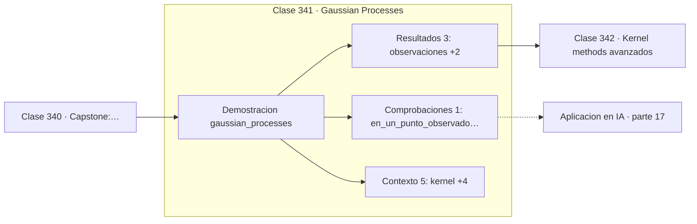

# 341 — Gaussian Processes

> [⬅️ 340 Capstone: mini-Transformer matemático](../../part-16-matematica-de-transformers-modelos-generativos-grafos-y-rl/340-capstone-mini-transformer-matematico/README.md) · [📚 Parte 17](../README.md) · [🏠 Programa](../../../README.md) · [342 Kernel methods avanzados ➡️](../342-kernel-methods-avanzados/README.md)

**Parte:** 17 — Frontera matemática para IA e investigación · **Nivel:** `frontera-investigacion` · **Horas estimadas:** 4
**Motor:** `engines.part17` · **Demostración:** `gaussian_processes` · **Clase 1 de 20** de la parte

---

## 🎯 Propósito

**Un proceso gaussiano distribuye sobre funciones, y su incertidumbre crece donde no hay datos.**

Procesos gaussianos, MCMC avanzado, inferencia variacional, transporte óptimo, geometría diferencial e informacional, SDE, Neural ODE, score matching y teoría del aprendizaje.

## ✅ Resultados de aprendizaje

Al terminar podrás:

1. Explicar **Gaussian Processes** con lenguaje cotidiano y con notación matemática.
2. Resolver un caso pequeño a mano y anticipar el orden de magnitud del resultado.
3. Ejecutar y modificar `lab.py`, que corre la demostración `gaussian_processes`.
4. Interpretar las 9 salidas del laboratorio y decir qué comprueba cada una.
5. Detectar el error típico de esta parte: reportar resultados de mcmc sin diagnóstico de convergencia.

## 🧩 Fórmulas de la clase

```text
f ~ GP(m(x), k(x,x'))
media posterior: K*ᵀ(K + σ²I)⁻¹y
varianza posterior: k** − K*ᵀ(K + σ²I)⁻¹K*
```

## 🗺️ Ubicación en el programa



## 📖 Fundamentos

Un proceso gaussiano cambia el objeto sobre el que se pone la distribución. En vez de
definir un modelo paramétrico y distribuir sobre sus parámetros, distribuye directamente
sobre **funciones**: cualquier conjunto finito de evaluaciones sigue una normal
multivariante determinada por el kernel.

Su propiedad más valiosa es que la **incertidumbre es honesta**. Cerca de un punto
observado la varianza posterior es casi nula, porque la función tiene que pasar por ahí;
lejos de todos los datos, vuelve a la varianza del prior. Ningún modelo paramétrico da eso
gratis, y es la razón de que los GP dominen la optimización bayesiana, donde hay que decidir
dónde explorar a continuación.

El precio es el coste. Invertir la matriz de covarianza cuesta `O(n³)` en tiempo y `O(n²)`
en memoria, lo que limita el método a unos miles de puntos sin aproximaciones. Las técnicas
de puntos inductores y los GP dispersos existen precisamente para sortear ese muro.

Una advertencia de implementación que no es opcional: la matriz de covarianza es
teóricamente definida positiva pero **numéricamente casi singular** cuando hay puntos
próximos. Sin sumar un pequeño **jitter** a la diagonal, la factorización de Cholesky
falla. Es el mismo problema de condicionamiento de la parte 11, y la solución es la misma
idea que Ridge: sumar `λI`.

## 🧮 Ejemplo trabajado

GP con kernel RBF sobre cinco observaciones.

```text
observaciones: 5      kernel: RBF con escala 1,0
ruido: 0,0001

predicción en x = −1,0:
  media = −0,841409
  desviación = 0,009999
  valor real de sin(−1) = −0,841471                  ✓

En un punto observado la varianza es mínima          ✓
Lejos de los datos la varianza vuelve al prior: 1,0

Esa es la propiedad clave: el modelo sabe
dónde no sabe.

Coste: invertir la covarianza es O(n³).
Con n = 10 000 ya es inviable sin aproximar.
```

## 🔬 Qué ejecuta el laboratorio

`gaussian_processes` — GP: distribución sobre funciones, con media y varianza posterior.

| Grupo | Salidas |
|---|---|
| 🔢 Resultados numéricos (3) | `observaciones`, `ruido`, `lejos_de_los_datos_vuelve_al_prior` |
| ✅ Comprobaciones de invariante (1) | `en_un_punto_observado_la_varianza_es_minima` |

Las claves booleanas no son adorno: si alguna fuera `False`, el resultado numérico
no sería fiable aunque el programa terminase sin error.

```bash
python classes/part-17-frontera-matematica-para-ia-e-investigacion/341-gaussian-processes/lab.py
compmath run 341
```

> [!TIP]
> Antes de ejecutar, **escribe tu predicción**. Un laboratorio que confirma lo que
> esperabas enseña tanto como uno que te contradice, pero solo si la predicción
> existía antes del resultado.

## ⚠️ Errores conceptuales frecuentes

1. Invertir la covarianza sin sumar jitter a la diagonal.
2. Aplicar GP exacto a decenas de miles de puntos.
3. Elegir el kernel sin considerar qué suavidad implica sobre las funciones.

## 🚀 Dónde se usa de verdad

Optimización bayesiana de hiperparámetros, regresión con incertidumbre calibrada,
geoestadística, diseño experimental y modelos sustitutos de simuladores costosos.

## 🤖 Conexión con IA

Score matching fundamenta los modelos de difusión; el transporte óptimo aparece en flow matching; la teoría estadística del aprendizaje explica el scaling.

## 📓 Notebooks

| Archivo | Para qué |
|---|---|
| [`notebook.ipynb`](notebook.ipynb) | recorrido guiado con la demostración ejecutada |
| [`notebook_student.ipynb`](notebook_student.ipynb) | versión con `TODO` para resolver |
| [`notebook_solution.ipynb`](notebook_solution.ipynb) | solución de referencia verificada |

## 📝 Evaluación

| Criterio | Peso |
|---|---:|
| Comprensión conceptual | 25 % |
| Resolución manual | 25 % |
| Implementación y verificación | 25 % |
| Interpretación y comunicación | 15 % |
| Conexión con aplicación real | 10 % |

Detalle y criterios de error crítico en [`assessment.md`](assessment.md).

## ❓ Preguntas de comprobación

1. ¿Cuál es la entrada, cuál la salida y qué unidades tienen?
2. ¿Qué operación domina el comportamiento del resultado?
3. ¿Qué caso extremo revelaría un error conceptual?
4. ¿Cómo verificarías el resultado por un método independiente?
5. ¿Dónde aparece esto en investigación aplicada?

Si necesitas releer el código para responderlas, la clase todavía no está superada.

## 📥 Entregable

`notebook_student.ipynb` resuelto más un párrafo que explique el resultado **sin citar
código**: qué entra, qué sale, qué invariante se comprueba y qué pasaría en un caso límite.

## 📚 Bibliografía de la clase

Esta clase enseña **Teoría del aprendizaje · Procesos gaussianos · Transporte óptimo · Geometría diferencial · Modelos generativos · Inferencia bayesiana · Procesos estocásticos**. Cada obra dice qué aporta aquí y cómo se comprobó su localizador:

- [Rasmussen, C.; Williams, C. *Gaussian Processes for Machine Learning*, MIT Press, 2006](https://gaussianprocess.org/gpml/) — Procesos gaussianos: el tema de esta clase · ISBN-13 `9781423769903` verificado en International ISBN Agency (2026-08-19).
- [Snoek, J.; Larochelle, H.; Adams, R. *Practical Bayesian Optimization*, NeurIPS, 2012](https://arxiv.org/abs/1206.2944) — Procesos gaussianos: el tema de esta clase · DOI `10.48550/arxiv.1206.2944` verificado en DataCite (2026-08-19).

Bibliografía de todas las clases, con el porqué de cada obra, en [`docs/BIBLIOGRAPHY.md`](../../../docs/BIBLIOGRAPHY.md) · localizador y estado de cada obra en [`sources/bibliography.json`](../../../sources/bibliography.json).

## 📂 Material de la clase

[`intuition.md`](intuition.md) · [`theory.md`](theory.md) · [`derivation.md`](derivation.md) · [`exercises.md`](exercises.md) · [`assessment.md`](assessment.md) · [`where-is-this-used.md`](where-is-this-used.md) · [`lesson.yaml`](lesson.yaml)

---

> [⬅️ 340 Capstone: mini-Transformer matemático](../../part-16-matematica-de-transformers-modelos-generativos-grafos-y-rl/340-capstone-mini-transformer-matematico/README.md) · [📚 Parte 17](../README.md) · [🏠 Programa](../../../README.md) · [342 Kernel methods avanzados ➡️](../342-kernel-methods-avanzados/README.md)
