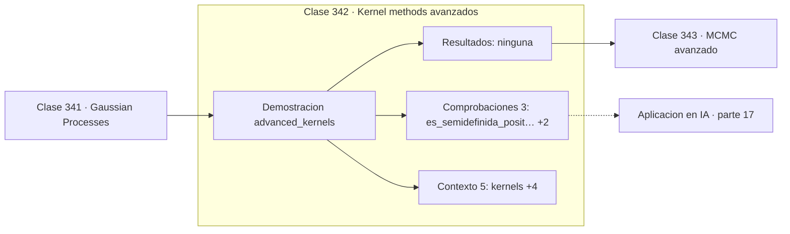

# 342 — Kernel methods avanzados

> [⬅️ 341 Gaussian Processes](../341-gaussian-processes/README.md) · [📚 Parte 17](../README.md) · [🏠 Programa](../../../README.md) · [343 MCMC avanzado ➡️](../343-mcmc-avanzado/README.md)

**Parte:** 17 — Frontera matemática para IA e investigación · **Nivel:** `frontera-investigacion` · **Horas estimadas:** 4
**Motor:** `engines.part17` · **Demostración:** `advanced_kernels` · **Clase 2 de 20** de la parte

---

## 🎯 Propósito

**Una función es kernel válido si y solo si su matriz de Gram es siempre semidefinida positiva.**

Procesos gaussianos, MCMC avanzado, inferencia variacional, transporte óptimo, geometría diferencial e informacional, SDE, Neural ODE, score matching y teoría del aprendizaje.

## ✅ Resultados de aprendizaje

Al terminar podrás:

1. Explicar **Kernel methods avanzados** con lenguaje cotidiano y con notación matemática.
2. Resolver un caso pequeño a mano y anticipar el orden de magnitud del resultado.
3. Ejecutar y modificar `lab.py`, que corre la demostración `advanced_kernels`.
4. Interpretar las 8 salidas del laboratorio y decir qué comprueba cada una.
5. Detectar el error típico de esta parte: invertir una matriz de covarianza sin jitter numérico.

## 🧩 Fórmulas de la clase

```text
K(a,b) = φ(a)ᵀφ(b) para alguna φ
Mercer: matriz de Gram semidefinida positiva
suma y producto de kernels son kernels
```

## 🗺️ Ubicación en el programa



## 📖 Fundamentos

Un kernel codifica una noción de similitud, y elegirlo es elegir qué se considera parecido.
Cada familia impone supuestos distintos sobre las funciones que el modelo puede
representar, y esos supuestos son la parte del modelado que realmente importa.

El **RBF** o gaussiano supone funciones infinitamente suaves y decae con la distancia; es
el punto de partida razonable. El **polinómico** captura interacciones de grado fijo. La
familia **Matérn** es más flexible: su parámetro controla la suavidad, y Matérn 3/2 o 5/2
suelen ajustarse mejor a datos reales que el RBF, que a menudo es demasiado suave.

La **condición de Mercer** caracteriza qué funciones son kernels legítimos: aquellas cuya
matriz de Gram es semidefinida positiva para cualquier conjunto de puntos. Esa condición
garantiza que existe un espacio de características —posiblemente de dimensión infinita—
donde el kernel es el producto escalar, y es lo que hace válido el truco de la clase 290.

Las **reglas de composición** permiten construir kernels a medida sin verificar Mercer cada
vez: sumas, productos y escalados de kernels válidos siguen siendo válidos. Con eso se
combinan estructuras —periodicidad más tendencia más ruido— de forma modular, que es como
se modelan series temporales complejas con GP.

## 🧮 Ejemplo trabajado

Cuatro kernels y la verificación de Mercer.

```text
valores sobre un mismo par de puntos:
  RBF                  0,32465247
  polinómico grado 3  42,87500000
  Matérn 3/2           0,26770000

matriz de Gram del RBF (4 puntos):
  [1,000000  0,882497  0,606531  0,324652]
  [0,882497  1,000000  0,882497  0,606531]
  [ ...                                  ]

autovalores:
  [3,11850065 ; 0,78879628 ; 0,08864872 ; 0,00405435]

todos ≥ 0  →  semidefinida positiva                  ✓
cumple Mercer                                        ✓

El menor autovalor es 0,004: casi singular.
Sin jitter, Cholesky fallaría.
```

## 🔬 Qué ejecuta el laboratorio

`advanced_kernels` — Familias de kernels y la condición de Mercer.

| Grupo | Salidas |
|---|---|
| 🔢 Resultados numéricos (0) | — |
| ✅ Comprobaciones de invariante (3) | `es_semidefinida_positiva`, `suma_de_kernels_es_kernel`, `producto_de_kernels_es_kernel` |

Las claves booleanas no son adorno: si alguna fuera `False`, el resultado numérico
no sería fiable aunque el programa terminase sin error.

```bash
python classes/part-17-frontera-matematica-para-ia-e-investigacion/342-kernel-methods-avanzados/lab.py
compmath run 342
```

> [!TIP]
> Antes de ejecutar, **escribe tu predicción**. Un laboratorio que confirma lo que
> esperabas enseña tanto como uno que te contradice, pero solo si la predicción
> existía antes del resultado.

## ⚠️ Errores conceptuales frecuentes

1. Usar como kernel una función que no cumple Mercer.
2. Elegir RBF por defecto cuando los datos no son tan suaves.
3. Combinar kernels sin normalizar sus escalas.

## 🚀 Dónde se usa de verdad

Procesos gaussianos, SVM no lineales, PCA con kernel, modelado de series temporales
estructuradas y comparación de objetos complejos.

## 🤖 Conexión con IA

Score matching fundamenta los modelos de difusión; el transporte óptimo aparece en flow matching; la teoría estadística del aprendizaje explica el scaling.

## 📓 Notebooks

| Archivo | Para qué |
|---|---|
| [`notebook.ipynb`](notebook.ipynb) | recorrido guiado con la demostración ejecutada |
| [`notebook_student.ipynb`](notebook_student.ipynb) | versión con `TODO` para resolver |
| [`notebook_solution.ipynb`](notebook_solution.ipynb) | solución de referencia verificada |

## 📝 Evaluación

| Criterio | Peso |
|---|---:|
| Comprensión conceptual | 25 % |
| Resolución manual | 25 % |
| Implementación y verificación | 25 % |
| Interpretación y comunicación | 15 % |
| Conexión con aplicación real | 10 % |

Detalle y criterios de error crítico en [`assessment.md`](assessment.md).

## ❓ Preguntas de comprobación

1. ¿Cuál es la entrada, cuál la salida y qué unidades tienen?
2. ¿Qué operación domina el comportamiento del resultado?
3. ¿Qué caso extremo revelaría un error conceptual?
4. ¿Cómo verificarías el resultado por un método independiente?
5. ¿Dónde aparece esto en investigación aplicada?

Si necesitas releer el código para responderlas, la clase todavía no está superada.

## 📥 Entregable

`notebook_student.ipynb` resuelto más un párrafo que explique el resultado **sin citar
código**: qué entra, qué sale, qué invariante se comprueba y qué pasaría en un caso límite.

## 🔗 Referencias

- [Schölkopf, B.; Smola, A. *Learning with Kernels*, MIT Press, 2002](https://mitpress.mit.edu/9780262536578/learning-with-kernels/) — *uso:* desarrollo formal del tema en «Kernel methods avanzados».
- [Duvenaud, D. *Automatic Model Construction with Gaussian Processes*, tesis, 2014](https://www.cs.toronto.edu/~duvenaud/thesis.pdf) — *uso:* obra de referencia consultada en «Kernel methods avanzados».

Bibliografía completa de la parte en [`../../../docs/BIBLIOGRAPHY.md`](../../../docs/BIBLIOGRAPHY.md) · localizador verificable de cada obra en [`sources/bibliography.json`](../../../sources/bibliography.json).

## 📂 Material de la clase

[`intuition.md`](intuition.md) · [`theory.md`](theory.md) · [`derivation.md`](derivation.md) · [`exercises.md`](exercises.md) · [`assessment.md`](assessment.md) · [`where-is-this-used.md`](where-is-this-used.md) · [`lesson.yaml`](lesson.yaml)

---

> [⬅️ 341 Gaussian Processes](../341-gaussian-processes/README.md) · [📚 Parte 17](../README.md) · [🏠 Programa](../../../README.md) · [343 MCMC avanzado ➡️](../343-mcmc-avanzado/README.md)
