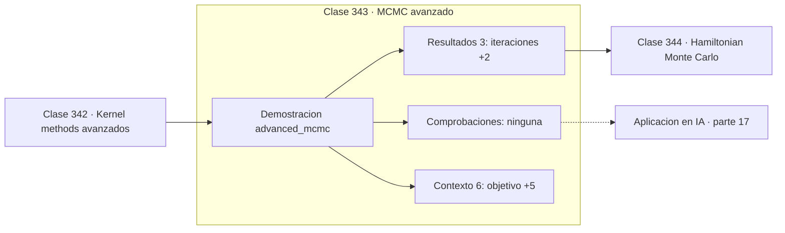

# 343 — MCMC avanzado

> [⬅️ 342 Kernel methods avanzados](../342-kernel-methods-avanzados/README.md) · [📚 Parte 17](../README.md) · [🏠 Programa](../../../README.md) · [344 Hamiltonian Monte Carlo ➡️](../344-hamiltonian-monte-carlo/README.md)

**Parte:** 17 — Frontera matemática para IA e investigación · **Nivel:** `frontera-investigacion` · **Horas estimadas:** 4
**Motor:** `engines.part17` · **Demostración:** `advanced_mcmc` · **Clase 3 de 20** de la parte

---

## 🎯 Propósito

**Aceptar el 95 % de las propuestas no es buena señal: significa que no se explora.**

Procesos gaussianos, MCMC avanzado, inferencia variacional, transporte óptimo, geometría diferencial e informacional, SDE, Neural ODE, score matching y teoría del aprendizaje.

## ✅ Resultados de aprendizaje

Al terminar podrás:

1. Explicar **MCMC avanzado** con lenguaje cotidiano y con notación matemática.
2. Resolver un caso pequeño a mano y anticipar el orden de magnitud del resultado.
3. Ejecutar y modificar `lab.py`, que corre la demostración `advanced_mcmc`.
4. Interpretar las 9 salidas del laboratorio y decir qué comprueba cada una.
5. Detectar el error típico de esta parte: interpretar una cota teórica como predicción del error real.

## 🧩 Fórmulas de la clase

```text
aceptar con probabilidad min(1, p(x')/p(x))
tasa óptima en 1D ≈ 0,44
descartar el burn-in antes de estimar
```

## 🗺️ Ubicación en el programa



## 📖 Fundamentos

Metropolis-Hastings genera muestras de una distribución conocida solo hasta una constante,
que es la situación habitual en inferencia bayesiana: la posterior se conoce salvo por la
evidencia, que es una integral intratable. El algoritmo propone un estado y lo acepta con
probabilidad proporcional a la razón de densidades, en la que la constante se cancela.

El **tamaño del paso** de la propuesta controla todo el comportamiento, y sus dos extremos
son igual de malos. Un paso pequeño acepta casi todas las propuestas pero se mueve muy
despacio, produciendo muestras fuertemente autocorrelacionadas que aportan poca información
nueva. Un paso grande propone estados improbables que se rechazan, y la cadena se queda
quieta.

La teoría da un objetivo concreto: la tasa óptima de aceptación en una dimensión ronda
**0,44**, y en dimensiones altas converge a 0,234. Una tasa del 95 % no indica un buen
muestreador sino un paso demasiado tímido, y es un error de lectura frecuente.

Ningún resultado MCMC debe reportarse sin **diagnóstico**. Descartar el burn-in inicial,
examinar la autocorrelación, calcular el tamaño de muestra efectivo y ejecutar varias
cadenas comprobando el estadístico R̂ son pasos obligatorios. Una cadena que no ha
convergido produce números perfectamente plausibles y completamente equivocados.

## 🧮 Ejemplo trabajado

Efecto del tamaño de paso sobre la exploración.

```text
objetivo: Normal(2,0 ; 1,5)
8 000 iteraciones, burn-in 2 000

paso = 0,2:
  tasa de aceptación: 0,9547
  media estimada: 2,4552          error 0,455
  acepta casi todo pero explora muy despacio         ✗

paso óptimo (tasa ≈ 0,44):
  media estimada mucho más cercana a 2,0

Tasa óptima teórica:
  1 dimensión:     0,44
  alta dimensión:  0,234

Una tasa alta no es buena señal: es síntoma
de que la cadena apenas se mueve.
```

## 🔬 Qué ejecuta el laboratorio

`advanced_mcmc` — Metropolis-Hastings con diagnóstico de aceptación y autocorrelación.

| Grupo | Salidas |
|---|---|
| 🔢 Resultados numéricos (3) | `iteraciones`, `burn_in`, `semilla` |
| ✅ Comprobaciones de invariante (0) | — |

Las claves booleanas no son adorno: si alguna fuera `False`, el resultado numérico
no sería fiable aunque el programa terminase sin error.

```bash
python classes/part-17-frontera-matematica-para-ia-e-investigacion/343-mcmc-avanzado/lab.py
compmath run 343
```

> [!TIP]
> Antes de ejecutar, **escribe tu predicción**. Un laboratorio que confirma lo que
> esperabas enseña tanto como uno que te contradice, pero solo si la predicción
> existía antes del resultado.

## ⚠️ Errores conceptuales frecuentes

1. Interpretar una tasa de aceptación alta como buena convergencia.
2. Reportar resultados MCMC sin diagnóstico ni burn-in.
3. Ejecutar una sola cadena y no poder calcular R̂.

## 🚀 Dónde se usa de verdad

Inferencia bayesiana con posteriores complejas, física estadística, modelos jerárquicos y
cuantificación de incertidumbre.

## 🤖 Conexión con IA

Score matching fundamenta los modelos de difusión; el transporte óptimo aparece en flow matching; la teoría estadística del aprendizaje explica el scaling.

## 📓 Notebooks

| Archivo | Para qué |
|---|---|
| [`notebook.ipynb`](notebook.ipynb) | recorrido guiado con la demostración ejecutada |
| [`notebook_student.ipynb`](notebook_student.ipynb) | versión con `TODO` para resolver |
| [`notebook_solution.ipynb`](notebook_solution.ipynb) | solución de referencia verificada |

## 📝 Evaluación

| Criterio | Peso |
|---|---:|
| Comprensión conceptual | 25 % |
| Resolución manual | 25 % |
| Implementación y verificación | 25 % |
| Interpretación y comunicación | 15 % |
| Conexión con aplicación real | 10 % |

Detalle y criterios de error crítico en [`assessment.md`](assessment.md).

## ❓ Preguntas de comprobación

1. ¿Cuál es la entrada, cuál la salida y qué unidades tienen?
2. ¿Qué operación domina el comportamiento del resultado?
3. ¿Qué caso extremo revelaría un error conceptual?
4. ¿Cómo verificarías el resultado por un método independiente?
5. ¿Dónde aparece esto en investigación aplicada?

Si necesitas releer el código para responderlas, la clase todavía no está superada.

## 📥 Entregable

`notebook_student.ipynb` resuelto más un párrafo que explique el resultado **sin citar
código**: qué entra, qué sale, qué invariante se comprueba y qué pasaría en un caso límite.

## 📚 Bibliografía de la clase

Esta clase enseña **Teoría del aprendizaje · Procesos gaussianos · Transporte óptimo · Geometría diferencial · Modelos generativos · Inferencia bayesiana · Procesos estocásticos**. Cada obra dice qué aporta aquí y cómo se comprobó su localizador:

- [Brooks, S. et al. *Handbook of Markov Chain Monte Carlo*, CRC, 2011](https://doi.org/10.1201/b10905) — Inferencia bayesiana: el tema de esta clase · DOI `10.1201/b10905` verificado en Crossref (2026-08-19).
- [Gelman, A. et al. *Bayesian Data Analysis*, 3ª ed., CRC, 2013](https://www.stat.columbia.edu/~gelman/book/) — Inferencia bayesiana: el tema de esta clase · ISBN-13 `9781439840955` verificado en International ISBN Agency (2026-08-19).

Bibliografía de todas las clases, con el porqué de cada obra, en [`docs/BIBLIOGRAPHY.md`](../../../docs/BIBLIOGRAPHY.md) · localizador y estado de cada obra en [`sources/bibliography.json`](../../../sources/bibliography.json).

## 📂 Material de la clase

[`intuition.md`](intuition.md) · [`theory.md`](theory.md) · [`derivation.md`](derivation.md) · [`exercises.md`](exercises.md) · [`assessment.md`](assessment.md) · [`where-is-this-used.md`](where-is-this-used.md) · [`lesson.yaml`](lesson.yaml)

---

> [⬅️ 342 Kernel methods avanzados](../342-kernel-methods-avanzados/README.md) · [📚 Parte 17](../README.md) · [🏠 Programa](../../../README.md) · [344 Hamiltonian Monte Carlo ➡️](../344-hamiltonian-monte-carlo/README.md)
