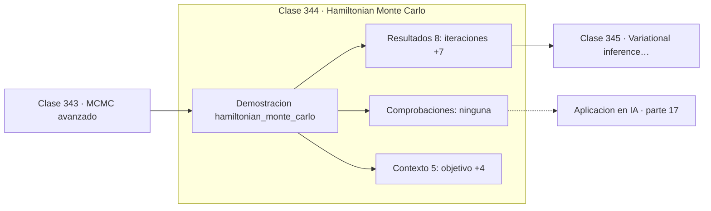

# 344 — Hamiltonian Monte Carlo

> [⬅️ 343 MCMC avanzado](../343-mcmc-avanzado/README.md) · [📚 Parte 17](../README.md) · [🏠 Programa](../../../README.md) · [345 Variational inference avanzada ➡️](../345-variational-inference-avanzada/README.md)

**Parte:** 17 — Frontera matemática para IA e investigación · **Nivel:** `frontera-investigacion` · **Horas estimadas:** 4
**Motor:** `engines.part17` · **Demostración:** `hamiltonian_monte_carlo` · **Clase 4 de 20** de la parte

---

## 🎯 Propósito

**Con gradientes se proponen estados lejanos que se aceptan el 99,8 % de las veces.**

Procesos gaussianos, MCMC avanzado, inferencia variacional, transporte óptimo, geometría diferencial e informacional, SDE, Neural ODE, score matching y teoría del aprendizaje.

## ✅ Resultados de aprendizaje

Al terminar podrás:

1. Explicar **Hamiltonian Monte Carlo** con lenguaje cotidiano y con notación matemática.
2. Resolver un caso pequeño a mano y anticipar el orden de magnitud del resultado.
3. Ejecutar y modificar `lab.py`, que corre la demostración `hamiltonian_monte_carlo`.
4. Interpretar las 13 salidas del laboratorio y decir qué comprueba cada una.
5. Detectar el error típico de esta parte: reportar resultados de mcmc sin diagnóstico de convergencia.

## 🧩 Fórmulas de la clase

```text
energía: H(q,p) = −log p(q) + ‖p‖²/2
integrador leapfrog, simpléctico
aceptación basada en la conservación de H
```

## 🗺️ Ubicación en el programa



## 📖 Fundamentos

Hamiltonian Monte Carlo sustituye la propuesta aleatoria por una simulación de dinámica
física. Se interpreta el logaritmo negativo de la densidad como una energía potencial, se
añade una variable de momento con energía cinética, y se simula el movimiento de una
partícula en ese paisaje.

La ventaja es que la partícula **sigue el gradiente** y se desplaza a regiones lejanas que
conservan alta densidad. Donde Metropolis-Hastings tantea a ciegas y rechaza a menudo, HMC
propone estados informados y los acepta casi siempre. En el ejemplo, la tasa de aceptación
es del 99,8 % con propuestas mucho más lejanas.

El integrador tiene que ser **simpléctico**, y por eso se usa leapfrog y no Euler. Un
integrador simpléctico conserva el volumen del espacio de fases, lo que es exactamente la
condición que hace válida la propuesta reversible. Con un integrador cualquiera, la cadena
no muestrearía la distribución correcta. Es un caso donde la elección del método numérico
de la parte 11 no es una cuestión de precisión sino de corrección.

Sus dos hiperparámetros —el tamaño de paso y el número de saltos de leapfrog— son delicados
de ajustar, y **NUTS** los adapta automáticamente. Esa es la razón de que HMC y NUTS sean
hoy el motor por defecto de Stan, PyMC y NumPyro. Su límite es que exige gradientes, y por
tanto no sirve con parámetros discretos.

## 🧮 Ejemplo trabajado

HMC frente a random walk sobre el mismo objetivo.

```text
objetivo: Normal(2,0 ; 1,5)
3 000 iteraciones
step size ε = 0,35      pasos de leapfrog: 12

tasa de aceptación: 0,9983
media estimada: 2,0051      error 0,005

Comparación con Metropolis-Hastings:
  MH  con paso 0,2:  aceptación 0,95, media 2,4552
  HMC con ε = 0,35:  aceptación 0,998, media 2,0051

HMC acepta más Y explora más lejos, porque las
propuestas siguen el gradiente en vez de ser ciegas.

El integrador debe ser simpléctico: con Euler
la cadena muestrearía la distribución equivocada.
```

## 🔬 Qué ejecuta el laboratorio

`hamiltonian_monte_carlo` — HMC: usar el gradiente para proponer estados lejanos con alta aceptación.

| Grupo | Salidas |
|---|---|
| 🔢 Resultados numéricos (8) | `iteraciones`, `step_size_epsilon`, `pasos_de_leapfrog`, `tasa_de_aceptacion`, `media_estimada`, `desviacion_estimada`, `autocorrelacion_lag_1`, `tamaño_efectivo_aprox` |
| ✅ Comprobaciones de invariante (0) | — |

Las claves booleanas no son adorno: si alguna fuera `False`, el resultado numérico
no sería fiable aunque el programa terminase sin error.

```bash
python classes/part-17-frontera-matematica-para-ia-e-investigacion/344-hamiltonian-monte-carlo/lab.py
compmath run 344
```

> [!TIP]
> Antes de ejecutar, **escribe tu predicción**. Un laboratorio que confirma lo que
> esperabas enseña tanto como uno que te contradice, pero solo si la predicción
> existía antes del resultado.

## ⚠️ Errores conceptuales frecuentes

1. Usar un integrador no simpléctico y muestrear la distribución equivocada.
2. Ajustar ε y el número de saltos a mano existiendo NUTS.
3. Aplicar HMC a modelos con parámetros discretos.

## 🚀 Dónde se usa de verdad

Motores de inferencia bayesiana como Stan y PyMC, modelos jerárquicos complejos, física
computacional y cuantificación de incertidumbre en redes.

## 🤖 Conexión con IA

Score matching fundamenta los modelos de difusión; el transporte óptimo aparece en flow matching; la teoría estadística del aprendizaje explica el scaling.

## 📓 Notebooks

| Archivo | Para qué |
|---|---|
| [`notebook.ipynb`](notebook.ipynb) | recorrido guiado con la demostración ejecutada |
| [`notebook_student.ipynb`](notebook_student.ipynb) | versión con `TODO` para resolver |
| [`notebook_solution.ipynb`](notebook_solution.ipynb) | solución de referencia verificada |

## 📝 Evaluación

| Criterio | Peso |
|---|---:|
| Comprensión conceptual | 25 % |
| Resolución manual | 25 % |
| Implementación y verificación | 25 % |
| Interpretación y comunicación | 15 % |
| Conexión con aplicación real | 10 % |

Detalle y criterios de error crítico en [`assessment.md`](assessment.md).

## ❓ Preguntas de comprobación

1. ¿Cuál es la entrada, cuál la salida y qué unidades tienen?
2. ¿Qué operación domina el comportamiento del resultado?
3. ¿Qué caso extremo revelaría un error conceptual?
4. ¿Cómo verificarías el resultado por un método independiente?
5. ¿Dónde aparece esto en investigación aplicada?

Si necesitas releer el código para responderlas, la clase todavía no está superada.

## 📥 Entregable

`notebook_student.ipynb` resuelto más un párrafo que explique el resultado **sin citar
código**: qué entra, qué sale, qué invariante se comprueba y qué pasaría en un caso límite.

## 🔗 Referencias

- [Neal, R. *MCMC using Hamiltonian dynamics*, Handbook of MCMC, 2011](https://arxiv.org/abs/1206.1901)
- [Betancourt, M. *A Conceptual Introduction to Hamiltonian Monte Carlo*, 2017](https://arxiv.org/abs/1701.02434)

Bibliografía completa de la parte en [`../../../docs/BIBLIOGRAPHY.md`](../../../docs/BIBLIOGRAPHY.md).

## 📂 Material de la clase

[`intuition.md`](intuition.md) · [`theory.md`](theory.md) · [`derivation.md`](derivation.md) · [`exercises.md`](exercises.md) · [`assessment.md`](assessment.md) · [`where-is-this-used.md`](where-is-this-used.md) · [`lesson.yaml`](lesson.yaml)

---

> [⬅️ 343 MCMC avanzado](../343-mcmc-avanzado/README.md) · [📚 Parte 17](../README.md) · [🏠 Programa](../../../README.md) · [345 Variational inference avanzada ➡️](../345-variational-inference-avanzada/README.md)
