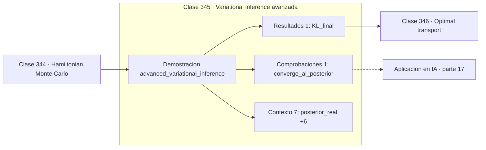

# 345 — Variational inference avanzada

> [⬅️ 344 Hamiltonian Monte Carlo](../344-hamiltonian-monte-carlo/README.md) · [📚 Parte 17](../README.md) · [🏠 Programa](../../../README.md) · [346 Optimal transport ➡️](../346-optimal-transport/README.md)

**Parte:** 17 — Frontera matemática para IA e investigación · **Nivel:** `frontera-investigacion` · **Horas estimadas:** 4
**Motor:** `engines.part17` · **Demostración:** `advanced_variational_inference` · **Clase 5 de 20** de la parte

---

## 🎯 Propósito

**Cambiar muestreo por optimización: más rápido, aproximado y con sesgo conocido.**

Procesos gaussianos, MCMC avanzado, inferencia variacional, transporte óptimo, geometría diferencial e informacional, SDE, Neural ODE, score matching y teoría del aprendizaje.

## ✅ Resultados de aprendizaje

Al terminar podrás:

1. Explicar **Variational inference avanzada** con lenguaje cotidiano y con notación matemática.
2. Resolver un caso pequeño a mano y anticipar el orden de magnitud del resultado.
3. Ejecutar y modificar `lab.py`, que corre la demostración `advanced_variational_inference`.
4. Interpretar las 9 salidas del laboratorio y decir qué comprueba cada una.
5. Detectar el error típico de esta parte: invertir una matriz de covarianza sin jitter numérico.

## 🧩 Fórmulas de la clase

```text
minimizar KL(q ‖ p) sobre la familia variacional
equivale a maximizar el ELBO
el resultado depende de la familia elegida
```

## 🗺️ Ubicación en el programa



## 📖 Fundamentos

La inferencia variacional plantea la aproximación de una posterior como un problema de
**optimización**: elegir una familia de distribuciones tratables y buscar dentro de ella la
que minimiza la divergencia KL respecto de la posterior real. Sustituye muestrear por
minimizar.

La ventaja es la velocidad y la escala. Donde MCMC necesita miles de evaluaciones
secuenciales, la inferencia variacional aprovecha descenso de gradiente, minilotes y GPU. Es
lo que hace viable la inferencia bayesiana en modelos con millones de parámetros, y es la
razón de que el VAE de la clase 331 funcione.

El precio es un **sesgo sistemático**. Como se minimiza `KL(q‖p)` —la dirección de búsqueda
de modo, según la clase 264— la aproximación tiende a **subestimar la varianza** y a
concentrarse en un modo. MCMC es asintóticamente exacto; la inferencia variacional es
rápida y sesgada, y ese sesgo no desaparece con más cómputo.

La elección de familia determina el resultado. La aproximación de **campo medio**, que
supone independencia entre parámetros, es la más común y la que peor captura correlaciones
posteriores. Familias más expresivas —flujos normalizadores— reducen el sesgo a cambio de
coste. El criterio práctico es claro: MCMC cuando el modelo es pequeño y la exactitud
importa; variacional cuando el modelo es grande y la escala manda.

## 🧮 Ejemplo trabajado

Aproximación variacional de una posterior normal.

```text
posterior real: Normal(mu = 3,0 ; sigma = 0,8)
familia variacional: Normal(m, s)

paso     m         s         KL
  1    0,46875   0,945303   5,03687513
  …
final  3,00000   0,800000   ≈ 0

La familia contiene la posterior real, así que
la aproximación es exacta y KL llega a 0.        ✓

En un caso real la familia NO contiene la posterior,
y KL se estanca en un valor positivo: ese residuo
es el sesgo del método.

Con campo medio, s quedaría por debajo del real:
la varianza se subestima sistemáticamente.
```

## 🔬 Qué ejecuta el laboratorio

`advanced_variational_inference` — Inferencia variacional: optimizar en lugar de muestrear.

| Grupo | Salidas |
|---|---|
| 🔢 Resultados numéricos (1) | `KL_final` |
| ✅ Comprobaciones de invariante (1) | `converge_al_posterior` |

Las claves booleanas no son adorno: si alguna fuera `False`, el resultado numérico
no sería fiable aunque el programa terminase sin error.

```bash
python classes/part-17-frontera-matematica-para-ia-e-investigacion/345-variational-inference-avanzada/lab.py
compmath run 345
```

> [!TIP]
> Antes de ejecutar, **escribe tu predicción**. Un laboratorio que confirma lo que
> esperabas enseña tanto como uno que te contradice, pero solo si la predicción
> existía antes del resultado.

## ⚠️ Errores conceptuales frecuentes

1. Reportar la incertidumbre variacional como si fuera exacta.
2. Usar campo medio con posteriores fuertemente correlacionadas.
3. Comparar valores de ELBO entre familias variacionales distintas.

## 🚀 Dónde se usa de verdad

VAE, redes bayesianas a escala, topic models, inferencia en modelos grandes y
cuantificación rápida de incertidumbre.

## 🤖 Conexión con IA

Score matching fundamenta los modelos de difusión; el transporte óptimo aparece en flow matching; la teoría estadística del aprendizaje explica el scaling.

## 📓 Notebooks

| Archivo | Para qué |
|---|---|
| [`notebook.ipynb`](notebook.ipynb) | recorrido guiado con la demostración ejecutada |
| [`notebook_student.ipynb`](notebook_student.ipynb) | versión con `TODO` para resolver |
| [`notebook_solution.ipynb`](notebook_solution.ipynb) | solución de referencia verificada |

## 📝 Evaluación

| Criterio | Peso |
|---|---:|
| Comprensión conceptual | 25 % |
| Resolución manual | 25 % |
| Implementación y verificación | 25 % |
| Interpretación y comunicación | 15 % |
| Conexión con aplicación real | 10 % |

Detalle y criterios de error crítico en [`assessment.md`](assessment.md).

## ❓ Preguntas de comprobación

1. ¿Cuál es la entrada, cuál la salida y qué unidades tienen?
2. ¿Qué operación domina el comportamiento del resultado?
3. ¿Qué caso extremo revelaría un error conceptual?
4. ¿Cómo verificarías el resultado por un método independiente?
5. ¿Dónde aparece esto en investigación aplicada?

Si necesitas releer el código para responderlas, la clase todavía no está superada.

## 📥 Entregable

`notebook_student.ipynb` resuelto más un párrafo que explique el resultado **sin citar
código**: qué entra, qué sale, qué invariante se comprueba y qué pasaría en un caso límite.

## 📚 Bibliografía de la clase

Esta clase enseña **Teoría del aprendizaje · Procesos gaussianos · Transporte óptimo · Geometría diferencial · Modelos generativos · Inferencia bayesiana · Procesos estocásticos**. Cada obra dice qué aporta aquí y cómo se comprobó su localizador:

- [Blei, D.; Kucukelbir, A.; McAuliffe, J. *Variational inference: a review for statisticians*, JASA, 2017](https://arxiv.org/abs/1601.00670) — Inferencia bayesiana: el tema de esta clase · DOI `10.48550/arxiv.1601.00670` verificado en DataCite (2026-08-19).
- [Rezende, D.; Mohamed, S. *Variational Inference with Normalizing Flows*, ICML, 2015](https://arxiv.org/abs/1505.05770) — Inferencia bayesiana y Modelos generativos: el tema de esta clase · DOI `10.48550/arxiv.1505.05770` verificado en DataCite (2026-08-19).

Bibliografía de todas las clases, con el porqué de cada obra, en [`docs/BIBLIOGRAPHY.md`](../../../docs/BIBLIOGRAPHY.md) · localizador y estado de cada obra en [`sources/bibliography.json`](../../../sources/bibliography.json).

## 📂 Material de la clase

[`intuition.md`](intuition.md) · [`theory.md`](theory.md) · [`derivation.md`](derivation.md) · [`exercises.md`](exercises.md) · [`assessment.md`](assessment.md) · [`where-is-this-used.md`](where-is-this-used.md) · [`lesson.yaml`](lesson.yaml)

---

> [⬅️ 344 Hamiltonian Monte Carlo](../344-hamiltonian-monte-carlo/README.md) · [📚 Parte 17](../README.md) · [🏠 Programa](../../../README.md) · [346 Optimal transport ➡️](../346-optimal-transport/README.md)
