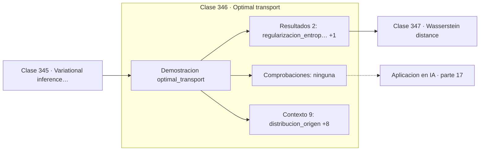

# 346 — Optimal transport

> [⬅️ 345 Variational inference avanzada](../345-variational-inference-avanzada/README.md) · [📚 Parte 17](../README.md) · [🏠 Programa](../../../README.md) · [347 Wasserstein distance ➡️](../347-wasserstein-distance/README.md)

**Parte:** 17 — Frontera matemática para IA e investigación · **Nivel:** `frontera-investigacion` · **Horas estimadas:** 4
**Motor:** `engines.part17` · **Demostración:** `optimal_transport` · **Clase 6 de 20** de la parte

---

## 🎯 Propósito

**Sinkhorn convierte un problema de programación lineal en escalados alternos.**

Procesos gaussianos, MCMC avanzado, inferencia variacional, transporte óptimo, geometría diferencial e informacional, SDE, Neural ODE, score matching y teoría del aprendizaje.

## ✅ Resultados de aprendizaje

Al terminar podrás:

1. Explicar **Optimal transport** con lenguaje cotidiano y con notación matemática.
2. Resolver un caso pequeño a mano y anticipar el orden de magnitud del resultado.
3. Ejecutar y modificar `lab.py`, que corre la demostración `optimal_transport`.
4. Interpretar las 11 salidas del laboratorio y decir qué comprueba cada una.
5. Detectar el error típico de esta parte: interpretar una cota teórica como predicción del error real.

## 🧩 Fórmulas de la clase

```text
min_P Σ Pᵢⱼ·Cᵢⱼ  sujeto a marginales fijas
regularizado: + ε·Σ Pᵢⱼ·log Pᵢⱼ
solución: escalados alternos de filas y columnas
```

## 🗺️ Ubicación en el programa



## 📖 Fundamentos

El transporte óptimo pregunta cuál es la forma más barata de mover una distribución de masa
hasta convertirla en otra, dado un coste por unidad transportada. La formulación de
Kantorovich lo plantea como un programa lineal sobre planes de transporte con marginales
fijas.

Resolver ese programa lineal exactamente cuesta `O(n³ log n)`, prohibitivo para
distribuciones grandes. La aportación de Cuturi fue añadir una **regularización
entrópica**: penalizar planes de baja entropía suaviza el problema, lo vuelve
estrictamente convexo, y su solución adopta una forma que se calcula con **escalados
alternos** de filas y columnas.

Ese algoritmo —Sinkhorn— es sencillo, paralelizable y **diferenciable**, lo que permite
usarlo como capa dentro de una red neuronal. Esas tres propiedades juntas son las que
llevaron el transporte óptimo de la matemática pura al aprendizaje automático aplicado en
apenas unos años.

El parámetro `ε` controla el compromiso. Valores grandes dan convergencia rápida y planes
muy difusos, lejos del óptimo verdadero; valores pequeños se acercan al transporte exacto
pero convergen despacio y sufren problemas numéricos por desbordamiento en los
exponentes. El capstone de la clase 360 mide exactamente esa convergencia.

## 🧮 Ejemplo trabajado

Sinkhorn entre dos distribuciones de tres átomos.

```text
origen:  [0,4 ; 0,3 ; 0,3]
destino: [0,2 ; 0,5 ; 0,3]

matriz de coste:
  [0,5  1,5  3,0]
  [0,5  0,5  2,0]
  [1,5  0,5  1,0]

regularización ε = 0,05

plan de transporte:
  [0,200000  0,199750  0,000000]
  [0,000000  0,299813  0,000000]
  [0,000000  0,000437  0,299999]

marginales de fila: [0,399751 ; 0,299813 ; 0,300436]
coinciden con el origen                              ✓

El plan evita las celdas caras (coste 3,0 y 2,0)
y concentra la masa en las baratas.
```

## 🔬 Qué ejecuta el laboratorio

`optimal_transport` — Transporte óptimo por Sinkhorn: coste de mover una distribución a otra.

| Grupo | Salidas |
|---|---|
| 🔢 Resultados numéricos (2) | `regularizacion_entropica`, `coste_de_transporte` |
| ✅ Comprobaciones de invariante (0) | — |

Las claves booleanas no son adorno: si alguna fuera `False`, el resultado numérico
no sería fiable aunque el programa terminase sin error.

```bash
python classes/part-17-frontera-matematica-para-ia-e-investigacion/346-optimal-transport/lab.py
compmath run 346
```

> [!TIP]
> Antes de ejecutar, **escribe tu predicción**. Un laboratorio que confirma lo que
> esperabas enseña tanto como uno que te contradice, pero solo si la predicción
> existía antes del resultado.

## ⚠️ Errores conceptuales frecuentes

1. Usar ε demasiado pequeño y provocar desbordamiento numérico.
2. Interpretar el plan regularizado como el transporte exacto.
3. Olvidar comprobar que las marginales del plan coinciden con las distribuciones.

## 🚀 Dónde se usa de verdad

Comparación de distribuciones, adaptación de dominios, flow matching, emparejamiento de
formas y análisis de datos de una sola célula.

## 🤖 Conexión con IA

Score matching fundamenta los modelos de difusión; el transporte óptimo aparece en flow matching; la teoría estadística del aprendizaje explica el scaling.

## 📓 Notebooks

| Archivo | Para qué |
|---|---|
| [`notebook.ipynb`](notebook.ipynb) | recorrido guiado con la demostración ejecutada |
| [`notebook_student.ipynb`](notebook_student.ipynb) | versión con `TODO` para resolver |
| [`notebook_solution.ipynb`](notebook_solution.ipynb) | solución de referencia verificada |

## 📝 Evaluación

| Criterio | Peso |
|---|---:|
| Comprensión conceptual | 25 % |
| Resolución manual | 25 % |
| Implementación y verificación | 25 % |
| Interpretación y comunicación | 15 % |
| Conexión con aplicación real | 10 % |

Detalle y criterios de error crítico en [`assessment.md`](assessment.md).

## ❓ Preguntas de comprobación

1. ¿Cuál es la entrada, cuál la salida y qué unidades tienen?
2. ¿Qué operación domina el comportamiento del resultado?
3. ¿Qué caso extremo revelaría un error conceptual?
4. ¿Cómo verificarías el resultado por un método independiente?
5. ¿Dónde aparece esto en investigación aplicada?

Si necesitas releer el código para responderlas, la clase todavía no está superada.

## 📥 Entregable

`notebook_student.ipynb` resuelto más un párrafo que explique el resultado **sin citar
código**: qué entra, qué sale, qué invariante se comprueba y qué pasaría en un caso límite.

## 🔗 Referencias

- [Cuturi, M. *Sinkhorn Distances: Lightspeed Computation of Optimal Transport*, NeurIPS, 2013](https://arxiv.org/abs/1306.0895)
- [Peyré, G.; Cuturi, M. *Computational Optimal Transport*, 2019](https://arxiv.org/abs/1803.00567)

Bibliografía completa de la parte en [`../../../docs/BIBLIOGRAPHY.md`](../../../docs/BIBLIOGRAPHY.md).

## 📂 Material de la clase

[`intuition.md`](intuition.md) · [`theory.md`](theory.md) · [`derivation.md`](derivation.md) · [`exercises.md`](exercises.md) · [`assessment.md`](assessment.md) · [`where-is-this-used.md`](where-is-this-used.md) · [`lesson.yaml`](lesson.yaml)

---

> [⬅️ 345 Variational inference avanzada](../345-variational-inference-avanzada/README.md) · [📚 Parte 17](../README.md) · [🏠 Programa](../../../README.md) · [347 Wasserstein distance ➡️](../347-wasserstein-distance/README.md)
