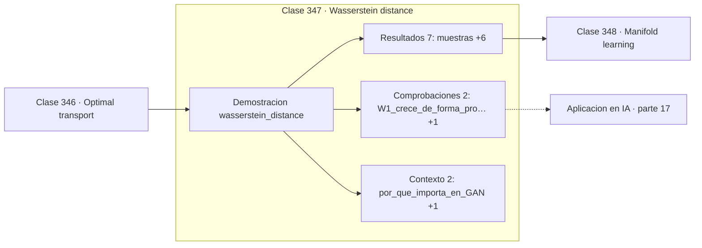

# 347 — Wasserstein distance

> [⬅️ 346 Optimal transport](../346-optimal-transport/README.md) · [📚 Parte 17](../README.md) · [🏠 Programa](../../../README.md) · [348 Manifold learning ➡️](../348-manifold-learning/README.md)

**Parte:** 17 — Frontera matemática para IA e investigación · **Nivel:** `frontera-investigacion` · **Horas estimadas:** 4
**Motor:** `engines.part17` · **Demostración:** `wasserstein_distance` · **Clase 7 de 20** de la parte

---

## 🎯 Propósito

**Wasserstein mide la separación real cuando la KL se vuelve infinita o constante.**

Procesos gaussianos, MCMC avanzado, inferencia variacional, transporte óptimo, geometría diferencial e informacional, SDE, Neural ODE, score matching y teoría del aprendizaje.

## ✅ Resultados de aprendizaje

Al terminar podrás:

1. Explicar **Wasserstein distance** con lenguaje cotidiano y con notación matemática.
2. Resolver un caso pequeño a mano y anticipar el orden de magnitud del resultado.
3. Ejecutar y modificar `lab.py`, que corre la demostración `wasserstein_distance`.
4. Interpretar las 11 salidas del laboratorio y decir qué comprueba cada una.
5. Detectar el error típico de esta parte: reportar resultados de mcmc sin diagnóstico de convergencia.

## 🧩 Fórmulas de la clase

```text
W₁(P,Q) = ínfimo del coste de transporte con coste |x−y|
en 1D: W₁ = ∫|F_P(x) − F_Q(x)| dx
es una métrica verdadera
```

## 🗺️ Ubicación en el programa



## 📖 Fundamentos

La distancia de Wasserstein es el coste del transporte óptimo, y a diferencia de la KL o
la JS es una **métrica en sentido estricto**: simétrica, no negativa, nula solo si las
distribuciones coinciden, y cumple la desigualdad triangular.

Su ventaja decisiva aparece cuando los **soportes no se solapan**. Dos distribuciones
disjuntas tienen KL infinita y JS constante en su valor máximo; en ambos casos el gradiente
es inútil para acercarlas. Wasserstein, en cambio, mide cuán lejos están y su gradiente
apunta en la dirección correcta. Esa es exactamente la motivación de **WGAN**.

Su interpretación es intuitiva y le da el nombre informal de distancia del transportista:
si cada distribución es un montón de tierra, la distancia es el trabajo mínimo necesario
para transformar uno en el otro. En una dimensión tiene una forma especialmente simple: el
área entre las funciones de distribución acumuladas.

El resultado numérico es limpio: para dos normales con la misma varianza, `W₁` es
aproximadamente la diferencia de medias, y lo sigue siendo cuando están muy separadas. Con
medias 0 y 5, `W₁ ≈ 5,04` mientras que la KL empírica se vuelve inestable. La distancia
escala con la separación real, que es lo que se quiere de una medida geométrica.

## 🧮 Ejemplo trabajado

Wasserstein-1 entre normales cercanas y lejanas.

```text
2 000 muestras de cada distribución

W₁(N(0,1) , N(0,5;1)) = 0,535306
  diferencia de medias teórica: 0,5             ✓

W₁(N(0,1) , N(5;1))   = 5,042759
  diferencia teórica: 5,0                       ✓

KL empírica en el caso cercano: 0,144536
KL empírica en el caso lejano: inestable o infinita

Wasserstein escala linealmente con la separación.
La KL no distingue "lejos" de "muy lejos": ambas
son igual de infinitas.
```

## 🔬 Qué ejecuta el laboratorio

`wasserstein_distance` — Wasserstein-1 en 1D: comparar distribuciones sin soporte común.

| Grupo | Salidas |
|---|---|
| 🔢 Resultados numéricos (7) | `muestras`, `W1(N(0,1), N(0.5,1))`, `diferencia_de_medias_teorica`, `W1(N(0,1), N(5,1))`, `diferencia_teorica_lejana`, `KL_empirica_cercana`, `KL_empirica_lejana_(soportes_casi_disjuntos)` |
| ✅ Comprobaciones de invariante (2) | `W1_crece_de_forma_proporcional`, `KL_no_informa_cuando_no_hay_solape` |

Las claves booleanas no son adorno: si alguna fuera `False`, el resultado numérico
no sería fiable aunque el programa terminase sin error.

```bash
python classes/part-17-frontera-matematica-para-ia-e-investigacion/347-wasserstein-distance/lab.py
compmath run 347
```

> [!TIP]
> Antes de ejecutar, **escribe tu predicción**. Un laboratorio que confirma lo que
> esperabas enseña tanto como uno que te contradice, pero solo si la predicción
> existía antes del resultado.

## ⚠️ Errores conceptuales frecuentes

1. Usar KL para comparar distribuciones con soportes disjuntos.
2. Confundir la versión regularizada de Sinkhorn con la distancia exacta.
3. Comparar valores de Wasserstein calculados con costes distintos.

## 🚀 Dónde se usa de verdad

WGAN, evaluación de modelos generativos, adaptación de dominios, análisis de formas y
comparación de distribuciones empíricas.

## 🤖 Conexión con IA

Score matching fundamenta los modelos de difusión; el transporte óptimo aparece en flow matching; la teoría estadística del aprendizaje explica el scaling.

## 📓 Notebooks

| Archivo | Para qué |
|---|---|
| [`notebook.ipynb`](notebook.ipynb) | recorrido guiado con la demostración ejecutada |
| [`notebook_student.ipynb`](notebook_student.ipynb) | versión con `TODO` para resolver |
| [`notebook_solution.ipynb`](notebook_solution.ipynb) | solución de referencia verificada |

## 📝 Evaluación

| Criterio | Peso |
|---|---:|
| Comprensión conceptual | 25 % |
| Resolución manual | 25 % |
| Implementación y verificación | 25 % |
| Interpretación y comunicación | 15 % |
| Conexión con aplicación real | 10 % |

Detalle y criterios de error crítico en [`assessment.md`](assessment.md).

## ❓ Preguntas de comprobación

1. ¿Cuál es la entrada, cuál la salida y qué unidades tienen?
2. ¿Qué operación domina el comportamiento del resultado?
3. ¿Qué caso extremo revelaría un error conceptual?
4. ¿Cómo verificarías el resultado por un método independiente?
5. ¿Dónde aparece esto en investigación aplicada?

Si necesitas releer el código para responderlas, la clase todavía no está superada.

## 📥 Entregable

`notebook_student.ipynb` resuelto más un párrafo que explique el resultado **sin citar
código**: qué entra, qué sale, qué invariante se comprueba y qué pasaría en un caso límite.

## 🔗 Referencias

- [Arjovsky, M.; Chintala, S.; Bottou, L. *Wasserstein GAN*, ICML, 2017](https://arxiv.org/abs/1701.07875)
- [Villani, C. *Optimal Transport: Old and New*, Springer, 2009](https://doi.org/10.1007/978-3-540-71050-9)

Bibliografía completa de la parte en [`../../../docs/BIBLIOGRAPHY.md`](../../../docs/BIBLIOGRAPHY.md).

## 📂 Material de la clase

[`intuition.md`](intuition.md) · [`theory.md`](theory.md) · [`derivation.md`](derivation.md) · [`exercises.md`](exercises.md) · [`assessment.md`](assessment.md) · [`where-is-this-used.md`](where-is-this-used.md) · [`lesson.yaml`](lesson.yaml)

---

> [⬅️ 346 Optimal transport](../346-optimal-transport/README.md) · [📚 Parte 17](../README.md) · [🏠 Programa](../../../README.md) · [348 Manifold learning ➡️](../348-manifold-learning/README.md)
