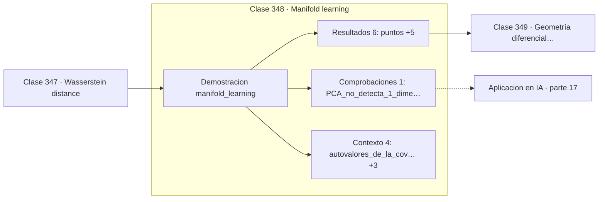

# 348 — Manifold learning

> [⬅️ 347 Wasserstein distance](../347-wasserstein-distance/README.md) · [📚 Parte 17](../README.md) · [🏠 Programa](../../../README.md) · [349 Geometría diferencial para ML ➡️](../349-geometria-diferencial-para-ml/README.md)

**Parte:** 17 — Frontera matemática para IA e investigación · **Nivel:** `frontera-investigacion` · **Horas estimadas:** 4
**Motor:** `engines.part17` · **Demostración:** `manifold_learning` · **Clase 8 de 20** de la parte

---

## 🎯 Propósito

**PCA no encuentra una variedad curva: ve tres dimensiones donde solo hay una.**

Procesos gaussianos, MCMC avanzado, inferencia variacional, transporte óptimo, geometría diferencial e informacional, SDE, Neural ODE, score matching y teoría del aprendizaje.

## ✅ Resultados de aprendizaje

Al terminar podrás:

1. Explicar **Manifold learning** con lenguaje cotidiano y con notación matemática.
2. Resolver un caso pequeño a mano y anticipar el orden de magnitud del resultado.
3. Ejecutar y modificar `lab.py`, que corre la demostración `manifold_learning`.
4. Interpretar las 11 salidas del laboratorio y decir qué comprueba cada una.
5. Detectar el error típico de esta parte: invertir una matriz de covarianza sin jitter numérico.

## 🧩 Fórmulas de la clase

```text
dimensión intrínseca ≪ dimensión ambiente
PCA solo detecta subespacios lineales
métodos no lineales: Isomap, LLE, t-SNE, UMAP
```

## 🗺️ Ubicación en el programa



## 📖 Fundamentos

La **hipótesis de la variedad** sostiene que los datos reales de dimensión alta se
concentran cerca de una variedad de dimensión intrínseca mucho menor. Una imagen de 1000×1000
píxeles vive en un espacio de un millón de dimensiones, pero el conjunto de imágenes de
caras es un subconjunto minúsculo y estructurado de ese espacio.

Esa hipótesis es lo que hace posible el aprendizaje en dimensión alta. Si los datos
ocuparan uniformemente el espacio ambiente, la maldición de la dimensionalidad de la clase
288 sería insuperable. Como no lo hacen, un modelo puede aprender la estructura de la
variedad con una cantidad razonable de ejemplos.

**PCA solo encuentra subespacios lineales**, y esa limitación se ve con claridad en el
ejemplo. Una hélice es una curva de dimensión intrínseca 1 sumergida en tres dimensiones;
PCA reparte la varianza entre las tres componentes —49 %, 36 % y 14 %— sin detectar en
ningún momento que hay un solo grado de libertad. La variedad es curva y PCA solo ve rectas.

Los métodos no lineales atacan justamente eso. **Isomap** usa distancias geodésicas sobre
el grafo de vecinos en vez de distancias euclídeas; **t-SNE** y **UMAP** preservan la
estructura local y son las herramientas estándar de visualización. Con una precaución
importante: t-SNE y UMAP **no preservan distancias globales**, así que el tamaño y la
separación de los grupos en sus gráficos no son interpretables.

## 🧮 Ejemplo trabajado

Una hélice: dimensión intrínseca 1 en un espacio de 3.

```text
120 puntos sobre una hélice
dimensión ambiente: 3
dimensión intrínseca: 1

autovalores de la covarianza:
  [0,177520 ; 0,129535 ; 0,052063]

varianza explicada:
  [49,43 % ; 36,07 % ; 14,50 %]

PCA reparte la varianza entre las tres componentes
y no detecta que hay un solo grado de libertad.     ✗

Un método basado en distancias geodésicas sobre el
grafo de vecinos sí recuperaría la dimensión 1.
```

## 🔬 Qué ejecuta el laboratorio

`manifold_learning` — Variedad: dimensión intrínseca menor que la del espacio ambiente.

| Grupo | Salidas |
|---|---|
| 🔢 Resultados numéricos (6) | `puntos`, `dimension_ambiente`, `dimension_intrinseca`, `distancia_euclidea_extremos`, `distancia_geodesica_extremos`, `razon` |
| ✅ Comprobaciones de invariante (1) | `PCA_no_detecta_1_dimension` |

Las claves booleanas no son adorno: si alguna fuera `False`, el resultado numérico
no sería fiable aunque el programa terminase sin error.

```bash
python classes/part-17-frontera-matematica-para-ia-e-investigacion/348-manifold-learning/lab.py
compmath run 348
```

> [!TIP]
> Antes de ejecutar, **escribe tu predicción**. Un laboratorio que confirma lo que
> esperabas enseña tanto como uno que te contradice, pero solo si la predicción
> existía antes del resultado.

## ⚠️ Errores conceptuales frecuentes

1. Usar PCA para variedades curvas y concluir que la dimensión es alta.
2. Interpretar distancias globales en un gráfico de t-SNE o UMAP.
3. Fijar los hiperparámetros de UMAP sin comprobar la estabilidad del resultado.

## 🚀 Dónde se usa de verdad

Visualización de datos de alta dimensión, reducción de dimensión no lineal, análisis de
espacios latentes y exploración de embeddings.

## 🤖 Conexión con IA

Score matching fundamenta los modelos de difusión; el transporte óptimo aparece en flow matching; la teoría estadística del aprendizaje explica el scaling.

## 📓 Notebooks

| Archivo | Para qué |
|---|---|
| [`notebook.ipynb`](notebook.ipynb) | recorrido guiado con la demostración ejecutada |
| [`notebook_student.ipynb`](notebook_student.ipynb) | versión con `TODO` para resolver |
| [`notebook_solution.ipynb`](notebook_solution.ipynb) | solución de referencia verificada |

## 📝 Evaluación

| Criterio | Peso |
|---|---:|
| Comprensión conceptual | 25 % |
| Resolución manual | 25 % |
| Implementación y verificación | 25 % |
| Interpretación y comunicación | 15 % |
| Conexión con aplicación real | 10 % |

Detalle y criterios de error crítico en [`assessment.md`](assessment.md).

## ❓ Preguntas de comprobación

1. ¿Cuál es la entrada, cuál la salida y qué unidades tienen?
2. ¿Qué operación domina el comportamiento del resultado?
3. ¿Qué caso extremo revelaría un error conceptual?
4. ¿Cómo verificarías el resultado por un método independiente?
5. ¿Dónde aparece esto en investigación aplicada?

Si necesitas releer el código para responderlas, la clase todavía no está superada.

## 📥 Entregable

`notebook_student.ipynb` resuelto más un párrafo que explique el resultado **sin citar
código**: qué entra, qué sale, qué invariante se comprueba y qué pasaría en un caso límite.

## 📚 Bibliografía de la clase

Esta clase enseña **Teoría del aprendizaje · Procesos gaussianos · Transporte óptimo · Geometría diferencial · Modelos generativos · Inferencia bayesiana · Procesos estocásticos**. Cada obra dice qué aporta aquí y cómo se comprobó su localizador:

- [Tenenbaum, J.; de Silva, V.; Langford, J. *A global geometric framework for nonlinear dimensionality reduction*, Science, 2000](https://doi.org/10.1126/science.290.5500.2319) — Geometría diferencial: el tema de esta clase · DOI `10.1126/science.290.5500.2319` verificado en Crossref (2026-08-19).
- [McInnes, L.; Healy, J.; Melville, J. *UMAP*, 2018](https://arxiv.org/abs/1802.03426) — Geometría diferencial: el tema de esta clase · DOI `10.48550/arxiv.1802.03426` verificado en DataCite (2026-08-19).

Bibliografía de todas las clases, con el porqué de cada obra, en [`docs/BIBLIOGRAPHY.md`](../../../docs/BIBLIOGRAPHY.md) · localizador y estado de cada obra en [`sources/bibliography.json`](../../../sources/bibliography.json).

## 📂 Material de la clase

[`intuition.md`](intuition.md) · [`theory.md`](theory.md) · [`derivation.md`](derivation.md) · [`exercises.md`](exercises.md) · [`assessment.md`](assessment.md) · [`where-is-this-used.md`](where-is-this-used.md) · [`lesson.yaml`](lesson.yaml)

---

> [⬅️ 347 Wasserstein distance](../347-wasserstein-distance/README.md) · [📚 Parte 17](../README.md) · [🏠 Programa](../../../README.md) · [349 Geometría diferencial para ML ➡️](../349-geometria-diferencial-para-ml/README.md)
