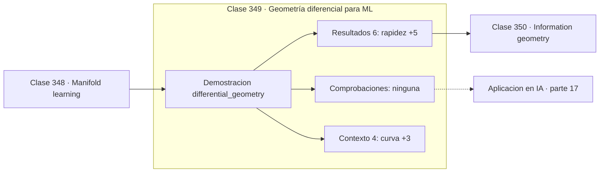

# 349 — Geometría diferencial para ML

> [⬅️ 348 Manifold learning](../348-manifold-learning/README.md) · [📚 Parte 17](../README.md) · [🏠 Programa](../../../README.md) · [350 Information geometry ➡️](../350-information-geometry/README.md)

**Parte:** 17 — Frontera matemática para IA e investigación · **Nivel:** `frontera-investigacion` · **Horas estimadas:** 4
**Motor:** `engines.part17` · **Demostración:** `differential_geometry` · **Clase 9 de 20** de la parte

---

## 🎯 Propósito

**La longitud de una curva es la integral de su rapidez, y eso se verifica numéricamente.**

Procesos gaussianos, MCMC avanzado, inferencia variacional, transporte óptimo, geometría diferencial e informacional, SDE, Neural ODE, score matching y teoría del aprendizaje.

## ✅ Resultados de aprendizaje

Al terminar podrás:

1. Explicar **Geometría diferencial para ML** con lenguaje cotidiano y con notación matemática.
2. Resolver un caso pequeño a mano y anticipar el orden de magnitud del resultado.
3. Ejecutar y modificar `lab.py`, que corre la demostración `differential_geometry`.
4. Interpretar las 10 salidas del laboratorio y decir qué comprueba cada una.
5. Detectar el error típico de esta parte: interpretar una cota teórica como predicción del error real.

## 🧩 Fórmulas de la clase

```text
velocidad: r'(t)
rapidez: ‖r'(t)‖
longitud de arco: ∫ ‖r'(t)‖ dt
```

## 🗺️ Ubicación en el programa



## 📖 Fundamentos

La geometría diferencial estudia espacios curvos con las herramientas del cálculo. Su
objeto central es el **tensor métrico**, que define cómo medir distancias y ángulos
localmente, y del que se derivan longitudes, geodésicas y curvatura.

El caso más simple es una curva parametrizada. Su **velocidad** es la derivada del vector
de posición, su **rapidez** es la norma de esa velocidad, y la **longitud de arco** es la
integral de la rapidez. Para una hélice el cálculo es exacto y sirve de verificación
numérica: la rapidez teórica `√(1 + 0,09) = 1,044031` coincide con la calculada, y la
longitud sobre un periodo también.

Las **geodésicas** son las curvas de longitud mínima, la generalización de la recta a
espacios curvos. En una esfera son arcos de círculo máximo, que es la razón de que las
rutas aéreas parezcan curvas en un mapa plano. La distancia geodésica es la que Isomap usa
en la clase anterior.

Su relevancia para el aprendizaje automático llega por dos vías. La **hipótesis de la
variedad** convierte el espacio de datos en un objeto geométrico donde la distancia
relevante es la geodésica y no la euclídea. Y la **geometría de la información** de la
clase siguiente aplica estas mismas herramientas al espacio de parámetros, dotándolo de
una métrica natural.

## 🧮 Ejemplo trabajado

Hélice: rapidez y longitud de arco verificadas.

```text
curva: r(t) = (cos t , sin t , 0,3t)

velocidad en t = 1:
  (−0,841471 ; 0,540302 ; 0,300000)

rapidez = ‖r'(1)‖ = 1,044031
teórica = √(1 + 0,09) = 1,044031                     ✓

longitud de arco de 0 a 2π:
  calculada = 6,559838
  teórica   = 2π · 1,044031 = 6,559838               ✓

La rapidez es constante porque la hélice avanza
de forma uniforme: es una parametrización natural.
```

## 🔬 Qué ejecuta el laboratorio

`differential_geometry` — Geometría diferencial: métrica, longitud de curva y curvatura.

| Grupo | Salidas |
|---|---|
| 🔢 Resultados numéricos (6) | `rapidez`, `rapidez_teorica_√(1+0.09)`, `longitud_de_arco_0_a_2π`, `longitud_teorica`, `curvatura`, `curvatura_teorica_1/1.09` |
| ✅ Comprobaciones de invariante (0) | — |

Las claves booleanas no son adorno: si alguna fuera `False`, el resultado numérico
no sería fiable aunque el programa terminase sin error.

```bash
python classes/part-17-frontera-matematica-para-ia-e-investigacion/349-geometria-diferencial-para-ml/lab.py
compmath run 349
```

> [!TIP]
> Antes de ejecutar, **escribe tu predicción**. Un laboratorio que confirma lo que
> esperabas enseña tanto como uno que te contradice, pero solo si la predicción
> existía antes del resultado.

## ⚠️ Errores conceptuales frecuentes

1. Confundir la longitud del recorrido con la distancia entre extremos.
2. Usar distancia euclídea donde la geometría del problema pide geodésica.
3. Suponer que una parametrización cualquiera tiene rapidez constante.

## 🚀 Dónde se usa de verdad

Aprendizaje sobre variedades, robótica y planificación de trayectorias, relatividad,
geometría de espacios latentes y optimización sobre variedades.

## 🤖 Conexión con IA

Score matching fundamenta los modelos de difusión; el transporte óptimo aparece en flow matching; la teoría estadística del aprendizaje explica el scaling.

## 📓 Notebooks

| Archivo | Para qué |
|---|---|
| [`notebook.ipynb`](notebook.ipynb) | recorrido guiado con la demostración ejecutada |
| [`notebook_student.ipynb`](notebook_student.ipynb) | versión con `TODO` para resolver |
| [`notebook_solution.ipynb`](notebook_solution.ipynb) | solución de referencia verificada |

## 📝 Evaluación

| Criterio | Peso |
|---|---:|
| Comprensión conceptual | 25 % |
| Resolución manual | 25 % |
| Implementación y verificación | 25 % |
| Interpretación y comunicación | 15 % |
| Conexión con aplicación real | 10 % |

Detalle y criterios de error crítico en [`assessment.md`](assessment.md).

## ❓ Preguntas de comprobación

1. ¿Cuál es la entrada, cuál la salida y qué unidades tienen?
2. ¿Qué operación domina el comportamiento del resultado?
3. ¿Qué caso extremo revelaría un error conceptual?
4. ¿Cómo verificarías el resultado por un método independiente?
5. ¿Dónde aparece esto en investigación aplicada?

Si necesitas releer el código para responderlas, la clase todavía no está superada.

## 📥 Entregable

`notebook_student.ipynb` resuelto más un párrafo que explique el resultado **sin citar
código**: qué entra, qué sale, qué invariante se comprueba y qué pasaría en un caso límite.

## 🔗 Referencias

- [do Carmo, M. *Differential Geometry of Curves and Surfaces*, 2ª ed., Dover, 2016](https://store.doverpublications.com/products/9780486806990)
- [Bronstein, M. et al. *Geometric Deep Learning*, 2021](https://arxiv.org/abs/2104.13478)

Bibliografía completa de la parte en [`../../../docs/BIBLIOGRAPHY.md`](../../../docs/BIBLIOGRAPHY.md).

## 📂 Material de la clase

[`intuition.md`](intuition.md) · [`theory.md`](theory.md) · [`derivation.md`](derivation.md) · [`exercises.md`](exercises.md) · [`assessment.md`](assessment.md) · [`where-is-this-used.md`](where-is-this-used.md) · [`lesson.yaml`](lesson.yaml)

---

> [⬅️ 348 Manifold learning](../348-manifold-learning/README.md) · [📚 Parte 17](../README.md) · [🏠 Programa](../../../README.md) · [350 Information geometry ➡️](../350-information-geometry/README.md)
