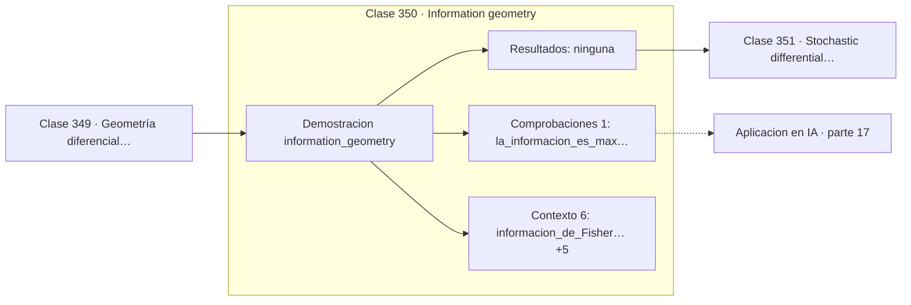

# 350 — Information geometry

> [⬅️ 349 Geometría diferencial para ML](../349-geometria-diferencial-para-ml/README.md) · [📚 Parte 17](../README.md) · [🏠 Programa](../../../README.md) · [351 Stochastic differential equations ➡️](../351-stochastic-differential-equations/README.md)

**Parte:** 17 — Frontera matemática para IA e investigación · **Nivel:** `frontera-investigacion` · **Horas estimadas:** 4
**Motor:** `engines.part17` · **Demostración:** `information_geometry` · **Clase 10 de 20** de la parte

---

## 🎯 Propósito

**La información de Fisher es la curvatura de la KL, y de ella salen Cramér-Rao y el gradiente natural.**

Procesos gaussianos, MCMC avanzado, inferencia variacional, transporte óptimo, geometría diferencial e informacional, SDE, Neural ODE, score matching y teoría del aprendizaje.

## ✅ Resultados de aprendizaje

Al terminar podrás:

1. Explicar **Information geometry** con lenguaje cotidiano y con notación matemática.
2. Resolver un caso pequeño a mano y anticipar el orden de magnitud del resultado.
3. Ejecutar y modificar `lab.py`, que corre la demostración `information_geometry`.
4. Interpretar las 7 salidas del laboratorio y decir qué comprueba cada una.
5. Detectar el error típico de esta parte: reportar resultados de mcmc sin diagnóstico de convergencia.

## 🧩 Fórmulas de la clase

```text
I(θ) = E[(∂ log p/∂θ)²]
KL(p_θ ‖ p_{θ+ε}) ≈ ½·I(θ)·ε²
Cramér-Rao: Var(θ̂) ≥ 1/(n·I(θ))
```

## 🗺️ Ubicación en el programa



## 📖 Fundamentos

La geometría de la información trata el conjunto de distribuciones de una familia
paramétrica como una **variedad**, donde cada punto es una distribución. La pregunta
natural es qué métrica usar en ese espacio, y la respuesta es la **información de Fisher**.

Su significado es que la KL, localmente, se comporta como una forma cuadrática cuya matriz
es Fisher. La comprobación numérica lo confirma: para un desplazamiento minúsculo `ε`, la
KL entre `p` y `p+ε` coincide con `½·I(p)·ε²` con razón 1,0. Esa identidad es lo que
convierte a Fisher en la métrica natural del espacio de parámetros, no una elección
arbitraria.

De ahí salen dos resultados centrales. La **cota de Cramér-Rao** establece un límite
inferior a la varianza de cualquier estimador insesgado: donde la información es alta, se
puede estimar con precisión; donde es baja, ningún estimador puede ser preciso. En la
Bernoulli, la información es máxima en los extremos —11,1 para `p = 0,1`— y mínima en 0,5,
lo que dice que es más fácil estimar un parámetro cercano a los extremos.

El **gradiente natural** preacondiciona el gradiente con la inversa de Fisher, con lo que
la dirección de descenso deja de depender de cómo se hayan parametrizado los pesos. Es
elegante y costoso —requiere invertir Fisher— y de ahí vienen aproximaciones prácticas como
K-FAC. La restricción de KL de PPO en la clase 339 es una manifestación de la misma idea:
medir el cambio de la política en el espacio de distribuciones, no en el de parámetros.

## 🧮 Ejemplo trabajado

Información de Fisher y su relación con la KL.

```text
Bernoulli:
  p = 0,1  →  I = 11,111111
  p = 0,5  →  I =  4,000000
  p = 0,9  →  I = 11,111111
máxima en los extremos                               ✓

Normal:
  σ = 0,5  →  I = 4,00
  σ = 1,0  →  I = 1,00
  σ = 2,0  →  I = 0,25

KL localmente es una métrica (p = 0,1):
  KL(p ‖ p+ε)  = 5,5523e-08
  ½·I(p)·ε²    = 5,5556e-08
  razón ≈ 1,0                                        ✓

Cramér-Rao: Var(θ̂) ≥ 1/(n·I(θ))
Gradiente natural: ∇̃ = I(θ)⁻¹∇
```

## 🔬 Qué ejecuta el laboratorio

`information_geometry` — Información de Fisher: la métrica natural del espacio de parámetros.

| Grupo | Salidas |
|---|---|
| 🔢 Resultados numéricos (0) | — |
| ✅ Comprobaciones de invariante (1) | `la_informacion_es_maxima_en_los_extremos` |

Las claves booleanas no son adorno: si alguna fuera `False`, el resultado numérico
no sería fiable aunque el programa terminase sin error.

```bash
python classes/part-17-frontera-matematica-para-ia-e-investigacion/350-information-geometry/lab.py
compmath run 350
```

> [!TIP]
> Antes de ejecutar, **escribe tu predicción**. Un laboratorio que confirma lo que
> esperabas enseña tanto como uno que te contradice, pero solo si la predicción
> existía antes del resultado.

## ⚠️ Errores conceptuales frecuentes

1. Interpretar Fisher como una constante en vez de como función de θ.
2. Aplicar Cramér-Rao a estimadores sesgados.
3. Invertir Fisher exactamente en modelos grandes en vez de aproximarla.

## 🚀 Dónde se usa de verdad

Gradiente natural y K-FAC, PPO, diseño experimental óptimo, cotas de precisión de
estimadores y análisis de identificabilidad.

## 🤖 Conexión con IA

Score matching fundamenta los modelos de difusión; el transporte óptimo aparece en flow matching; la teoría estadística del aprendizaje explica el scaling.

## 📓 Notebooks

| Archivo | Para qué |
|---|---|
| [`notebook.ipynb`](notebook.ipynb) | recorrido guiado con la demostración ejecutada |
| [`notebook_student.ipynb`](notebook_student.ipynb) | versión con `TODO` para resolver |
| [`notebook_solution.ipynb`](notebook_solution.ipynb) | solución de referencia verificada |

## 📝 Evaluación

| Criterio | Peso |
|---|---:|
| Comprensión conceptual | 25 % |
| Resolución manual | 25 % |
| Implementación y verificación | 25 % |
| Interpretación y comunicación | 15 % |
| Conexión con aplicación real | 10 % |

Detalle y criterios de error crítico en [`assessment.md`](assessment.md).

## ❓ Preguntas de comprobación

1. ¿Cuál es la entrada, cuál la salida y qué unidades tienen?
2. ¿Qué operación domina el comportamiento del resultado?
3. ¿Qué caso extremo revelaría un error conceptual?
4. ¿Cómo verificarías el resultado por un método independiente?
5. ¿Dónde aparece esto en investigación aplicada?

Si necesitas releer el código para responderlas, la clase todavía no está superada.

## 📥 Entregable

`notebook_student.ipynb` resuelto más un párrafo que explique el resultado **sin citar
código**: qué entra, qué sale, qué invariante se comprueba y qué pasaría en un caso límite.

## 🔗 Referencias

- [Amari, S. *Information Geometry and Its Applications*, Springer, 2016](https://doi.org/10.1007/978-4-431-55978-8)
- [Martens, J. *New insights and perspectives on the natural gradient method*, JMLR, 2020](https://arxiv.org/abs/1412.1193)

Bibliografía completa de la parte en [`../../../docs/BIBLIOGRAPHY.md`](../../../docs/BIBLIOGRAPHY.md).

## 📂 Material de la clase

[`intuition.md`](intuition.md) · [`theory.md`](theory.md) · [`derivation.md`](derivation.md) · [`exercises.md`](exercises.md) · [`assessment.md`](assessment.md) · [`where-is-this-used.md`](where-is-this-used.md) · [`lesson.yaml`](lesson.yaml)

---

> [⬅️ 349 Geometría diferencial para ML](../349-geometria-diferencial-para-ml/README.md) · [📚 Parte 17](../README.md) · [🏠 Programa](../../../README.md) · [351 Stochastic differential equations ➡️](../351-stochastic-differential-equations/README.md)
