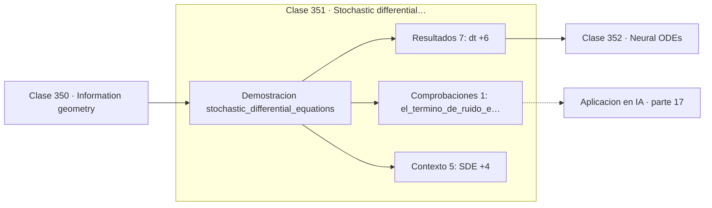

# 351 — Stochastic differential equations

> [⬅️ 350 Information geometry](../350-information-geometry/README.md) · [📚 Parte 17](../README.md) · [🏠 Programa](../../../README.md) · [352 Neural ODEs ➡️](../352-neural-odes/README.md)

**Parte:** 17 — Frontera matemática para IA e investigación · **Nivel:** `frontera-investigacion` · **Horas estimadas:** 4
**Motor:** `engines.part17` · **Demostración:** `stochastic_differential_equations` · **Clase 11 de 20** de la parte

---

## 🎯 Propósito

**En una SDE el ruido escala como √dt, no como dt: esa raíz lo cambia todo.**

Procesos gaussianos, MCMC avanzado, inferencia variacional, transporte óptimo, geometría diferencial e informacional, SDE, Neural ODE, score matching y teoría del aprendizaje.

## ✅ Resultados de aprendizaje

Al terminar podrás:

1. Explicar **Stochastic differential equations** con lenguaje cotidiano y con notación matemática.
2. Resolver un caso pequeño a mano y anticipar el orden de magnitud del resultado.
3. Ejecutar y modificar `lab.py`, que corre la demostración `stochastic_differential_equations`.
4. Interpretar las 13 salidas del laboratorio y decir qué comprueba cada una.
5. Detectar el error típico de esta parte: invertir una matriz de covarianza sin jitter numérico.

## 🧩 Fórmulas de la clase

```text
dX = f(X,t)dt + g(X,t)dW
Euler-Maruyama: X ← X + f·dt + g·√dt·ξ
Ornstein-Uhlenbeck: dX = θ(μ − X)dt + σ dW
```

## 🗺️ Ubicación en el programa



## 📖 Fundamentos

Una ecuación diferencial estocástica añade a la dinámica determinista un término de ruido
continuo. El primer término, la **deriva**, describe hacia dónde tiende el sistema; el
segundo, la **difusión**, describe la magnitud de las fluctuaciones aleatorias.

El detalle que hay que interiorizar es el escalado del ruido. El movimiento browniano tiene
incrementos de varianza proporcional al tiempo, así que la **desviación** escala como
`√dt`. En el integrador de Euler-Maruyama eso significa multiplicar el ruido por `√dt` y no
por `dt`. Usar `dt` produce una simulación con la magnitud de ruido completamente
equivocada, y es el error más frecuente al implementar SDE.

Ese mismo hecho tiene una consecuencia teórica: las trayectorias brownianas son continuas
pero **no derivables en ningún punto**, y por eso el cálculo ordinario no sirve. El cálculo
de Itô y su lema son la herramienta correcta, y son la razón de que la fórmula de
Black-Scholes tenga el término adicional que tiene.

El proceso de **Ornstein-Uhlenbeck** del ejemplo es el prototipo con reversión a la media:
la deriva empuja hacia `μ` con fuerza proporcional a la distancia, mientras el ruido lo
aparta. Su distribución estacionaria es normal, y aparece en modelos de tipos de interés, en
física y en la formulación en tiempo continuo de los modelos de difusión de la clase 334.

## 🧮 Ejemplo trabajado

Ornstein-Uhlenbeck simulado con Euler-Maruyama.

```text
SDE: dX = θ(μ − X)dt + σ dW
θ = 1,5    μ = 2,0    σ = 0,8
dt = 0,01     400 réplicas

paso    t       x
  1    0,01   0,014091
101    1,01   1,xxxxxx
  …             → oscila alrededor de μ = 2,0

Escalado del ruido:
  correcto:    σ·√dt·ξ = 0,8·0,1·ξ = 0,08·ξ
  incorrecto:  σ·dt·ξ  = 0,8·0,01·ξ = 0,008·ξ
  factor 10 de diferencia

Con el escalado incorrecto la simulación parecería
casi determinista.
```

## 🔬 Qué ejecuta el laboratorio

`stochastic_differential_equations` — SDE: proceso de Ornstein-Uhlenbeck simulado con Euler-Maruyama.

| Grupo | Salidas |
|---|---|
| 🔢 Resultados numéricos (7) | `dt`, `replicas`, `media_estacionaria_empirica`, `media_estacionaria_teorica`, `varianza_estacionaria_empirica`, `varianza_estacionaria_teorica_σ²/(2θ)`, `semilla` |
| ✅ Comprobaciones de invariante (1) | `el_termino_de_ruido_escala_como_√dt` |

Las claves booleanas no son adorno: si alguna fuera `False`, el resultado numérico
no sería fiable aunque el programa terminase sin error.

```bash
python classes/part-17-frontera-matematica-para-ia-e-investigacion/351-stochastic-differential-equations/lab.py
compmath run 351
```

> [!TIP]
> Antes de ejecutar, **escribe tu predicción**. Un laboratorio que confirma lo que
> esperabas enseña tanto como uno que te contradice, pero solo si la predicción
> existía antes del resultado.

## ⚠️ Errores conceptuales frecuentes

1. Escalar el ruido con dt en vez de con √dt.
2. Aplicar cálculo ordinario a trayectorias brownianas.
3. Usar pasos grandes y perder la estructura estadística del proceso.

## 🚀 Dónde se usa de verdad

Modelos de difusión en tiempo continuo, finanzas cuantitativas, física estadística,
dinámica de Langevin y modelado de ruido en sistemas.

## 🤖 Conexión con IA

Score matching fundamenta los modelos de difusión; el transporte óptimo aparece en flow matching; la teoría estadística del aprendizaje explica el scaling.

## 📓 Notebooks

| Archivo | Para qué |
|---|---|
| [`notebook.ipynb`](notebook.ipynb) | recorrido guiado con la demostración ejecutada |
| [`notebook_student.ipynb`](notebook_student.ipynb) | versión con `TODO` para resolver |
| [`notebook_solution.ipynb`](notebook_solution.ipynb) | solución de referencia verificada |

## 📝 Evaluación

| Criterio | Peso |
|---|---:|
| Comprensión conceptual | 25 % |
| Resolución manual | 25 % |
| Implementación y verificación | 25 % |
| Interpretación y comunicación | 15 % |
| Conexión con aplicación real | 10 % |

Detalle y criterios de error crítico en [`assessment.md`](assessment.md).

## ❓ Preguntas de comprobación

1. ¿Cuál es la entrada, cuál la salida y qué unidades tienen?
2. ¿Qué operación domina el comportamiento del resultado?
3. ¿Qué caso extremo revelaría un error conceptual?
4. ¿Cómo verificarías el resultado por un método independiente?
5. ¿Dónde aparece esto en investigación aplicada?

Si necesitas releer el código para responderlas, la clase todavía no está superada.

## 📥 Entregable

`notebook_student.ipynb` resuelto más un párrafo que explique el resultado **sin citar
código**: qué entra, qué sale, qué invariante se comprueba y qué pasaría en un caso límite.

## 📚 Bibliografía de la clase

Esta clase enseña **Teoría del aprendizaje · Procesos gaussianos · Transporte óptimo · Geometría diferencial · Modelos generativos · Inferencia bayesiana · Procesos estocásticos**. Cada obra dice qué aporta aquí y cómo se comprobó su localizador:

- [Øksendal, B. *Stochastic Differential Equations*, 6ª ed., Springer, 2003](https://doi.org/10.1007/978-3-642-14394-6) — Procesos estocásticos: el tema de esta clase · ISBN-13 `9783642143946` verificado en International ISBN Agency (2026-08-19).
- [Song, Y. et al. *Score-Based Generative Modeling through SDEs*, ICLR, 2021](https://arxiv.org/abs/2011.13456) — Modelos generativos y Procesos estocásticos: el tema de esta clase · DOI `10.48550/arxiv.2011.13456` verificado en DataCite (2026-08-19).

Bibliografía de todas las clases, con el porqué de cada obra, en [`docs/BIBLIOGRAPHY.md`](../../../docs/BIBLIOGRAPHY.md) · localizador y estado de cada obra en [`sources/bibliography.json`](../../../sources/bibliography.json).

## 📂 Material de la clase

[`intuition.md`](intuition.md) · [`theory.md`](theory.md) · [`derivation.md`](derivation.md) · [`exercises.md`](exercises.md) · [`assessment.md`](assessment.md) · [`where-is-this-used.md`](where-is-this-used.md) · [`lesson.yaml`](lesson.yaml)

---

> [⬅️ 350 Information geometry](../350-information-geometry/README.md) · [📚 Parte 17](../README.md) · [🏠 Programa](../../../README.md) · [352 Neural ODEs ➡️](../352-neural-odes/README.md)
