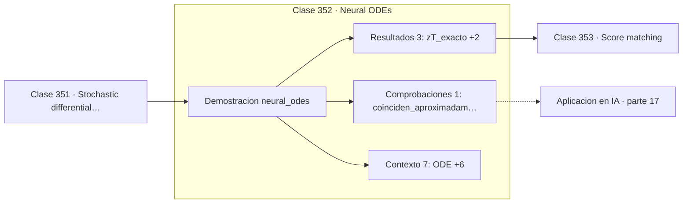

# 352 — Neural ODEs

> [⬅️ 351 Stochastic differential equations](../351-stochastic-differential-equations/README.md) · [📚 Parte 17](../README.md) · [🏠 Programa](../../../README.md) · [353 Score matching ➡️](../353-score-matching/README.md)

**Parte:** 17 — Frontera matemática para IA e investigación · **Nivel:** `frontera-investigacion` · **Horas estimadas:** 4
**Motor:** `engines.part17` · **Demostración:** `neural_odes` · **Clase 12 de 20** de la parte

---

## 🎯 Propósito

**El método adjunto calcula gradientes con memoria constante, sin guardar la trayectoria.**

Procesos gaussianos, MCMC avanzado, inferencia variacional, transporte óptimo, geometría diferencial e informacional, SDE, Neural ODE, score matching y teoría del aprendizaje.

## ✅ Resultados de aprendizaje

Al terminar podrás:

1. Explicar **Neural ODEs** con lenguaje cotidiano y con notación matemática.
2. Resolver un caso pequeño a mano y anticipar el orden de magnitud del resultado.
3. Ejecutar y modificar `lab.py`, que corre la demostración `neural_odes`.
4. Interpretar las 11 salidas del laboratorio y decir qué comprueba cada una.
5. Detectar el error típico de esta parte: interpretar una cota teórica como predicción del error real.

## 🧩 Fórmulas de la clase

```text
dz/dt = f(z, t, θ)
salida: z(T) = z(0) + ∫₀ᵀ f dt
gradientes por una EDO adjunta hacia atrás
```

## 🗺️ Ubicación en el programa



## 📖 Fundamentos

Un Neural ODE observa que una red residual —`z ← z + f(z)`— es un paso de Euler de una
ecuación diferencial, y lleva la idea al límite: en vez de un número discreto de capas, una
dinámica continua integrada por un solver numérico. La profundidad deja de ser un entero y
pasa a ser un intervalo de tiempo.

La ventaja más citada es el **método adjunto** para calcular gradientes. En vez de guardar
todas las activaciones intermedias como hace backpropagation, se resuelve una EDO auxiliar
**hacia atrás** que reconstruye lo necesario sobre la marcha. El coste de memoria pasa a ser
constante, independiente de la profundidad efectiva.

La otra ventaja es el **cómputo adaptativo**: un solver con paso adaptativo dedica más
evaluaciones donde la dinámica es complicada y menos donde es suave. El modelo ajusta su
esfuerzo al problema en vez de tener un número fijo de capas.

El coste es la velocidad. Los solvers adaptativos requieren muchas evaluaciones de la red y
son más lentos que una pila de capas discretas. Su valor práctico está en dominios donde la
dinámica continua es natural: series temporales irregularmente muestreadas, física, y los
flujos continuos normalizadores. Toda la parte 11 se vuelve directamente relevante:
elegir el integrador y su tolerancia es una decisión de modelado.

## 🧮 Ejemplo trabajado

Neural ODE lineal con solución analítica conocida.

```text
ODE: dz/dt = −θz        solución: z₀·e^(−θt)

z(T) exacto = 0,16529889

convergencia de Euler:
  5 pasos:  z(T) = 0,10737418   error 0,0579
 20 pasos:  ...                  error menor
 80 pasos:  ...                  error/4 por duplicación

Orden 1 confirmado, como en la clase 236.           ✓

pérdida: L = (z(T) − 0,2)²
dL/dθ por método adjunto = 0,168375

El adjunto obtiene el gradiente sin haber guardado
ninguna activación intermedia.
```

## 🔬 Qué ejecuta el laboratorio

`neural_odes` — Neural ODE: capas continuas y el método adjunto.

| Grupo | Salidas |
|---|---|
| 🔢 Resultados numéricos (3) | `z(T)_exacto`, `dL/dθ_por_metodo_adjunto`, `dL/dθ_analitico` |
| ✅ Comprobaciones de invariante (1) | `coinciden_aproximadamente` |

Las claves booleanas no son adorno: si alguna fuera `False`, el resultado numérico
no sería fiable aunque el programa terminase sin error.

```bash
python classes/part-17-frontera-matematica-para-ia-e-investigacion/352-neural-odes/lab.py
compmath run 352
```

> [!TIP]
> Antes de ejecutar, **escribe tu predicción**. Un laboratorio que confirma lo que
> esperabas enseña tanto como uno que te contradice, pero solo si la predicción
> existía antes del resultado.

## ⚠️ Errores conceptuales frecuentes

1. Usar tolerancias muy bajas y hacer el entrenamiento inviable.
2. Aplicar Neural ODE donde una red discreta sería más rápida y suficiente.
3. Olvidar que el número de evaluaciones varía entre lotes con solvers adaptativos.

## 🚀 Dónde se usa de verdad

Series temporales irregulares, flujos continuos normalizadores, modelado físico, dinámica
de sistemas y modelos de difusión en tiempo continuo.

## 🤖 Conexión con IA

Score matching fundamenta los modelos de difusión; el transporte óptimo aparece en flow matching; la teoría estadística del aprendizaje explica el scaling.

## 📓 Notebooks

| Archivo | Para qué |
|---|---|
| [`notebook.ipynb`](notebook.ipynb) | recorrido guiado con la demostración ejecutada |
| [`notebook_student.ipynb`](notebook_student.ipynb) | versión con `TODO` para resolver |
| [`notebook_solution.ipynb`](notebook_solution.ipynb) | solución de referencia verificada |

## 📝 Evaluación

| Criterio | Peso |
|---|---:|
| Comprensión conceptual | 25 % |
| Resolución manual | 25 % |
| Implementación y verificación | 25 % |
| Interpretación y comunicación | 15 % |
| Conexión con aplicación real | 10 % |

Detalle y criterios de error crítico en [`assessment.md`](assessment.md).

## ❓ Preguntas de comprobación

1. ¿Cuál es la entrada, cuál la salida y qué unidades tienen?
2. ¿Qué operación domina el comportamiento del resultado?
3. ¿Qué caso extremo revelaría un error conceptual?
4. ¿Cómo verificarías el resultado por un método independiente?
5. ¿Dónde aparece esto en investigación aplicada?

Si necesitas releer el código para responderlas, la clase todavía no está superada.

## 📥 Entregable

`notebook_student.ipynb` resuelto más un párrafo que explique el resultado **sin citar
código**: qué entra, qué sale, qué invariante se comprueba y qué pasaría en un caso límite.

## 🔗 Referencias

- [Chen, R. et al. *Neural Ordinary Differential Equations*, NeurIPS, 2018](https://arxiv.org/abs/1806.07366) — *uso:* artículo de origen consultado en «Neural ODEs».
- [Kidger, P. *On Neural Differential Equations*, tesis, 2022](https://arxiv.org/abs/2202.02435) — *uso:* artículo de origen consultado en «Neural ODEs».

Bibliografía completa de la parte en [`../../../docs/BIBLIOGRAPHY.md`](../../../docs/BIBLIOGRAPHY.md) · localizador verificable de cada obra en [`sources/bibliography.json`](../../../sources/bibliography.json).

## 📂 Material de la clase

[`intuition.md`](intuition.md) · [`theory.md`](theory.md) · [`derivation.md`](derivation.md) · [`exercises.md`](exercises.md) · [`assessment.md`](assessment.md) · [`where-is-this-used.md`](where-is-this-used.md) · [`lesson.yaml`](lesson.yaml)

---

> [⬅️ 351 Stochastic differential equations](../351-stochastic-differential-equations/README.md) · [📚 Parte 17](../README.md) · [🏠 Programa](../../../README.md) · [353 Score matching ➡️](../353-score-matching/README.md)
