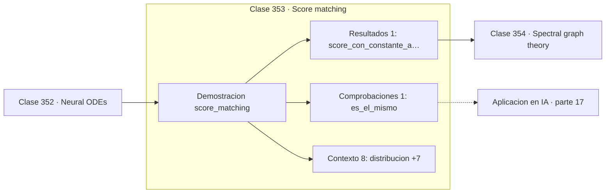

# 353 — Score matching

> [⬅️ 352 Neural ODEs](../352-neural-odes/README.md) · [📚 Parte 17](../README.md) · [🏠 Programa](../../../README.md) · [354 Spectral graph theory ➡️](../354-spectral-graph-theory/README.md)

**Parte:** 17 — Frontera matemática para IA e investigación · **Nivel:** `frontera-investigacion` · **Horas estimadas:** 4
**Motor:** `engines.part17` · **Demostración:** `score_matching` · **Clase 13 de 20** de la parte

---

## 🎯 Propósito

**El score no depende de la constante de normalización, y esa es precisamente la parte intratable.**

Procesos gaussianos, MCMC avanzado, inferencia variacional, transporte óptimo, geometría diferencial e informacional, SDE, Neural ODE, score matching y teoría del aprendizaje.

## ✅ Resultados de aprendizaje

Al terminar podrás:

1. Explicar **Score matching** con lenguaje cotidiano y con notación matemática.
2. Resolver un caso pequeño a mano y anticipar el orden de magnitud del resultado.
3. Ejecutar y modificar `lab.py`, que corre la demostración `score_matching`.
4. Interpretar las 10 salidas del laboratorio y decir qué comprueba cada una.
5. Detectar el error típico de esta parte: reportar resultados de mcmc sin diagnóstico de convergencia.

## 🧩 Fórmulas de la clase

```text
score: s(x) = ∇ₓ log p(x)
log p(x) = log p̃(x) − log Z
∇ₓ log Z = 0, luego el score ignora Z
```

## 🗺️ Ubicación en el programa



## 📖 Fundamentos

El **score** es el gradiente del logaritmo de la densidad respecto de la entrada. Apunta
hacia las regiones de mayor densidad, y su magnitud indica cuán pronunciada es la subida.
Es un campo vectorial que describe la distribución tan completamente como la densidad
misma.

Su propiedad decisiva es que **no depende de la constante de normalización**. Como el
logaritmo convierte el producto en suma y la constante no depende de `x`, su gradiente es
cero y desaparece. Eso importa muchísimo porque `Z` es una integral sobre todo el espacio,
intratable en cualquier modelo interesante, y es lo que bloqueaba históricamente el
entrenamiento de modelos basados en energía.

La demostración numérica es directa: multiplicar la densidad por una constante arbitraria no
cambia el score en ningún punto. Se puede modelar la distribución salvo un factor y aun así
caracterizarla completamente.

Conocido el score, la **dinámica de Langevin** genera muestras: seguir el score con un poco
de ruido converge a la distribución. Combinar esa idea con múltiples niveles de ruido es
exactamente lo que hacen los modelos de difusión de la clase 335 —la red que predice el
ruido está estimando el score— y esa equivalencia unifica dos líneas de trabajo que
parecían distintas.

## 🧮 Ejemplo trabajado

Score de una normal, con y sin constante arbitraria.

```text
distribución: Normal(1,5 ; 0,7)
score analítico: −(x − μ)/σ²

x        analítico     numérico
0,0      3,061224      3,061224                      ✓
1,5      0,000000      0,000000                      ✓
2,5     −2,040816     −2,040816                      ✓

Con la densidad multiplicada por una constante:
  score en x = 1,0:  1,020408
  idéntico al de la densidad normalizada             ✓

El score en el máximo vale 0: es donde la densidad
deja de crecer.

Por eso importa: Z es una integral intratable,
y el score no la necesita.
```

## 🔬 Qué ejecuta el laboratorio

`score_matching` — Score matching: aprender ∇ log p sin conocer la constante de normalización.

| Grupo | Salidas |
|---|---|
| 🔢 Resultados numéricos (1) | `score_con_constante_arbitraria` |
| ✅ Comprobaciones de invariante (1) | `es_el_mismo` |

Las claves booleanas no son adorno: si alguna fuera `False`, el resultado numérico
no sería fiable aunque el programa terminase sin error.

```bash
python classes/part-17-frontera-matematica-para-ia-e-investigacion/353-score-matching/lab.py
compmath run 353
```

> [!TIP]
> Antes de ejecutar, **escribe tu predicción**. Un laboratorio que confirma lo que
> esperabas enseña tanto como uno que te contradice, pero solo si la predicción
> existía antes del resultado.

## ⚠️ Errores conceptuales frecuentes

1. Suponer que el score identifica la densidad sin fijar la normalización.
2. Estimar el score en regiones de densidad casi nula, donde es inestable.
3. Confundir el score respecto de x con el score respecto de los parámetros.

## 🚀 Dónde se usa de verdad

Modelos de difusión, modelos basados en energía, dinámica de Langevin, estimación de
densidad y generación de imágenes.

## 🤖 Conexión con IA

Score matching fundamenta los modelos de difusión; el transporte óptimo aparece en flow matching; la teoría estadística del aprendizaje explica el scaling.

## 📓 Notebooks

| Archivo | Para qué |
|---|---|
| [`notebook.ipynb`](notebook.ipynb) | recorrido guiado con la demostración ejecutada |
| [`notebook_student.ipynb`](notebook_student.ipynb) | versión con `TODO` para resolver |
| [`notebook_solution.ipynb`](notebook_solution.ipynb) | solución de referencia verificada |

## 📝 Evaluación

| Criterio | Peso |
|---|---:|
| Comprensión conceptual | 25 % |
| Resolución manual | 25 % |
| Implementación y verificación | 25 % |
| Interpretación y comunicación | 15 % |
| Conexión con aplicación real | 10 % |

Detalle y criterios de error crítico en [`assessment.md`](assessment.md).

## ❓ Preguntas de comprobación

1. ¿Cuál es la entrada, cuál la salida y qué unidades tienen?
2. ¿Qué operación domina el comportamiento del resultado?
3. ¿Qué caso extremo revelaría un error conceptual?
4. ¿Cómo verificarías el resultado por un método independiente?
5. ¿Dónde aparece esto en investigación aplicada?

Si necesitas releer el código para responderlas, la clase todavía no está superada.

## 📥 Entregable

`notebook_student.ipynb` resuelto más un párrafo que explique el resultado **sin citar
código**: qué entra, qué sale, qué invariante se comprueba y qué pasaría en un caso límite.

## 🔗 Referencias

- [Hyvärinen, A. *Estimation of non-normalized statistical models by score matching*, JMLR, 2005](https://jmlr.org/papers/v6/hyvarinen05a.html)
- [Song, Y.; Ermon, S. *Generative Modeling by Estimating Gradients of the Data Distribution*, NeurIPS, 2019](https://arxiv.org/abs/1907.05600)

Bibliografía completa de la parte en [`../../../docs/BIBLIOGRAPHY.md`](../../../docs/BIBLIOGRAPHY.md).

## 📂 Material de la clase

[`intuition.md`](intuition.md) · [`theory.md`](theory.md) · [`derivation.md`](derivation.md) · [`exercises.md`](exercises.md) · [`assessment.md`](assessment.md) · [`where-is-this-used.md`](where-is-this-used.md) · [`lesson.yaml`](lesson.yaml)

---

> [⬅️ 352 Neural ODEs](../352-neural-odes/README.md) · [📚 Parte 17](../README.md) · [🏠 Programa](../../../README.md) · [354 Spectral graph theory ➡️](../354-spectral-graph-theory/README.md)
