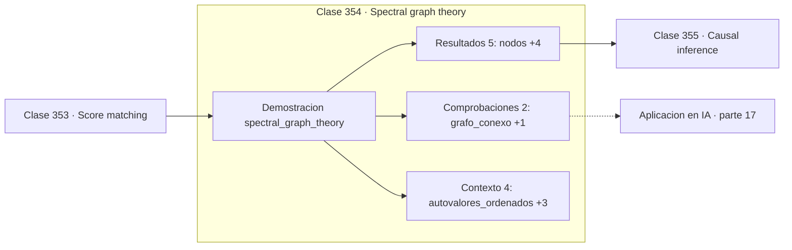

# 354 — Spectral graph theory

> [⬅️ 353 Score matching](../353-score-matching/README.md) · [📚 Parte 17](../README.md) · [🏠 Programa](../../../README.md) · [355 Causal inference ➡️](../355-causal-inference/README.md)

**Parte:** 17 — Frontera matemática para IA e investigación · **Nivel:** `frontera-investigacion` · **Horas estimadas:** 4
**Motor:** `engines.part17` · **Demostración:** `spectral_graph_theory` · **Clase 14 de 20** de la parte

---

## 🎯 Propósito

**El signo del vector de Fiedler dice por dónde partir el grafo en dos.**

Procesos gaussianos, MCMC avanzado, inferencia variacional, transporte óptimo, geometría diferencial e informacional, SDE, Neural ODE, score matching y teoría del aprendizaje.

## ✅ Resultados de aprendizaje

Al terminar podrás:

1. Explicar **Spectral graph theory** con lenguaje cotidiano y con notación matemática.
2. Resolver un caso pequeño a mano y anticipar el orden de magnitud del resultado.
3. Ejecutar y modificar `lab.py`, que corre la demostración `spectral_graph_theory`.
4. Interpretar las 11 salidas del laboratorio y decir qué comprueba cada una.
5. Detectar el error típico de esta parte: invertir una matriz de covarianza sin jitter numérico.

## 🧩 Fórmulas de la clase

```text
L = D − A;  autovalores 0 = λ₁ ≤ λ₂ ≤ …
λ₂ = conectividad algebraica
partición por el signo del autovector de λ₂
```

## 🗺️ Ubicación en el programa



## 📖 Fundamentos

El agrupamiento espectral resuelve un problema difícil mediante una **relajación
continua**. Partir un grafo minimizando el número de aristas cortadas es un problema
combinatorio NP-difícil; relajarlo a variables continuas lo convierte en un problema de
autovectores, que se resuelve en tiempo polinómico.

El autovector asociado al segundo autovalor —el **vector de Fiedler**— es la solución de esa
relajación, y el signo de cada componente indica a qué lado del corte asignar cada nodo. En
el ejemplo, cuatro nodos tienen componente negativa y cuatro positiva, y esa partición
corresponde exactamente a la estructura de comunidades del grafo.

La **conectividad algebraica** `λ₂` cuantifica cuán bien separado está el grafo. Un valor
pequeño —0,29 en el ejemplo, frente a autovalores posteriores de 2 y 4— indica que existe
un corte barato y que la partición es significativa. Si `λ₂` fuera comparable a los demás,
el corte sería arbitrario.

El método se generaliza a más de dos grupos usando los primeros `k` autovectores como
coordenadas y aplicando k-means en ese espacio. Su ventaja sobre k-means directo es que
**funciona con grupos no convexos**, que es justamente donde k-means falla. Su límite es el
coste: calcular autovectores de un grafo enorme requiere métodos iterativos como los de la
parte 11.

## 🧮 Ejemplo trabajado

Grafo de 8 nodos partido por el vector de Fiedler.

```text
8 nodos, 11 aristas

autovalores del Laplaciano:
  [0,0 ; 0,29072464 ; 2,0 ; 2,80606343 ; 4,0 ; 4,0 ; 4,0 ; 4,90321193]

multiplicidad de 0: 1  →  grafo conexo             ✓
conectividad algebraica: 0,29072464

vector de Fiedler:
  [−0,432487 ; −0,369619 ; −0,369619 ; −0,199295 ;
    0,199295 ;  0,369619 ;  0,369619 ;  0,432487]

partición por signo:
  grupo A: nodos 0, 1, 2, 3
  grupo B: nodos 4, 5, 6, 7

λ₂ = 0,29 frente a λ₃ = 2,0: el corte es claro.
```

## 🔬 Qué ejecuta el laboratorio

`spectral_graph_theory` — Clustering espectral: el vector de Fiedler separa el grafo.

| Grupo | Salidas |
|---|---|
| 🔢 Resultados numéricos (5) | `nodos`, `aristas`, `conectividad_algebraica`, `aristas_cortadas`, `corte_minimo_esperado` |
| ✅ Comprobaciones de invariante (2) | `grafo_conexo`, `particion_correcta` |

Las claves booleanas no son adorno: si alguna fuera `False`, el resultado numérico
no sería fiable aunque el programa terminase sin error.

```bash
python classes/part-17-frontera-matematica-para-ia-e-investigacion/354-spectral-graph-theory/lab.py
compmath run 354
```

> [!TIP]
> Antes de ejecutar, **escribe tu predicción**. Un laboratorio que confirma lo que
> esperabas enseña tanto como uno que te contradice, pero solo si la predicción
> existía antes del resultado.

## ⚠️ Errores conceptuales frecuentes

1. Aplicar el método a grafos no conexos sin tratar cada componente por separado.
2. Interpretar la partición cuando λ₂ es comparable a los autovalores siguientes.
3. Calcular todos los autovectores cuando solo hacen falta los primeros.

## 🚀 Dónde se usa de verdad

Detección de comunidades, segmentación de imágenes, partición de mallas, análisis de redes
sociales y agrupamiento de datos no convexos.

## 🤖 Conexión con IA

Score matching fundamenta los modelos de difusión; el transporte óptimo aparece en flow matching; la teoría estadística del aprendizaje explica el scaling.

## 📓 Notebooks

| Archivo | Para qué |
|---|---|
| [`notebook.ipynb`](notebook.ipynb) | recorrido guiado con la demostración ejecutada |
| [`notebook_student.ipynb`](notebook_student.ipynb) | versión con `TODO` para resolver |
| [`notebook_solution.ipynb`](notebook_solution.ipynb) | solución de referencia verificada |

## 📝 Evaluación

| Criterio | Peso |
|---|---:|
| Comprensión conceptual | 25 % |
| Resolución manual | 25 % |
| Implementación y verificación | 25 % |
| Interpretación y comunicación | 15 % |
| Conexión con aplicación real | 10 % |

Detalle y criterios de error crítico en [`assessment.md`](assessment.md).

## ❓ Preguntas de comprobación

1. ¿Cuál es la entrada, cuál la salida y qué unidades tienen?
2. ¿Qué operación domina el comportamiento del resultado?
3. ¿Qué caso extremo revelaría un error conceptual?
4. ¿Cómo verificarías el resultado por un método independiente?
5. ¿Dónde aparece esto en investigación aplicada?

Si necesitas releer el código para responderlas, la clase todavía no está superada.

## 📥 Entregable

`notebook_student.ipynb` resuelto más un párrafo que explique el resultado **sin citar
código**: qué entra, qué sale, qué invariante se comprueba y qué pasaría en un caso límite.

## 🔗 Referencias

- [von Luxburg, U. *A tutorial on spectral clustering*, Statistics and Computing, 2007](https://arxiv.org/abs/0711.0189) — *uso:* artículo de origen consultado en «Spectral graph theory».
- [Shi, J.; Malik, J. *Normalized cuts and image segmentation*, IEEE TPAMI, 2000](https://doi.org/10.1109/34.868688) — *uso:* artículo de origen consultado en «Spectral graph theory».

Bibliografía completa de la parte en [`../../../docs/BIBLIOGRAPHY.md`](../../../docs/BIBLIOGRAPHY.md) · localizador verificable de cada obra en [`sources/bibliography.json`](../../../sources/bibliography.json).

## 📂 Material de la clase

[`intuition.md`](intuition.md) · [`theory.md`](theory.md) · [`derivation.md`](derivation.md) · [`exercises.md`](exercises.md) · [`assessment.md`](assessment.md) · [`where-is-this-used.md`](where-is-this-used.md) · [`lesson.yaml`](lesson.yaml)

---

> [⬅️ 353 Score matching](../353-score-matching/README.md) · [📚 Parte 17](../README.md) · [🏠 Programa](../../../README.md) · [355 Causal inference ➡️](../355-causal-inference/README.md)
