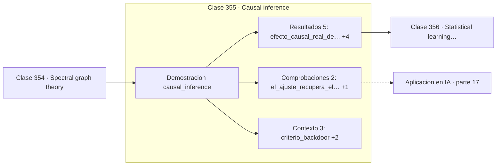

# 355 — Causal inference

> [⬅️ 354 Spectral graph theory](../354-spectral-graph-theory/README.md) · [📚 Parte 17](../README.md) · [🏠 Programa](../../../README.md) · [356 Statistical learning theory ➡️](../356-statistical-learning-theory/README.md)

**Parte:** 17 — Frontera matemática para IA e investigación · **Nivel:** `frontera-investigacion` · **Horas estimadas:** 4
**Motor:** `engines.part17` · **Demostración:** `causal_inference` · **Clase 15 de 20** de la parte

---

## 🎯 Propósito

**El coeficiente sin ajustar estima 1,02 un efecto que en realidad es cero.**

Procesos gaussianos, MCMC avanzado, inferencia variacional, transporte óptimo, geometría diferencial e informacional, SDE, Neural ODE, score matching y teoría del aprendizaje.

## ✅ Resultados de aprendizaje

Al terminar podrás:

1. Explicar **Causal inference** con lenguaje cotidiano y con notación matemática.
2. Resolver un caso pequeño a mano y anticipar el orden de magnitud del resultado.
3. Ejecutar y modificar `lab.py`, que corre la demostración `causal_inference`.
4. Interpretar las 10 salidas del laboratorio y decir qué comprueba cada una.
5. Detectar el error típico de esta parte: interpretar una cota teórica como predicción del error real.

## 🧩 Fórmulas de la clase

```text
criterio de puerta trasera: bloquear todos los caminos X ← … → Y
confusor: Z → X y Z → Y
colisionador: X → C ← Y, condicionar crea asociación
```

## 🗺️ Ubicación en el programa



## 📖 Fundamentos

La inferencia causal formaliza qué significa que `X` cause `Y` y cuándo se puede estimar ese
efecto a partir de datos observacionales. Su lenguaje son los grafos causales dirigidos,
donde las flechas representan relaciones causales y los caminos determinan qué asociaciones
aparecen.

El **criterio de puerta trasera** dice qué variables hay que ajustar: un conjunto que
bloquee todos los caminos no causales entre `X` e `Y`. Ajustar por ese conjunto permite
estimar el efecto causal correctamente. La demostración numérica es contundente: con un
efecto causal real de **cero**, el coeficiente sin ajustar estima 1,02 —una relación fuerte
e inexistente— y al ajustar por el confusor baja a 0,007.

El resultado que más contradice la intuición es el **sesgo de colisionador**. Si dos
variables independientes causan una tercera, condicionar sobre esa tercera **crea**
correlación entre ellas donde no había ninguna. Ajustar por todo lo disponible no es una
estrategia conservadora: puede introducir sesgo donde no lo había.

La conclusión metodológica es que **no se puede decidir qué ajustar mirando solo los
datos**. Hace falta un modelo causal, es decir, conocimiento del dominio sobre qué causa
qué. Los datos por sí solos no distinguen un confusor de un colisionador, y esa es la razón
profunda de que la aleatorización sea tan valiosa: rompe todos los caminos de puerta trasera
a la vez, conocidos y desconocidos.

## 🧮 Ejemplo trabajado

Efecto real cero, estimado en 1,02 sin ajustar.

```text
estructura: Z → X,  Z → Y,  X ↛ Y
efecto causal real de X sobre Y: 0,0

coeficiente sin ajustar:      1,0243        ✗
coeficiente ajustando por Z:  0,0074        ✓

El ajuste recupera el efecto real.

Criterio de puerta trasera:
  bloquear todos los caminos X ← … → Y

Colisionador (X → C ← Y):
  correlación X-Y sin condicionar C: −0,0145
  (independientes, como deben ser)
  al condicionar sobre C aparecería correlación
  donde no la hay.
```

## 🔬 Qué ejecuta el laboratorio

`causal_inference` — Confusión, ajuste por backdoor y el sesgo de colisionador.

| Grupo | Salidas |
|---|---|
| 🔢 Resultados numéricos (5) | `efecto_causal_real_de_X_sobre_Y`, `coeficiente_sin_ajustar`, `coeficiente_ajustando_por_Z`, `correlacion_X_Y_sin_condicionar_el_colisionador`, `correlacion_condicionando_el_colisionador` |
| ✅ Comprobaciones de invariante (2) | `el_ajuste_recupera_el_efecto`, `condicionar_un_colisionador_crea_sesgo` |

Las claves booleanas no son adorno: si alguna fuera `False`, el resultado numérico
no sería fiable aunque el programa terminase sin error.

```bash
python classes/part-17-frontera-matematica-para-ia-e-investigacion/355-causal-inference/lab.py
compmath run 355
```

> [!TIP]
> Antes de ejecutar, **escribe tu predicción**. Un laboratorio que confirma lo que
> esperabas enseña tanto como uno que te contradice, pero solo si la predicción
> existía antes del resultado.

## ⚠️ Errores conceptuales frecuentes

1. Ajustar por todas las variables disponibles sin un modelo causal.
2. Condicionar sobre un colisionador y crear asociación espuria.
3. Interpretar coeficientes de regresión como efectos causales en datos observacionales.

## 🚀 Dónde se usa de verdad

Evaluación de políticas y tratamientos, atribución en marketing, análisis de equidad
algorítmica, epidemiología y diseño de experimentos.

## 🤖 Conexión con IA

Score matching fundamenta los modelos de difusión; el transporte óptimo aparece en flow matching; la teoría estadística del aprendizaje explica el scaling.

## 📓 Notebooks

| Archivo | Para qué |
|---|---|
| [`notebook.ipynb`](notebook.ipynb) | recorrido guiado con la demostración ejecutada |
| [`notebook_student.ipynb`](notebook_student.ipynb) | versión con `TODO` para resolver |
| [`notebook_solution.ipynb`](notebook_solution.ipynb) | solución de referencia verificada |

## 📝 Evaluación

| Criterio | Peso |
|---|---:|
| Comprensión conceptual | 25 % |
| Resolución manual | 25 % |
| Implementación y verificación | 25 % |
| Interpretación y comunicación | 15 % |
| Conexión con aplicación real | 10 % |

Detalle y criterios de error crítico en [`assessment.md`](assessment.md).

## ❓ Preguntas de comprobación

1. ¿Cuál es la entrada, cuál la salida y qué unidades tienen?
2. ¿Qué operación domina el comportamiento del resultado?
3. ¿Qué caso extremo revelaría un error conceptual?
4. ¿Cómo verificarías el resultado por un método independiente?
5. ¿Dónde aparece esto en investigación aplicada?

Si necesitas releer el código para responderlas, la clase todavía no está superada.

## 📥 Entregable

`notebook_student.ipynb` resuelto más un párrafo que explique el resultado **sin citar
código**: qué entra, qué sale, qué invariante se comprueba y qué pasaría en un caso límite.

## 📚 Bibliografía de la clase

Esta clase enseña **Inferencia causal · Estadística e inferencia**. Cada obra dice qué aporta aquí y cómo se comprobó su localizador:

- [Pearl, J. *Causality*, 2ª ed., Cambridge, 2009](https://doi.org/10.1017/CBO9780511803161) — Inferencia causal: el tema de esta clase · ISBN-13 `9780511803161` verificado en International ISBN Agency (2026-08-19).
- [Hernán, M.; Robins, J. *Causal Inference: What If*, CRC, 2020](https://miguelhernan.org/whatifbook) — Estadística e inferencia y Inferencia causal: el tema de esta clase · URL de la fuente primaria comprobada en miguelhernan.org (2026-08-19).

Bibliografía de todas las clases, con el porqué de cada obra, en [`docs/BIBLIOGRAPHY.md`](../../../docs/BIBLIOGRAPHY.md) · localizador y estado de cada obra en [`sources/bibliography.json`](../../../sources/bibliography.json).

## 📂 Material de la clase

[`intuition.md`](intuition.md) · [`theory.md`](theory.md) · [`derivation.md`](derivation.md) · [`exercises.md`](exercises.md) · [`assessment.md`](assessment.md) · [`where-is-this-used.md`](where-is-this-used.md) · [`lesson.yaml`](lesson.yaml)

---

> [⬅️ 354 Spectral graph theory](../354-spectral-graph-theory/README.md) · [📚 Parte 17](../README.md) · [🏠 Programa](../../../README.md) · [356 Statistical learning theory ➡️](../356-statistical-learning-theory/README.md)
