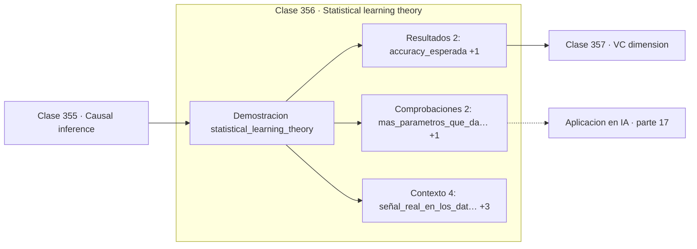

# 356 — Statistical learning theory

> [⬅️ 355 Causal inference](../355-causal-inference/README.md) · [📚 Parte 17](../README.md) · [🏠 Programa](../../../README.md) · [357 VC dimension ➡️](../357-vc-dimension/README.md)

**Parte:** 17 — Frontera matemática para IA e investigación · **Nivel:** `frontera-investigacion` · **Horas estimadas:** 4
**Motor:** `engines.part17` · **Demostración:** `statistical_learning_theory` · **Clase 16 de 20** de la parte

---

## 🎯 Propósito

**Con 25 parámetros y 30 datos se acierta el 80 % en entrenamiento sobre etiquetas aleatorias.**

Procesos gaussianos, MCMC avanzado, inferencia variacional, transporte óptimo, geometría diferencial e informacional, SDE, Neural ODE, score matching y teoría del aprendizaje.

## ✅ Resultados de aprendizaje

Al terminar podrás:

1. Explicar **Statistical learning theory** con lenguaje cotidiano y con notación matemática.
2. Resolver un caso pequeño a mano y anticipar el orden de magnitud del resultado.
3. Ejecutar y modificar `lab.py`, que corre la demostración `statistical_learning_theory`.
4. Interpretar las 8 salidas del laboratorio y decir qué comprueba cada una.
5. Detectar el error típico de esta parte: reportar resultados de mcmc sin diagnóstico de convergencia.

## 🧩 Fórmulas de la clase

```text
R(h) = R_emp(h) + brecha de generalización
la brecha crece con la complejidad y decrece con n
cota uniforme: sup_h |R(h) − R_emp(h)|
```

## 🗺️ Ubicación en el programa



## 📖 Fundamentos

La teoría estadística del aprendizaje separa dos cantidades que se confunden a diario. El
**riesgo empírico** es el error medido sobre la muestra de entrenamiento; el **riesgo
verdadero** es el error esperado sobre la distribución real. Minimizar el primero es lo que
se puede hacer; controlar el segundo es lo que interesa.

La diferencia entre ambos es la **brecha de generalización**, y depende de dos cosas: la
complejidad de la clase de hipótesis y el número de ejemplos. Con muchos datos y una clase
simple la brecha es pequeña; con pocos datos y una clase rica puede ser enorme, y el modelo
memoriza en vez de aprender.

La demostración usa etiquetas **completamente aleatorias**, sin ninguna señal que aprender,
y por tanto con accuracy esperada de 0,5. Con 30 observaciones y 25 parámetros, el modelo
acierta el 80 % en entrenamiento y el 48,5 % en test: la brecha entera es memorización. El
número de entrenamiento no mide nada.

Las cotas teóricas acotan el **peor caso sobre toda la clase de hipótesis**, no el caso
concreto. Esa uniformidad es lo que las hace válidas y también lo que las hace holgadas:
son correctas y muy pesimistas. En redes profundas predicen que no debería haber
generalización, y la hay. Explicar esa discrepancia es un área abierta, y conviene
presentarla así en vez de fingir que la teoría clásica describe lo que ocurre.

## 🧮 Ejemplo trabajado

Memorización pura sobre etiquetas aleatorias.

```text
señal real en los datos: NINGUNA
accuracy esperada: 0,5

n = 30, d = 25:
  accuracy train: 0,800
  accuracy test:  0,485
  brecha: 0,315

El 80 % de entrenamiento es memorización completa:
con 25 parámetros y 30 datos hay capacidad de sobra
para ajustar ruido.

El test confirma que no se aprendió nada: 0,485
es indistinguible del azar.

Descomposición: R(h) = R_emp(h) + brecha
```

## 🔬 Qué ejecuta el laboratorio

`statistical_learning_theory` — Riesgo empírico frente a riesgo verdadero y la brecha de generalización.

| Grupo | Salidas |
|---|---|
| 🔢 Resultados numéricos (2) | `accuracy_esperada`, `semilla` |
| ✅ Comprobaciones de invariante (2) | `mas_parametros_que_datos_memoriza`, `el_riesgo_empirico_solo_no_basta` |

Las claves booleanas no son adorno: si alguna fuera `False`, el resultado numérico
no sería fiable aunque el programa terminase sin error.

```bash
python classes/part-17-frontera-matematica-para-ia-e-investigacion/356-statistical-learning-theory/lab.py
compmath run 356
```

> [!TIP]
> Antes de ejecutar, **escribe tu predicción**. Un laboratorio que confirma lo que
> esperabas enseña tanto como uno que te contradice, pero solo si la predicción
> existía antes del resultado.

## ⚠️ Errores conceptuales frecuentes

1. Reportar el error de entrenamiento como medida de calidad.
2. Usar más parámetros que datos sin regularizar.
3. Interpretar una cota teórica como predicción del error real.

## 🚀 Dónde se usa de verdad

Diseño de experimentos de aprendizaje, elección de capacidad, comprensión del sobreajuste y
justificación de la validación.

## 🤖 Conexión con IA

Score matching fundamenta los modelos de difusión; el transporte óptimo aparece en flow matching; la teoría estadística del aprendizaje explica el scaling.

## 📓 Notebooks

| Archivo | Para qué |
|---|---|
| [`notebook.ipynb`](notebook.ipynb) | recorrido guiado con la demostración ejecutada |
| [`notebook_student.ipynb`](notebook_student.ipynb) | versión con `TODO` para resolver |
| [`notebook_solution.ipynb`](notebook_solution.ipynb) | solución de referencia verificada |

## 📝 Evaluación

| Criterio | Peso |
|---|---:|
| Comprensión conceptual | 25 % |
| Resolución manual | 25 % |
| Implementación y verificación | 25 % |
| Interpretación y comunicación | 15 % |
| Conexión con aplicación real | 10 % |

Detalle y criterios de error crítico en [`assessment.md`](assessment.md).

## ❓ Preguntas de comprobación

1. ¿Cuál es la entrada, cuál la salida y qué unidades tienen?
2. ¿Qué operación domina el comportamiento del resultado?
3. ¿Qué caso extremo revelaría un error conceptual?
4. ¿Cómo verificarías el resultado por un método independiente?
5. ¿Dónde aparece esto en investigación aplicada?

Si necesitas releer el código para responderlas, la clase todavía no está superada.

## 📥 Entregable

`notebook_student.ipynb` resuelto más un párrafo que explique el resultado **sin citar
código**: qué entra, qué sale, qué invariante se comprueba y qué pasaría en un caso límite.

## 🔗 Referencias

- [Shalev-Shwartz, S.; Ben-David, S. *Understanding Machine Learning*, Cambridge, 2014](https://www.cs.huji.ac.il/~shais/UnderstandingMachineLearning/)
- [Zhang, C. et al. *Understanding deep learning requires rethinking generalization*, ICLR, 2017](https://arxiv.org/abs/1611.03530)

Bibliografía completa de la parte en [`../../../docs/BIBLIOGRAPHY.md`](../../../docs/BIBLIOGRAPHY.md).

## 📂 Material de la clase

[`intuition.md`](intuition.md) · [`theory.md`](theory.md) · [`derivation.md`](derivation.md) · [`exercises.md`](exercises.md) · [`assessment.md`](assessment.md) · [`where-is-this-used.md`](where-is-this-used.md) · [`lesson.yaml`](lesson.yaml)

---

> [⬅️ 355 Causal inference](../355-causal-inference/README.md) · [📚 Parte 17](../README.md) · [🏠 Programa](../../../README.md) · [357 VC dimension ➡️](../357-vc-dimension/README.md)
