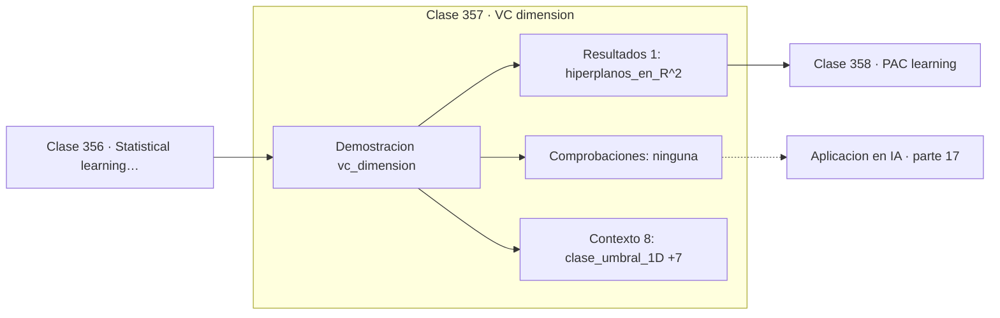

# 357 — VC dimension

> [⬅️ 356 Statistical learning theory](../356-statistical-learning-theory/README.md) · [📚 Parte 17](../README.md) · [🏠 Programa](../../../README.md) · [358 PAC learning ➡️](../358-pac-learning/README.md)

**Parte:** 17 — Frontera matemática para IA e investigación · **Nivel:** `frontera-investigacion` · **Horas estimadas:** 4
**Motor:** `engines.part17` · **Demostración:** `vc_dimension` · **Clase 17 de 20** de la parte

---

## 🎯 Propósito

**Una clase con infinitas hipótesis puede tener dimensión VC igual a 1.**

Procesos gaussianos, MCMC avanzado, inferencia variacional, transporte óptimo, geometría diferencial e informacional, SDE, Neural ODE, score matching y teoría del aprendizaje.

## ✅ Resultados de aprendizaje

Al terminar podrás:

1. Explicar **VC dimension** con lenguaje cotidiano y con notación matemática.
2. Resolver un caso pequeño a mano y anticipar el orden de magnitud del resultado.
3. Ejecutar y modificar `lab.py`, que corre la demostración `vc_dimension`.
4. Interpretar las 9 salidas del laboratorio y decir qué comprueba cada una.
5. Detectar el error típico de esta parte: invertir una matriz de covarianza sin jitter numérico.

## 🧩 Fórmulas de la clase

```text
VC = tamaño del mayor conjunto que la clase fragmenta
umbrales en 1D: VC = 1
hiperplanos en ℝᵈ: VC = d + 1
```

## 🗺️ Ubicación en el programa



## 📖 Fundamentos

La dimensión de Vapnik-Chervonenkis mide la capacidad de una clase de hipótesis por lo que
**puede hacer**, no por cuántas hipótesis contiene. Una clase **fragmenta** un conjunto de
puntos si puede realizar todas las `2ⁿ` etiquetaciones posibles, y la dimensión VC es el
tamaño del mayor conjunto que consigue fragmentar.

La distinción con el número de hipótesis es la aportación conceptual. La clase de los
umbrales en una dimensión es **infinita** —hay un umbral por cada número real— y su
dimensión VC es **1**: puede etiquetar un punto de las dos formas, pero con dos puntos no
puede producir la etiquetación «derecha positiva, izquierda negativa». Contar hipótesis no
mide capacidad; fragmentar sí.

Los valores conocidos son informativos. Los intervalos en una dimensión tienen VC 2, porque
no pueden etiquetar `+ − +`. Los hiperplanos en `ℝᵈ` tienen VC `d+1`, así que en el plano
son 3: con cuatro puntos en las esquinas de un cuadrado, la configuración XOR no es
separable, exactamente el problema del perceptrón de la clase 301.

Su papel es dar cotas de generalización que dependen de la capacidad y no del número de
hipótesis. Su límite práctico es severo: para redes neuronales la dimensión VC crece con el
número de parámetros, lo que predice que las redes modernas no deberían generalizar en
absoluto. La teoría es correcta y la cota es tan holgada que no informa; medidas
alternativas como la complejidad de Rademacher o las basadas en normas se comportan algo
mejor, sin resolver del todo la cuestión.

## 🧮 Ejemplo trabajado

Dimensión VC de tres clases de hipótesis.

```text
Umbrales en 1D:
  fragmenta 1 punto:  sí
  fragmenta 2 puntos: no
  VC = 1
  (la clase es infinita y su VC vale 1)

Intervalos en 1D:
  VC = 2
  razón: no puede etiquetar + − + con un solo intervalo

Hiperplanos en ℝᵈ:
  VC = d + 1
  en ℝ²: VC = 3

Por qué no 4 puntos en ℝ²:
  XOR en las esquinas de un cuadrado no es separable,
  el mismo obstáculo del perceptrón.
```

## 🔬 Qué ejecuta el laboratorio

`vc_dimension` — Dimensión VC: cuántos puntos puede fragmentar una clase de hipótesis.

| Grupo | Salidas |
|---|---|
| 🔢 Resultados numéricos (1) | `hiperplanos_en_R^2` |
| ✅ Comprobaciones de invariante (0) | — |

Las claves booleanas no son adorno: si alguna fuera `False`, el resultado numérico
no sería fiable aunque el programa terminase sin error.

```bash
python classes/part-17-frontera-matematica-para-ia-e-investigacion/357-vc-dimension/lab.py
compmath run 357
```

> [!TIP]
> Antes de ejecutar, **escribe tu predicción**. Un laboratorio que confirma lo que
> esperabas enseña tanto como uno que te contradice, pero solo si la predicción
> existía antes del resultado.

## ⚠️ Errores conceptuales frecuentes

1. Medir capacidad por el número de hipótesis en vez de por fragmentación.
2. Aplicar cotas basadas en VC a redes profundas esperando predicciones útiles.
3. Confundir dimensión VC con número de parámetros.

## 🚀 Dónde se usa de verdad

Cotas de generalización, comparación de familias de modelos, teoría del aprendizaje y
análisis de complejidad de clases de hipótesis.

## 🤖 Conexión con IA

Score matching fundamenta los modelos de difusión; el transporte óptimo aparece en flow matching; la teoría estadística del aprendizaje explica el scaling.

## 📓 Notebooks

| Archivo | Para qué |
|---|---|
| [`notebook.ipynb`](notebook.ipynb) | recorrido guiado con la demostración ejecutada |
| [`notebook_student.ipynb`](notebook_student.ipynb) | versión con `TODO` para resolver |
| [`notebook_solution.ipynb`](notebook_solution.ipynb) | solución de referencia verificada |

## 📝 Evaluación

| Criterio | Peso |
|---|---:|
| Comprensión conceptual | 25 % |
| Resolución manual | 25 % |
| Implementación y verificación | 25 % |
| Interpretación y comunicación | 15 % |
| Conexión con aplicación real | 10 % |

Detalle y criterios de error crítico en [`assessment.md`](assessment.md).

## ❓ Preguntas de comprobación

1. ¿Cuál es la entrada, cuál la salida y qué unidades tienen?
2. ¿Qué operación domina el comportamiento del resultado?
3. ¿Qué caso extremo revelaría un error conceptual?
4. ¿Cómo verificarías el resultado por un método independiente?
5. ¿Dónde aparece esto en investigación aplicada?

Si necesitas releer el código para responderlas, la clase todavía no está superada.

## 📥 Entregable

`notebook_student.ipynb` resuelto más un párrafo que explique el resultado **sin citar
código**: qué entra, qué sale, qué invariante se comprueba y qué pasaría en un caso límite.

## 🔗 Referencias

- [Vapnik, V. *The Nature of Statistical Learning Theory*, Springer, 1995](https://doi.org/10.1007/978-1-4757-3264-1) — *uso:* desarrollo formal del tema en «VC dimension».
- [Shalev-Shwartz, S.; Ben-David, S. *Understanding Machine Learning*, Cambridge, 2014](https://www.cs.huji.ac.il/~shais/UnderstandingMachineLearning/) — *uso:* obra de referencia consultada en «VC dimension».

Bibliografía completa de la parte en [`../../../docs/BIBLIOGRAPHY.md`](../../../docs/BIBLIOGRAPHY.md) · localizador verificable de cada obra en [`sources/bibliography.json`](../../../sources/bibliography.json).

## 📂 Material de la clase

[`intuition.md`](intuition.md) · [`theory.md`](theory.md) · [`derivation.md`](derivation.md) · [`exercises.md`](exercises.md) · [`assessment.md`](assessment.md) · [`where-is-this-used.md`](where-is-this-used.md) · [`lesson.yaml`](lesson.yaml)

---

> [⬅️ 356 Statistical learning theory](../356-statistical-learning-theory/README.md) · [📚 Parte 17](../README.md) · [🏠 Programa](../../../README.md) · [358 PAC learning ➡️](../358-pac-learning/README.md)
