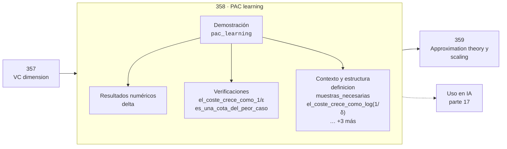

# 358 — PAC learning

> [⬅️ 357 VC dimension](../357-vc-dimension/README.md) · [📚 Parte 17](../README.md) · [🏠 Programa](../../../README.md) · [359 Approximation theory y scaling ➡️](../359-approximation-theory-y-scaling/README.md)

**Parte:** 17 — Frontera matemática para IA e investigación · **Nivel:** `frontera-investigacion` · **Horas estimadas:** 4
**Motor:** `engines.part17` · **Demostración:** `pac_learning` · **Clase 18 de 20** de la parte

---

## 🎯 Propósito

Procesos gaussianos, MCMC avanzado, inferencia variacional, transporte óptimo, geometría diferencial e informacional, SDE, Neural ODE, score matching y teoría del aprendizaje.

Esta clase concreta ese objetivo sobre **PAC learning**: qué es, cómo se
calcula a mano, cómo se implementa sin ocultar el procedimiento y cómo se verifica
que el resultado es correcto y no solo plausible.

## ✅ Resultados de aprendizaje

Al terminar podrás:

1. Explicar **PAC learning** con lenguaje cotidiano y con notación matemática.
2. Resolver un caso pequeño a mano y anticipar el orden de magnitud del resultado.
3. Ejecutar y modificar `lab.py`, que corre la demostración `pac_learning`.
4. Interpretar las 9 salidas del laboratorio y decir qué comprueba cada una.
5. Detectar el error típico de esta parte: interpretar una cota teórica como predicción del error real.

## 🗺️ Ubicación en el programa



## 🧠 Idea rectora de la parte 17

> La distancia de Wasserstein compara distribuciones sin exigir soporte común.

## 🔬 Qué ejecuta el laboratorio

`pac_learning` — PAC: cuántas muestras hacen falta para (ε, δ).

| Grupo | Salidas |
|---|---|
| 🔢 Resultados numéricos (1) | `delta` |
| ✅ Comprobaciones de invariante (2) | `el_coste_crece_como_1/ε`, `es_una_cota_del_peor_caso` |

Las claves booleanas no son adorno: si alguna fuera `False`, el resultado numérico
no sería fiable aunque el programa terminase sin error.

```bash
python classes/part-17-frontera-matematica-para-ia-e-investigacion/358-pac-learning/lab.py
compmath run 358
```

> [!TIP]
> Antes de ejecutar, **escribe tu predicción**. Un laboratorio que confirma lo que
> esperabas enseña tanto como uno que te contradice, pero solo si la predicción
> existía antes del resultado.

## ⚠️ Errores frecuentes en esta parte

- Reportar resultados de MCMC sin diagnóstico de convergencia.
- Invertir una matriz de covarianza sin jitter numérico.
- Interpretar una cota teórica como predicción del error real.

## 🤖 Conexión con IA

Score matching fundamenta los modelos de difusión; el transporte óptimo aparece en flow matching; la teoría estadística del aprendizaje explica el scaling.

## 📓 Notebooks

| Archivo | Para qué |
|---|---|
| [`notebook.ipynb`](notebook.ipynb) | recorrido guiado con la demostración ejecutada |
| [`notebook_student.ipynb`](notebook_student.ipynb) | versión con `TODO` para resolver |
| [`notebook_solution.ipynb`](notebook_solution.ipynb) | solución de referencia verificada |

## 📝 Evaluación

| Criterio | Peso |
|---|---:|
| Comprensión conceptual | 25 % |
| Resolución manual | 25 % |
| Implementación y verificación | 25 % |
| Interpretación y comunicación | 15 % |
| Conexión con aplicación real | 10 % |

Detalle y criterios de error crítico en [`assessment.md`](assessment.md).

## ❓ Preguntas de comprobación

1. ¿Cuál es la entrada, cuál la salida y qué unidades tienen?
2. ¿Qué operación domina el comportamiento del resultado?
3. ¿Qué caso extremo revelaría un error conceptual?
4. ¿Cómo verificarías el resultado por un método independiente?
5. ¿Dónde aparece esto en investigación aplicada?

Si necesitas releer el código para responderlas, la clase todavía no está superada.

## 📥 Entregable

`notebook_student.ipynb` resuelto más un párrafo que explique el resultado **sin citar
código**: qué entra, qué sale, qué invariante se comprueba y qué pasaría en un caso límite.

## 🔗 Referencias

- Rasmussen, C.; Williams, C. *Gaussian Processes for Machine Learning*. MIT Press, 2006.
- Neal, R. *MCMC using Hamiltonian dynamics*. Handbook of MCMC, 2011.
- Peyré, G.; Cuturi, M. *Computational Optimal Transport*. 2019.
- Shalev-Shwartz, S.; Ben-David, S. *Understanding Machine Learning*. Cambridge, 2014.

## 📂 Material de la clase

[`intuition.md`](intuition.md) · [`theory.md`](theory.md) · [`derivation.md`](derivation.md) · [`exercises.md`](exercises.md) · [`assessment.md`](assessment.md) · [`where-is-this-used.md`](where-is-this-used.md) · [`lesson.yaml`](lesson.yaml)

---

> [⬅️ 357 VC dimension](../357-vc-dimension/README.md) · [📚 Parte 17](../README.md) · [🏠 Programa](../../../README.md) · [359 Approximation theory y scaling ➡️](../359-approximation-theory-y-scaling/README.md)
